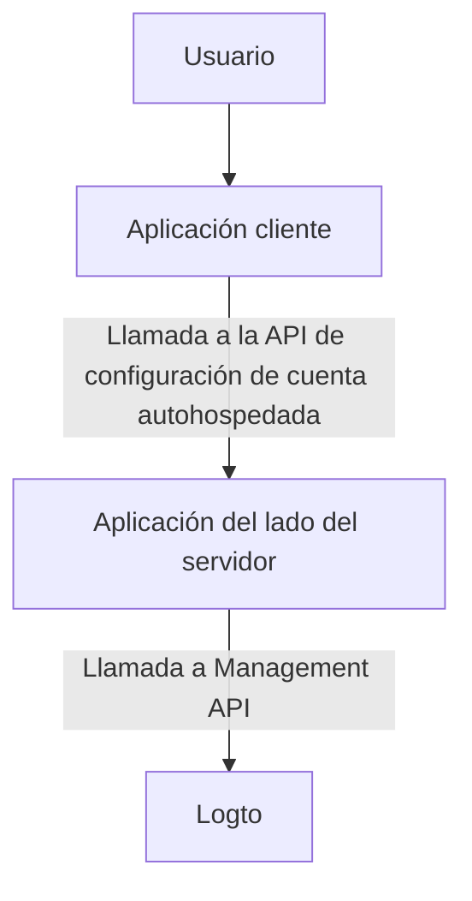
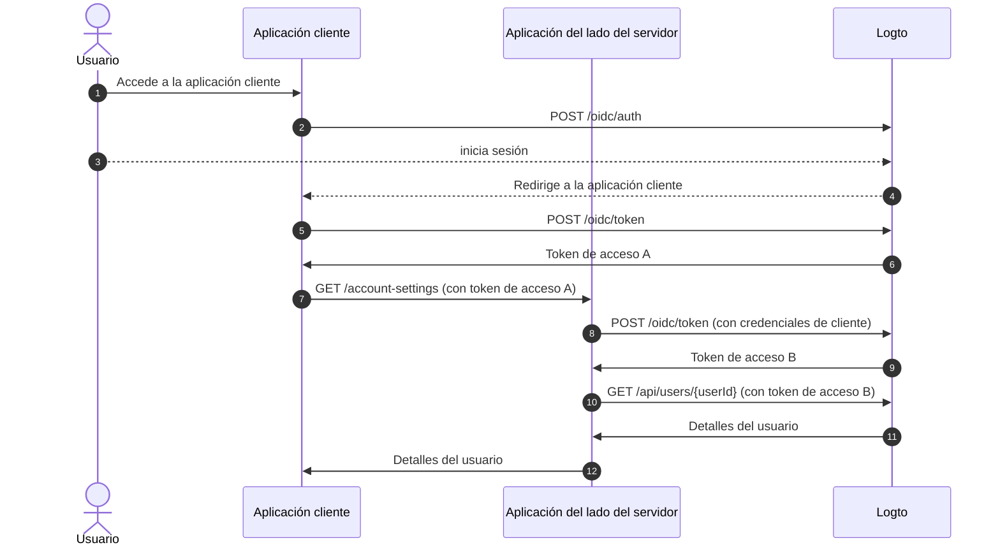
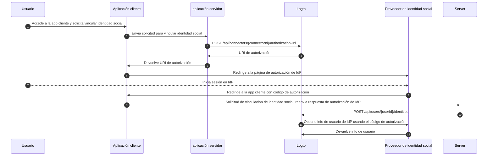

# Configuración de cuenta mediante Management API

## Integraciones \{#integrations}

Logto proporciona varias Management API para gestionar cuentas de usuario. Puedes utilizar estas APIs para construir una página de configuración de cuenta de autoservicio para los usuarios finales.

### Arquitectura \{#architecture}

1. **Usuario**: Usuario final autenticado que necesita acceder y gestionar la configuración de su cuenta.
2. **Aplicación cliente**: Tu aplicación cliente que muestra la página de configuración de cuenta al usuario.
3. **Aplicación del lado del servidor**: Aplicación del lado del servidor que proporciona la API de configuración de cuenta al cliente. Interactúa con la Management API de Logto.
4. **Logto**: Logto como servicio de autenticación y autorización. Proporciona la Management API para gestionar cuentas de usuario.

### Diagrama de secuencia \{#sequence-diagram}

1. El usuario accede a la aplicación cliente.
2. La aplicación cliente envía la solicitud de autenticación a Logto y redirige al usuario a la página de inicio de sesión de Logto.
3. El usuario inicia sesión en Logto.
4. El usuario autenticado es redirigido de vuelta a la aplicación cliente con el código de autorización.
5. La aplicación cliente solicita el token de acceso a Logto para acceder a la API de configuración de cuenta autohospedada.
6. Logto concede el token de acceso a la aplicación cliente.
7. La aplicación cliente envía la solicitud de configuración de cuenta a la aplicación del lado del servidor con el token de acceso del usuario.
8. La aplicación del lado del servidor verifica la identidad y permisos del solicitante a partir del token de acceso del usuario. Luego solicita un token de acceso a Management API a Logto.
9. Logto concede el token de acceso a Management API a la aplicación del lado del servidor.
10. La aplicación del lado del servidor solicita los datos del usuario a Logto usando el token de acceso de Management API.
11. Logto verifica la identidad del servidor y el permiso de Management API y devuelve los datos del usuario.
12. La aplicación del lado del servidor procesa los datos del usuario según los permisos del solicitante y devuelve los detalles de la cuenta de usuario a la aplicación cliente.

### Integrar Management API en la aplicación del lado del servidor \{#integrate-management-api-to-server-side-application}

Consulta la sección de [Management API](/integrate-logto/interact-with-management-api/) para aprender cómo integrar las Management APIs con aplicaciones del lado del servidor.

## APIs de gestión de usuarios \{#user-management-apis}

### Esquema de datos de usuario \{#user-data-schema}

Consulta la sección de [datos de usuario y datos personalizados](/user-management/user-data/) para obtener más información sobre el esquema de usuario en Logto.

### APIs de gestión de perfil e identificadores de usuario \{#user-profile-and-identifiers-management-apis}

El perfil y los identificadores de un usuario son esenciales para la gestión de usuarios. Puedes utilizar las siguientes APIs para gestionar perfiles e identificadores de usuario.

| método | path                                                                                                     | descripción                             |
| ------ | -------------------------------------------------------------------------------------------------------- | --------------------------------------- |
| GET    | [/api/users/\{userId\}](https://openapi.logto.io/operation/operation-getuser)                            | Obtener detalles del usuario por ID.    |
| PATCH  | [/api/users/\{userId\}](https://openapi.logto.io/operation/operation-updateuser)                         | Actualizar detalles del usuario.        |
| PATCH  | [/api/users/\{userId\}/profile](https://openapi.logto.io/operation/operation-updateuserprofile)          | Actualizar campos del perfil por ID.    |
| GET    | [/api/users/\{userId\}/custom-data](https://openapi.logto.io/operation/operation-listusercustomdata)     | Obtener datos personalizados por ID.    |
| PATCH  | [/api/users/\{userId\}/custom-data](https://openapi.logto.io/operation/operation-updateusercustomdata)   | Actualizar datos personalizados por ID. |
| PATCH  | [/api/users/\{userId\}/is-suspended](https://openapi.logto.io/operation/operation-updateuserissuspended) | Actualizar estado de suspensión por ID. |

### Verificación de correo electrónico y número de teléfono \{#email-and-phone-number-verification}

En el sistema Logto, tanto las direcciones de correo electrónico como los números de teléfono pueden servir como identificadores de usuario, por lo que su verificación es esencial. Para ello, proporcionamos un conjunto de APIs de código de verificación para ayudar a verificar el correo electrónico o número de teléfono proporcionado.

:::note
Asegúrate de verificar el correo electrónico o número de teléfono antes de actualizar el perfil del usuario con un nuevo correo electrónico o número de teléfono.
:::

| método | path                                                                                                                             | descripción                                          |
| ------ | -------------------------------------------------------------------------------------------------------------------------------- | ---------------------------------------------------- |
| POST   | [/api/verifications/verification-code](https://openapi.logto.io/operation/operation-createverificationbyverificationcode)        | Enviar código de verificación por correo o teléfono. |
| POST   | [/api/verifications/verification-code/verify](https://openapi.logto.io/operation/operation-verifyverificationbyverificationcode) | Verificar correo o teléfono mediante código.         |

### Gestión de contraseña de usuario \{#user-password-management}

| método | path                                                                                                     | descripción                                      |
| ------ | -------------------------------------------------------------------------------------------------------- | ------------------------------------------------ |
| POST   | [/api/users/\{userId\}/password/verify](https://openapi.logto.io/operation/operation-verifyuserpassword) | Verificar la contraseña actual por ID.           |
| PATCH  | [/api/users/\{userId\}/password](https://openapi.logto.io/operation/operation-updateuserpassword)        | Actualizar la contraseña por ID.                 |
| GET    | [/api/users/\{userId\}/has-password](https://openapi.logto.io/operation/operation-getuserhaspassword)    | Comprobar si el usuario tiene contraseña por ID. |

:::note
Asegúrate de verificar la contraseña actual del usuario antes de actualizar la contraseña.
:::

### Gestión de identidades sociales de usuario \{#user-social-identities-management}

| método | path                                                                                                                              | descripción                                                                                                         |
| ------ | --------------------------------------------------------------------------------------------------------------------------------- | ------------------------------------------------------------------------------------------------------------------- |
| GET    | [/api/users/\{userId\}](https://openapi.logto.io/operation/operation-getuser)                                                     | Obtener detalles del usuario por ID. Las identidades sociales están en el campo `identities`.                       |
| POST   | [/api/users/\{userId\}/identities](https://openapi.logto.io/operation/operation-createuseridentity)                               | Vincular una identidad social autenticada al usuario por ID.                                                        |
| DELETE | [/api/users/\{userId\}/identities](https://openapi.logto.io/operation/operation-deleteuseridentity)                               | Desvincular una identidad social del usuario por ID.                                                                |
| PUT    | [/api/users/\{userId\}/identities](https://openapi.logto.io/operation/operation-replaceuseridentity)                              | Actualizar directamente una identidad social vinculada al usuario por ID.                                           |
| POST   | [/api/connectors/\{connectorId\}/authorization-uri](https://openapi.logto.io/operation/operation-createconnectorauthorizationuri) | Obtener la URI de autorización para un proveedor de identidad social. Usa esta URI para iniciar una nueva conexión. |

1. El usuario accede a la aplicación cliente y solicita vincular una identidad social.
2. La aplicación cliente envía una solicitud al servidor para vincular una identidad social.
3. El servidor envía una solicitud a Logto para obtener la URI de autorización del proveedor de identidad social. Debes proporcionar tu propio parámetro `state` y `redirect_uri` en la solicitud. Asegúrate de registrar el `redirect_uri` en el proveedor de identidad social.
4. Logto devuelve la URI de autorización al servidor.
5. El servidor devuelve la URI de autorización a la aplicación cliente.
6. La aplicación cliente redirige al usuario a la URI de autorización del IdP.
7. El usuario inicia sesión en el IdP.
8. El IdP redirige al usuario de vuelta a la aplicación cliente usando el `redirect_uri` con el código de autorización.
9. La aplicación cliente valida el `state` y reenvía la respuesta de autorización del IdP al servidor.
10. El servidor envía una solicitud a Logto para vincular la identidad social al usuario.
11. Logto obtiene la información del usuario del IdP usando el código de autorización.
12. El IdP devuelve la información del usuario a Logto y Logto vincula la identidad social al usuario.

:::note
Hay algunas limitaciones a considerar al vincular nuevas identidades sociales a un usuario:

- Management API no tiene ningún contexto de sesión, cualquier conector social que requiera una sesión activa para mantener de forma segura el estado de autenticación social no puede ser vinculado mediante Management API. Los conectores no soportados incluyen apple, OIDC estándar y conector OAuth 2.0 estándar.
- Por la misma razón, Logto no puede verificar el parámetro `state` en la respuesta de autorización. Asegúrate de almacenar el parámetro `state` en tu aplicación cliente y validarlo cuando se reciba la respuesta de autorización.
- Debes registrar el `redirect_uri` en el proveedor de identidad social con antelación. De lo contrario, el IdP social no redirigirá al usuario de vuelta a tu aplicación cliente. Tu IdP social debe aceptar más de un `redirect_uri` de callback, uno para el inicio de sesión de usuario y otro para tu propia página de vinculación de perfil.

:::

### Gestión de identidades empresariales de usuario \{#user-enterprise-identities-management}

| método | path                                                                                                    | descripción                                                                                                                                                                                 |
| ------ | ------------------------------------------------------------------------------------------------------- | ------------------------------------------------------------------------------------------------------------------------------------------------------------------------------------------- |
| GET    | [/api/users/\{userId\}?includeSsoIdentities=true](https://openapi.logto.io/operation/operation-getuser) | Obtener detalles del usuario por ID. Las identidades empresariales están en el campo `ssoIdentities`. Añade el parámetro de consulta `includeSsoIdentities=true` para incluirlas en la API. |

Actualmente, la Management API no admite vincular o desvincular identidades empresariales a un usuario. Solo puedes mostrar las identidades empresariales vinculadas a un usuario.

### Token de acceso personal \{#personal-access-token}

| método | path                                                                                                                                 | descripción                                               |
| ------ | ------------------------------------------------------------------------------------------------------------------------------------ | --------------------------------------------------------- |
| GET    | [/api/users/\{userId\}/personal-access-tokens](https://openapi.logto.io/operation/operation-listuserpersonalaccesstokens)            | Obtener todos los tokens de acceso personal del usuario.  |
| POST   | [/api/users/\{userId\}/personal-access-tokens](https://openapi.logto.io/operation/operation-createuserpersonalaccesstoken)           | Añadir un nuevo token de acceso personal para el usuario. |
| DELETE | [/api/users/\{userId\}/personal-access-tokens/\{name\}](https://openapi.logto.io/operation/operation-deleteuserpersonalaccesstoken)  | Eliminar un token del usuario por nombre.                 |
| PATCH  | [/api/users/\{userId\s}/personal-access-tokens/\{name\}](https://openapi.logto.io/operation/operation-updateuserpersonalaccesstoken) | Actualizar un token del usuario por nombre.               |

Los tokens de acceso personal proporcionan una forma segura para que los usuarios otorguen [token de acceso (Access token)](https://auth.wiki/access-token) sin usar sus credenciales ni inicio de sesión interactivo. Aprende más sobre [el uso de tokens de acceso personal](/user-management/personal-access-token).

### Gestión de configuración MFA de usuario \{#user-mfa-settings-management}

| método | path                                                                                                                                 | descripción                                   |
| ------ | ------------------------------------------------------------------------------------------------------------------------------------ | --------------------------------------------- |
| GET    | [/api/users/\{userId\}/mfa-verifications](https://openapi.logto.io/operation/operation-listusermfaverifications)                     | Obtener configuración MFA del usuario por ID. |
| POST   | [/api/users/\{userId\}/mfa-verifications](https://openapi.logto.io/operation/operation-createusermfaverification)                    | Configurar una verificación MFA por ID.       |
| DELETE | [/api/users/\{userId\}/mfa-verifications/\{verificationId\}](https://openapi.logto.io/operation/operation-deleteusermfaverification) | Eliminar una verificación MFA por ID.         |

### Eliminación de cuenta de usuario \{#user-account-deletion}

| método | path                                                                             | descripción                 |
| ------ | -------------------------------------------------------------------------------- | --------------------------- |
| DELETE | [/api/users/\{userId\}](https://openapi.logto.io/operation/operation-deleteuser) | Eliminar un usuario por ID. |
