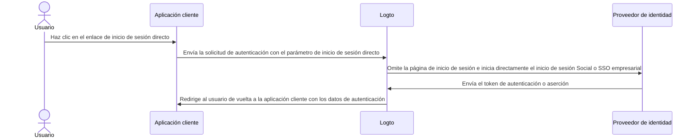

# Inicio de sesión directo

El inicio de sesión directo es un [parámetro de autenticación](/end-user-flows/authentication-parameters) específico de Logto que te permite iniciar el inicio de sesión social o el SSO empresarial directamente, omitiendo la página de inicio de sesión universal predeterminada de Logto.

Esta función es especialmente útil si tienes una página de inicio de sesión personalizada o un punto de entrada de inicio de sesión de IdP incrustado en tu sitio web (Ver casos de uso). Al usar el inicio de sesión directo, puedes redirigir a los usuarios directamente a la página de inicio de sesión del IdP.



## Inicio de sesión social \{#social-sign-in}

Pasa el parámetro `direct_sign_in` con el valor `social:<idp-name>` para iniciar directamente el proceso de inicio de sesión social.

### Dónde encontrar el nombre del IdP del conector \{#where-to-find-the-connector-idp-name}

1. Navega a <CloudLink to="/connectors/social">Consola > Conectores > Conectores sociales</CloudLink>
2. Haz clic en el [conector social](/connectors/social-connectors) que deseas usar.
3. Ubica el nombre del proveedor de identidad en la parte superior de la página de configuración del conector.


### Ejemplo \{#example}

Construye tu propia URL de solicitud de autenticación con el parámetro `direct_sign_in`:

```sh
curl --location \
  --request GET 'https://[tenant-id].logto.app/oidc/auth?client_id=1234567890&...&direct_sign_in=social:google'
```

En los SDK de Logto compatibles, puedes establecer el parámetro `directSignIn` al llamar al método `signIn`:

```javascript
const authResult = await logto.signIn({
  redirectUri: 'https://your-app.com/callback',
  directSignIn: 'social:google',
});
```

## SSO empresarial \{#enterprise-sso}

Pasa el parámetro `direct_sign_in` con el valor `sso:<connector-id>` para iniciar directamente el proceso de inicio de sesión SSO empresarial.

### Dónde encontrar el ID del conector SSO empresarial \{#where-to-find-the-enterprise-sso-connector-id}

1. Navega a <CloudLink to="/enterprise-sso">Consola > SSO empresarial</CloudLink>
2. Haz clic en el [conector empresarial](/connectors/enterprise-connectors) que deseas usar.
3. Ubica el ID del conector en la parte superior de la página de configuración del conector.


### Ejemplo \{#example-1}

Construye tu propia URL de solicitud de autenticación con el parámetro `direct_sign_in`:

```sh
curl --location \
  --request GET 'https://[tenant-id].logto.app/oidc/auth?client_id=1234567890&...&direct_sign_in=sso:1234567890'
```

En los SDK de Logto compatibles, puedes establecer el parámetro `directSignIn` al llamar al método `signIn`:

```javascript
logtoClient.signIn({
  redirectUri: 'https://your-app.com/callback',
  directSignIn: 'sso:1234567890',
});
```

## Reversión a la página de inicio de sesión \{#fallback-to-the-sign-in-page}

Si el proceso de inicio de sesión directo falla, por ejemplo, si el conector no se encuentra o no está habilitado, el usuario será redirigido a la página de inicio de sesión estándar.

:::note
Estamos agregando gradualmente soporte para el parámetro direct_sign_in en todos los SDK de Logto. Si no lo ves en tu SDK, por favor abre un issue o contáctanos.
:::

## Preguntas frecuentes \{#faqs}

<details>
  <summary>

### ¿El inicio de sesión directo es lo mismo que la autenticación por API? \{#is-direct-sign-in-the-same-as-api-authentication}

</summary>

No, el inicio de sesión directo es un parámetro de flujo de usuario que te permite omitir la página de inicio de sesión predeterminada de Logto y redirigir a los usuarios directamente a la página de inicio de sesión del proveedor social o SSO empresarial. A diferencia de la autenticación basada en API, el usuario aún debe ser redirigido primero al endpoint de autenticación de Logto para iniciar el proceso de inicio de sesión.

</details>
