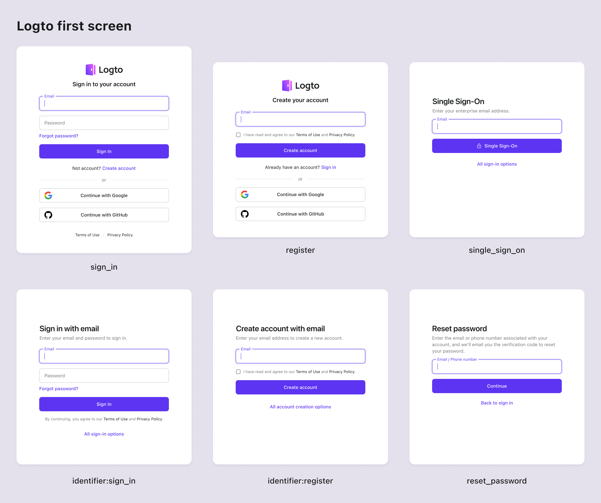

# Parámetros de la primera pantalla

Un conjunto de parámetros de autenticación personalizados que te permiten adaptar la experiencia de la primera pantalla deseada para los usuarios finales.

- `first_screen`: Especifica la primera pantalla que verá el usuario.
- `identifier`: Especifica los tipos de identificadores que el formulario de inicio de sesión o registro aceptará.
- `login_hint`: Llena el campo de identificador con la dirección de correo electrónico o nombre de usuario del usuario. (Este es un parámetro estándar de OIDC)

## first_screen

El parámetro `first_screen` es el parámetro clave que determina la primera pantalla que los usuarios verán cuando se redirijan a la página de inicio de sesión de Logto. Por defecto, se mostrará el formulario de inicio de sesión universal. Usa este parámetro para personalizar la primera pantalla según los requisitos de tu aplicación. Los valores admitidos son:

- `sign_in`: Muestra el formulario de inicio de sesión. (Por defecto)
- `register`: Muestra el formulario de registro.
- `reset_password`: Muestra el formulario de restablecimiento de contraseña.
- `single_sign_on`: Muestra el formulario de inicio de sesión de SSO empresarial. (Se pedirá una dirección de correo electrónico para determinar los proveedores de SSO habilitados)
- `identifier:sign-in`: Muestra un formulario de inicio de sesión específico de identificador. El tipo de identificador se puede especificar usando el parámetro `identifier`. Esto es útil cuando tienes múltiples métodos de inicio de sesión por identificador habilitados.
- `identifier:register`: Muestra un formulario de registro específico de identificador. El tipo de identificador se puede especificar usando el parámetro `identifier`. Esto es útil cuando tienes múltiples métodos de registro por identificador habilitados.



Por ejemplo, enviar a los usuarios directamente al formulario de inicio de sesión de SSO empresarial:

```sh
curl --location \
--request GET 'https://<your-tenant>.logto.app/oidc/auth?client_id=<client_id>&...&first_screen=single_sign_on'
```

## identifier

El parámetro `identifier` se utiliza para especificar los tipos de identificadores que el formulario de inicio de sesión o registro aceptará. Este parámetro solo es aplicable cuando el parámetro `first_screen` está configurado en `identifier:sign-in`, `identifier:register` o `reset_password`. Los valores admitidos son: `username`, `email` y `phone`. Separa múltiples valores con un espacio vacío para permitir múltiples tipos de identificadores.

Por ejemplo, enviar a los usuarios directamente a la página de registro por correo electrónico o número de teléfono:

```sh
curl --location \
--request GET 'https://<your-tenant>.logto.app/oidc/auth?client_id=<client_id>&...&first_screen=identifier:register&identifier=email phone'
```

Todos los tipos de identificadores especificados en este parámetro deben estar habilitados en tus configuraciones de inicio de sesión o registro en la Logto Console.

Cualquier tipo de identificador no admitido o deshabilitado será ignorado. Si todos los identificadores especificados no son admitidos, se utilizará la configuración predeterminada de la experiencia de inicio de sesión.

## login_hint

El parámetro `login_hint`, definido en la especificación estándar de [OpenID Connect](https://openid.net/specs/openid-connect-core-1_0.html#AuthorizationEndpoint), se utiliza para prellenar el formulario de inicio de sesión con el identificador del usuario (como un correo electrónico, un número de teléfono o nombre de usuario). Con Logto, se puede combinar con otros parámetros de pantalla de inicio de sesión para mejorar la experiencia del usuario. Este parámetro es especialmente útil si tienes un formulario de preautenticación personalizado que recopila el identificador del usuario de antemano, permitiéndoles omitir volver a ingresarlo durante el inicio de sesión.

Por ejemplo, prellenar la dirección de correo electrónico recopilada en el formulario de inicio de sesión:

```sh
curl --location \
--request GET 'https://<your-tenant>.logto.app/oidc/auth?client_id=<client_id>&...&first_screen=identifier:sign_in&identifier=email&login_hint=example@logto.io
```

## Soporte de SDK

En los SDK de Logto compatibles, puedes establecer los parámetros al llamar al método `signIn`:

```javascript
logtoClient.signIn({
  redirectUri: 'https://your-app.com/callback',
  firstScreen: 'identifier:register',
  identifier: ['email', 'phone'],
  loginHint: 'example@logto.io',
});
```

:::note
Estamos agregando gradualmente soporte para los parámetros `first_screen`, `identifier` y `login_hint` a todos los SDK de Logto. Si no los ves en tu SDK, por favor abre un problema o contáctanos.
:::

:::note
Para los usuarios de Logto OSS, estos parámetros son compatibles desde la versión 1.15.0. Si estás usando una versión anterior, por favor actualiza a la última versión.
:::
