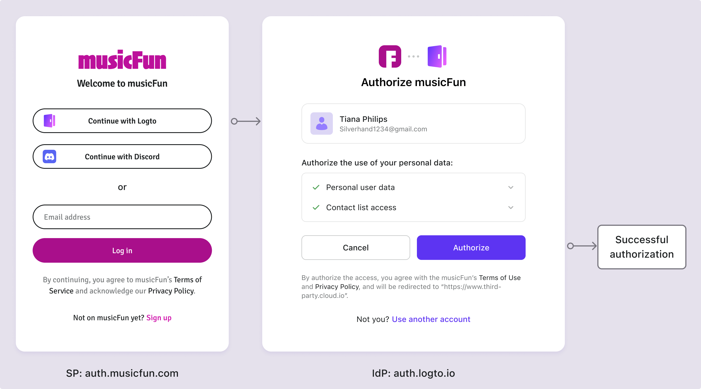

# Pantalla de consentimiento

## ¿Qué es la pantalla de consentimiento?

Imagina que te estás registrando en Logto usando tu cuenta de Google. Cuando haces clic en el botón "Iniciar sesión con Google", eres redirigido a la página de inicio de sesión de Google. Después de ingresar tus credenciales de Google, se te pedirá que otorgues permiso a Logto para acceder a la información de tu cuenta de Google. Esta es la pantalla de consentimiento del usuario.

Esta página es lo que llamamos la **pantalla de consentimiento** o **página de consentimiento** del usuario. Es un flujo estándar de [OIDC / OAuth 2.0](/integrate-logto/third-party-applications/oidc-oauth-third-party-applications) que permite a los usuarios otorgar permisos a [aplicaciones de terceros](/integrate-logto/third-party-applications) para acceder a sus datos en su nombre. Su propósito principal es informar a los usuarios sobre la recopilación, el procesamiento y el uso de sus datos personales y buscar su acuerdo o consentimiento explícito para estas actividades.

En una pantalla de consentimiento, a los usuarios generalmente se les presenta [información](/integrate-logto/third-party-applications/oidc-oauth-third-party-applications/consent-screen-branding#customize-the-branding-information) sobre los tipos de datos que se recopilarán, cómo se utilizarán y si se compartirán con terceros. Esta información es crucial para la transparencia, permitiendo a los usuarios tomar decisiones informadas sobre su privacidad y seguridad de datos.

Las páginas de consentimiento son particularmente importantes en el contexto de regulaciones de privacidad como el Reglamento General de Protección de Datos ([GDPR](https://gdpr-info.eu/art-4-gdpr/)) en la Unión Europea o la Ley de Privacidad del Consumidor de California ([CCPA](https://oag.ca.gov/privacy/ccpa)) en los Estados Unidos, que requieren que las organizaciones obtengan un consentimiento claro y afirmativo de los usuarios antes de procesar su información personal.

## ¿Cuándo ve el usuario la pantalla de consentimiento en Logto?

Como se mencionó anteriormente, la pantalla de consentimiento aparece cuando los usuarios inician sesión en Logto usando un proveedor de identidad (IdP) de terceros como Google, Facebook o Apple. En esta configuración, Logto actúa como el proveedor de servicios (SP), solicitando acceso a la información del usuario del IdP. La pantalla de consentimiento generalmente se presenta cuando el [SP](https://auth.wiki/service-provider) y el [IdP](https://auth.wiki/identity-provider) son organizaciones separadas, requiriendo la autorización del usuario para facilitar el intercambio de datos.

De manera similar, en Logto, cuando Logto funciona como el IdP, la pantalla de consentimiento se muestra cuando los usuarios inician sesión en una [**aplicación de terceros OIDC / OAuth**](/integrate-logto/third-party-applications/oidc-oauth-third-party-applications) integrada con Logto. Esta pantalla informa a los usuarios sobre los datos que la aplicación está solicitando y busca su permiso para proceder. Los usuarios pueden revisar los permisos solicitados y decidir si otorgan autorización a la aplicación.

## ¿Cómo configurar la pantalla de consentimiento?

El flujo de consentimiento de Logto te permite autorizar inicios de sesión desde aplicaciones de terceros. Puedes personalizar la marca y las solicitudes de permisos para cada aplicación de terceros OIDC.

Aprende más sobre cómo configurar la [aplicación de terceros](/integrate-logto/third-party-applications/) y configurar la [pantalla de consentimiento](/integrate-logto/third-party-applications/oidc-oauth-third-party-applications/consent-screen-branding/) en Logto.

## Recursos relacionados

<Url href="https://www.youtube.com/watch?v=sW-C7SRt9OM">
  Convierte tu servicio en un IdP OIDC seguro equipado con pantalla de consentimiento.
</Url>
<Url href="https://blog.logto.io/user-consent-screen">
  Introducción a la pantalla de consentimiento del usuario.
</Url>
