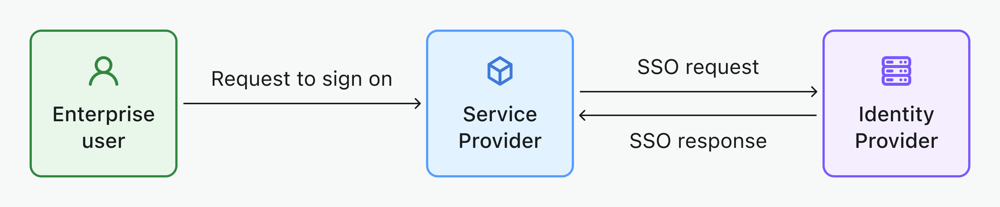

# SSO empresarial

[Single sign-on (SSO)](https://auth.wiki/single-sign-on) permite a los usuarios iniciar sesión en múltiples aplicaciones con un solo conjunto de credenciales. Simplifica el proceso de autenticación para los usuarios empresariales, especialmente para las plataformas SaaS de la fuerza laboral actual.

Logto mejora la experiencia de SSO al proporcionar una amplia gama de conectores de SSO empresarial que puedes configurar e integrar fácilmente con tus aplicaciones, por ejemplo, [Google Workspace](/integrations/google-workspace), [Microsoft Azure AD](/integrations/entra-id-saml), [Okta](/integrations/okta), y más.

## Componentes clave del SSO empresarial

- **Proveedor de identidad (IdP)**: Un servicio que verifica las identidades de los usuarios y gestiona sus credenciales de inicio de sesión. Después de confirmar la identidad de un usuario, el IdP genera tokens de autenticación o afirmaciones y permite al usuario acceder a varias aplicaciones o servicios sin necesidad de iniciar sesión nuevamente. Esencialmente, es el sistema de referencia para gestionar las identidades y permisos de los empleados en tu empresa. Ejemplos: Okta, Azure AD, Google Workspace, LastPass, OneLogin, Ping Identity, Cyberark, etc. [Aprende más sobre IdP](https://auth.wiki/identity-provider).
- **Proveedor de servicios (SP)**: Un sistema o aplicación que requiere autenticación de usuario y depende del Proveedor de Identidad (IdP) para la autenticación. El SP recibe tokens de autenticación o afirmaciones del IdP, otorgando acceso a sus recursos sin requerir credenciales de inicio de sesión separadas. Ejemplos: Slack, Shopify, Dropbox, Figma, Notion, etc... y tu servicio. [Aprende más sobre SP](https://auth.wiki/service-provider).
- **Identidad empresarial**: Generalmente identificada por su uso de un dominio de correo electrónico de la empresa para iniciar sesión. Esta cuenta de correo electrónico empresarial finalmente pertenece a la empresa.

## Flujo de trabajo de SSO compatible

- [**SSO iniciado por IdP**](/end-user-flows/enterprise-sso/idp-initiated-sso): En el SSO iniciado por IdP, el Proveedor de Identidad (IdP) controla principalmente el proceso de inicio de sesión único. Este proceso comienza cuando un usuario inicia sesión en la plataforma del IdP, como un portal de la empresa o un panel de identidad centralizado. Una vez autenticado, el IdP genera un token de autenticación o afirmación, que luego se utiliza para otorgar al usuario acceso a múltiples servicios o aplicaciones conectadas (SP) sin requerir inicios de sesión adicionales.
  
- [**SSO iniciado por SP**](/end-user-flows/enterprise-sso/sp-initiated-sso): En el SSO iniciado por SP, el Proveedor de Servicios (SP) toma la iniciativa en iniciar y gestionar el proceso de inicio de sesión único, a menudo preferido en escenarios B2B. Este escenario ocurre cuando un usuario intenta acceder a un servicio o aplicación específica (el SP) y es redirigido a su IdP para la autenticación. Tras un inicio de sesión exitoso en el IdP, se envía un token de autenticación de vuelta al SP, otorgando acceso al usuario. Logto admite SSO iniciado por SP para tus servicios B2B.
  

## Protocolos de SSO compatibles

- [**SAML**](/integrations/saml-sso): [Security Assertion Markup Language (SAML)](https://auth.wiki/saml) es un estándar abierto basado en XML para intercambiar datos de autenticación y autorización entre un IdP y un SP. Este protocolo es particularmente hábil para manejar requisitos de seguridad a nivel empresarial complejos.
- [**OIDC**](/integrations/oidc-sso): [OpenID Connect (OIDC)](https://auth.wiki/openid-connect) es una capa de identidad simple construida sobre el protocolo OAuth 2.0. Emplea JSON / REST para la comunicación, lo que lo hace más ligero y mejor adaptado para arquitecturas de aplicaciones modernas, incluidas aplicaciones móviles y de una sola página (SPAs).

## Preguntas frecuentes

  
¿Cómo agregar botones de conector SSO e iniciar sesión directamente con el proveedor SSO en mi sitio web?

Logto te permite agregar botones de inicio de sesión social a tu sitio web e iniciar el proceso de inicio de sesión SSO directamente sin mostrar el formulario de inicio de sesión predeterminado. Consulta nuestra guía de [Inicio de sesión directo](/end-user-flows/authentication-parameters/direct-sign-in/) para obtener instrucciones detalladas.

## Recursos relacionados

<Url href="https://www.youtube.com/watch?v=-mD8Sfab7sI&t=12s"> Experiencia de SSO empresarial</Url>

<Url href="https://blog.logto.io/idp-vs-sp-initiated-sso">
  SSO iniciado por IdP vs SSO iniciado por SP
</Url>

<Url href="https://blog.logto.io/enterprise-sso">
  SSO empresarial: Qué es, cómo funciona y por qué es importante
</Url>

<Url href="https://blog.logto.io/single-sign-on">El arte del inicio de sesión único</Url>
