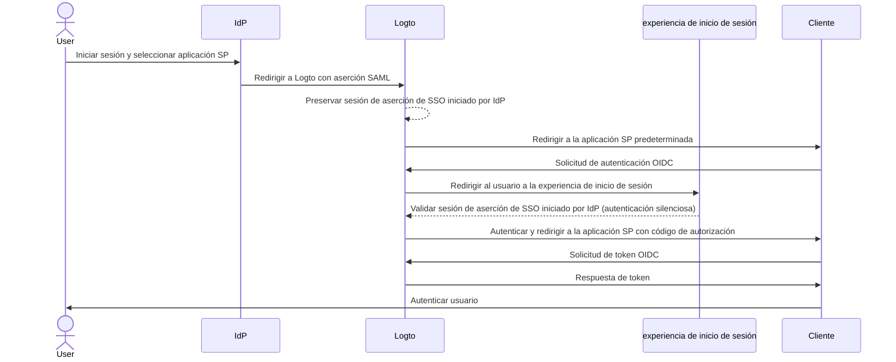
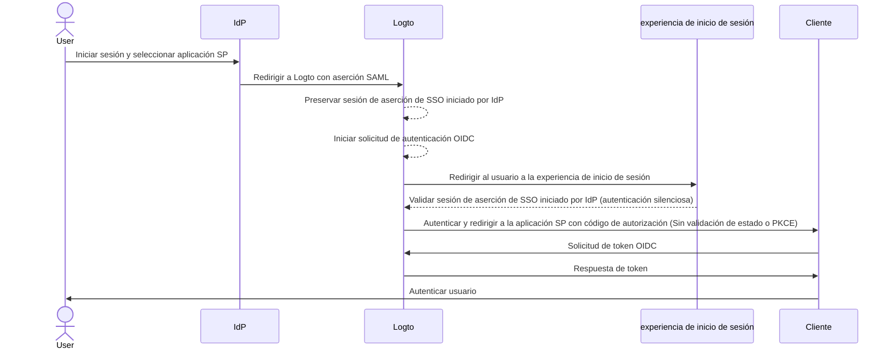

import Availability from '@components/Availability';

<Availability cloud="comingSoon" oss={false} />

# Inicio de sesión único iniciado por IdP (solo SAML)

El inicio de sesión único (SSO) iniciado por IdP es un proceso de inicio de sesión único donde el Proveedor de Identidad (IdP) controla principalmente el flujo de autenticación. Este proceso comienza cuando un usuario inicia sesión en la plataforma del IdP, como un portal de la empresa o un panel de identidad centralizado. Una vez autenticado, el IdP genera una aserción SAML y dirige al usuario al Proveedor de Servicios (SP) para acceder a la aplicación o servicio.


## Riesgos y consideraciones \{#risks-and-considerations}

El SSO iniciado por IdP puede introducir varias vulnerabilidades de seguridad que las organizaciones deben tener en cuenta. Dado que el proceso de autenticación es iniciado por el IdP sin una solicitud directa del usuario, puede ser susceptible a varios ataques, incluyendo [Cross-Site Request Forgery](https://blog.logto.io/csrf) (CSRF).

Esta falta de autenticación iniciada por el usuario puede llevar a accesos no autorizados si no se implementan las salvaguardas adecuadas. Además, la dependencia de un único punto de autenticación aumenta el riesgo de una brecha de seguridad, ya que comprometer el IdP podría exponer todas las aplicaciones conectadas.

Por lo tanto, se recomienda encarecidamente utilizar el SSO iniciado por SP, que proporciona un flujo de autenticación más seguro y controlado, asegurando que los usuarios soliciten explícitamente el acceso a los servicios.

## Conectar el SSO iniciado por IdP con aplicaciones OIDC de Logto \{#connect-idp-initiated-sso-with-logto-oidc-applications}

Logto como proveedor de OpenID Connect (OIDC) no admite el SSO iniciado por IdP. Sin embargo, puedes configurar Logto como un SP para admitir el SSO iniciado por IdP con tu IdP empresarial utilizando SAML. Esta configuración te permite aprovechar las capacidades de autenticación de Logto mientras mantienes el control del IdP sobre el flujo de autenticación.

:::note
Por defecto, esta función no está habilitada en Logto. Si necesitas que el SSO iniciado por IdP esté habilitado para tu inquilino, por favor contacta a nuestro [equipo de soporte](https://logto.io/contact?src=docs.sso).
:::

### Requisitos previos \{#prerequisites}

Antes de configurar el SSO iniciado por IdP, primero debes crear un conector SAML. Navega a la <CloudLink to="/enterprise-sso">Consola > SSO empresarial</CloudLink> y sigue la guía paso a paso para configurar un conector [SAML](/integrations/saml-sso/) con tu IdP.

Una vez configurado el conector SAML, puedes habilitar el método de inicio de sesión SSO en la sección de <CloudLink to="/sign-in-experience">Experiencia de inicio de sesión</CloudLink> y probar el flujo de SSO iniciado por SP para asegurarte de que la configuración sea correcta. Asegúrate de que el SSO iniciado por SP funcione como se espera antes de proceder con el SSO iniciado por IdP.

### Habilitar el SSO iniciado por IdP \{#enable-idp-initiated-sso}

Una vez que la función de SSO iniciado por IdP esté habilitada para tu inquilino, deberías ver una pestaña adicional en la página de configuración de tu conector SAML, llamada **SSO iniciado por IdP**. Habilita el interruptor de **SSO iniciado por IdP** para activar la función para el conector.

### Seleccionar la aplicación SP \{#select-the-sp-application}

A diferencia del SSO iniciado por SP, donde el flujo de autenticación comienza desde el SP, el SSO iniciado por IdP requiere una aplicación SP del lado del cliente para redirigir a los usuarios después del proceso de autenticación. Puedes seleccionar la aplicación SP de la lista de aplicaciones registradas en el menú desplegable **Aplicación predeterminada**.

Solo las aplicaciones **Aplicación web tradicional** y **Aplicación de una sola página** son compatibles con el SSO iniciado por IdP. Asegúrate de seleccionar el tipo de aplicación adecuado según tu caso de uso.

:::note
En el lado de tu IdP, deja el parámetro `RelayState` en **VACÍO** para que el flujo de SSO iniciado por IdP funcione correctamente. Logto manejará la redirección basada en la aplicación SP predeterminada seleccionada.
:::

## Configurar el flujo de autenticación iniciado por IdP \{#configure-idp-initiated-authentication-flow}

Para conectar el SSO SAML iniciado por IdP con OIDC, Logto proporciona dos opciones de configuración para manejar la solicitud de autenticación.

### Opción A: Redirigir a la aplicación SP predeterminada (Recomendado) \{#option-a-redirect-to-the-default-sp-application-recommended}

Cuando el IdP inicia el flujo de SSO y envía la aserción SAML a Logto, se creará una sesión de aserción de SSO iniciada por IdP. Logto redirigirá al usuario a la aplicación SP predeterminada para iniciar una solicitud de autenticación OIDC estándar en el lado del cliente.



Para configurar esta opción, selecciona la tarjeta **Redirigir al cliente para autenticación iniciada por SP** en la pestaña **SSO iniciado por IdP** de la configuración del conector SAML.


1. Proporciona una **URL de redirección del cliente** para redirigir al usuario a la aplicación SP predeterminada después del flujo de SSO iniciado por IdP. Logto redirigirá al usuario a esta URL con el parámetro de consulta `?ssoConnectorId={connectorId}` añadido a la URL. La aplicación cliente debe manejar la redirección e iniciar la solicitud de autenticación OIDC. (Recomendamos usar una ruta o página dedicada en tu aplicación cliente para manejar la solicitud de autenticación SSO iniciada por IdP).

2. Maneja la solicitud de autenticación OIDC en el lado del cliente usando el parámetro de consulta `ssoConnectorId` para identificar el conector SAML que inició el flujo de autenticación SSO iniciado por IdP.

3. Pasa el parámetro de autenticación [inicio de sesión directo](/end-user-flows/authentication-parameters/direct-sign-in/) en la solicitud de inicio de sesión a Logto para completar el flujo de autenticación SSO.

```typescript
// Ejemplo de React
import { Prompt, useLogto } from '@logto/react';
import { useEffect } from 'react';
import { useNavigate, useSearchParams } from 'react-router-dom';

const SsoDirectSignIn = () => {
  const { signIn } = useLogto();
  const [searchParams] = useSearchParams();

  useEffect(() => {
    const ssoConnectorId = searchParams.get('ssoConnectorId');
    if (ssoConnectorId) {
      void signIn({
        redirectUri,
        prompt: Prompt.Login,
        directSignIn: {
          method: 'sso',
          target: ssoConnectorId,
        },
      });
    }
  }, [searchParams, signIn]);
};
```

- `redirectUri`: El `redirect_uri` para redirigir al usuario después de que se complete el flujo de autenticación OIDC.
- `prompt=login`: Obliga al usuario a iniciar sesión usando la identidad de SSO iniciada por IdP.
- `directSignIn=sso:{connectorId}`: Especifica el método de inicio de sesión directo como `sso` y el ID del conector SAML de destino. Este parámetro activará el flujo de autenticación SSO directamente sin mostrar la página de inicio de sesión. El usuario será autenticado automáticamente usando la sesión de aserción de SSO iniciada por IdP preservada si el ID del conector coincide y la sesión es válida.

Este método asegura que el flujo de autenticación sea seguro y siga el protocolo OIDC estándar, mientras mantiene el control del IdP sobre el proceso de autenticación. La aplicación cliente puede aprovechar la sesión de aserción de SSO iniciada por IdP para autenticar al usuario sin pasos de inicio de sesión adicionales, manteniendo el flujo de autenticación seguro y controlado. La aplicación cliente aún puede validar los parámetros `state` y `PKCE` para asegurar que la solicitud de autenticación sea segura.

:::note
Este método está disponible para aplicaciones **Aplicación web tradicional** y **Aplicación de una sola página**. Y se recomienda para todos los casos de uso.
:::

### Opción B: Autenticar directamente al usuario con SSO iniciado por IdP \{#option-b-directly-authenticate-the-user-with-idp-initiated-sso}

En ciertas circunstancias, el SP puede no ser capaz de manejar el callback de SSO iniciado por IdP e iniciar la solicitud de autenticación OIDC. En este caso, Logto proporciona una opción alternativa para autenticar directamente al usuario con la sesión de aserción de SSO iniciado por IdP.

Esta opción se considera menos segura y no se recomienda. El flujo de autenticación omite el protocolo OIDC estándar. Dado que la solicitud de autenticación es iniciada por el IdP, la aplicación cliente puede no ser capaz de validar la solicitud de autenticación de manera segura. Por ejemplo, la aplicación cliente no puede validar los parámetros `state` y `PKCE` para asegurar que la solicitud de autenticación sea segura.

:::warning
Este método no está disponible para aplicaciones **Aplicación de una sola página**, ya que requiere que la aplicación cliente maneje la solicitud de autenticación de manera segura usando el parámetro `PKCE`. Si necesitas implementar SSO iniciado por IdP para una aplicación SPA, por favor usa la opción anterior.
:::



Para configurar esta opción, selecciona la opción **Iniciar sesión directamente usando SSO iniciado por IdP** en la pestaña **SSO iniciado por IdP** de la configuración del conector SAML.


1. Selecciona el **URI de redirección posterior al inicio de sesión** para redirigir al usuario de vuelta a la aplicación cliente después de la autenticación exitosa. Esta URL se usará como el `redirect_uri` en la solicitud de autenticación OIDC. El URI debe ser uno de los URIs de redirección permitidos registrados en la aplicación cliente.

   :::note
   Se recomienda encarecidamente usar un **URI de redirección** dedicado para el SSO iniciado por IdP. Dado que la solicitud de autenticación es no solicitada, la aplicación cliente debe gestionar la respuesta de manera independiente, separada del flujo de autenticación estándar iniciado por SP.
   :::

2. Personaliza los parámetros de la solicitud de autorización si es necesario usando el editor json de **Parámetros de autenticación adicionales** (siguiendo el tipo `Map<string,string>`).

   Por ejemplo, por defecto Logto solo solicita los alcances `openid` y `profile`. Puedes añadir alcances o parámetros adicionales a la solicitud de autenticación.

   ```json
   {
     "scope": "email offline_access"
   }
   ```

   - añade el alcance adicional `email` para solicitar la dirección de correo electrónico del usuario.
   - añade el alcance `offline_access` para solicitar el token de actualización.

   También te recomendamos proporcionar un parámetro `state` personalizado para validar la respuesta de autenticación de manera segura.

   ```json
   {
     "state": "custom-state-value"
   }
   ```

   La aplicación cliente debe validar el parámetro `state` en la respuesta del código de autorización para asegurar que la solicitud de autenticación sea válida.
