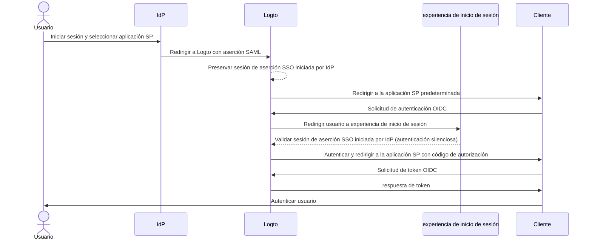
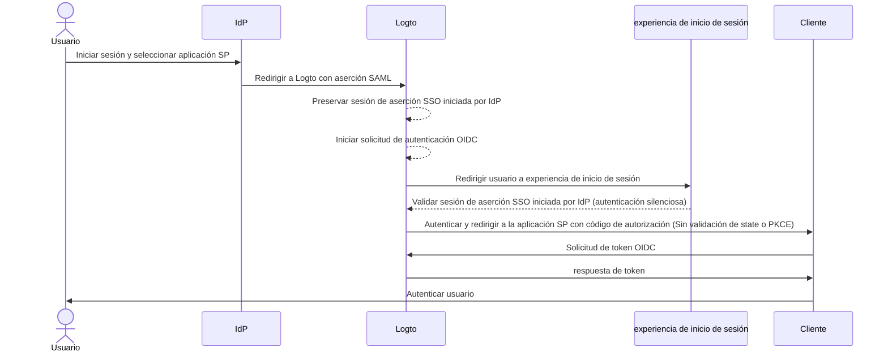

import Availability from '@components/Availability';

<Availability cloud="comingSoon" oss={false} />

# SSO iniciado por IdP (solo SAML)

El SSO iniciado por IdP es un proceso de inicio de sesión único donde el Proveedor de Identidad (IdP) controla principalmente el flujo de autenticación. Este proceso comienza cuando un usuario inicia sesión en la plataforma del IdP, como un portal corporativo o un panel de identidad centralizado. Una vez autenticado, el IdP genera una aserción SAML y dirige al usuario al Proveedor de Servicios (SP) para acceder a la aplicación o servicio.


## Riesgos y consideraciones \{#risks-and-considerations}

El SSO iniciado por IdP puede introducir varias vulnerabilidades de seguridad que las organizaciones deben tener en cuenta. Dado que el proceso de autenticación es iniciado por el IdP sin una solicitud directa del usuario, puede ser susceptible a varios ataques, incluyendo [Cross-Site Request Forgery](https://blog.logto.io/csrf) (CSRF).

Esta falta de autenticación iniciada por el usuario puede llevar a accesos no autorizados si no se implementan las salvaguardas adecuadas. Además, la dependencia de un único punto de autenticación incrementa el riesgo de una brecha de seguridad, ya que comprometer el IdP podría exponer todas las aplicaciones conectadas.

Por lo tanto, se recomienda encarecidamente utilizar el SSO iniciado por SP, que proporciona un flujo de autenticación más seguro y controlado, asegurando que los usuarios soliciten explícitamente el acceso a los servicios.

## Conectar SSO iniciado por IdP con aplicaciones OIDC de Logto \{#connect-idp-initiated-sso-with-logto-oidc-applications}

Logto como proveedor de OpenID Connect (OIDC) no admite SSO iniciado por IdP. Sin embargo, puedes configurar Logto como SP para admitir SSO iniciado por IdP con tu IdP empresarial usando SAML. Esta configuración te permite aprovechar las capacidades de autenticación de Logto mientras mantienes el control del IdP sobre el flujo de autenticación.

:::note
Por defecto, esta función no está habilitada en Logto. Si necesitas habilitar el SSO iniciado por IdP para tu tenant, por favor contacta a nuestro [equipo de soporte](https://logto.io/contact?src=docs.sso).
:::

### Requisitos previos \{#prerequisites}

Antes de configurar el SSO iniciado por IdP, primero debes crear un conector SAML. Navega a <CloudLink to="/enterprise-sso">Consola > SSO empresarial</CloudLink> y sigue la guía paso a paso para configurar un conector [SAML](/integrations/saml-sso/) con tu IdP.

Una vez que el conector SAML esté configurado, puedes habilitar el método de inicio de sesión SSO en la sección <CloudLink to="/sign-in-experience/sign-up-and-sign-in">Inicio de sesión y cuenta > Registro e inicio de sesión</CloudLink>, y probar el flujo de SSO iniciado por SP para asegurarte de que la configuración es correcta. Asegúrate de que el SSO iniciado por SP funcione como se espera antes de continuar con el SSO iniciado por IdP.

### Habilitar SSO iniciado por IdP \{#enable-idp-initiated-sso}

Una vez que la función de SSO iniciado por IdP esté habilitada para tu tenant, deberías ver una pestaña adicional en la página de configuración de tu conector SAML, llamada **SSO iniciado por IdP**. Activa el interruptor **SSO iniciado por IdP** para habilitar la función en el conector.

### Seleccionar la aplicación SP \{#select-the-sp-application}

A diferencia del SSO iniciado por SP, donde el flujo de autenticación comienza desde el SP, el SSO iniciado por IdP requiere una aplicación SP del lado del cliente para redirigir a los usuarios después del proceso de autenticación. Puedes seleccionar la aplicación SP de la lista de aplicaciones registradas en el desplegable **Aplicación predeterminada**.

Solo las aplicaciones **Traditional Web App** y **Single Page App** son compatibles con el SSO iniciado por IdP. Asegúrate de seleccionar el tipo de aplicación adecuado según tu caso de uso.

:::note
En el lado de tu IdP, deja el parámetro `RelayState` en **VACÍO** para que el flujo de SSO iniciado por IdP funcione correctamente. Logto gestionará la redirección según la aplicación SP predeterminada seleccionada.
:::

## Configurar el flujo de autenticación iniciado por IdP \{#configure-idp-initiated-authentication-flow}

Para conectar el SSO SAML iniciado por IdP con OIDC, Logto proporciona dos opciones de configuración para gestionar la solicitud de autenticación.

### Opción A: Redirigir a la aplicación SP predeterminada (Recomendado) \{#option-a-redirect-to-the-default-sp-application-recommended}

Cuando el IdP inicia el flujo SSO y envía la aserción SAML a Logto, se creará una sesión de aserción SSO iniciada por IdP. Logto redirigirá al usuario a la aplicación SP predeterminada para iniciar una solicitud de autenticación OIDC estándar en el lado del cliente.


```mermaid
sequenceDiagram
    actor Usuario
    participant IdP as IdP
    participant Logto as Logto
    participant Experiencia as experiencia de inicio de sesión
    participant SP as Cliente

    Usuario->>IdP: Iniciar sesión y seleccionar aplicación SP
    IdP->>Logto: Redirigir a Logto con aserción SAML
    Logto-->>Logto: Preservar sesión de aserción SSO iniciada por IdP
    Logto->>SP: Redirigir a la aplicación SP predeterminada
    SP->>Logto: Solicitud de autenticación OIDC
    Logto->>Experiencia: Redirigir usuario a experiencia de inicio de sesión
    Experiencia-->>Logto: Validar sesión de aserción SSO iniciada por IdP (autenticación silenciosa)
    Logto->>SP: Autenticar y redirigir a la aplicación SP con código de autorización
    SP->>Logto: Solicitud de token OIDC
    Logto->>SP: respuesta de token
    SP->>Usuario: Autenticar usuario
```

Para configurar esta opción, selecciona la tarjeta **Redirigir al cliente para autenticación iniciada por SP** en la pestaña **SSO iniciado por IdP** de la configuración del conector SAML.


1. Proporciona una **URL de redirección del cliente** para redirigir al usuario a la aplicación SP predeterminada después del flujo SSO iniciado por IdP. Logto redirigirá al usuario a esta URL con el parámetro de consulta `?ssoConnectorId={connectorId}` añadido a la URL. La aplicación cliente debe gestionar la redirección e iniciar la solicitud de autenticación OIDC. (Recomendamos usar una ruta o página dedicada en tu aplicación cliente para gestionar la solicitud de autenticación SSO iniciada por IdP.)

2. Gestiona la solicitud de autenticación OIDC en el lado del cliente usando el parámetro de consulta `ssoConnectorId` para identificar el conector SAML que inició el flujo de autenticación SSO iniciado por IdP.

3. Pasa el parámetro de autenticación [inicio de sesión directo](/end-user-flows/authentication-parameters/direct-sign-in/) en la solicitud de inicio de sesión a Logto para completar el flujo de autenticación SSO.

```typescript
// Ejemplo en React
import { Prompt, useLogto } from '@logto/react';
import { useEffect } from 'react';
import { useNavigate, useSearchParams } from 'react-router-dom';

const SsoDirectSignIn = () => {
  const { signIn } = useLogto();
  const [searchParams] = useSearchParams();

  useEffect(() => {
    const ssoConnectorId = searchParams.get('ssoConnectorId');
    if (ssoConnectorId) {
      void signIn({
        redirectUri,
        prompt: Prompt.Login,
        directSignIn: {
          method: 'sso',
          target: ssoConnectorId,
        },
      });
    }
  }, [searchParams, signIn]);
};
```

- `redirectUri`: El `redirect_uri` para redirigir al usuario después de completar el flujo de autenticación OIDC.
- `prompt=login`: Obliga al usuario a iniciar sesión usando la identidad SSO iniciada por IdP.
- `directSignIn=sso:{connectorId}`: Especifica el método de inicio de sesión directo como `sso` y el ID del conector SAML de destino. Este parámetro activará el flujo de autenticación SSO directamente sin mostrar la página de inicio de sesión. El usuario será autenticado automáticamente usando la sesión de aserción SSO iniciada por IdP preservada si el ID del conector coincide y la sesión es válida.

Este método asegura que el flujo de autenticación sea seguro y siga el protocolo OIDC estándar, mientras mantiene el control del IdP sobre el proceso de autenticación. La aplicación cliente puede aprovechar la sesión de aserción SSO iniciada por IdP para autenticar al usuario sin pasos adicionales de inicio de sesión, manteniendo el flujo de autenticación seguro y controlado. La aplicación cliente aún puede validar los parámetros `state` y `PKCE` para asegurar que la solicitud de autenticación sea segura.

:::note
Este método está disponible tanto para aplicaciones **Traditional Web App** como **Single Page App**. Y se recomienda para todos los casos de uso.
:::

### Opción B: Autenticar directamente al usuario con SSO iniciado por IdP \{#option-b-directly-authenticate-the-user-with-idp-initiated-sso}

En ciertas circunstancias, el SP puede no ser capaz de gestionar el callback de SSO iniciado por IdP e iniciar la solicitud de autenticación OIDC. En este caso, Logto proporciona una opción alternativa para autenticar directamente al usuario con la sesión de aserción SSO iniciada por IdP.

Esta opción se considera menos segura y no se recomienda. El flujo de autenticación omite el protocolo OIDC estándar. Como la solicitud de autenticación es iniciada por el IdP, la aplicación cliente puede no ser capaz de validar la solicitud de autenticación de forma segura. Por ejemplo, la aplicación cliente no puede validar los parámetros `state` y `PKCE` para asegurar que la solicitud de autenticación sea segura.

:::warning
Este método no está disponible para aplicaciones **Single Page App**, ya que requiere que la aplicación cliente gestione la solicitud de autenticación de forma segura usando el parámetro `PKCE`. Si necesitas implementar SSO iniciado por IdP para una aplicación SPA, utiliza la opción anterior.
:::


```mermaid
  sequenceDiagram

  actor Usuario
  participant IdP as IdP
  participant Logto as Logto
  participant Experiencia as experiencia de inicio de sesión
  participant SP as Cliente

  Usuario->>IdP: Iniciar sesión y seleccionar aplicación SP
  IdP->>Logto: Redirigir a Logto con aserción SAML
  Logto-->>Logto: Preservar sesión de aserción SSO iniciada por IdP
  Logto-->>Logto: Iniciar solicitud de autenticación OIDC
  Logto->>Experiencia: Redirigir usuario a experiencia de inicio de sesión
  Experiencia-->>Logto: Validar sesión de aserción SSO iniciada por IdP (autenticación silenciosa)
  Logto->>SP: Autenticar y redirigir a la aplicación SP con código de autorización (Sin validación de state o PKCE)
  SP->>Logto: Solicitud de token OIDC
  Logto->>SP: respuesta de token
  SP->>Usuario: Autenticar usuario
```

Para configurar esta opción, selecciona la opción **Iniciar sesión directamente usando SSO iniciado por IdP** en la pestaña **SSO iniciado por IdP** de la configuración del conector SAML.


1. Selecciona el **URI de redirección posterior al inicio de sesión** para redirigir al usuario de vuelta a la aplicación cliente tras la autenticación exitosa. Esta URL se usará como el `redirect_uri` en la solicitud de autenticación OIDC. El URI debe ser uno de los URIs de redirección permitidos registrados en la aplicación cliente.

   :::note
   Se recomienda encarecidamente usar un **URI de redirección** dedicado para el SSO iniciado por IdP. Dado que la solicitud de autenticación es no solicitada, la aplicación cliente debe gestionar la respuesta de forma independiente, separada del flujo estándar de autenticación iniciado por SP.
   :::

2. Personaliza los parámetros de la solicitud de autorización si es necesario usando el editor json **Parámetros de autenticación adicionales** (siguiendo el tipo `Map<string,string>`).

   Ejemplo: Por defecto, Logto solo solicita los alcances `openid` y `profile`. Puedes añadir alcances o parámetros adicionales a la solicitud de autenticación.

   ```json
   {
     "scope": "email offline_access"
   }
   ```

   - añade el alcance adicional `email` para solicitar la dirección de correo electrónico del usuario.
   - añade el alcance `offline_access` para solicitar el token de actualización.

   También te recomendamos proporcionar un parámetro `state` personalizado para validar la respuesta de autenticación de forma segura.

   ```json
   {
     "state": "valor-personalizado-state"
   }
   ```

   La aplicación cliente debe validar el parámetro `state` en la respuesta del código de autorización para asegurar que la solicitud de autenticación sea válida.
