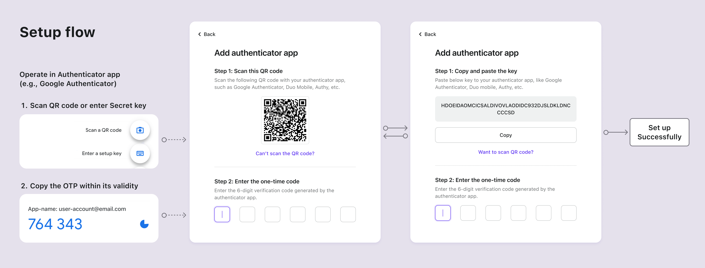
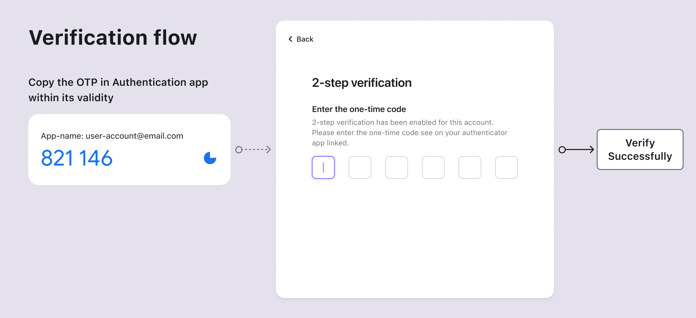

# OTP de la aplicación autenticadora

## Conceptos {#concepts}

La aplicación autenticadora, también conocida como el Token de Software, es uno de los métodos de [autenticación multifactor (MFA)](https://auth.wiki/mfa) más adoptados. Genera contraseñas temporales, [contraseñas de un solo uso (OTP)](https://auth.wiki/otp), para mejorar la seguridad de la autenticación de servicios en línea. A diferencia de los tokens de hardware físicos, los tokens de software son típicamente aplicaciones o complementos que los usuarios instalan en sus dispositivos, ya sea un teléfono inteligente o un navegador de computadora. Los tokens de software pueden operar localmente en un solo dispositivo o sincronizarse a través de varios dispositivos, dependiendo de las capacidades del autenticador y de la configuración individual del usuario.

Ejemplos populares de tokens de software incluyen Google Authenticator, Microsoft Authenticator, Duo, 1Password, Authy, y más.

## Flujos de autenticación {#authentication-flows}

### Flujos de configuración de OTP de la aplicación autenticadora {#authentication-app-otp-setup-flows}

1. **Código QR o Clave Secreta**: Los usuarios reciben un código QR o una clave secreta de tu servicio.
2. **Agregar cuenta**: Usando su aplicación autenticadora, los usuarios escanean el código QR o ingresan manualmente la clave secreta para agregar su cuenta.
3. **Contraseña dinámica de un solo uso**: La aplicación autenticadora muestra un código de seis dígitos que se actualiza cada 1-2 minutos para la cuenta agregada.
4. **Completar configuración de MFA**: Los usuarios ingresan este código dentro de su validez en la página de configuración de MFA, completando la configuración de OTP de la aplicación autenticadora para MFA.

### Flujos de verificación de OTP de la aplicación autenticadora {#authentication-app-otp-verification-flows}

1. **Intento de inicio de sesión**: Durante el inicio de sesión, se solicita a los usuarios MFA.
2. **Recuperar OTP**: Abren su aplicación autenticadora para recuperar el OTP de la cuenta respectiva.
3. **Ingresar OTP**: Los usuarios ingresan el OTP mostrado en la aplicación dentro de su validez en la página de verificación en dos pasos.
4. **Autenticación**: El sistema verifica el OTP, otorgando acceso tras una validación exitosa.

