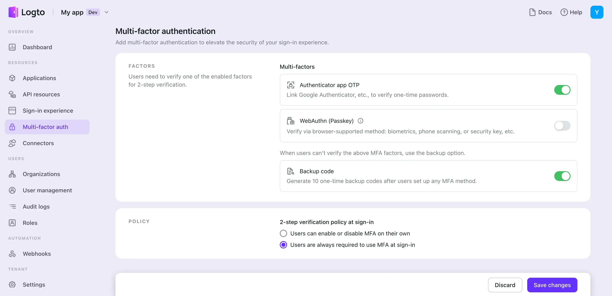

# Configurar MFA

## Configurar ajustes de MFA en Logto \{#configure-mfa-settings-in-logto}

Sigue estos pasos para habilitar MFAs en el flujo de inicio de sesión de Logto de los usuarios:

1. Navega a: <CloudLink to="/mfa">Consola > Autenticación multifactor (MFA)</CloudLink>.
2. Habilita los factores de verificación compatibles para tus usuarios.
   1. Factores primarios:
      - [OTP de la aplicación autenticadora](/end-user-flows/mfa/authenticator-app-otp): El método más común y ampliamente aceptado. Utiliza una contraseña de un solo uso basada en tiempo (TOTP) generada por una aplicación autenticadora como Google Authenticator o Authy.
      - [Passkeys (WebAuthn)](/end-user-flows/mfa/webauthn): Una opción de alta seguridad adecuada para productos web que admiten biometría de dispositivos o claves de seguridad, etc., asegurando una protección robusta.
   2. Factores de respaldo:
      - [Códigos de respaldo](/end-user-flows/mfa/backup-codes): Esto sirve como una opción de respaldo cuando los usuarios no pueden verificar ninguno de los factores primarios mencionados anteriormente. Habilitar esta opción reduce la fricción para el acceso exitoso de los usuarios.
3. Selecciona los ajustes de política de MFA para los usuarios:
   - **MFA controlado por el usuario**: Los usuarios pueden omitir el proceso de configuración de MFA durante el flujo de registro. Pueden optar por configurar MFA más tarde a través de tu página de configuración de cuenta de autoservicio o la página de configuración de cuenta alojada por Logto (próximamente). [Aprende más](/end-user-flows/account-settings/) sobre cómo implementar una página de configuración de cuenta de usuario.
   - **MFA impuesto por el administrador**: Puedes imponer MFA para todos los usuarios. Se pedirá a los usuarios que configuren MFA durante el proceso de inicio de sesión, el cual no se puede omitir. Si el usuario no configura MFA o elimina sus ajustes de MFA, se bloqueará su cuenta hasta que configuren MFA nuevamente.

## Flujo de usuario de MFA \{#mfa-user-flow}

### Flujo de configuración de MFA \{#mfa-set-up-flow}

Una vez que MFA está habilitado, se pedirá a los usuarios que configuren MFA durante el proceso de inicio de sesión y registro. Los usuarios pueden optar por omitir este proceso de configuración solo si la política de "MFA controlado por el usuario" está habilitada.

1. **Visitar la página de inicio de sesión o registro**: El usuario navega a la página de inicio de sesión o registro.
2. **Completa el inicio de sesión o registro**: El usuario completa el proceso de verificación de identidad dentro del flujo de inicio de sesión o registro.
3. **Configurar el factor primario de MFA**: Se le pide al usuario que configure su factor primario de MFA (ya sea OTP de la aplicación autenticadora o WebAuthn). Si se habilitan múltiples factores primarios, pueden elegir su opción preferida. Si la política de "MFA controlado por el usuario" está habilitada, también pueden omitir este paso seleccionando el botón "Omitir".
4. **Configurar el factor de respaldo de MFA**: Si se habilitan **Códigos de respaldo**, se le pide al usuario que configure códigos de respaldo después de configurar con éxito su factor de autenticación primario. Se mostrarán códigos de respaldo generados automáticamente al usuario, que pueden descargar y almacenar de forma segura. El usuario debe confirmar manualmente los códigos de respaldo para completar el proceso de configuración de MFA.

### Flujo de verificación de MFA \{#mfa-verification-flow}

A los usuarios que han configurado MFA se les pedirá que verifiquen su identidad utilizando sus factores de MFA configurados durante el inicio de sesión. El factor de verificación dependerá de la configuración de MFA en Logto y de los ajustes del usuario.

- Si un usuario ha configurado solo un factor, lo verificará directamente.
- Si un usuario ha configurado múltiples factores como 2FA, necesitará elegir uno para verificar.
- Si todos los factores primarios habilitados no están disponibles para el usuario, y el código de respaldo está habilitado, pueden usar el código de respaldo de un solo uso para verificar su identidad.

