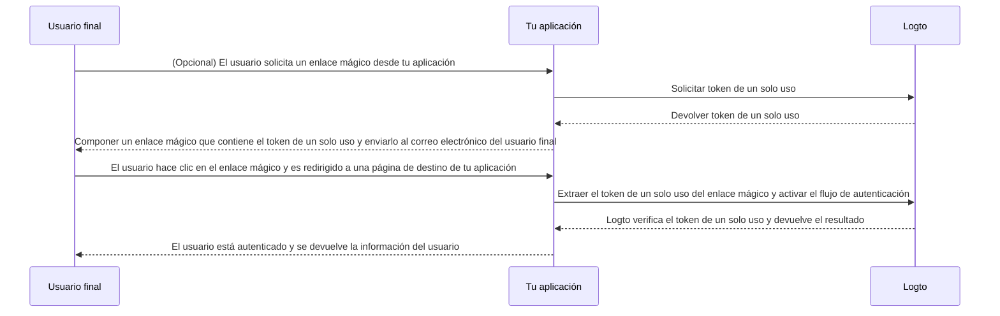

# Enlace mágico (Token de un solo uso)

import Availability from '@components/Availability';

<Availability cloud oss="comingSoon" />

Similar al código de un solo uso (OTP), un token de un solo uso es otro método de autenticación sin contraseña que se puede utilizar para verificar la identidad de un usuario. El token es válido por un período de tiempo limitado y está asociado con una dirección de correo electrónico del usuario final.

A veces, es posible que desees invitar a nuevos usuarios a tu aplicación / organización sin requerir que creen una cuenta primero. O puedes olvidar tu contraseña y querer iniciar sesión / restablecer tu contraseña verificando rápidamente tu identidad a través del correo electrónico. En tales casos, la aplicación puede enviar un "enlace mágico" a tu correo electrónico. Y serás autenticado inmediatamente cuando hagas clic en el enlace.

Los desarrolladores de aplicaciones pueden usar el token de un solo uso para componer un enlace mágico y enviarlo a la dirección de correo electrónico del usuario final.

## Flujo de token de un solo uso \{#one-time-token-flow}

Aquí está el diagrama de secuencia del flujo de autenticación usando el token de un solo uso:



## Guía de implementación \{#implementation-guide}

Logto ofrece un conjunto de Management APIs y Experience APIs para facilitar la implementación de tu enlace mágico.

Antes de comenzar, asegúrate de tener una instancia de Logto lista y haber establecido la conexión Máquina a Máquina entre tu servidor de aplicaciones y el endpoint de Logto (requerido para las Management APIs). Aprende más sobre [Logto Management API](/integrate-logto/interact-with-management-api).

### Paso 1: Solicitar token de un solo uso \{#step-1-request-one-time-token}

Usa Logto Management API para crear un token de un solo uso.

```bash
POST /api/one-time-tokens
```

Ejemplo de carga útil del cuerpo de la solicitud:

```json
{
  "email": "user@example.com",
  // Opcional. Por defecto es 600 (10 minutos).
  "expiresIn": 3600,
  // Opcional. El usuario será aprovisionado a las organizaciones especificadas tras la verificación exitosa.
  "context": {
    "jitOrganizationIds": ["abcdefgh1234"]
  }
}
```

### Paso 2: Componer tu enlace mágico \{#step-2-compose-your-magic-link}

Después de obtener el token de un solo uso, puedes componer un enlace mágico y enviarlo a la dirección de correo electrónico del usuario final. El enlace mágico debe contener al menos el token y el correo electrónico del usuario como parámetros, y debe navegar a una página de destino en tu propia aplicación. Por ejemplo, `https://yourapp.com/landing-page`.

Aquí tienes un ejemplo simple de cómo podría verse el enlace mágico:

```
https://yourapp.com/landing-page?token=YHwbXSXxQfL02IoxFqr1hGvkB13uTqcd&email=user@example.com
```

:::note

Los nombres de los parámetros en el enlace mágico pueden ser completamente personalizados. Puedes agregar información adicional al enlace mágico según los requisitos de tu aplicación, así como codificar todos los parámetros de la URL.

:::

### Paso 3: Activar el flujo de autenticación a través de Logto SDK \{#step-3-trigger-the-authentication-flow-via-logto-sdk}

Después de que el usuario final haga clic en el enlace mágico y navegue a tu aplicación, puedes extraer los parámetros `token` y `email` de la URL, y luego llamar a la función `signIn()` desde Logto SDK para activar el flujo de autenticación.

```typescript title="TokenLandingPage.tsx"
// Ejemplo de React
import { useLogto } from '@logto/react';
import { useEffect } from 'react';
import { useSearchParams } from 'react-router-dom';

const TokenLandingPage = () => {
  const { signIn } = useLogto();
  const [searchParams] = useSearchParams();

  useEffect(() => {
    // Extraer el token y el correo electrónico del enlace mágico
    const oneTimeToken = searchParams.get('token');
    const email = searchParams.get('email');

    // Suponiendo que esta es tu URI de redirección de inicio de sesión
    const redirectUri = 'https://yourapp.com/callback';

    if (oneTimeToken && email) {
      signIn({
        redirectUri,
        clearTokens: false, // Opcional. Ver mensaje de advertencia a continuación
        extraParams: {
          'one_time_token': oneTimeToken,
          'login_hint': email,
        },
      });
    }
  }, [searchParams, signIn]);

  return <>Por favor espera...</>;
};
```

:::warning

Si un usuario ya ha iniciado sesión, llamar a la función `signIn()` desde el SDK borrará automáticamente todos los tokens almacenados en caché (Token de ID, Token de acceso y Token de actualización) del almacenamiento del cliente, lo que resultará en la pérdida del estado de autenticación del usuario actual.

Por lo tanto, debes especificar un parámetro adicional de inicio de sesión `clearTokens: false` para evitar borrar los tokens existentes. Si esto se especifica, también necesitarás borrar manualmente los tokens en la página de callback de inicio de sesión.

Ignora esto si tus enlaces mágicos no están diseñados para usuarios autenticados.

:::

### Paso 4: (Opcional) Borrar tokens almacenados en caché en la página de callback de inicio de sesión \{#step-4-clear-cached-tokens-in-sign-in-callback-page}

Si especificas `clearTokens: false` en la función de inicio de sesión, necesitas borrar manualmente los tokens en la página de callback de inicio de sesión.

```typescript title="Callback.tsx"
// Ejemplo de React
import { useHandleSignInCallback, useLogto } from '@logto/react';
import { useEffect } from 'react';

const Callback = () => {
  const { clearAllTokens } = useLogto();

  useEffect(() => {
    void clearAllTokens();
  }, [clearAllTokens]);

  useHandleSignInCallback(() => {
    // Navegar a tu página de inicio
  });

  return <>Por favor espera...</>;
};
```

## Preguntas frecuentes \{#faqs}

<details>

<summary>

### ¿Puedo usar el enlace mágico para invitar a nuevos usuarios a mis organizaciones? \{#can-i-use-the-magic-link-to-invite-new-users-to-my-organizations}

</summary>

Sí, puedes usar el enlace mágico para invitar a nuevos usuarios a tu aplicación, así como a organizaciones. Si deseas invitar a nuevos usuarios a tu organización, simplemente especifica los `jitOrganizationIds` en el cuerpo de la solicitud.

El usuario se unirá automáticamente a las organizaciones tras la verificación exitosa, y se asignarán roles predeterminados de la organización. Consulta la sección "Aprovisionamiento Just-in-Time" en la página de detalles de tu organización y configura los roles predeterminados para tus organizaciones.

</details>

<details>

<summary>

### ¿El token de un solo uso expira? \{#does-the-one-time-token-expire}

</summary>

Sí, el token de un solo uso expirará después del tiempo `expiresIn` especificado (en segundos). El tiempo de expiración predeterminado es de 10 minutos.

</details>

<details>

<summary>

### Si desactivo el registro de usuarios en "Experiencia de inicio de sesión", ¿puedo seguir usando el enlace mágico para invitar a usuarios? \{#if-i-disable-user-registration-in-sign-in-experience-can-i-still-use-magic-link-to-invite-users}

</summary>

Sí, puedes seguir usando el enlace mágico para invitar a usuarios incluso si desactivas el registro de usuarios en "Experiencia de inicio de sesión".

</details>

<details>

<summary>

### ¿Qué sucederá si un usuario ya ha iniciado sesión y luego hace clic en otro enlace mágico? \{#what-will-happen-if-a-user-already-signed-in-and-then-click-another-magic-link}

</summary>

Hay varios escenarios posibles:

1. El usuario ya ha iniciado sesión y luego hace clic en un enlace mágico que se asocia con la cuenta de usuario actual. En este caso, Logto aún verificará el token de un solo uso y aprovisionará al usuario a las organizaciones especificadas si es necesario.
2. El usuario ya ha iniciado sesión y luego hace clic en un enlace mágico que se asocia con una cuenta diferente. En este caso, Logto le pedirá al usuario que continúe como la nueva cuenta o que regrese a la aplicación con la cuenta actual.
   1. Si el usuario elige continuar como la nueva cuenta, Logto cambiará a la nueva cuenta después de que la verificación del token sea exitosa.
   2. Si el usuario elige quedarse con la cuenta actual, Logto no verificará el token y regresará a la aplicación con la cuenta actual.
3. Si tu solicitud de inicio de sesión está configurada para "login" o contiene "login", Logto iniciará automáticamente la sesión de la cuenta asociada con el token de un solo uso sin solicitar un cambio.

</details>
