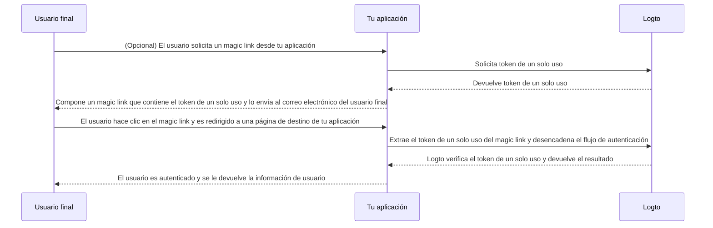

# Magic link (Token de un solo uso)

Similar a la contraseña de un solo uso (OTP), un token de un solo uso es otro método de autenticación sin contraseña que puede utilizarse para verificar la identidad de un usuario.
El token es válido por un período de tiempo limitado y está asociado con una dirección de correo electrónico del usuario final.

A veces puedes querer invitar a nuevos usuarios a tu aplicación / organización sin requerir que creen una cuenta primero.
O puedes olvidar tu contraseña y querer iniciar sesión / restablecer tu contraseña verificando rápidamente tu identidad por correo electrónico.
En tales casos, la aplicación puede enviar un "magic link" a tu correo electrónico. Y serás autenticado inmediatamente al hacer clic en el enlace.

Los desarrolladores de aplicaciones pueden usar el token de un solo uso para componer un magic link y enviarlo a la dirección de correo electrónico del usuario final.

## Casos de uso \{#use-cases}

Logto admite los siguientes escenarios con magic links:

- **Registro solo por invitación**: Para herramientas internas o productos de IA en fase de prueba, puedes desactivar el registro público e invitar a usuarios específicos mediante magic links.
- **Invitación de miembros de la organización**: Para productos SaaS, utiliza magic links para invitar a nuevos miembros a unirse a una organización, agilizando el proceso de incorporación.
- **Inicio de sesión / Registro**: Envía un magic link para iniciar sesión o registrarse sin contraseña a través del correo electrónico.

Por ejemplo, cuando has desactivado el registro público, puedes enviar un magic link con un token de un solo uso (por ejemplo, `https://yourapp.com/landing-page?token=YHwbXSXxQfL02IoxFqr1hGvkB13uTqcd&email=user@example.com`) al correo electrónico del usuario para invitarlo a completar la creación de la cuenta. Puedes personalizar la plantilla de correo electrónico en tu propio servicio de envío de correos, como:


Actualmente no es compatible:

- Restablecimiento de contraseña con magic link.
- Uso de número de teléfono o nombre de usuario como identificador.

## Flujo de token de un solo uso \{#one-time-token-flow}

Aquí tienes el diagrama de secuencia del flujo de autenticación usando token de un solo uso:



## Guía de implementación \{#implementation-guide}

Logto ofrece un conjunto de Management API y Experience API para facilitar la implementación de tu magic link.

Antes de comenzar, asegúrate de tener una instancia de Logto lista y haber establecido la conexión Máquina a Máquina entre tu servidor de aplicaciones
y el endpoint de Logto (requerido para las Management API). Aprende más sobre [Logto Management API](/integrate-logto/interact-with-management-api).

### Paso 1: Solicitar token de un solo uso \{#step-1-request-one-time-token}

Utiliza Logto Management API para crear un token de un solo uso.

```bash
POST /api/one-time-tokens
```

Ejemplo de payload del cuerpo de la solicitud:

```json
{
  "email": "user@example.com",
  // Opcional. Por defecto es 600 (10 minutos).
  "expiresIn": 3600,
  // Opcional. El usuario será aprovisionado a las organizaciones especificadas tras la verificación exitosa.
  "context": {
    "jitOrganizationIds": ["abcdefgh1234"]
  }
}
```

### Paso 2: Componer tu magic link \{#step-2-compose-your-magic-link}

Después de obtener el token de un solo uso, puedes componer un magic link y enviarlo al correo electrónico del usuario final.
El magic link debe contener al menos el token y el correo electrónico del usuario como parámetros, y debe dirigir a una página de destino en tu propia aplicación.
Por ejemplo: `https://yourapp.com/landing-page`.

Aquí tienes un ejemplo simple de cómo podría verse el magic link:

```
https://yourapp.com/landing-page?token=YHwbXSXxQfL02IoxFqr1hGvkB13uTqcd&email=user@example.com
```

:::note

Los nombres de los parámetros en el magic link pueden ser totalmente personalizados.
Puedes añadir información adicional al magic link según los requisitos de tu aplicación,
así como codificar todos los parámetros de la URL.

:::

### Paso 3: Desencadenar el flujo de autenticación vía Logto SDK \{#step-3-trigger-the-authentication-flow-via-logto-sdk}

Después de que el usuario final haga clic en el magic link y navegue a tu aplicación, puedes extraer los parámetros `token` y `email` de la URL, y luego llamar a la función `signIn()` de Logto SDK para iniciar el flujo de autenticación.

```typescript title="TokenLandingPage.tsx"
// Ejemplo en React
import { useLogto } from '@logto/react';
import { useEffect } from 'react';
import { useSearchParams } from 'react-router-dom';

const TokenLandingPage = () => {
  const { signIn } = useLogto();
  const [searchParams] = useSearchParams();

  useEffect(() => {
    // Extrae el token y el correo electrónico del magic link
    const oneTimeToken = searchParams.get('token');
    const email = searchParams.get('email');

    // Suponiendo que esta es tu URI de redirección de inicio de sesión
    const redirectUri = 'https://yourapp.com/callback';

    if (oneTimeToken && email) {
      signIn({
        redirectUri,
        clearTokens: false, // Opcional. Ver mensaje de advertencia abajo
        extraParams: {
          'one_time_token': oneTimeToken,
          'login_hint': email,
        },
      });
    }
  }, [searchParams, signIn]);

  return <>Por favor, espera...</>;
};
```

:::warning

Si un usuario ya ha iniciado sesión, llamar a la función `signIn()` del SDK limpiará automáticamente todos los tokens almacenados en caché (token de ID, token de acceso y token de actualización) del almacenamiento del cliente,
lo que termina perdiendo el estado de autenticación del usuario actual.

Por lo tanto, debes especificar un parámetro adicional de inicio de sesión `clearTokens: false` para evitar limpiar los tokens existentes.
Si esto se especifica, también tendrás que limpiar manualmente los tokens en la página de callback de inicio de sesión.

Ignora esto si tus magic links no están diseñados para usuarios autenticados.

:::

### Paso 4: (Opcional) Limpiar tokens en caché en la página de callback de inicio de sesión \{#step-4-clear-cached-tokens-in-sign-in-callback-page}

Si especificas `clearTokens: false` en la función de inicio de sesión, necesitas limpiar manualmente los tokens en la página de callback de inicio de sesión.

```typescript title="Callback.tsx"
// Ejemplo en React
import { useHandleSignInCallback, useLogto } from '@logto/react';
import { useEffect } from 'react';

const Callback = () => {
  const { clearAllTokens } = useLogto();

  useEffect(() => {
    void clearAllTokens();
  }, [clearAllTokens]);

  useHandleSignInCallback(() => {
    // Navega a tu página principal
  });

  return <>Por favor, espera...</>;
};
```

## Preguntas frecuentes \{#faqs}

<details>

<summary>

### ¿Puedo usar el magic link para invitar nuevos usuarios a mis organizaciones? \{#can-i-use-the-magic-link-to-invite-new-users-to-my-organizations}

</summary>

Sí, puedes usar el magic link para invitar nuevos usuarios a tu aplicación, así como a organizaciones.
Si quieres invitar nuevos usuarios a tu organización, simplemente especifica los `jitOrganizationIds` en el cuerpo de la solicitud.

El usuario se unirá automáticamente a las organizaciones tras la verificación exitosa, y se asignarán los roles predeterminados de la organización.
Consulta la sección "Just-in-time provisioning" en la página de detalles de tu organización y configura los roles predeterminados para tus organizaciones.

</details>

<details>

<summary>

### ¿Puedo asignar usuarios a roles específicos usando el magic link? \{#can-i-assign-users-to-specific-roles-using-the-magic-link}

</summary>

El flujo de autenticación con magic link no admite la asignación de roles a usuarios. Pero siempre puedes usar los [Webhooks](/developers/webhooks) y la [Management API](/user-management/manage-users#manage-roles-of-users) para actualizar los roles del usuario después de que se registre.

</details>

<details>

<summary>

### ¿El token de un solo uso expira? \{#does-the-one-time-token-expire}

</summary>

Sí, el token de un solo uso expirará después del tiempo especificado en `expiresIn` (en segundos). El tiempo de expiración predeterminado es de 10 minutos.

</details>

<details>

<summary>

### Si desactivo el registro de usuarios en "Experiencia de inicio de sesión", ¿puedo seguir usando magic link para invitar usuarios? \{#if-i-disable-user-registration-in-sign-in-experience-can-i-still-use-magic-link-to-invite-users}

</summary>

Sí, puedes seguir usando magic link para invitar usuarios incluso si desactivas el registro de usuarios en "Experiencia de inicio de sesión".

</details>

<details>

<summary>

### ¿Qué sucede si un usuario ya ha iniciado sesión y luego hace clic en otro magic link? \{#what-will-happen-if-a-user-already-signed-in-and-then-click-another-magic-link}

</summary>

Existen varios escenarios posibles:

1. El usuario ya ha iniciado sesión y luego hace clic en un magic link que se asocia con la cuenta de usuario actual. En este caso, Logto seguirá verificando el token de un solo uso y aprovisionará al usuario a las organizaciones especificadas si es necesario.
2. El usuario ya ha iniciado sesión y luego hace clic en un magic link que se asocia con una cuenta diferente. En este caso, Logto solicitará al usuario continuar como la nueva cuenta o regresar a la aplicación con la cuenta actual.
   1. Si el usuario elige continuar como la nueva cuenta, Logto cambiará a la nueva cuenta después de que la verificación del token sea exitosa.
   2. Si el usuario elige permanecer con la cuenta actual, Logto no verificará el token y regresará a la aplicación con la cuenta actual.
3. Si tu prompt de inicio de sesión está configurado como "login" o contiene "login", Logto iniciará sesión automáticamente con la cuenta asociada al token de un solo uso sin solicitar el cambio. Esto se debe a que el prompt "login" indica una intención explícita de autenticación, lo que tiene prioridad sobre la sesión actual.

</details>
