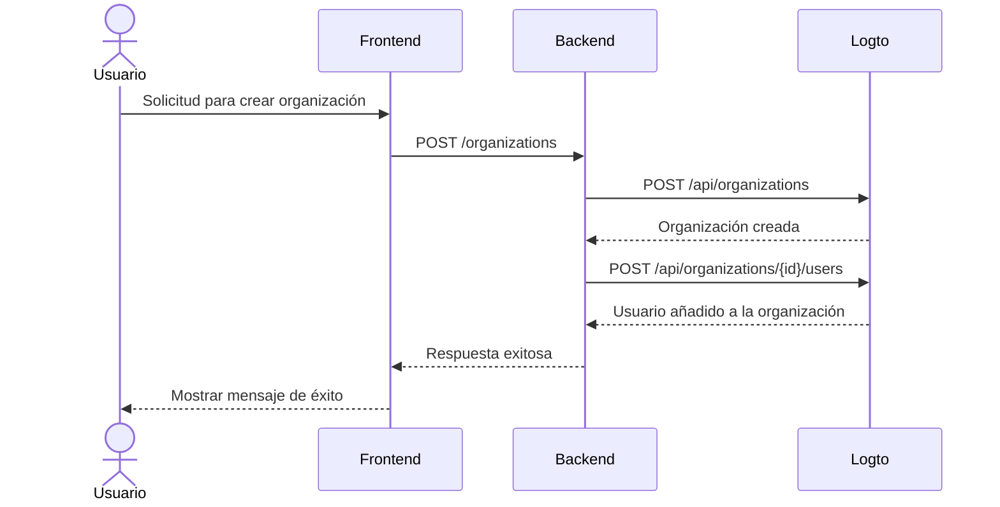

import GearIcon from '@site/src/assets/gear.svg';
import OrganizationIcon from '@site/src/assets/organization.svg';

# Experiencia de organización

La experiencia de [organización](/organizations) es el conjunto de interfaces y flujos que utilizan tus clientes empresariales y sus empleados, especialmente en [aplicaciones multi-inquilino](https://auth.wiki/multi-tenancy). Esta guía muestra cómo integrarla en tu aplicación utilizando la Management API de Logto.

Esta sección te ayuda a diseñar la **experiencia de organización** para tus usuarios finales. Por ejemplo:

1. Los administradores pueden crear sus propias organizaciones.
2. Los administradores pueden gestionar los miembros de la organización.
3. Los administradores pueden invitar a miembros a unirse a sus organizaciones.
4. y más.

  

## Comprende el flujo de autenticación \{#understand-the-authentication-flow}

Para integrarte con la Management API de Logto, primero comprende el flujo básico de autenticación. Tiene dos requisitos clave:

### Protege tu API de backend \{#protect-your-backend-api}

- Las llamadas del frontend a tu API de backend requieren autenticación.
- Protege los endpoints de la API validando el token de acceso de Logto del usuario.
- Asegúrate de que solo los usuarios autenticados puedan acceder a tus servicios.

### Accede a la Management API de Logto \{#access-the-logto-management-api}

- Tu servicio de backend llama de forma segura a la Management API de Logto.
- Sigue la guía [Interactúa con la Management API](/integrate-logto/interact-with-management-api) para la configuración.
- Utiliza la autenticación máquina a máquina para obtener credenciales de acceso.

Los próximos capítulos explican cómo configurar la Management API de Logto y repasan casos de uso comunes para construir tu experiencia de organización.

## Funcionalidades de la experiencia de organización \{#features-for-organization-experience}

<DocCardList
  items={[
    {
      type: 'link',
      label: 'Crear organización',
      href: '/end-user-flows/organization-experience/create-organization',
      description:
        'Utiliza la Management API de Logto para permitir que los usuarios finales creen organizaciones en el producto por sí mismos.',
      customProps: {
        icon: <OrganizationIcon />,
      },
    },
    {
      type: 'link',
      label: 'Invitar miembros a la organización',
      href: '/end-user-flows/organization-experience/invite-organization-members',
      description:
        'Utiliza la Management API de Logto para permitir que los administradores de la organización inviten a miembros a sus organizaciones.',
      customProps: {
        icon: <OrganizationIcon />,
      },
    },
    {
      type: 'link',
      label: 'Gestión de la organización',
      href: '/end-user-flows/organization-experience/organization-management',
      description:
        'Utiliza la Management API de Logto para permitir que los administradores de la organización gestionen a sus miembros dentro de la organización.',
      customProps: {
        icon: <GearIcon />,
      },
    },
  ]}
/>

Para una explicación detallada de las definiciones de organización, conceptos de miembros y plantillas de organización, consulta [Comprende cómo funcionan las organizaciones](/organizations/understand-how-organizations-work).

## Recursos relacionados \{#related-resources}

<Url href="https://blog.logto.io/build-multi-tenant-saas-application">
  Construye una aplicación SaaS multi-inquilino: Una guía completa desde el diseño hasta la
  implementación
</Url>
