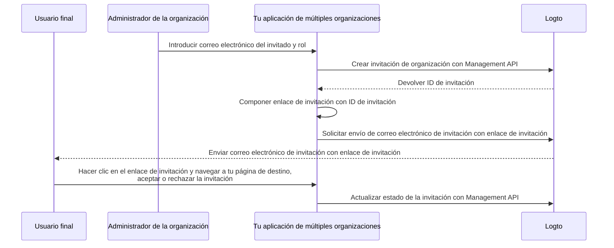

# Invitar a miembros de la organización

Como una aplicación de múltiples organizaciones, un requisito común es invitar a miembros a tu organización. En esta guía, te guiaremos a través de los pasos y detalles técnicos para implementar esta función en tu aplicación.

## Resumen del flujo

El proceso general se ilustra en el siguiente diagrama:



## Crear roles de organización

Antes de invitar a miembros a tu organización, necesitas crear roles de organización. Consulta la guía [Configurar plantilla de organización](/authorization/organization-template/configure-organization-template) para obtener instrucciones detalladas.

En esta guía, vamos a crear dos roles típicos de organización: `admin` y `member`.

El rol `admin` tiene acceso completo a todos los recursos de la organización, mientras que el rol `member` tiene acceso limitado. Por ejemplo, cada rol puede tener un conjunto de permisos como sigue:

- Rol `admin`:
  - `read:data` - Acceso de lectura a todos los recursos de datos de la organización.
  - `write:data` - Acceso de escritura a todos los recursos de datos de la organización.
  - `delete:data` - Acceso de eliminación a todos los recursos de datos de la organización.
  - `invite:member` - Invitar a miembros a la organización.
  - `manage:member` - Gestionar miembros en la organización.
  - `delete:member` - Eliminar miembros de la organización.
- Rol `member`:
  - `read:data` - Acceso de lectura a todos los recursos de datos de la organización.
  - `write:data` - Acceso de escritura a todos los recursos de datos de la organización.
  - `invite:member` - Invitar a miembros a la organización.

Esto se puede hacer fácilmente en el [Logto Console](https://cloud.logto.io/). También puedes usar el [Logto Management API](https://openapi.logto.io/operation/operation-createorganizationrole) para crear roles de organización programáticamente.

## Configurar tu conector de correo electrónico

Dado que las invitaciones se envían por correo electrónico, asegúrate de que tu [conector de correo electrónico](/connectors/email-connectors) esté configurado correctamente. Para enviar invitaciones, necesitas configurar un nuevo tipo de uso de [plantilla de correo electrónico](/connectors/email-connectors/email-templates#email-template-types) - `OrganizationInvitation`.

A continuación se muestra una plantilla de correo electrónico de ejemplo para el tipo de uso `OrganizationInvitation`:

```json
{
  "subject": "Bienvenido a mi organización",
  "content": "<p>Únete a mi organización mediante este <a href=\"{{link}}\" target=\"_blank\">enlace</a>.</p>",
  "usageType": "OrganizationInvitation",
  "type": "text/html"
}
```

El marcador `{{link}}` en el contenido del correo electrónico será reemplazado con el enlace de invitación real al enviar el correo electrónico. En esta guía, digamos que sería `https://your-app.com/invitation/accept/{your-invitation-id}`.

:::note

El "servicio de correo electrónico de Logto" incorporado en Logto Cloud no admite el tipo de uso `OrganizationInvitation` en este momento. En su lugar, necesitas configurar tu conector de correo electrónico (por ejemplo, Sendgrid) y configurar la plantilla `OrganizationInvitation`.

:::

## Manejar invitaciones con Logto Management API

:::note

Si aún no has configurado el Logto Management API, consulta [Interactuar con Management API](/integrate-logto/interact-with-management-api) para obtener detalles.

:::

Hemos proporcionado un conjunto de APIs de Management relacionadas con invitaciones en la función de organizaciones. Con estas APIs, puedes:

- `POST /api/organization-invitations` crear una invitación de organización con un rol de organización asignado.
- `POST /api/organization-invitations/{id}/message` enviar la invitación de organización al invitado por correo electrónico.
  Nota: Esta carga útil de la API admite una propiedad `link`, puedes componer tu enlace de invitación basado en el ID de invitación. Por ejemplo:

  ```json
  {
    "link": "https://your-app.com/invitation/accept/{your-invitation-id}"
  }
  ```

  En consecuencia, necesitas implementar una página de destino cuando tu invitado navegue a través del enlace de invitación a tu aplicación.

- `GET /api/organization-invitations` & `GET /api/organization-invitations/{id}` obtener todas tus invitaciones o una específica por ID.
  En tu página de destino, usa estas APIs para listar todas las invitaciones o los detalles de una invitación que un usuario ha recibido.
- `PUT /api/organization-invitations/{id}/status` aceptar o rechazar la invitación actualizando el estado de la invitación.
  Usa esta API para manejar la respuesta del usuario a la invitación.

Ten en cuenta que todas las APIs listadas arriba requieren un "token de organización" válido. [Consulta esta guía](/authorization/organization-template/protect-organization-resources#step-2-fetch-the-organization-token) para aprender cómo obtener el token de organización.

## Usar control de acceso basado en roles de organización (RBAC) para gestionar permisos de usuario

Con las configuraciones anteriores, ahora puedes enviar invitaciones por correo electrónico, y los invitados pueden unirse a la organización con el rol asignado.

Los usuarios con diferentes roles de organización tendrán diferentes alcances (permisos) en sus tokens de organización. Por lo tanto, tanto tu aplicación cliente como los servicios de backend deben verificar estos alcances para determinar las características visibles y las acciones permitidas.

## Manejar actualizaciones de alcance en tokens de organización

:::note

Asegúrate de haber integrado la organización con tu aplicación. Consulta la [guía de integración](/authorization/organization-template/protect-organization-resources) para obtener más detalles.

:::

Gestionar actualizaciones de alcance en tokens de organización implica:

### Revocar alcances existentes

Por ejemplo, degradar a un administrador a un miembro no administrador debería eliminar alcances del usuario. En tal caso, puedes simplemente borrar el token de organización en caché y obtener uno nuevo con el token de actualización. Los alcances reducidos se reflejarán inmediatamente en el nuevo token de organización emitido.

### Otorgar nuevos alcances

Esto se puede dividir en dos escenarios:

#### Otorgar nuevos alcances que ya están definidos en tu sistema de autenticación

Similar a revocar alcances, si el nuevo alcance otorgado ya está registrado con el servidor de autenticación, puedes simplemente emitir un nuevo token de organización, y los nuevos alcances se reflejarán inmediatamente.

#### Otorgar nuevos alcances que se introducen recientemente en tu sistema de autenticación

En este caso, necesitas desencadenar un proceso de re-inicio de sesión o re-consentimiento para actualizar el token de organización del usuario. Por ejemplo, llamando al método `signIn` en Logto SDK.

Aprende más sobre [emitir un token de organización](/authorization/organization-template/protect-organization-resources/#fetch-the-organization-token).

### Implementar verificación de permisos en tiempo real y actualizar el token de organización

Logto proporciona Management API para obtener permisos de usuario en tiempo real en la organización.

- `GET /api/organizations/{id}/users/{userId}/scopes` ([Referencias de API](https://openapi.logto.io/operation/operation-listorganizationuserscopes))

Luego puedes comparar los alcances en el token de organización del usuario con los permisos en tiempo real para determinar si el usuario ha sido promovido o degradado.

- Si es degradado, puedes simplemente borrar el token de organización en caché y el SDK emitirá automáticamente uno nuevo con los alcances actualizados.

  ```ts
  const { clearAccessToken } = useLogto();

  ...
  // Si los alcances en tiempo real obtenidos tienen menos alcances que los alcances del token de organización
  await clearAccessToken();
  ```

  Esto no requiere un proceso de re-inicio de sesión o re-consentimiento. Los nuevos tokens de organización se emitirán automáticamente por el Logto SDK.

- Si se introduce un nuevo alcance en tu sistema de autenticación, desencadena un proceso de re-inicio de sesión o re-consentimiento para actualizar el token de organización del usuario. Tomemos el SDK de React como ejemplo:

  ```ts
  const { clearAllTokens, signIn } = useLogto();

  ...
  // Si los alcances en tiempo real obtenidos tienen alcances recién asignados que los alcances del token de organización
  await clearAllTokens();
  signIn({
    redirectUri: '<your-sign-in-redirect-uri>',
    prompt: 'consent',
  });
  ```

  El código anterior desencadenará una navegación de página a la pantalla de consentimiento y redirigirá automáticamente de regreso a tu aplicación, con los alcances actualizados en el token de organización del usuario.

## Recursos relacionados

<Url href="https://blog.logto.io/implement-user-collaboration-in-your-app">
  Cómo implementamos la colaboración de usuarios dentro de una aplicación multi-tenant
</Url>
