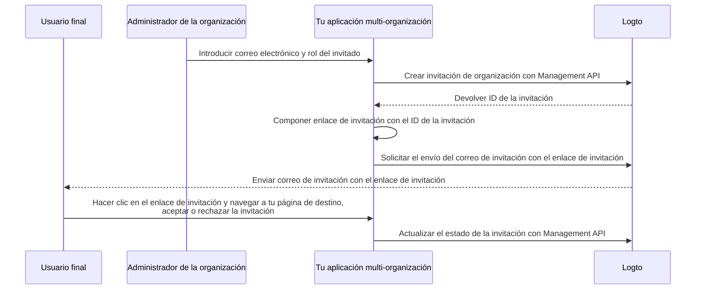

# Invitar miembros a la organización

En aplicaciones multi‑organización, un requisito común es invitar miembros a una organización. Esta guía recorre los pasos y detalles técnicos para implementar esta funcionalidad.

## Descripción general del flujo \{#flow-overview}

El proceso general se ilustra en el siguiente diagrama:



## Crear roles de organización \{#create-organization-roles}

Antes de invitar miembros, crea roles de organización. Consulta la [plantilla de organización](/authorization/organization-template) para aprender más sobre roles y permisos.

En esta guía, vamos a crear dos roles típicos de organización: `admin` y `member`.

El rol `admin` tiene acceso total a todos los recursos de la organización, mientras que el rol `member` tiene acceso limitado. Por ejemplo:

- Rol `admin`:
  - `read:data` - Acceso de lectura a todos los recursos de datos de la organización.
  - `write:data` - Acceso de escritura a todos los recursos de datos de la organización.
  - `delete:data` - Acceso de eliminación a todos los recursos de datos de la organización.
  - `invite:member` - Invitar miembros a la organización.
  - `manage:member` - Gestionar miembros en la organización.
  - `delete:member` - Eliminar miembros de la organización.
- Rol `member`:
  - `read:data` - Acceso de lectura a todos los recursos de datos de la organización.
  - `write:data` - Acceso de escritura a todos los recursos de datos de la organización.
  - `invite:member` - Invitar miembros a la organización.

Esto se puede hacer fácilmente en la [Consola de Logto](https://cloud.logto.io/). También puedes usar la [Logto Management API](https://openapi.logto.io/operation/operation-createorganizationrole) para crear roles de organización de forma programática.

## Configura tu conector de correo electrónico \{#configure-your-email-connector}

Dado que las invitaciones se envían por correo electrónico, asegúrate de que tu [conector de correo electrónico](/connectors/email-connectors) esté correctamente configurado. Para enviar invitaciones, configura una [plantilla de correo electrónico](/connectors/email-connectors/email-templates#email-template-types) con el tipo de uso `OrganizationInvitation`. Puedes incluir variables de la organización (por ejemplo, nombre, logo) y del invitador (por ejemplo, correo electrónico, nombre) [variables](/connectors/email-connectors/email-templates#email-template-variables) en el contenido, y personalizar [plantillas localizadas](/connectors/email-connectors/email-templates#email-template-localization) según sea necesario.

Un ejemplo de plantilla de correo electrónico para el tipo de uso `OrganizationInvitation` se muestra a continuación:

```json
{
  "subject": "Bienvenido a mi organización",
  "content": "<p>Únete a {{organization.name}} mediante este <a href=\"{{link}}\" target=\"_blank\">enlace</a>.</p>",
  "usageType": "OrganizationInvitation",
  "type": "text/html"
}
```

El marcador `{{link}}` en el contenido del correo será reemplazado por el enlace real de invitación cuando se envíe el correo.

:::note

El “servicio de correo electrónico de Logto” integrado en Logto Cloud actualmente no admite el tipo de uso `OrganizationInvitation`. Configura tu propio conector de correo electrónico (por ejemplo, SendGrid) y configura la plantilla `OrganizationInvitation` en su lugar.

:::

## Gestiona invitaciones con Logto Management API \{#handle-invitations-with-logto-management-api}

:::note

Si aún no has configurado la Logto Management API, consulta [Interactuar con Management API](/integrate-logto/interact-with-management-api) para más detalles.

:::

### Crear una invitación de organización con Logto Management API \{#create-an-organization-invitation-with-logto-management-api}

Hay un conjunto de Management APIs relacionadas con invitaciones en la funcionalidad de organizaciones. Con estas APIs, puedes:

- `POST /api/organization-invitations`: Crear una invitación de organización con un rol de organización asignado.
- `POST /api/one-time-tokens`: Crear un token de un solo uso para que el invitado se autentique cuando acepte la invitación. [Aprende más](/end-user-flows/one-time-token)
- `POST /api/organization-invitations/{id}/message`: Enviar la invitación de organización al invitado por correo electrónico.
  Nota: El payload admite una propiedad `link` para que puedas componer tu propio enlace de invitación basado en el ID de la invitación. Por ejemplo:

  ```json
  {
    "link": "https://your-app.com/invitation/join?id=your-invitation-id&token=your-one-time-token&email=invitee-email"
  }
  ```
