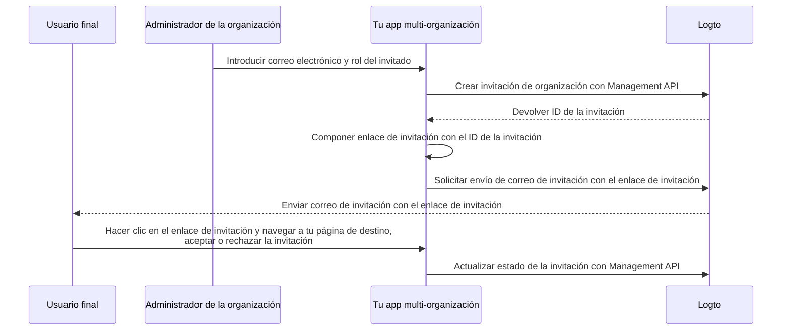

# Invitar miembros a la organización

Como una aplicación multi-organización, un requisito común es invitar miembros a tu organización. En esta guía, te mostraremos los pasos y detalles técnicos para implementar esta función en tu aplicación.

## Descripción general del flujo \{#flow-overview}

El proceso general se ilustra en el siguiente diagrama:



## Crear roles de organización \{#create-organization-roles}

Antes de invitar miembros a tu organización, necesitas crear roles de organización. Consulta la [Plantilla de organización](/authorization/organization-template) para aprender más sobre los roles y permisos de organización.

En esta guía, vamos a crear dos roles típicos de organización: `admin` y `member`.

El rol `admin` tiene acceso completo a todos los recursos de la organización, mientras que el rol `member` tiene acceso limitado. Por ejemplo, cada rol puede tener un conjunto de permisos como los siguientes:

- Rol `admin`:
  - `read:data` - Acceso de lectura a todos los recursos de datos de la organización.
  - `write:data` - Acceso de escritura a todos los recursos de datos de la organización.
  - `delete:data` - Acceso de eliminación a todos los recursos de datos de la organización.
  - `invite:member` - Invitar miembros a la organización.
  - `manage:member` - Gestionar miembros en la organización.
  - `delete:member` - Eliminar miembros de la organización.
- Rol `member`:
  - `read:data` - Acceso de lectura a todos los recursos de datos de la organización.
  - `write:data` - Acceso de escritura a todos los recursos de datos de la organización.
  - `invite:member` - Invitar miembros a la organización.

Esto se puede hacer fácilmente en la [Consola de Logto](https://cloud.logto.io/). También puedes usar la [Logto Management API](https://openapi.logto.io/operation/operation-createorganizationrole) para crear roles de organización de forma programática.

## Configura tu conector de correo electrónico \{#configure-your-email-connector}

Dado que las invitaciones se envían por correo electrónico, asegúrate de que tu [conector de correo electrónico](/connectors/email-connectors) esté correctamente configurado. Para enviar invitaciones, necesitas configurar un [tipo de uso de plantilla de correo electrónico](/connectors/email-connectors/email-templates#email-template-types) - `OrganizationInvitation`. También puedes incluir variables de organización (por ejemplo, nombre de la organización, logo) y del invitador (por ejemplo, correo electrónico del invitador, nombre) [variables](/connectors/email-connectors/email-templates#email-template-variables) en el contenido, o personalizar [plantillas multilingües](/connectors/email-connectors/email-templates#email-template-localization) según sea necesario.

Un ejemplo de plantilla de correo electrónico para el tipo de uso `OrganizationInvitation` se muestra a continuación:

```json
{
  "subject": "Bienvenido a mi organización",
  "content": "<p>Únete a {{organization.name}} mediante este <a href=\"{{link}}\" target=\"_blank\">enlace</a>.</p>",
  "usageType": "OrganizationInvitation",
  "type": "text/html"
}
```

El marcador `{{link}}` en el contenido del correo será reemplazado por el enlace real de invitación al enviar el correo. En esta guía, supongamos que sería `https://your-app.com/invitation/accept/{your-invitation-id}`.

:::note

El "servicio de correo electrónico de Logto" integrado en Logto Cloud no admite actualmente el tipo de uso `OrganizationInvitation`. En su lugar, necesitas configurar tu propio conector de correo electrónico (por ejemplo, Sendgrid) y establecer la plantilla `OrganizationInvitation`.

:::

## Gestiona invitaciones con Logto Management API \{#handle-invitations-with-logto-management-api}

:::note

Si aún no has configurado la Logto Management API, consulta [Interactuar con Management API](/integrate-logto/interact-with-management-api) para más detalles.

:::

Hemos proporcionado un conjunto de Management APIs relacionadas con invitaciones en la función de organizaciones. Con estas APIs, puedes:

- `POST /api/organization-invitations` crear una invitación de organización con un rol de organización asignado.
- `POST /api/organization-invitations/{id}/message` enviar la invitación de organización al invitado por correo electrónico.
  Nota: Esta carga útil de la API admite una propiedad `link`, puedes componer tu enlace de invitación en función del ID de la invitación. Por ejemplo:

  ```json
  {
    "link": "https://your-app.com/invitation/accept/{your-invitation-id}"
  }
  ```

  En consecuencia, necesitas implementar una página de destino cuando tu invitado navegue a través del enlace de invitación hacia tu aplicación.

- `GET /api/organization-invitations` & `GET /api/organization-invitations/{id}` obtener todas tus invitaciones o una específica por ID.
  En tu página de destino, utiliza estas APIs para listar todas las invitaciones o los detalles de una invitación que un usuario ha recibido.
- `PUT /api/organization-invitations/{id}/status` aceptar o rechazar la invitación actualizando el estado de la invitación.
  Utiliza esta API para gestionar la respuesta del usuario a la invitación.

## Usa control de acceso basado en roles (RBAC) de organización para gestionar permisos de usuario \{#use-organization-role-based-access-control-rbac-to-manage-user-permissions}

Con las configuraciones anteriores, ahora puedes enviar invitaciones por correo electrónico, y los invitados pueden unirse a la organización con el rol asignado.

Los usuarios con diferentes roles de organización tendrán diferentes alcances (permisos) en sus tokens de organización. Por lo tanto, tanto tu aplicación cliente como los servicios backend deben comprobar estos alcances para determinar las funciones visibles y las acciones permitidas.

## Gestiona actualizaciones de alcance en los tokens de organización \{#handle-scope-updates-in-organization-tokens}

:::note
Esta sección trata temas avanzados sobre la gestión de plantillas de organización y escenarios de autorización. Si no estás familiarizado con estos conceptos, por favor lee primero [Autorización](/authorization) y [Plantilla de organización](/authorization/organization-template).
:::

Gestionar actualizaciones de alcance en los tokens de organización implica:

### Revocar alcances existentes \{#revoking-existing-scopes}

Por ejemplo, degradar un admin a un miembro no admin debería eliminar alcances del usuario. En tal caso, simplemente puedes limpiar el token de organización en caché y obtener uno nuevo con el refresh token. Los alcances reducidos se reflejarán inmediatamente en el nuevo token de organización emitido.

### Conceder nuevos alcances \{#granting-new-scopes}

Esto se puede dividir en dos escenarios:

#### Conceder nuevos alcances que ya están definidos en tu sistema de autenticación \{#grant-new-scopes-that-already-defined-in-your-auth-system}

Similar a revocar alcances, si el nuevo alcance concedido ya está registrado en el servidor de autenticación, simplemente puedes emitir un nuevo token de organización, y los nuevos alcances se reflejarán de inmediato.

#### Conceder nuevos alcances que son recién introducidos en tu sistema de autenticación \{#grant-new-scopes-that-are-newly-introduced-your-auth-system}

En este caso, necesitas desencadenar un proceso de re-login o re-consentimiento para actualizar el token de organización del usuario. Por ejemplo, llamando al método `signIn` en Logto SDK.

### Implementar comprobación de permisos en tiempo real y actualizar el token de organización \{#implement-real-time-permission-check-and-update-organization-token}

Logto proporciona Management API para obtener los permisos de usuario en tiempo real en la organización.

- `GET /api/organizations/{id}/users/{userId}/scopes` ([Referencias de API](https://openapi.logto.io/operation/operation-listorganizationuserscopes))

Luego puedes comparar los alcances en el token de organización del usuario con los permisos en tiempo real para determinar si el usuario ha sido promovido o degradado.

- Si es degradado, simplemente puedes limpiar el token de organización en caché y el SDK emitirá automáticamente uno nuevo con los alcances actualizados.

  ```ts
  const { clearAccessToken } = useLogto();

  ...
  // Si los alcances en tiempo real obtenidos son menos que los alcances del token de organización
  await clearAccessToken();
  ```

  Esto no requiere un proceso de re-login o re-consentimiento. Los nuevos tokens de organización se emitirán automáticamente por el Logto SDK.

- Si se introduce un nuevo alcance en tu sistema de autenticación, desencadena un proceso de re-login o re-consentimiento para actualizar el token de organización del usuario. Tomemos como ejemplo el SDK de React:

  ```ts
  const { clearAllTokens, signIn } = useLogto();

  ...
  // Si los alcances en tiempo real obtenidos incluyen nuevos alcances respecto al token de organización
  await clearAllTokens();
  signIn({
    redirectUri: '<your-sign-in-redirect-uri>',
    prompt: 'consent',
  });
  ```

  El código anterior desencadenará una navegación a la pantalla de consentimiento y redirigirá automáticamente de vuelta a tu app, con los alcances actualizados en el token de organización del usuario.

## Recursos relacionados \{#related-resources}

<Url href="https://blog.logto.io/implement-user-collaboration-in-your-app">
  Cómo implementamos la colaboración de usuarios en una app multi-tenant
</Url>
