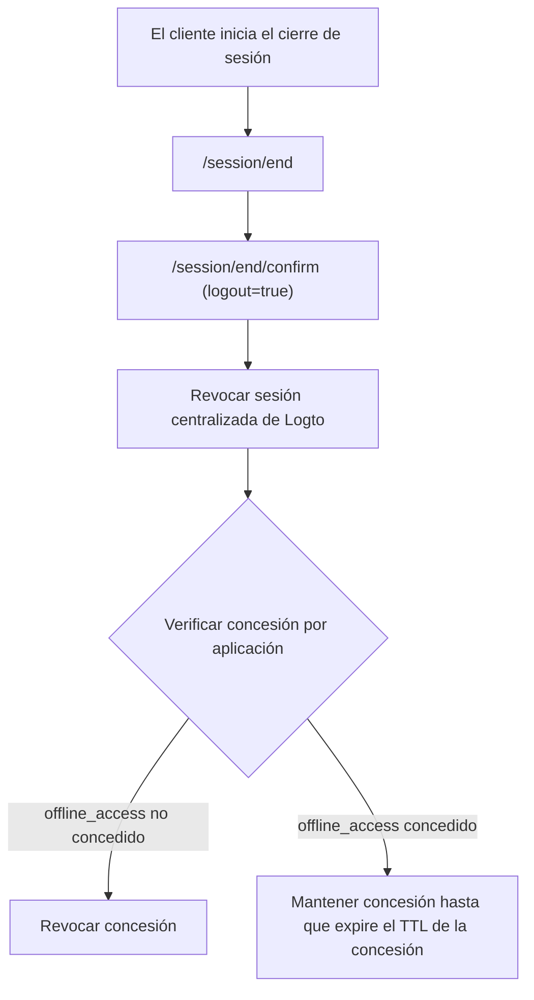

# Cierre de sesión

El cierre de sesión en Logto involucra dos capas:

- **Cierre de sesión de la sesión de Logto**: Termina la sesión de inicio de sesión centralizada bajo el dominio de Logto.
- **Cierre de sesión de la aplicación**: Borra el estado de la sesión local y los tokens en tu aplicación cliente.

Para comprender mejor cómo funcionan las sesiones en Logto, consulta [Sesiones](/sessions).

## Mecanismos de cierre de sesión \{#sign-out-mechanisms}

### 1) Cierre de sesión solo del lado del cliente \{#1-client-side-only-sign-out}

La aplicación cliente borra su propia sesión local y tokens (Tokens de ID / Tokens de acceso / Tokens de actualización). Esto cierra la sesión del usuario solo del estado local de esa aplicación.

- La sesión de Logto puede seguir activa.
- Otras aplicaciones bajo la misma sesión de Logto pueden seguir usando SSO.

### 2) Terminar sesión en Logto (cierre de sesión global en la implementación actual de Logto) \{#2-end-session-at-logto-global-sign-out-in-current-logto-implementation}

Para borrar la sesión centralizada de Logto, la aplicación redirige al usuario al endpoint de fin de sesión, por ejemplo:

`https://{your-logto-domain}/oidc/session/end`

En el comportamiento actual del SDK de Logto:

1. `signOut()` redirige a `/session/end`.
2. Luego va a `/session/end/confirm`.
3. El formulario de confirmación predeterminado auto-envía `logout=true`.

Como resultado, el cierre de sesión actual del SDK se trata como un **cierre de sesión global**.

:::note

- **Cierre de sesión global**: Revoca la sesión centralizada de Logto.

:::

### Qué sucede durante el cierre de sesión global \{#what-happens-during-global-sign-out}



Durante el cierre de sesión global:

- La sesión centralizada de Logto es revocada.
- Las concesiones de aplicaciones relacionadas se manejan según el estado de autorización de cada aplicación:
  - Si `offline_access` **no** está concedido, las concesiones relacionadas son revocadas.
  - Si `offline_access` **está** concedido, las concesiones no son revocadas por el fin de sesión.
- Para los casos de `offline_access`, los tokens de actualización y las concesiones permanecen válidos hasta la expiración de la concesión.

## Duración de la concesión e impacto de `offline_access` \{#grant-lifetime-and-offline-access-impact}

- El TTL de concesión predeterminado de Logto es de **180 días**.
- Si `offline_access` está concedido, el fin de sesión no revoca esa concesión de aplicación por defecto.
- La cadena de tokens de actualización asociada con esa concesión puede continuar hasta que la concesión expire (o sea revocada explícitamente).

## Cierre de sesión federado: cierre de sesión por canal secundario \{#federated-sign-out-back-channel-logout}

Para la consistencia entre aplicaciones, Logto admite [cierre de sesión por canal secundario](https://openid.net/specs/openid-connect-backchannel-1_0-final.html).

Cuando un usuario cierra sesión desde una aplicación, Logto puede notificar a todas las aplicaciones que participan en la misma sesión enviando un token de cierre de sesión a la URI de cierre de sesión por canal secundario registrada de cada aplicación.

Si `Is session required` está habilitado en la configuración de canal secundario de la aplicación, el token de cierre de sesión incluye `sid` para identificar la sesión de Logto.

Flujo típico:

1. El usuario inicia el cierre de sesión desde una aplicación.
2. Logto procesa el fin de sesión y envía token(es) de cierre de sesión a la(s) URI(s) de cierre de sesión por canal secundario registrada(s).
3. Cada aplicación valida el token de cierre de sesión y borra su propia sesión local / tokens.

## Métodos de cierre de sesión en los SDKs de Logto \{#sign-out-methods-in-logto-sdks}

- **SPA y web**: `client.signOut()` borra el almacenamiento local de tokens y redirige al endpoint de fin de sesión de Logto. Puedes proporcionar una URI de redirección posterior al cierre de sesión.
- **Nativo (incluyendo React Native / Flutter)**: generalmente borra solo el almacenamiento local de tokens. La vista web sin sesión significa que no hay cookie persistente del navegador de Logto para borrar.

:::note
Para aplicaciones nativas que no admiten vista web sin sesión o no reconocen la configuración `emphasized` (aplicación Android usando el SDK de **React Native** o **Flutter**), puedes forzar al usuario a iniciar sesión nuevamente pasando el parámetro `prompt=login` en la solicitud de autorización.
:::

## Forzar re-autenticación en cada acceso \{#enforce-re-authentication-on-every-access}

Para acciones de alta seguridad, incluye `prompt=login` en las solicitudes de autenticación para omitir SSO y forzar la entrada de credenciales cada vez.

Si solicitas `offline_access` (para recibir tokens de actualización), también incluye `consent`, `prompt=login consent`.

Configuración combinada típica:

```txt
prompt=login consent
```

## Preguntas frecuentes \{#faqs}

<details>
  <summary>

### No estoy recibiendo las notificaciones de cierre de sesión por canal secundario. \{#im-not-receiving-the-back-channel-logout-notifications}

</summary>

- Asegúrate de que la URI de cierre de sesión por canal secundario esté correctamente registrada en el panel de Logto.
- Asegúrate de que tu aplicación tenga un estado de inicio de sesión activo para el mismo contexto de usuario / sesión.

</details>

## Recursos relacionados \{#related-resources}

<Url href="https://blog.logto.io/oidc-back-channel-logout/">
  Comprendiendo el cierre de sesión por canal secundario de OIDC.
</Url>
