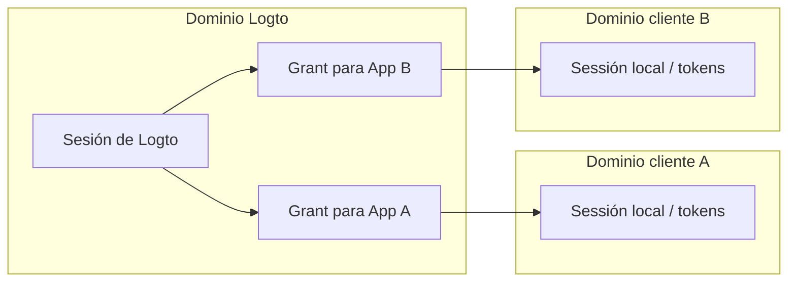
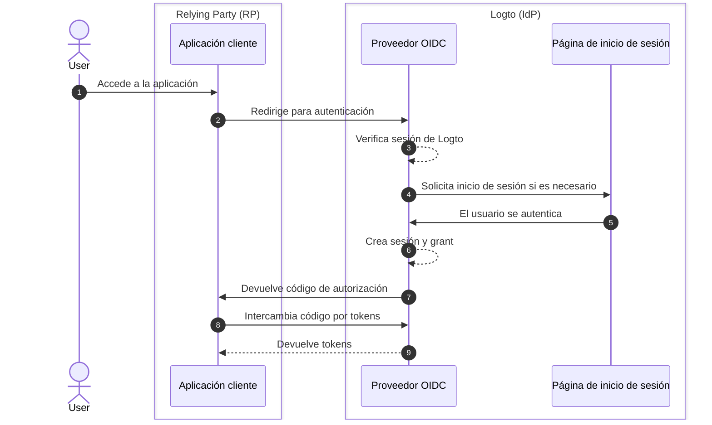
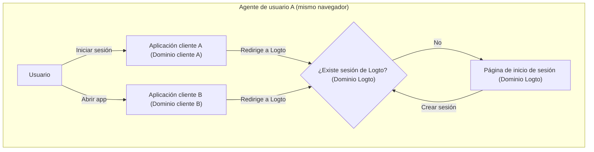
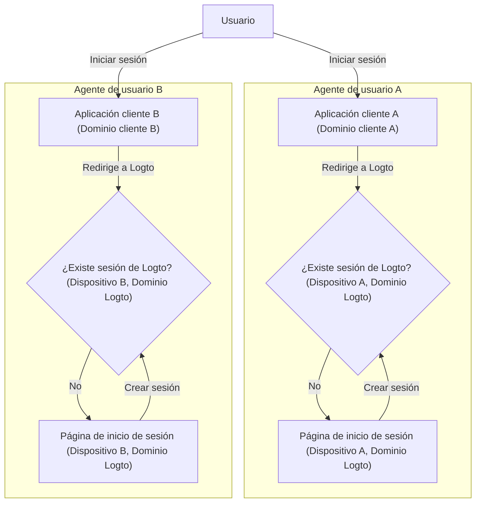
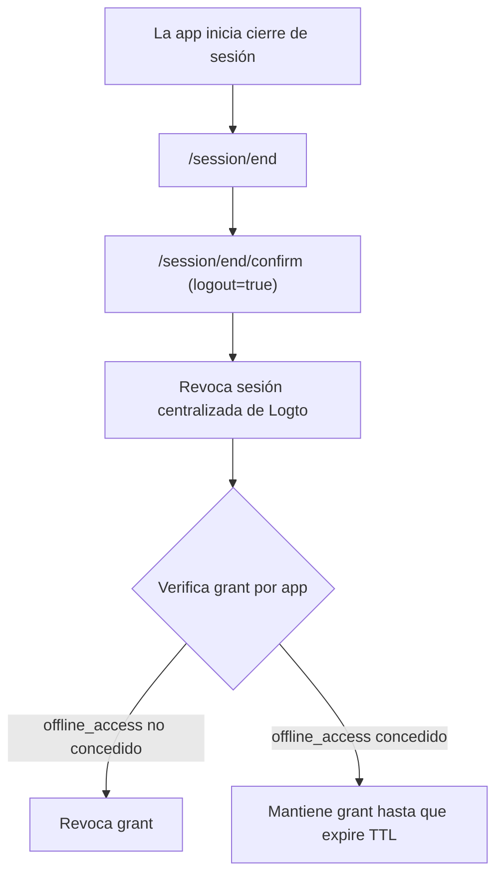

# Cierre de sesión

El cierre de sesión en Logto (como proveedor de identidad OIDC) implica tanto:

- Una **sesión centralizada de Logto** (cookie del navegador bajo el dominio de Logto), y
- **Estado de autenticación distribuido en el lado del cliente** (tokens y sesión local de la app en cada aplicación).

Para entender el comportamiento del cierre de sesión, ayuda separar estas dos capas y luego ver cómo los **grants** las conectan.

## Conceptos clave \{#core-concepts}

### ¿Qué es una sesión de Logto? \{#what-is-a-logto-session}

Una sesión de Logto es el estado centralizado de inicio de sesión gestionado por Logto. Se crea tras una autenticación exitosa y está representada por cookies bajo el dominio de Logto.

Si la cookie de sesión es válida, el usuario puede ser autenticado silenciosamente (SSO) en varias aplicaciones que confían en el mismo tenant de Logto.

Si no existe una sesión válida, Logto muestra la página de inicio de sesión.

### ¿Qué son los grants? \{#what-are-grants}

Un **grant** representa el estado de autorización para una combinación específica de usuario + aplicación cliente.

- Una sesión de Logto puede tener grants para varias aplicaciones cliente.
- Un grant es con lo que se asocian los tokens emitidos.
- En este conjunto de documentación, se usa **grant** como la unidad de autorización entre aplicaciones.

### Cómo se relacionan la sesión, los grants y el estado de autenticación del cliente \{#how-session-grants-and-client-auth-status-relate}



- **Sesión de Logto** controla la experiencia centralizada de SSO.
- **Sesión local / tokens del cliente** controlan si cada app considera actualmente al usuario como autenticado.
- **Grants** conectan estos dos mundos representando el estado de autorización específico de la app.

## Resumen del inicio de sesión (por qué el cierre de sesión es multinivel) \{#sign-in-recap-why-sign-out-is-multi-layered}



## Topología de sesión entre apps / dispositivos \{#session-topology-across-apps-devices}

### Cookie de sesión compartida (mismo navegador / agente de usuario) \{#shared-session-cookie-same-browser-user-agent}

Si un usuario inicia sesión en varias apps desde el mismo navegador, esas apps pueden reutilizar la misma cookie de sesión de Logto y se aplica el comportamiento SSO.



### Cookies de sesión aisladas (diferentes dispositivos / navegadores) \{#isolated-session-cookies-different-devices-browsers}

Diferentes navegadores / dispositivos mantienen diferentes cookies de Logto, por lo que el estado de la sesión de inicio de sesión está aislado.



## Mecanismos de cierre de sesión \{#sign-out-mechanisms}

### 1) Cierre de sesión solo en el lado del cliente \{#1-client-side-only-sign-out}

La aplicación cliente borra su propia sesión local y tokens (tokens de ID / acceso / actualización). Esto cierra la sesión del usuario solo en el estado local de esa app.

- La sesión de Logto puede seguir activa.
- Otras apps bajo la misma sesión de Logto pueden seguir usando SSO.

### 2) Fin de sesión en Logto (cierre de sesión global en la implementación actual de Logto) \{#2-end-session-at-logto-global-sign-out-in-current-logto-implementation}

Para borrar la sesión centralizada de Logto, la app redirige al usuario al endpoint de fin de sesión, por ejemplo:

`https://{your-logto-domain}/oidc/session/end`

En el comportamiento actual del SDK de Logto:

1. `signOut()` redirige a `/session/end`.
2. Luego va a `/session/end/confirm`.
3. El formulario de confirmación por defecto envía automáticamente `logout=true`.

Como resultado, el cierre de sesión del SDK actual se trata como **cierre de sesión global**.

### Qué sucede durante el cierre de sesión global \{#what-happens-during-global-sign-out}



Durante el cierre de sesión global:

- Se revoca la sesión centralizada de Logto.
- Los grants relacionados se gestionan según el estado de autorización de cada app:
  - Si `offline_access` **no** está concedido, los grants relacionados se revocan.
  - Si `offline_access` **está** concedido, los grants no se revocan por el fin de sesión.
- Para los casos de `offline_access`, los tokens de actualización y grants siguen siendo válidos hasta que expire el grant.

## Duración del grant e impacto de `offline_access` \{#grant-lifetime-and-offline-access-impact}

- El TTL por defecto de un grant de Logto es **180 días**.
- Si se concede `offline_access`, el fin de sesión no revoca ese grant de la app por defecto.
- La cadena de tokens de actualización asociada a ese grant puede continuar hasta que el grant expire (o se revoque explícitamente).

## Cierre de sesión federado: cierre de sesión back-channel \{#federated-sign-out-back-channel-logout}

Para la coherencia entre apps, Logto admite el [cierre de sesión back-channel](https://openid.net/specs/openid-connect-backchannel-1_0-final.html).

Cuando un usuario cierra sesión en una app, Logto puede notificar a todas las apps que participan en la misma sesión enviando un token de cierre de sesión al URI de cierre de sesión back-channel registrado de cada app.

Si `Is session required` está habilitado en la configuración back-channel de la app, el token de cierre de sesión incluye `sid` para identificar la sesión de Logto.

Flujo típico:

1. El usuario inicia el cierre de sesión desde una app.
2. Logto procesa el fin de sesión y envía el/los token(s) de cierre de sesión a los URI(s) de cierre de sesión back-channel registrados.
3. Cada app valida el token de cierre de sesión y borra su propia sesión local / tokens.

## Métodos de cierre de sesión en los SDKs de Logto \{#sign-out-methods-in-logto-sdks}

- **SPA y web**: `client.signOut()` borra el almacenamiento local de tokens y redirige al endpoint de fin de sesión de Logto. Puedes proporcionar un URI de redirección post-logout.
- **Nativo (incluyendo React Native / Flutter)**: normalmente solo borra el almacenamiento local de tokens. El webview sin sesión significa que no hay cookie persistente de Logto en el navegador que borrar.

:::note
Para aplicaciones nativas que no admiten webview sin sesión o no reconocen la configuración `emphasized` (app de Android usando el SDK de **React Native** o **Flutter**), puedes forzar que se solicite al usuario iniciar sesión de nuevo pasando el parámetro `prompt=login` en la solicitud de autorización.
:::

## Forzar la re-autenticación en cada acceso \{#enforce-re-authentication-on-every-access}

Para acciones de alta seguridad, incluye `prompt=login` en las solicitudes de autenticación para omitir el SSO y forzar la introducción de credenciales cada vez.

Si solicitas `offline_access` (para recibir tokens de actualización), incluye también `consent`, `prompt=login consent`.

Configuración combinada típica:

```txt
prompt=login consent
```

## Preguntas frecuentes \{#faqs}

<details>
  <summary>

### No recibo las notificaciones de cierre de sesión back-channel. \{#im-not-receiving-the-back-channel-logout-notifications}

</summary>

- Asegúrate de que el URI de cierre de sesión back-channel esté correctamente registrado en el panel de Logto.
- Asegúrate de que tu app tenga un estado de inicio de sesión activo para el mismo usuario / contexto de sesión.

</details>

## Recursos relacionados \{#related-resources}

<Url href="https://blog.logto.io/oidc-back-channel-logout/">
  Entendiendo el cierre de sesión back-channel de OIDC.
</Url>
