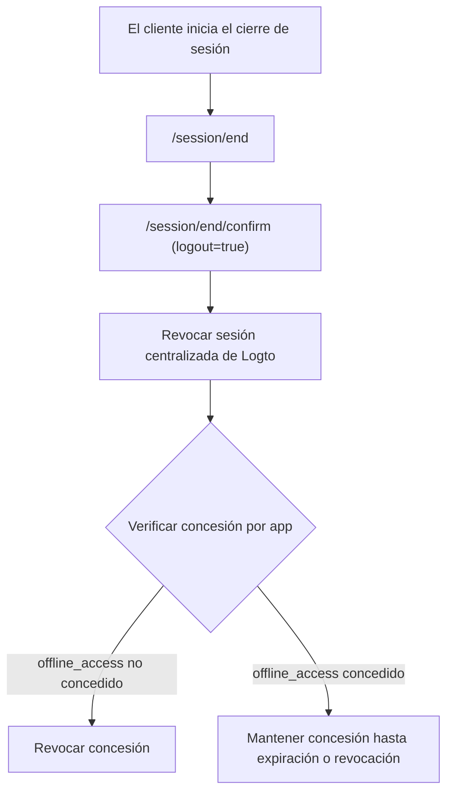

# Cierre de sesión

El cierre de sesión en Logto implica dos capas:

- **Cierre de sesión de la sesión Logto**: Finaliza la sesión centralizada de inicio de sesión bajo el dominio de Logto.
- **Cierre de sesión de la app**: Limpia el estado de la sesión local y los tokens en tu aplicación cliente.

Para comprender mejor cómo funcionan las sesiones en Logto, consulta [Sesiones](/sessions).

## Mecanismos de cierre de sesión \{#sign-out-mechanisms}

### 1) Cierre de sesión solo en el lado del cliente \{#1-client-side-only-sign-out}

La aplicación cliente limpia su propia sesión local y tokens (tokens de ID / acceso / actualización). Esto cierra la sesión del usuario solo en el estado local de esa app.

- La sesión de Logto puede seguir activa.
- Otras apps bajo la misma sesión de Logto pueden seguir usando SSO.

### 2) Finalizar sesión en Logto (cierre de sesión global en la implementación actual de Logto) \{#2-end-session-at-logto-global-sign-out-in-current-logto-implementation}

Para limpiar la sesión centralizada de Logto, la app redirige al usuario al endpoint de finalización de sesión, por ejemplo:

`https://{your-logto-domain}/oidc/session/end`

En el comportamiento actual del SDK de Logto:

1. `signOut()` redirige a `/session/end`.
2. Luego va a `/session/end/confirm`.
3. El formulario de confirmación por defecto envía automáticamente `logout=true`.

Como resultado, el cierre de sesión del SDK actual se trata como **cierre de sesión global**.

:::note

- **Cierre de sesión global**: Revoca la sesión centralizada de Logto.

:::

### Qué sucede durante el cierre de sesión global \{#what-happens-during-global-sign-out}



Durante el cierre de sesión global:

- Se revoca la sesión centralizada de Logto.
- Las concesiones relacionadas de la app se gestionan según el estado de autorización de cada app:
  - Si `offline_access` **no** está concedido, las concesiones relacionadas se revocan.
  - Si `offline_access` **está** concedido, las concesiones no se revocan al finalizar la sesión.
- Para los casos de `offline_access`, los tokens de actualización y las concesiones permanecen válidos hasta que ocurra lo primero entre la expiración de la concesión, la expiración del token de actualización o la revocación explícita.

## Duración de la concesión e impacto de `offline_access` \{#grant-lifetime-and-offline-access-impact}

- El TTL de concesión predeterminado de Logto es **180 días**.
- Si se concede `offline_access`, finalizar la sesión no revoca esa concesión de la app por defecto.
- Las cadenas de tokens de actualización asociadas con esa concesión pueden continuar hasta que la concesión expire, el token de actualización expire o la concesión sea revocada explícitamente.
- Para aplicaciones de una sola página (SPA), la rotación del token de actualización no extiende el TTL del token de actualización, por lo que el token de actualización puede expirar antes que la concesión.

## Cierre de sesión federado: cierre de sesión por canal secundario \{#federated-sign-out-back-channel-logout}

Para la coherencia entre apps, Logto admite el [cierre de sesión por canal secundario](https://openid.net/specs/openid-connect-backchannel-1_0-final.html).

Cuando un usuario cierra sesión en una app, Logto puede notificar a todas las apps que participan en la misma sesión enviando un token de cierre de sesión al URI de cierre de sesión por canal secundario registrado de cada app.

Si `¿Se requiere sesión?` está habilitado en la configuración de canal secundario de la app, el token de cierre de sesión incluye `sid` para identificar la sesión de Logto.

Flujo típico:

1. El usuario inicia el cierre de sesión desde una app.
2. Logto procesa la finalización de sesión y envía el/los token(s) de cierre de sesión a los URI(s) de cierre de sesión por canal secundario registrados.
3. Cada app valida el token de cierre de sesión y limpia su propia sesión / tokens locales.

## Métodos de cierre de sesión en los SDKs de Logto \{#sign-out-methods-in-logto-sdks}

- **SPA y web**: `client.signOut()` limpia el almacenamiento local de tokens y redirige al endpoint de finalización de sesión de Logto. Puedes proporcionar un URI de redirección post-cierre de sesión.
- **Nativo (incluyendo React Native / Flutter)**: normalmente solo limpia el almacenamiento local de tokens. El webview sin sesión significa que no hay cookie persistente del navegador de Logto que limpiar.

:::note
Para aplicaciones nativas que no admiten webview sin sesión o no reconocen la configuración `emphasized` (aplicación Android usando el SDK de **React Native** o **Flutter**), puedes forzar que se solicite al usuario iniciar sesión de nuevo pasando el parámetro `prompt=login` en la solicitud de autorización.
:::

## Forzar la re-autenticación en cada acceso \{#enforce-re-authentication-on-every-access}

Para acciones de alta seguridad, incluye `prompt=login` en las solicitudes de autenticación para omitir el SSO y forzar la introducción de credenciales cada vez.

Si solicitas `offline_access` (para recibir tokens de actualización), incluye también `consent`, `prompt=login consent`.

Configuración combinada típica:

```txt
prompt=login consent
```

## Preguntas frecuentes \{#faqs}

<details>
  <summary>

### No estoy recibiendo las notificaciones de cierre de sesión por canal secundario. \{#im-not-receiving-the-back-channel-logout-notifications}

</summary>

- Asegúrate de que el URI de cierre de sesión por canal secundario esté correctamente registrado en el panel de Logto.
- Asegúrate de que tu app tenga un estado de inicio de sesión activo para el mismo usuario / contexto de sesión.

</details>

## Recursos relacionados \{#related-resources}

<Url href="https://blog.logto.io/oidc-back-channel-logout/">
  Entendiendo el cierre de sesión por canal secundario OIDC.
</Url>
