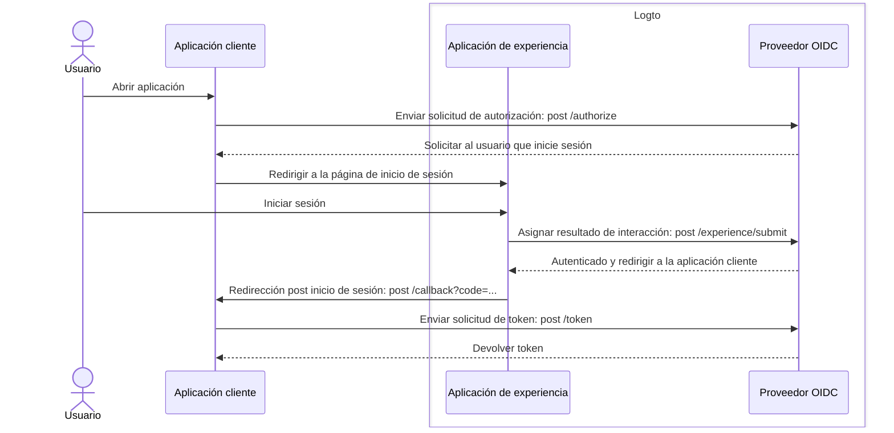
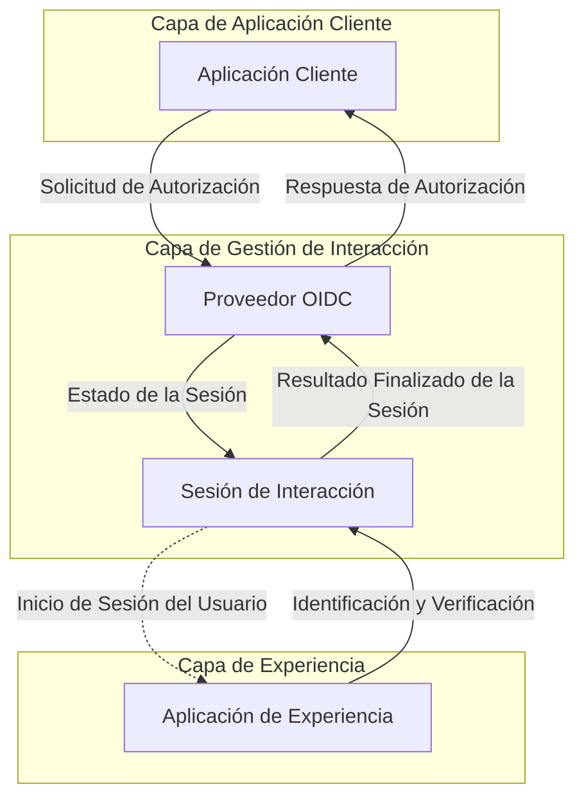

# Registro e inicio de sesión

El registro e inicio de sesión es el proceso de interacción central para que los usuarios finales autentiquen y autoricen el acceso a las aplicaciones cliente. Como una plataforma centralizada de CIAM basada en OIDC, Logto proporciona una experiencia de inicio de sesión universal para los usuarios a través de múltiples aplicaciones y plataformas cliente.

## Flujo de usuario \{#user-flow}

En un flujo de autenticación típico de OIDC, el usuario comienza abriendo la aplicación cliente. La aplicación cliente envía una [solicitud de autorización](https://auth.wiki/authorization-request) al proveedor OIDC de Logto. Si el usuario no tiene una sesión activa, Logto dirigirá al usuario a la página de experiencia de inicio de sesión alojada por Logto. El usuario interactúa con la página de experiencia de Logto y se autentica proporcionando las credenciales necesarias. Una vez que el usuario se autentica con éxito, Logto redirige al usuario de vuelta a la aplicación cliente con el [código de autorización](https://auth.wiki/authorization-code-flow#how-does-authorization-code-flow-work). La aplicación cliente luego envía una [solicitud de token](https://auth.wiki/token-request) al proveedor OIDC de Logto con el código de autorización para obtener los tokens.

## Interacción del usuario \{#user-interaction}

Se crea una **sesión de interacción** para cada interacción del usuario cuando una aplicación cliente inicia una solicitud de autorización. Esta sesión centraliza el estado de interacción del usuario a través de múltiples aplicaciones cliente, permitiendo a Logto proporcionar una experiencia de inicio de sesión coherente. A medida que los usuarios cambian entre aplicaciones cliente, la sesión de interacción permanece consistente, manteniendo el estado de autenticación del usuario y reduciendo la necesidad de inicios de sesión repetidos en diferentes plataformas. Una vez que se establece la **sesión de interacción**, se solicita al usuario que inicie sesión en Logto.

La **aplicación de experiencia** en Logto es una aplicación dedicada y alojada que facilita la experiencia de inicio de sesión. Cuando los usuarios necesitan autenticarse, son dirigidos a la **aplicación de experiencia**, donde completan su inicio de sesión e interactúan con Logto. La **aplicación de experiencia** utiliza la sesión de interacción activa para rastrear y apoyar el progreso de la interacción del usuario.

Para apoyar y controlar este recorrido del usuario, Logto presenta un conjunto de **Experience APIs** basadas en sesiones. Estas APIs permiten a la **aplicación de experiencia** manejar una amplia gama de métodos de identificación y verificación del usuario actualizando y accediendo al estado de la sesión de interacción en tiempo real.

Una vez que el usuario cumple con todos los requisitos de validación y verificación, la sesión de interacción concluye con un envío de resultados al proveedor OIDC, donde el usuario está completamente autenticado y ha proporcionado su consentimiento, finalizando el proceso seguro de inicio de sesión.

## Personalización de la experiencia de inicio de sesión \{#sign-in-experience-customization}

Logto proporciona una experiencia de usuario flexible y personalizable para diversos requisitos empresariales. Incluyendo personalización de marca, interfaz de usuario y flujos de interacción del usuario. La **aplicación de experiencia** se puede adaptar para cumplir con los requisitos de marca y seguridad de la aplicación cliente.

Continúa aprendiendo más sobre la [configuración](/end-user-flows/sign-up-and-sign-in/sign-up) y [personalización](/customization) de la experiencia de inicio de sesión en Logto.

## Preguntas frecuentes \{#faqs}

  

### Método o personalización de experiencia de inicio de sesión por aplicación \{#per-app-sign-in-experience-method-or-branding}

Para aplicaciones u organizaciones que requieren **interfaces de inicio de sesión** distintas, Logto admite la personalización de [marca específica de la aplicación](/customization/match-your-brand#app-specific-branding) y [marca específica de la organización](/customization/match-your-brand#organization-specific-branding).

Si necesitas ofrecer diferentes **métodos de inicio de sesión** según el tipo de usuario o sitio, simplemente utiliza [parámetros de autenticación](/end-user-flows/authentication-parameters) (por ejemplo, `first_screen` y `direct_sign_in`) para dirigir a los usuarios a una página de usuario final con opciones de inicio de sesión personalizadas.

  

### Limitar dominio de correo electrónico / dirección IP / región \{#limit-email-domain--ip-address--region}

Para el control de acceso basado en atributos, por ejemplo, limitar el inicio de sesión basado en el dominio de correo electrónico, dirección IP o región, puedes usar la función de [Reclamos de token personalizados](/developers/custom-token-claims/) en Logto para rechazar o permitir solicitudes de autorización basadas en los atributos del usuario.

  

### API sin interfaz para inicio de sesión y registro \{#headless-api-for-sign-in-and-sign-up}

Actualmente, Logto no proporciona una API sin interfaz para el inicio de sesión y registro. Sin embargo, puedes traer tu propia interfaz de inicio de sesión utilizando la opción [Trae tu propia interfaz](/customization/bring-your-ui/) para personalizar la experiencia de inicio de sesión y registro.

## Recursos relacionados \{#related-resources}

<Url href="https://blog.logto.io/deprecated-ropc-grant-type">
  Por qué deberías deprecar el tipo de concesión de Credenciales de Propietario de Recurso (ROPC)
</Url>

<Url href="https://blog.logto.io/implicit-flow-is-dead">
  ¿Por qué deberías usar el flujo de código de autorización en lugar del flujo implícito?
</Url>

<Url href="https://blog.logto.io/token-based-authentication-vs-session-based-authentication">
  Comparación entre autenticación basada en tokens y autenticación basada en sesiones
</Url>