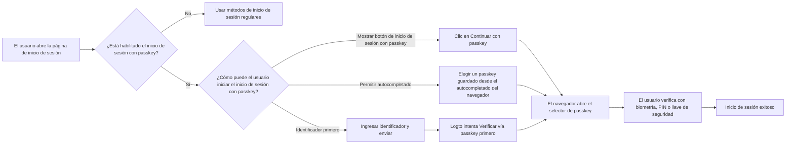
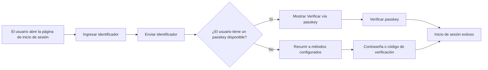
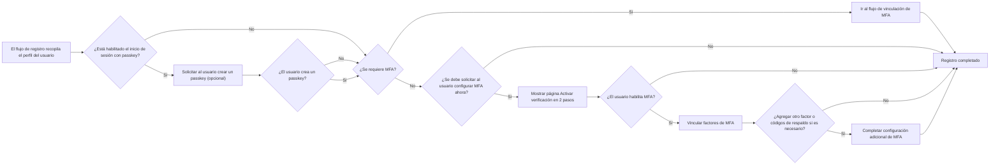

# Inicio de sesión con passkey

El inicio de sesión con passkey permite a los usuarios autenticarse con una credencial WebAuthn directamente durante el inicio de sesión, sin necesidad de ingresar primero una contraseña o un código de verificación. En Logto, la credencial utilizada para el inicio de sesión con passkey es el mismo modelo de credencial WebAuthn usado por MFA, por lo que las experiencias de inicio de sesión y MFA están estrechamente conectadas.

Este documento explica cómo funciona el inicio de sesión con passkey en la experiencia de inicio de sesión incorporada de Logto, cómo se ven las diferentes rutas de entrada para los usuarios finales y cómo interactúa con MFA.

## Cómo funciona el inicio de sesión con passkey \{#how-passkey-sign-in-works}

Para usar el inicio de sesión con passkey, primero debes habilitarlo en la configuración de la <CloudLink to="/sign-in-experience/sign-up-and-sign-in">experiencia de inicio de sesión</CloudLink>. Después de habilitarlo, Logto puede ofrecer el inicio de sesión con passkey de hasta tres maneras en la página de inicio de sesión:

- Un botón dedicado `Continuar con passkey` en la primera pantalla de inicio de sesión.
- Un flujo de identificador primero que intenta `Verificar vía passkey` después de que el usuario ingresa su correo electrónico, número de teléfono o nombre de usuario.
- Autocompletado del navegador en el campo de identificador, para que el navegador pueda sugerir passkeys disponibles directamente desde el dispositivo actual.

A grandes rasgos, la experiencia se ve así:

## Tres rutas de inicio de sesión con passkey \{#three-passkey-sign-in-paths}

### 1. Mostrar botón "Continuar con passkey" habilitado \{#1-show-continue-with-passkey-button-enabled}

Cuando la opción `Mostrar botón "Continuar con passkey"` está habilitada, la página de inicio de sesión muestra un botón `Continuar con passkey` en la parte inferior de la primera pantalla.

El flujo de usuario es:

1. Abrir la página de inicio de sesión.
2. Hacer clic en `Continuar con passkey`.
3. Seleccionar un passkey desde el navegador o el sistema operativo.
4. Completar la verificación biométrica, PIN o con llave de hardware.
5. Iniciar sesión exitosamente.

Esta es la ruta más directa. Es la mejor para usuarios que ya saben que tienen un passkey guardado y desean una experiencia de inicio de sesión en un solo paso.

### 2. Mostrar botón "Continuar con passkey" deshabilitado \{#2-show-continue-with-passkey-button-disabled}

Cuando la opción `Mostrar botón "Continuar con passkey"` está deshabilitada, Logto cambia a una experiencia de identificador primero en la primera pantalla. La página solo solicita primero el identificador del usuario.

Después de que el usuario envía el identificador:

1. Logto verifica si el inicio de sesión con passkey está habilitado y si el usuario identificado tiene un passkey utilizable.
2. Si hay un passkey disponible, Logto inicia primero el flujo "Verificar vía passkey".
3. El usuario puede completar la verificación con passkey e iniciar sesión inmediatamente.
4. Si no hay un passkey disponible, o el usuario prefiere otro método, Logto recurre a otros métodos de verificación configurados.

Los métodos alternativos disponibles dependen de la configuración de la experiencia de inicio de sesión del tenant actual. Por ejemplo, el usuario puede cambiar a contraseña, código de verificación por correo electrónico o código de verificación por teléfono, dependiendo de qué factores estén habilitados para ese identificador.

### 3. Permitir solicitud y autocompletado \{#3-allow-prompting-and-autofill}

Cuando la opción `Permitir solicitud y autocompletado` está habilitada, los navegadores compatibles pueden mostrar los passkeys pre-guardados directamente desde el campo de identificador.

El flujo de usuario es:

1. Enfocar el campo de identificador en la página de inicio de sesión.
2. El navegador sugiere passkeys guardados para el origen actual.
3. El usuario selecciona un passkey de la lista de autocompletado.
4. El navegador solicita al usuario verificar con biometría, PIN o una llave de hardware.
5. Inicio de sesión exitoso.

Este flujo es especialmente útil en dispositivos donde los passkeys ya están sincronizados por la plataforma, porque los usuarios pueden iniciar sesión sin moverse manualmente a una segunda página o pulsar un botón dedicado de passkey.

## Flujo de registro y vinculación de passkey \{#sign-up-and-passkey-binding-flow}

El inicio de sesión con passkey no es solo un punto de entrada para iniciar sesión. También afecta lo que sucede después del registro, ya que la misma credencial WebAuthn puede reutilizarse más adelante tanto para el inicio de sesión como para MFA.

Después de que el usuario completa los pasos regulares de registro, Logto puede solicitar al usuario crear un passkey. Esa solicitud es opcional para los usuarios finales, pero una vez que crean el passkey, el siguiente paso depende de la política de MFA del tenant y del estado de MFA del propio usuario.

La lógica principal es:

## Relación entre el inicio de sesión con passkey y MFA \{#relationship-between-passkey-sign-in-and-mfa}

### El inicio de sesión con passkey omite automáticamente la verificación MFA \{#passkey-sign-in-automatically-skips-mfa-verification}

Un passkey utilizado para el inicio de sesión con passkey está respaldado por una credencial WebAuthn, y esa credencial también se trata como un factor MFA WebAuthn. Por eso, el inicio de sesión con passkey y el MFA WebAuthn son efectivamente equivalentes desde la perspectiva de la credencial.

Eso conduce a dos comportamientos importantes:

- Si el usuario inicia sesión con un passkey, Logto omite el paso de verificación MFA por separado.
- Si el usuario ya había vinculado WebAuthn como factor MFA antes de que se habilitara el inicio de sesión con passkey, esa credencial existente puede reutilizarse como la credencial de inicio de sesión con passkey del usuario. El usuario no necesita vincularla de nuevo.

En otras palabras, un inicio de sesión con passkey exitoso ya satisface la verificación de identidad basada en WebAuthn que de otro modo se requeriría durante MFA.

### Vincular un passkey no activa automáticamente MFA para tenants controlados por el usuario \{#binding-a-passkey-does-not-automatically-force-mfa-for-user-controlled-tenants}

Para los usuarios en tenants donde MFA no es obligatorio, vincular un passkey durante el registro o la configuración de la cuenta no activa automáticamente MFA para la cuenta.

En su lugar, después de crear el passkey, Logto muestra una página de confirmación titulada "Activar verificación en 2 pasos".

En esa página, el usuario puede:

- Hacer clic en el botón "Activar verificación en 2 pasos" para activar explícitamente MFA y continuar con los siguientes pasos de vinculación.
- Omitir la solicitud y finalizar el flujo actual sin habilitar MFA.

Si el usuario elige habilitar MFA, Logto continúa con el flujo normal de configuración de MFA y puede pedir al usuario vincular factores adicionales, dependiendo de la configuración de MFA del tenant. Por ejemplo, si hay otros factores MFA habilitados para el tenant, Logto puede continuar con la vinculación de otro factor o códigos de respaldo.

### Qué sucede cuando el inicio de sesión con passkey se deshabilita posteriormente \{#what-happens-when-passkey-sign-in-is-disabled-later}

Si el inicio de sesión con passkey se desactiva más adelante, el passkey vinculado previamente sigue siendo una credencial WebAuthn. Eso significa que puede seguir funcionando como un factor MFA mientras el MFA WebAuthn siga disponible para el tenant.

Deshabilitar el inicio de sesión con passkey elimina el passkey como punto de entrada directo para iniciar sesión, pero no invalida la credencial MFA WebAuthn subyacente.

## Limitaciones y compatibilidad \{#limitations-and-compatibility}

- El inicio de sesión con passkey no está disponible para usuarios de SSO empresarial.
- El inicio de sesión con passkey depende del soporte de WebAuthn del navegador y la plataforma.
- "Permitir solicitud y autocompletado" solo funciona en navegadores y entornos que admiten autocompletado de passkey / UI condicional.
- Los passkeys están ligados al origen. Un passkey registrado para un dominio no puede usarse en otro dominio.

## Preguntas y respuestas \{#q-a}

  

### ¿El inicio de sesión con passkey aún requiere verificación MFA? \{#does-passkey-sign-in-still-require-mfa-verification}

  

No. Un inicio de sesión con passkey exitoso ya satisface el requisito de verificación basada en WebAuthn, por lo que Logto omite el paso de verificación MFA por separado.

  

### ¿Un passkey vinculado para el inicio de sesión con passkey puede seguir usándose como factor MFA después de deshabilitar el inicio de sesión con passkey? \{#can-a-passkey-bound-for-passkey-sign-in-still-be-used-as-an-mfa-factor-after-passkey-sign-in-is-disabled}

  

Sí. El inicio de sesión con passkey y el MFA WebAuthn están respaldados por el mismo modelo de credencial subyacente. Si el inicio de sesión con passkey se desactiva posteriormente, el passkey vinculado puede seguir usándose como factor MFA WebAuthn.

  

### ¿Los usuarios de SSO empresarial pueden usar el inicio de sesión con passkey? \{#can-enterprise-sso-users-use-passkey-sign-in}

  

No. Los usuarios de SSO empresarial no son elegibles para el inicio de sesión con passkey.

  

### ¿El inicio de sesión con passkey aún requiere CAPTCHA? \{#does-passkey-sign-in-still-require-captcha}

  

No. El inicio de sesión con passkey en sí no requiere un paso adicional de CAPTCHA. El CAPTCHA aún puede aplicarse a otras acciones de inicio de sesión en la página, como el envío basado en contraseña o código de verificación, pero no al flujo de verificación con passkey.

