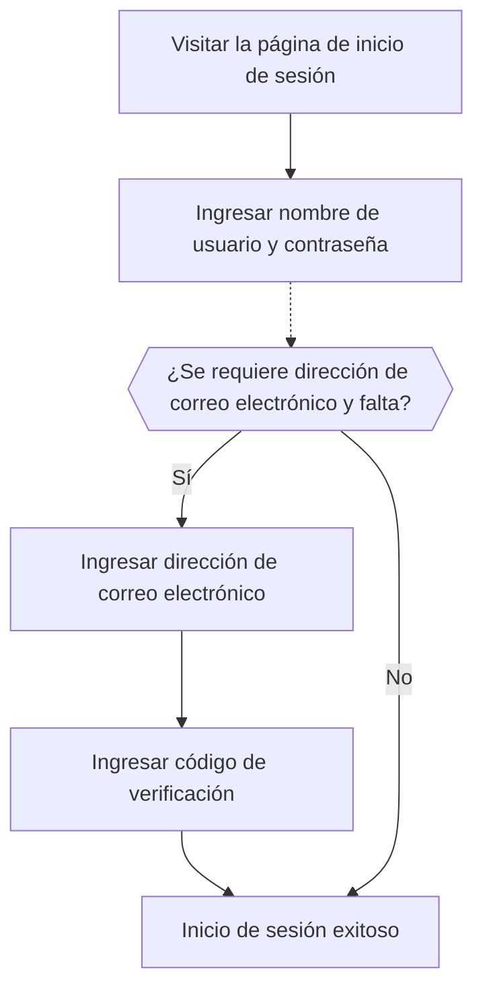

# Inicio de sesión por correo electrónico / teléfono / nombre de usuario

## Configura el flujo de inicio de sesión por identificador \{#configure-the-identifier-sign-in-flow}

Como se indicó anteriormente, se pueden recopilar varios tipos de identificadores de los usuarios a lo largo del [flujo de registro](/end-user-flows/sign-up-and-sign-in/sign-up) o mediante la [creación directa de cuentas en Logto](/user-management/manage-users#add-users). Además, los usuarios pueden ingresar y completar información adicional a medida que exploran y utilizan el producto. Estos identificadores pueden usarse para identificar de manera única a los usuarios en el sistema de Logto y permitir que sean autenticados e inicien sesión en las aplicaciones integradas con Logto.

Ya sea que elijas usar la página de inicio de sesión preconstruida alojada por Logto o planees [construir tu propia interfaz de inicio de sesión personalizada](/customization#custom-ui), deberás configurar los métodos de inicio de sesión disponibles y los ajustes de verificación para tus usuarios finales.

## Configura los ajustes de identificador y autenticación \{#set-up-the-identifier-and-authentication-settings}

### 1. Establece los identificadores de inicio de sesión admitidos \{#1-set-the-supported-sign-in-identifiers}

Puedes agregar varios identificadores admitidos desde la lista desplegable como métodos de inicio de sesión habilitados para los usuarios finales. Las opciones disponibles son:

- **Nombre de usuario**
- **Dirección de correo electrónico**
- **Número de teléfono**

Reordenar los identificadores cambiará el orden en que se muestran en la página de inicio de sesión. El primer identificador será el método principal de inicio de sesión para los usuarios.

### 2. Establece los ajustes de autenticación \{#2-set-the-authentication-settings}

Para cada identificador de inicio de sesión, deberás configurar al menos un factor de verificación efectivo para verificar la identidad del usuario. Hay dos factores entre los que puedes elegir:

- **Contraseña**: Disponible para todos los tipos de identificadores de inicio de sesión. Una vez habilitado, los usuarios deben proporcionar una contraseña para completar el proceso de inicio de sesión.
- **Código de verificación**: Disponible solo para los identificadores **Dirección de correo electrónico** y **Número de teléfono**. Una vez habilitado, los usuarios deben ingresar un código de verificación enviado a su correo electrónico o número de teléfono para completar el proceso de inicio de sesión.

Si ambos factores están habilitados, los usuarios pueden elegir cualquiera de los métodos para completar el proceso de inicio de sesión. También puedes reordenar los factores para cambiar el orden en que se muestran en la página de inicio de sesión. El primer factor se usará como el método principal de verificación para los usuarios y el segundo se mostrará como un enlace alternativo.

## Experiencia de usuario del flujo de inicio de sesión por identificador \{#identifier-sign-in-flow-user-experience}

La experiencia de inicio de sesión se adapta según el identificador elegido y los factores de autenticación disponibles.

- **Entrada inteligente para múltiples identificadores:**
  Si hay más de un método de inicio de sesión por identificador habilitado, la página de inicio de sesión incorporada de Logto detectará automáticamente el tipo de identificador ingresado por el usuario y mostrará las opciones de verificación correspondientes. Por ejemplo, si están habilitados tanto **Dirección de correo electrónico** como **Número de teléfono**, la página de inicio de sesión detectará automáticamente el tipo de identificador ingresado por el usuario y mostrará las opciones de verificación correspondientes. Cambia a un formato de número de teléfono con código de región si se ingresan números consecutivos o a un formato de correo electrónico cuando se utiliza el símbolo "@".
  - El código de país del número de teléfono se establece por defecto según la configuración regional del navegador del usuario; los usuarios pueden cambiarlo manualmente. Puedes usar el parámetro [`ui_locales`](/end-user-flows/authentication-parameters/ui-locales) para establecer un código de país predeterminado específico. Consulta [Idiomas localizados](/customization/localized-languages#how-can-i-set-a-default-phone-number-country-code-for-the-sign-in-experience) para más detalles.
- **Factores de verificación habilitados:**
  - **Solo contraseña:** Se mostrarán los campos de identificador y contraseña en la primera pantalla.
  - **Solo código de verificación:** El campo de identificador aparece en la primera pantalla, seguido del campo de código de verificación en la segunda pantalla.
  - **Contraseña y código de verificación:** El campo de identificador se ingresa inicialmente en la primera pantalla, seguido de los pasos para ingresar la contraseña o el código de verificación en la segunda pantalla según el orden de verificación. Se proporciona un enlace para que los usuarios puedan cambiar entre los dos métodos de verificación.

### Ejemplos \{#examples}

  

### Ejemplo 1: Dirección de correo electrónico con verificación por contraseña \{#example-1-email-address-with-password-verification}

Agrega la **Dirección de correo electrónico** como identificador de inicio de sesión y habilita el factor **Contraseña** para la verificación.

  

### Ejemplo 2: Correo electrónico / Teléfono con contraseña (principal) y código de verificación (alternativo) habilitados \{#example-2-emailphone-with-passwordprimary-and-verification-code-alternative-verification-enabled}

Agrega tanto **Dirección de correo electrónico** como **Número de teléfono** como identificadores de inicio de sesión.
Habilita los factores **Contraseña** y **Código de verificación** para ambos identificadores.

## Recopila información adicional del perfil de usuario al iniciar sesión \{#collect-additional-user-profile-on-sign-in}

En el flujo de inicio de sesión de Logto, se puede activar un proceso de cumplimiento de perfil si se actualizan los ajustes de identificadores de registro. Esto garantiza que todos los usuarios, incluidos los existentes, proporcionen cualquier identificador nuevo requerido.

Cuando un desarrollador agrega un nuevo identificador (como una dirección de correo electrónico), se vuelve obligatorio para todos los usuarios. Si un usuario recurrente inicia sesión con un identificador existente (como un nombre de usuario), se le pedirá que proporcione y verifique el nuevo identificador si falta en su perfil. Solo después de completar este paso podrá acceder a la aplicación, asegurando una transición fluida y coherente a los nuevos requisitos.

Desglose del proceso:

1. **Nombre de usuario** se estableció previamente como identificador de registro con la configuración **Crea tu contraseña** habilitada automáticamente.
2. Posteriormente, se establece **Dirección de correo electrónico** como identificador de registro. El identificador **Dirección de correo electrónico** se agrega automáticamente como opción de inicio de sesión habilitada.
3. Un usuario recurrente inicia sesión con su nombre de usuario y contraseña.
4. Se le solicita al usuario que proporcione y verifique una dirección de correo electrónico después de su paso inicial de inicio de sesión.

El mismo proceso se aplica también a la configuración de registro **Crea tu contraseña**. Si la configuración **Crea tu contraseña** se habilita recientemente en el flujo de registro, el factor **Contraseña** se habilitará automáticamente para todos los identificadores de inicio de sesión que elijas. Todos los usuarios recurrentes sin contraseña deberán crear una durante el proceso de inicio de sesión.

:::note
Nota: Para flujos de inicio de sesión personalizados, consulta la función de [Trae tu propia interfaz](/customization/bring-your-ui/).
:::

## Preguntas frecuentes \{#faqs}

  

### Experiencia de inicio de sesión autohospedada (inicio de sesión embebido) \{#self-hosted-sign-in-experience-embedded-sign-in}

Logto actualmente no admite API sin interfaz para inicio de sesión y registro. Sin embargo, puedes usar nuestra función [Trae tu propia interfaz](/customization/bring-your-ui/) para cargar tu formulario de inicio de sesión personalizado en Logto. También admitimos múltiples parámetros de inicio de sesión que puedes usar para rellenar previamente el formulario de inicio de sesión con el identificador de usuario recopilado desde tu aplicación o iniciar sesión directamente con un proveedor de inicio de sesión social o SSO empresarial de terceros. Obtén más información en [Parámetros de autenticación](/end-user-flows/authentication-parameters/).

## Recursos relacionados \{#related-resources}

<Url href="https://www.youtube.com/watch?v=64rBXpWbScc">
  Experiencia de registro e inicio de sesión por correo electrónico
</Url>

<Url href="https://www.youtube.com/watch?v=chQxCJX6e6w">
  Experiencia de registro e inicio de sesión por nombre de usuario
</Url>
