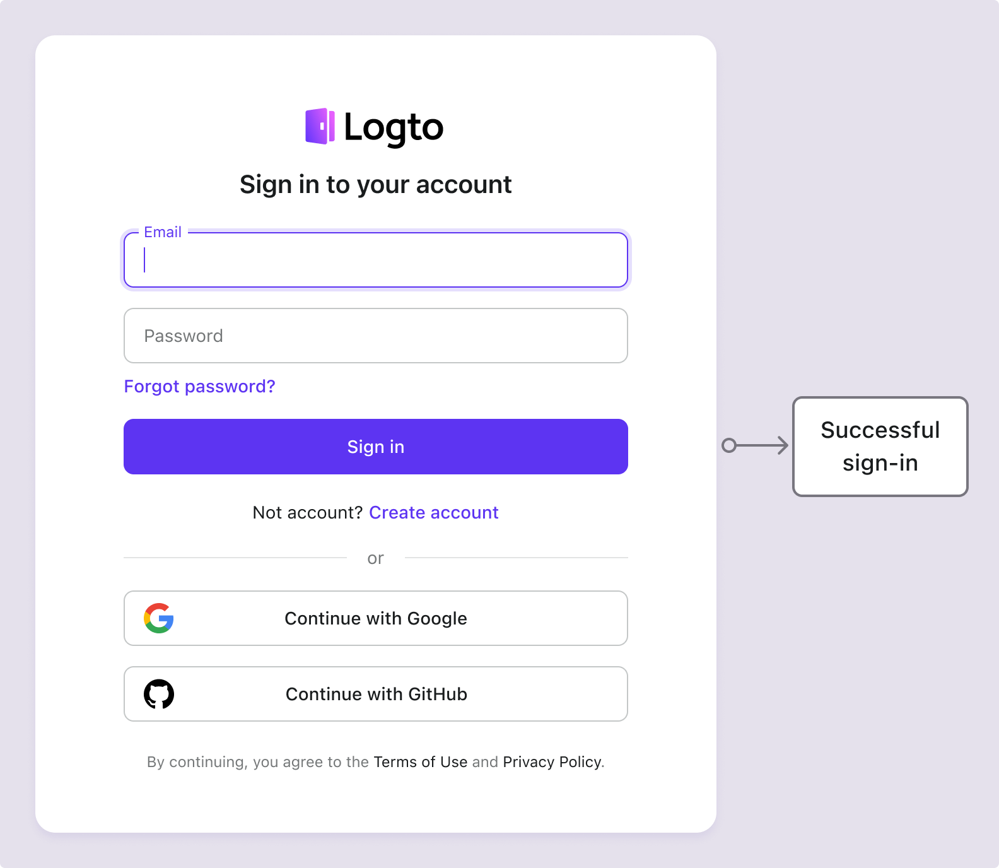

# Inicio de sesión por correo electrónico / teléfono / nombre de usuario

## Configurar el flujo de inicio de sesión del identificador

Como se indicó anteriormente, se pueden recopilar varios tipos de identificadores de los usuarios a lo largo del [flujo de registro](/end-user-flows/sign-up-and-sign-in/sign-up) o [creación directa de cuentas en Logto](/user-management/manage-users#add-users). Además, los usuarios pueden ingresar y completar información adicional a medida que exploran y utilizan el producto. Esos identificadores se pueden usar para identificar de manera única a los usuarios en el sistema de Logto y permitirles autenticarse e iniciar sesión en las aplicaciones que están integradas con Logto.

Ya sea que elijas usar la página de inicio de sesión preconstruida alojada por Logto o planees [construir tu propia interfaz de usuario de inicio de sesión personalizada](/customization#custom-ui), necesitarás configurar los métodos de inicio de sesión disponibles y las configuraciones de verificación para tus usuarios finales.

## Configurar el identificador y las configuraciones de autenticación

### 1. Establecer los identificadores de inicio de sesión admitidos

Puedes agregar múltiples identificadores admitidos de la lista desplegable como métodos de inicio de sesión habilitados para los usuarios finales. Las opciones disponibles son:

- **Nombre de usuario**
- **Dirección de correo electrónico**
- **Número de teléfono**

Reordenar los identificadores cambiará el orden en que se muestran en la página de inicio de sesión. El primer identificador será el método principal de inicio de sesión para los usuarios.

### 2. Establecer las configuraciones de autenticación

Para cada identificador de inicio de sesión, necesitarás configurar al menos un factor de verificación efectivo para verificar la identidad del usuario. Hay dos factores que puedes elegir:

- **Contraseña**: Disponible para todos los tipos de identificadores de inicio de sesión. Una vez habilitado, los usuarios deben proporcionar una contraseña para completar el proceso de inicio de sesión.
- **Código de verificación**: Disponible solo para los identificadores de **Dirección de correo electrónico** y **Número de teléfono**. Una vez habilitado, los usuarios deben ingresar un código de verificación enviado a su correo electrónico o número de teléfono para completar el proceso de inicio de sesión.

Si ambos factores están habilitados, los usuarios pueden elegir cualquiera de los métodos para completar el proceso de inicio de sesión. También puedes reordenar los factores para cambiar el orden en que se muestran en la página de inicio de sesión. El primer factor se usará como el método de verificación principal para los usuarios y el segundo se mostrará como un enlace alternativo.

## Experiencia de usuario del flujo de inicio de sesión del identificador

La experiencia de inicio de sesión se adapta según el identificador elegido y los factores de autenticación disponibles.

- **Entrada inteligente para múltiples identificadores:**
  Si se habilita más de un método de inicio de sesión por identificador, la página de inicio de sesión integrada de Logto detectará automáticamente el tipo de identificador ingresado por el usuario y mostrará las opciones de verificación correspondientes. Por ejemplo, si se habilitan tanto la **Dirección de correo electrónico** como el **Número de teléfono**, la página de inicio de sesión detectará automáticamente el tipo de identificador ingresado por el usuario y mostrará las opciones de verificación correspondientes. Cambia a un formato de número de teléfono con código de región si se ingresan números consecutivamente o a un formato de correo electrónico cuando se usa un símbolo “@”.
- **Factores de verificación habilitados:**
  - **Solo contraseña:** Tanto el campo de identificador como el de contraseña se mostrarán en la primera pantalla.
  - **Solo código de verificación:** El campo de identificador aparece en la primera pantalla, seguido del campo de código de verificación en la segunda pantalla.
  - **Contraseña y código de verificación:** El campo de identificador se ingresa inicialmente en la primera pantalla, seguido de pasos para ingresar la contraseña o el código de verificación en la segunda pantalla según el orden de verificación. Se proporciona un enlace de cambio para permitir a los usuarios cambiar entre los dos métodos de verificación.

### Ejemplos

  
Ejemplo 1: Dirección de correo electrónico con verificación de contraseña

Agrega la **Dirección de correo electrónico** como el identificador de inicio de sesión y habilita el factor de **Contraseña** para la verificación.

  
Ejemplo 2: Correo electrónico / Teléfono con verificación de contraseña (primaria) y código de verificación (alternativa) habilitada

Agrega tanto la **Dirección de correo electrónico** como el **Número de teléfono** como los identificadores de inicio de sesión.
Habilita los factores de **Contraseña** y **Código de verificación** para ambos identificadores.

## Recopilar perfil de usuario adicional en el inicio de sesión

En el flujo de inicio de sesión de Logto, se puede activar un proceso de cumplimiento de perfil si se actualizan las configuraciones de identificador de registro. Esto asegura que todos los usuarios, incluidos los existentes, proporcionen cualquier identificador nuevo requerido.

Cuando un desarrollador agrega un nuevo identificador (como una dirección de correo electrónico), se vuelve obligatorio para todos los usuarios. Si un usuario que regresa inicia sesión con un identificador existente (como un nombre de usuario), se le pedirá que proporcione y verifique el nuevo identificador si falta en su perfil. Solo después de completar este paso podrán acceder a la aplicación, asegurando una transición fluida y consistente a los requisitos actualizados.

Desglosando el proceso:

1. **Nombre de usuario** se estableció previamente como el identificador de registro con la configuración de **Crear tu contraseña** habilitada automáticamente.
2. **Dirección de correo electrónico** se establece más tarde como el identificador de registro. El identificador de **Dirección de correo electrónico** se agrega automáticamente como una opción de inicio de sesión habilitada.
3. Un usuario que regresa inicia sesión con su nombre de usuario y contraseña.
4. Se le pide al usuario que proporcione y verifique una dirección de correo electrónico después de su paso inicial de inicio de sesión.

El mismo proceso se aplica a las configuraciones de registro de **Crear tu contraseña** también. Si la configuración de **Crear tu contraseña** se habilita recientemente en el flujo de registro, el factor de **Contraseña** se habilitará automáticamente para todos los identificadores de inicio de sesión que elijas. Todos los usuarios que regresen sin una contraseña se les pedirá que creen una durante el proceso de inicio de sesión.

:::note
Nota: Para flujos de inicio de sesión personalizados, consulta la función de [Trae tu UI](/customization/bring-your-ui/).
:::

## Preguntas frecuentes

  
Experiencia de inicio de sesión autoalojada (inicio de sesión incrustado)

Logto actualmente no admite API sin cabeza para inicio de sesión y registro. Sin embargo, puedes usar nuestra función de [Trae tu UI](/customization/bring-your-ui/) para cargar tu formulario de inicio de sesión personalizado en Logto. También admitimos múltiples parámetros de inicio de sesión que puedes usar para prellenar el formulario de inicio de sesión con el identificador de usuario recopilado de tu aplicación o iniciar sesión directamente con un proveedor de SSO social o empresarial de terceros. Aprende más en [Parámetros de autenticación](/end-user-flows/authentication-parameters/).

## Recursos relacionados

<Url href="https://www.youtube.com/watch?v=64rBXpWbScc">
  Experiencia de registro e inicio de sesión por correo electrónico
</Url>

<Url href="https://www.youtube.com/watch?v=chQxCJX6e6w">
  Experiencia de registro e inicio de sesión por nombre de usuario
</Url>
