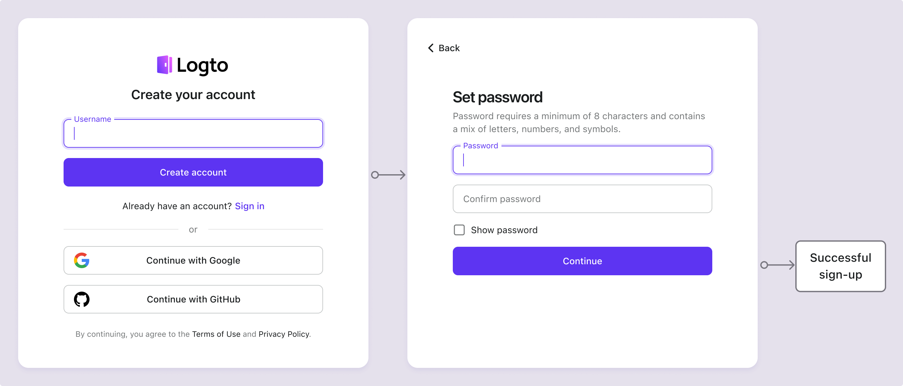

# Registro por correo electrónico / teléfono / nombre de usuario

El registro de usuarios es el primer paso para que los usuarios interactúen con tu aplicación. Logto admite una variedad de métodos de registro, incluidos nombre de usuario y contraseña, verificación de correo electrónico o número de teléfono, registro social y SSO empresarial. Puedes configurar los métodos de registro que mejor se adapten a los requisitos de tu aplicación.

Visita <CloudLink to="/sign-in-experience/sign-up-and-sign-in">Consola > Experiencia de inicio de sesión > Registro e inicio de sesión</CloudLink> para comenzar a configurar el flujo de registro de identificadores.

## Configurar el identificador de registro

Para crear con éxito una nueva cuenta de usuario en Logto, los usuarios deben proporcionar un **identificador** que los identifique de manera única dentro del sistema de Logto. Como primer paso, establece el **identificador** que necesitas recopilar de los usuarios durante el proceso de registro. Las opciones disponibles son:

- **Nombre de usuario**: Un nombre de usuario único que el usuario puede usar para iniciar sesión en la aplicación.
- **Dirección de correo electrónico**: Una dirección de correo electrónico válida que el usuario puede usar para iniciar sesión en la aplicación.
- **Número de teléfono**: Un número de teléfono válido que el usuario puede usar para iniciar sesión en la aplicación.
- **Dirección de correo electrónico o número de teléfono**: Permitir a los usuarios registrarse con una dirección de correo electrónico válida o un número de teléfono.
- **No aplicable**: No se habilita ningún identificador de registro. Esto se aplica a los métodos de registro solo social o solo SSO empresarial.

Todos los identificadores recopilados durante el proceso de registro deben ser únicos entre los usuarios bajo el mismo inquilino. Se almacenarán en el perfil del usuario y se pueden usar para iniciar sesión en las aplicaciones integradas con Logto.

## Configurar los ajustes de verificación de registro

Para garantizar la seguridad del registro de usuarios y el proceso de inicio de sesión futuro, también necesitas configurar los ajustes de verificación para los identificadores que recopilas durante el proceso de registro. Los ajustes disponibles son:

- **Crear tu contraseña:** Requiere que los usuarios creen una contraseña durante el registro que cumpla con la política de contraseñas configurada en tus ajustes de experiencia de inicio de sesión. Esta contraseña, junto con el identificador del usuario, sirve como su credencial para iniciar sesión en la aplicación. Si estableces **Nombre de usuario** como el identificador de registro, este requisito se habilita automáticamente, ya que el **Nombre de usuario** solo se puede usar con una contraseña para verificar efectivamente la identidad del usuario.
- **Verificar en el registro**: Requiere que los usuarios verifiquen su dirección de correo electrónico o número de teléfono durante el registro. Actualmente, Logto solo acepta correos electrónicos y números de teléfono verificados como identificadores. Este ajuste se habilita automáticamente cuando se utiliza una **Dirección de correo electrónico** o **Número de teléfono** como el identificador de registro. Los usuarios deben confirmar la propiedad ingresando un código de verificación enviado a su correo electrónico o número de teléfono durante el proceso de registro.

| Identificador                           | Crear contraseña de usuario | Verificar en el registro |
| --------------------------------------- | --------------------------- | ------------------------ |
| Nombre de usuario                       | Requerido                   | N/A                      |
| Dirección de correo electrónico         | Opcional                    | Requerido                |
| Número de teléfono                      | Opcional                    | Requerido                |
| Correo electrónico o número de teléfono | Opcional                    | Requerido                |
| No aplicable                            | N/A                         | N/A                      |

## Ejemplos de flujo de registro

  
Tipo 1: Nombre de usuario con creación de contraseña

Selecciona el **Nombre de usuario** como el identificador de registro. Crear tu contraseña se fuerza a habilitarse.

  
Tipo 2: Dirección de correo electrónico o número de teléfono con flujo de verificación

Selecciona la **Dirección de correo electrónico o número de teléfono** como el identificador de registro. **Verificar en el registro** se fuerza a habilitarse.

  
Tipo 3: Dirección de correo electrónico con verificación y creación de contraseña

Selecciona la **Dirección de correo electrónico** como el identificador de registro. **Verificar en el registro** se fuerza a habilitarse. Habilita **Crear tu contraseña** para requerir que los usuarios creen una contraseña durante el registro. (Lo mismo se aplica al flujo de registro con número de teléfono)

## Registro con social o SSO empresarial

Además de estos métodos tradicionales de registro de identificadores, Logto también admite el registro sin contraseña con proveedores de identidad social y SSO empresarial, haciendo el proceso de incorporación más fluido y amigable para el usuario.

Una vez que un conector social o un conector SSO empresarial está configurado y habilitado en Logto, los usuarios pueden registrarse fácilmente utilizando su identidad social o empresarial existente proporcionada por el conector. Los métodos de registro social y SSO empresarial permiten a los usuarios omitir pasos adicionales como crear una contraseña o verificar su dirección de correo electrónico o número de teléfono. Logto sincronizará automáticamente la información del usuario a través de su identidad social o empresarial verificada y la almacenará en el perfil del usuario.

Consulta las secciones de [inicio de sesión social](/end-user-flows/sign-up-and-sign-in/social-sign-in/) y [SSO empresarial](/end-user-flows/enterprise-sso/) para obtener más información sobre el flujo de registro con conectores sociales y SSO empresarial.

:::note
Nota: Para flujos de registro personalizados, consulta la función de [Trae tu UI](/customization/bring-your-ui/).
:::

## Preguntas frecuentes

  
Recopilar información adicional del usuario en el registro

  
Para recopilar información adicional del perfil del usuario (por ejemplo, Nombre completo, Fecha de nacimiento, Nombre de la empresa) durante el registro, tienes dos opciones:

- **Flujos de incorporación autohospedados**: Redirige a los usuarios a tu propio flujo de incorporación después de un registro exitoso para la recopilación de datos personalizable.
- **Trae tu propia UI**: Personaliza tu propio flujo de registro utilizando nuestra función de trae tu propia UI con la API de configuración del perfil del usuario (próximamente).

  
 Usuarios creados por el administrador / Usuarios invitados

Aprende cómo implementar el [flujo de registro solo por invitación.](/end-user-flows/sign-up-and-sign-in/disable-user-registration/#implement-an-invitation-only-sign-up-flow)

  
 Formularios de registro integrados en tu sitio web

  
Logto actualmente no admite API sin interfaz para el inicio de sesión y el registro. Puedes usar la función de [Trae tu UI](/customization/bring-your-ui/) para cargar tu propio formulario de registro en Logto o usar los parámetros de inicio de sesión para poblar información del usuario en Logto desde tu sitio web. Aprende más sobre la población de identificadores de usuario en [Parámetros de autenticación](/end-user-flows/authentication-parameters/).

  
 Enviar correos electrónicos de bienvenida a nuevos usuarios

Suscríbete al evento webhook `User.Created` para enviar un correo electrónico de bienvenida a los nuevos usuarios. Aprende más sobre [eventos webhook](/developers/webhooks/webhooks-events/#data-mutation-hook-events).

  
 Omitir la verificación de correo electrónico en el registro

Actualmente, Logto solo admite correos electrónicos y números de teléfono verificados como identificadores. El proceso de verificación es necesario para garantizar la seguridad y propiedad del identificador del usuario.
El soporte para correos electrónicos o números de teléfono no verificados está en nuestra hoja de ruta. ¡Mantente atento a las actualizaciones!

## Recursos relacionados

<Url href="https://www.youtube.com/watch?v=64rBXpWbScc">
  Experiencia de registro e inicio de sesión por correo electrónico
</Url>

<Url href="https://www.youtube.com/watch?v=chQxCJX6e6w">
  Experiencia de registro e inicio de sesión por nombre de usuario
</Url>
