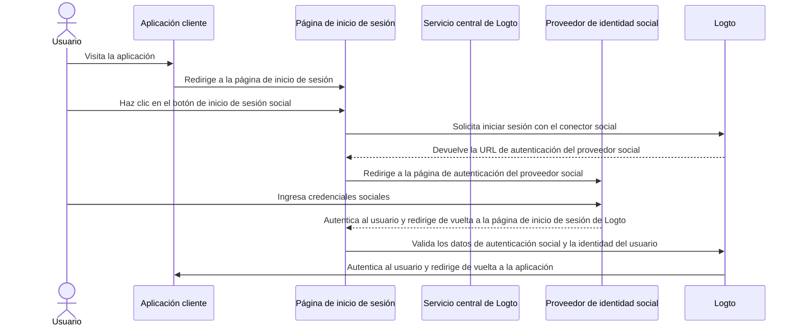

# Inicio de sesión social

El inicio de sesión social es un método de autenticación ampliamente utilizado que permite a los usuarios iniciar sesión y registrarse utilizando sus cuentas existentes de redes sociales, como Google, Facebook, Twitter y LinkedIn.

Beneficios del inicio de sesión social:

- **Proceso de incorporación simplificado**: El inicio de sesión social permite a los usuarios registrarse o iniciar sesión con un solo clic, sin necesidad de crear una nueva cuenta o recordar otra contraseña. Esto reduce la fricción y aumenta la participación de los usuarios.
- **Mayor confianza y seguridad**: Al aprovechar plataformas establecidas y confiables como Google o Facebook, los usuarios se sienten más seguros en tu aplicación.
- **Enriquecimiento de datos de usuario**: El inicio de sesión social te permite recopilar información adicional del perfil desde la plataforma social, como nombre, dirección de correo electrónico, foto de perfil y más.

## Implementar inicio de sesión social \{#implement-social-sign-in}

1. **Configura tus conectores sociales**:<br/>
   Navega a <CloudLink to="/connectors/social">Consola > Conectores > Conectores sociales</CloudLink>. Haz clic en el botón “Agregar conector social” y localiza el conector social que deseas agregar (por ejemplo, Google o Github). Consulta [conector social](/connectors/social-connectors/) para instrucciones detalladas.
2. **Agrega botones de inicio de sesión social**:<br/>
   Por defecto, tu conector social recién agregado no será visible en la página de inicio de sesión del usuario final. Para agregar botones de inicio de sesión social a la página de inicio de sesión, debes habilitar el conector social en la configuración de la experiencia de inicio de sesión.

   Navega a <CloudLink to="/sign-in-experience/sign-up-and-sign-in">Consola > Experiencia de inicio de sesión > Registro e inicio de sesión</CloudLink>. Haz clic en el botón “Agregar conector social” para integrar los botones de inicio de sesión social en tus páginas de registro e inicio de sesión. Usa arrastrar y soltar para organizar su orden en la interfaz.

3. **Configura las opciones de vinculación de cuentas**:<br/>
   Para los nuevos usuarios que se registran con [identidades sociales](/user-management/user-data#social-identities), Logto permite vincular su cuenta social a una cuenta existente de correo electrónico o número de teléfono dentro del sistema Logto. Por defecto, se muestra una página relacionada de [vinculación de cuentas](#account-linking) a los usuarios durante el registro social, permitiéndoles vincular su cuenta social a una cuenta existente o crear una nueva.

   Para agilizar este proceso, puedes habilitar la opción **Vinculación automática de cuentas** en la configuración de la experiencia de inicio de sesión. Esto vinculará automáticamente la cuenta social a una cuenta existente si el correo electrónico o número de teléfono coincide.

4. **Guarda los cambios**: <br/>
   Revisa cuidadosamente tus cambios y guárdalos para aplicar la configuración.

## Experiencia de usuario del inicio de sesión social \{#user-experience-of-social-sign-in}

Con el inicio de sesión social, los procesos de registro e inicio de sesión en Logto se simplifican para los usuarios.



1. **Inicio de sesión con social**: El usuario hace clic en el botón de inicio de sesión social mostrado en la página de inicio de sesión.
2. **Redirección**: El usuario es redirigido a la página de autenticación del proveedor de identidad social.
3. **Autenticación social**: El usuario ingresa sus credenciales sociales y se autentica con el proveedor social. Si el usuario ya ha iniciado sesión en el proveedor social, puede ser autenticado automáticamente. Si se detectan múltiples sesiones de inicio de sesión, se le puede pedir al usuario que elija la cuenta correcta (por ejemplo, varias cuentas de Google).
   :::note
   Los parámetros “prompt” de Google se pueden configurar en el conector de Google, permitiéndote personalizar la experiencia del usuario al seleccionar la cuenta y la pantalla de consentimiento para el inicio de sesión con Google.
   :::
4. **Regreso a Logto**: Tras la autenticación exitosa, el proveedor social redirige al usuario de vuelta a la página de inicio de sesión de Logto con los datos de autenticación.
5. **Validación de identidad social**: Logto valida los datos de autenticación social y la identidad del usuario. Si no existe una cuenta de usuario asociada con la identidad social, se creará una nueva cuenta.
6. **Autenticación del usuario**: Logto autentica al usuario y lo redirige de vuelta a la aplicación cliente para completar el proceso de autenticación.

## Vinculación de cuentas \{#account-linking}

Como se mencionó anteriormente, Logto permite a los usuarios vincular sus cuentas sociales a cuentas existentes de correo electrónico o número de teléfono dentro del sistema Logto. Este proceso es esencial para mantener una cuenta de usuario unificada a través de diferentes métodos de autenticación y proveedores de identidad.

- **Creación de nueva cuenta**:
  Cuando un usuario inicia sesión con una [identidad social](/user-management/user-data#social-identities) que no existe en el sistema Logto, y el correo electrónico o número de teléfono proporcionado no coincide con ninguna cuenta de usuario existente, se creará una nueva cuenta en Logto directamente.
- **Vinculación de cuenta existente**:
  Si el correo electrónico o número de teléfono proporcionado por la identidad social ya está asociado a una cuenta existente en Logto, ofrecemos un proceso flexible de vinculación de cuentas.

  - **Vinculación automática de cuentas:** Si la opción “Vinculación automática de cuentas” está habilitada en tu configuración de <CloudLink to="/sign-in-experience/sign-up-and-sign-in">Experiencia de inicio de sesión</CloudLink>, Logto vinculará automáticamente la cuenta social a la cuenta existente en base a la coincidencia de correo electrónico o número de teléfono. No se le pedirá al usuario que vincule las cuentas y será autenticado instantáneamente en su cuenta existente. La cuenta social quedará vinculada, permitiendo al usuario iniciar sesión usando cualquiera de los métodos en el futuro.
  - **Vinculación manual de cuentas**: Si la opción “Vinculación automática de cuentas” está deshabilitada, se le pedirá al usuario que vincule su cuenta social a la cuenta existente durante el proceso de inicio de sesión. Puede elegir vincular las cuentas o crear una nueva.

    

    ```mermaid
    flowchart TD
    A[Autenticarse con identidad social] --> B{{¿La identidad social existe en Logto?}}
    B -- Sí --> C[Inicia sesión con cuenta existente]
    B -- No --> D{{¿Correo electrónico/teléfono coincide con alguna cuenta existente?}}
    D -- Sí --> E{{¿Vinculación automática de cuentas habilitada?}}
    E -- Sí --> G[Vincula identidad social a cuenta existente]
    G --> C
    D -- No --> H[Crea nueva cuenta e inicia sesión]
    E -- No --> I{{¿Vincular cuenta social?}}
    I -- Sí --> G
    I -- No --> H
    ```

:::note
Si se localiza una cuenta relacionada durante el proceso de registro social con un correo electrónico o número de teléfono que coincide con una cuenta existente, y el usuario elige no vincular las cuentas, el correo electrónico o número de teléfono no se sincronizará con la nueva cuenta en Logto. Esto asegura que el correo electrónico y el número de teléfono permanezcan únicos en todas las cuentas de usuario.

Si el correo electrónico o número de teléfono es un identificador obligatorio para el registro, se le pedirá al usuario que proporcione otro correo electrónico o número de teléfono durante el proceso de registro. Consulta [Recopilar información adicional del perfil de usuario](#collect-additional-user-profile-data) para más detalles.
:::

## Recopilar información adicional del perfil de usuario \{#collect-additional-user-profile-data}

Durante el proceso de registro social, dependiendo de los identificadores obligatorios de registro (**dirección de correo electrónico**, **número de teléfono** y **nombre de usuario**) que hayas configurado, es posible que se le pida a los usuarios que proporcionen información verificada adicional para completar el proceso de registro o inicio de sesión después de autenticarse con el proveedor social.

Por ejemplo, se han establecido **dirección de correo electrónico** y **nombre de usuario** como identificadores obligatorios para el registro:

1. **Registro con identidad social que proporciona una dirección de correo electrónico verificada**

   Si la identidad social proporciona una dirección de correo electrónico verificada, esta dirección se sincronizará con el perfil del usuario y se le pedirá al usuario que proporcione un nombre de usuario para completar el proceso de registro.

   ```mermaid
   flowchart TD
      A[Autenticarse con identidad social] --> B{{¿Contiene dirección de correo electrónico verificada?}}
      B -- Sí --> C[Ingresar nombre de usuario]
      C --> D[Registro exitoso]
   ```

2. **Registro con identidad social que no proporciona una dirección de correo electrónico verificada**

   Si la identidad social no proporciona una dirección de correo electrónico verificada, se le pedirá al usuario que proporcione una dirección de correo electrónico durante el proceso de registro. El usuario debe verificar la dirección ingresando un código de verificación enviado al correo proporcionado.

   ```mermaid
   flowchart TD
      A[Autenticarse con identidad social] --> B{{¿Contiene dirección de correo electrónico verificada?}}
      B -- No --> C[Ingresar dirección de correo electrónico]
      C --> D[Ingresar código de verificación]
      D --> E[Ingresar nombre de usuario]
      E --> F[Registro exitoso]
   ```

3. **Registro con identidad social que proporciona una dirección de correo electrónico ya registrada**

   Si la identidad social proporciona una dirección de correo electrónico que ya está registrada en el sistema Logto, se le pedirá al usuario que vincule la cuenta social a la cuenta existente o cree una nueva cuenta. Si el usuario elige crear una nueva cuenta, se le pedirá que proporcione una nueva dirección de correo electrónico y la verifique.

   ```mermaid
      flowchart TD
       A[Autenticarse con identidad social] --> B{{¿La dirección de correo electrónico coincide con alguna cuenta existente?}}
       B -- Sí --> C{{¿Vincular cuenta social?}}
       C -- Sí --> D[Vincula identidad social a cuenta existente]
       D --> E[Inicio de sesión exitoso]
       C -- No --> F[Ingresar nueva dirección de correo electrónico]
       F --> G[Ingresar código de verificación]
       G --> H[Ingresar nombre de usuario]
       H --> I[Registro exitoso]
       B -- No --> H
   ```

## Google One-tap \{#google-one-tap}

Logto también admite el método de inicio de sesión [Google One-tap](https://developers.google.com/identity/gsi/web/guides/features) para el conector de Google, permitiendo a los usuarios iniciar sesión con un solo clic. Esta función simplifica aún más el proceso de inicio de sesión al eliminar la necesidad de que los usuarios sean redirigidos a la página de autenticación de Google.

Para habilitar el inicio de sesión Google One-tap, sigue las instrucciones en la configuración del [conector de Google](/integrations/google). Una vez habilitado, los usuarios verán una ventana emergente de "Iniciar sesión con Google" cuando lleguen a la página de inicio de sesión. Al hacer clic, serán autenticados automáticamente con su cuenta de Google y redirigidos de vuelta a la aplicación.


## Vincular o desvincular cuentas sociales \{#link-or-unlink-social-accounts}

Después del inicio de sesión social inicial, los usuarios pueden gestionar sus cuentas sociales conectadas a través de la configuración de su cuenta. Esto les permite vincular cuentas sociales adicionales a su perfil existente o eliminar conexiones sociales que ya no deseen utilizar.

Los usuarios pueden acceder a estas funciones a través de un centro de cuentas de autoservicio, que proporciona flexibilidad para:

- **Vincular nuevas cuentas sociales**: Conectar proveedores sociales adicionales al mismo perfil de usuario
- **Desvincular cuentas sociales existentes**: Eliminar conexiones sociales manteniendo el acceso a través de otros métodos
- **Ver cuentas conectadas**: Ver todas las identidades sociales actualmente vinculadas

Obtén más información sobre la implementación de funciones de gestión de cuentas en la documentación de [configuración de cuenta](/end-user-flows/account-settings).

## Almacenar tokens y llamar a APIs de terceros \{#store-tokens-and-call-third-party-apis}

Opcionalmente, puedes habilitar el almacenamiento de tokens de terceros para los conectores sociales compatibles, de modo que, después de que un usuario se autentique y otorgue permisos, los tokens de acceso y actualización emitidos por el proveedor se almacenen de forma segura en el almacén secreto de Logto. Tu aplicación (a través de Account API) podrá recuperarlos y usarlos para llamar a las APIs del proveedor (por ejemplo, permitir que tu app agregue eventos a Google Calendar) en nombre del usuario sin forzar otra autenticación social. Consulta [almacenamiento de tokens de terceros](/secret-vault/federated-token-set) para detalles de configuración.

## Preguntas frecuentes \{#faqs}

<details>
  <summary>

### ¿Cómo agregar botones de inicio de sesión social e iniciar sesión directamente con social en mi sitio web? \{#how-to-add-social-login-buttons-and-directly-sign-in-with-social-on-my-website}

</summary>

Logto te permite agregar botones de inicio de sesión social a tu sitio web e iniciar el proceso de inicio de sesión social directamente sin mostrar el formulario de inicio de sesión predeterminado. Consulta nuestra guía de [Inicio de sesión directo](/end-user-flows/authentication-parameters/direct-sign-in/) para instrucciones detalladas.

</details>

<details>
  <summary>

### ¿Por qué mis correos electrónicos o números de teléfono no se rellenan después de registrarme con social? \{#why-my-emails-or-phone-numbers-are-not-populated-after-signing-up-with-social}

</summary>

En Logto, la dirección de correo electrónico y el número de teléfono pueden usarse como identificadores de inicio de sesión para identificar de manera única a los usuarios. Solo se aceptan como identificadores las direcciones de correo electrónico y números de teléfono verificados. Si la identidad social no proporciona el reclamo `email_verified` o `phone_number_verified`, la dirección de correo electrónico o el número de teléfono no se sincronizarán con el perfil del usuario. Aun así, puedes encontrarlos en los datos de identidades sociales en el perfil del usuario.

El soporte para correo electrónico o número de teléfono no verificado como perfil de usuario estará disponible pronto.

</details>

## Recursos relacionados \{#related-resources}

<Url href="https://www.youtube.com/watch?v=sv60N9eW8Ew">Experiencia de inicio de sesión social</Url>

<Url href="https://blog.logto.io/maximize-google-sign-in-conversions">
  Maximiza las conversiones de inicio de sesión con Google con 6 configuraciones
</Url>
