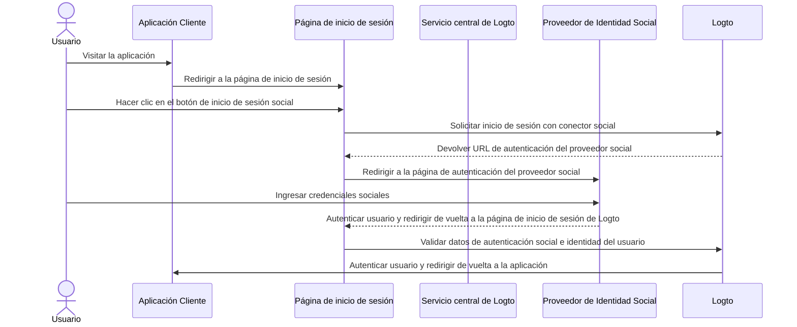
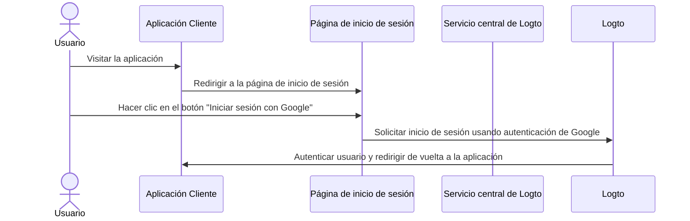

# Inicio de sesión social

El inicio de sesión social es un método de autenticación ampliamente utilizado que permite a los usuarios iniciar sesión y registrarse utilizando sus cuentas existentes de redes sociales, como Google, Facebook, Twitter y LinkedIn.

Beneficios del inicio de sesión social:

- **Proceso de incorporación simplificado**: El inicio de sesión social permite a los usuarios registrarse o iniciar sesión con un solo clic, sin necesidad de crear una nueva cuenta o recordar otra contraseña. Esto reduce la fricción y aumenta el compromiso del usuario.
- **Mayor confianza y seguridad**: Al aprovechar plataformas establecidas y confiables como Google o Facebook, los usuarios se sienten más seguros en tu aplicación.
- **Enriquecimiento de datos del usuario**: El inicio de sesión social te permite recopilar información adicional del perfil de la plataforma social, como nombre, dirección de correo electrónico, foto de perfil y más.

## Implementar el inicio de sesión social

1. **Configura tus conectores sociales**:<br/>
   Navega a <CloudLink to="/connectors/social">Consola > Conectores > Conectores sociales</CloudLink>. Haz clic en el botón "Agregar conector social" y localiza el conector social que deseas agregar (por ejemplo, Google o Github). Consulta nuestra documentación para obtener instrucciones detalladas sobre cómo agregar un [conector social](/connectors/social-connectors/).
2. **Agregar botones de inicio de sesión social**:<br/>
   Por defecto, tu nuevo conector social no será visible en la página de inicio de sesión del usuario final. Para agregar botones de inicio de sesión social a la página de inicio de sesión, debes habilitar el conector social en la configuración de la experiencia de inicio de sesión.

   Navega a <CloudLink to="/sign-in-experience/sign-up-and-sign-in">Consola > Experiencia de inicio de sesión > Registro e inicio de sesión</CloudLink>. Haz clic en el botón "Agregar conector social" para integrar botones de inicio de sesión social en tus páginas de registro e inicio de sesión. Usa arrastrar y soltar para organizar su orden en la interfaz de usuario.

3. **Configurar opciones de vinculación de cuentas**:<br/>
   Para los nuevos usuarios que se registran con [identidades sociales](/user-management/user-data#social-identities), Logto permite vincular su cuenta social a una cuenta de correo electrónico o número de teléfono existente dentro del sistema Logto. Por defecto, se muestra una página de [vinculación de cuentas](#account-linking) relacionada a los usuarios durante el registro social, permitiéndoles vincular su cuenta social a una cuenta existente o crear una nueva.

   Para simplificar este proceso, puedes habilitar la opción de **Vinculación automática de cuentas** en la configuración de la experiencia de inicio de sesión. Esto vinculará automáticamente la cuenta social a una cuenta existente si el correo electrónico o número de teléfono coincide.

4. **Guardar cambios**: <br/>
   Revisa tus cambios cuidadosamente y guárdalos para aplicar la configuración.

## Experiencia del usuario con el inicio de sesión social

Con el inicio de sesión social, los procesos de registro e inicio de sesión en Logto se simplifican para los usuarios.



1. **Inicio de sesión con social**: El usuario hace clic en el botón de inicio de sesión social que se muestra en la página de inicio de sesión.
2. **Redirección**: El usuario es redirigido a la página de autenticación del proveedor de identidad social.
3. **Autenticación social**: El usuario ingresa sus credenciales sociales y se autentica con el proveedor social. Si el usuario ya ha iniciado sesión en el proveedor social, puede ser autenticado automáticamente. Si se detectan múltiples sesiones de inicio de sesión, se le puede pedir al usuario que elija la cuenta correcta (por ejemplo, múltiples cuentas de Google).
   :::note
   Los parámetros de "prompt" de Google se pueden configurar en el conector de Google, permitiéndote personalizar la experiencia del usuario al seleccionar la cuenta y la pantalla de consentimiento para el inicio de sesión de Google.
   :::
4. **Regreso a Logto**: Después de una autenticación exitosa, el proveedor social redirige al usuario de vuelta a la página de inicio de sesión de Logto con los datos de autenticación.
5. **Validación de identidad social**: Logto valida los datos de autenticación social y la identidad del usuario. Si no existe una cuenta de usuario asociada con la identidad social, se creará una nueva cuenta.
6. **Autenticación del usuario**: Logto autentica al usuario y lo redirige de vuelta a la aplicación cliente para completar el proceso de autenticación.

### Google One-tap

Logto también admite el método de inicio de sesión [Google One-tap](https://developers.google.com/identity/gsi/web/guides/features) para el conector de Google, permitiendo a los usuarios iniciar sesión con un solo clic. Esta función simplifica aún más el proceso de inicio de sesión al eliminar la necesidad de que los usuarios sean redirigidos a la página de autenticación de Google.

Para habilitar el inicio de sesión Google One-tap, sigue las instrucciones en la configuración del [conector de Google](/integrations/google). Una vez habilitado, los usuarios verán un popup de "Iniciar sesión con Google" cuando lleguen a la página de inicio de sesión. Al hacer clic en él, serán autenticados automáticamente con su cuenta de Google y redirigidos de vuelta a la aplicación.




## Vinculación de cuentas

Como se mencionó anteriormente, Logto permite a los usuarios vincular sus cuentas sociales a cuentas de correo electrónico o número de teléfono existentes dentro del sistema Logto. Este proceso es esencial para mantener una cuenta de usuario unificada a través de diferentes métodos de autenticación y proveedores de identidad.

- **Creación de nueva cuenta**:
  Cuando un usuario inicia sesión con una [identidad social](/user-management/user-data#social-identities) que no existe en el sistema Logto, y el correo electrónico o número de teléfono proporcionado no coincide con ninguna cuenta de usuario existente, se creará una nueva cuenta en Logto directamente.
- **Vinculación de cuenta existente**:
  Si el correo electrónico o número de teléfono proporcionado por la identidad social ya está asociado con una cuenta existente en Logto, ofrecemos un proceso de vinculación de cuentas flexible.

  - **Vinculación automática de cuentas:** Si la opción de "Vinculación automática de cuentas" está habilitada en tu configuración de <CloudLink to="/sign-in-experience/sign-up-and-sign-in">Experiencia de inicio de sesión</CloudLink>, Logto vinculará automáticamente la cuenta social a la cuenta existente basada en un correo electrónico o número de teléfono coincidente. Los usuarios no serán solicitados para vincular las cuentas y serán instantáneamente iniciados en su cuenta existente. La cuenta social estará vinculada, permitiendo al usuario iniciar sesión usando cualquiera de los métodos en el futuro.
  - **Vinculación manual de cuentas**: Si la opción de "Vinculación automática de cuentas" está deshabilitada, se solicitará a los usuarios que vinculen su cuenta social a la cuenta existente durante el proceso de inicio de sesión. Pueden elegir vincular las cuentas o crear una nueva.

    

    ```mermaid
    flowchart TD
    A[Autenticar con identidad social] --> B{{¿La identidad social existe en Logto?}}
    B -- Sí --> C[Iniciado sesión con cuenta existente]
    B -- No --> D{{¿Correo electrónico/teléfono coincide con alguna cuenta existente?}}
    D -- Sí --> E{{¿Vinculación automática de cuentas habilitada?}}
    E -- Sí --> G[Vincular identidad social a cuenta existente]
    G --> C
    D -- No --> H[Crear nueva cuenta e iniciar sesión]
    E -- No --> I{{¿Vincular cuenta social?}}
    I -- Sí --> G
    I -- No --> H
    ```

:::note
Si se localiza una cuenta relacionada durante el proceso de registro social con un correo electrónico o número de teléfono que coincide con una cuenta existente, y el usuario elige no vincular las cuentas, el correo electrónico o número de teléfono no se sincronizará con la nueva cuenta en Logto. Esto asegura que el correo electrónico y el número de teléfono permanezcan únicos en todas las cuentas de usuario.

Si el correo electrónico o número de teléfono es un identificador de registro requerido, se solicitará al usuario que proporcione otro correo electrónico o número de teléfono durante el proceso de registro. Consulta [Recopilar perfil de usuario adicional](#collect-additional-user-profile-data) para más detalles.
:::

## Recopilar datos adicionales del perfil de usuario

Durante el proceso de registro social, dependiendo del identificador de registro obligatorio (**dirección de correo electrónico**, **número de teléfono** y **nombre de usuario**) que hayas configurado, se puede solicitar a los usuarios que proporcionen información verificada adicional para completar el proceso de registro o inicio de sesión después de autenticarse con el proveedor social.

Por ejemplo, se ha configurado **Dirección de correo electrónico** como el identificador de registro:

1. **Registro con identidad social que proporciona una dirección de correo electrónico verificada**

   Si una dirección de correo electrónico verificada es proporcionada por la identidad social, el usuario será registrado automáticamente con la identidad social y la dirección de correo electrónico se sincronizará con el perfil del usuario.

2. **Registro con identidad social que no proporciona una dirección de correo electrónico verificada**

   Si la identidad social no proporciona una dirección de correo electrónico verificada, se solicitará al usuario que proporcione una dirección de correo electrónico durante el proceso de registro. El usuario debe verificar la dirección de correo electrónico ingresando un código de verificación enviado a la dirección de correo electrónico proporcionada.

   ```mermaid
   flowchart TD
      A[Autenticar con identidad social] --> B{{¿Dirección de correo electrónico requerida y faltante?}}
      B -- Sí --> C[Ingresar dirección de correo electrónico]
      C --> D[Ingresar código de verificación]
      D --> E[Registro exitoso]
      B -- No --> E
   ```

3. **Registro con identidad social que proporciona una dirección de correo electrónico registrada**

   Si la identidad social proporciona una dirección de correo electrónico que ya está registrada en el sistema Logto, se solicitará al usuario que vincule la cuenta social a la cuenta existente o cree una nueva cuenta. Si el usuario selecciona crear una nueva cuenta, se le solicitará que proporcione una nueva dirección de correo electrónico y la verifique.

   ```mermaid
      flowchart TD
       A[Autenticar con identidad social] --> B{{¿Dirección de correo electrónico coincide con alguna cuenta existente?}}
       B -- Sí --> C{{¿Vincular cuenta social?}}
       C -- Sí --> D[Vincular identidad social a cuenta existente]
       D --> E[Inicio de sesión exitoso]
       C -- No --> F[Ingresar nueva dirección de correo electrónico]
       F --> G[Ingresar código de verificación]
       G --> E
       B -- No --> E
   ```

## Preguntas frecuentes

<details>
  <summary> ¿Cómo agregar botones de inicio de sesión social e iniciar sesión directamente con social en mi sitio web?</summary>

Logto te permite agregar botones de inicio de sesión social a tu sitio web e iniciar el proceso de inicio de sesión social directamente sin mostrar el formulario de inicio de sesión predeterminado. Consulta nuestra guía de [Inicio de sesión directo](/end-user-flows/authentication-parameters/direct-sign-in/) para obtener instrucciones detalladas.

</details>

<details>
  <summary> ¿Por qué mis correos electrónicos o números de teléfono no se completan después de registrarse con social?</summary>

En Logto, la dirección de correo electrónico y el número de teléfono pueden usarse como el identificador de inicio de sesión para identificar de manera única a los usuarios. Solo se aceptan direcciones de correo electrónico y números de teléfono verificados como identificadores. Si la identidad social no proporciona el reclamo `email_verified` o `phone_number_verified`, la dirección de correo electrónico o el número de teléfono no se sincronizarán con el perfil del usuario. Aún puedes encontrarlos bajo los datos de identidades sociales en el perfil del usuario.

El soporte de correo electrónico o número de teléfono no verificado como perfil de usuario estará disponible pronto.

</details>

## Recursos relacionados

<Url href="https://www.youtube.com/watch?v=sv60N9eW8Ew">Experiencia de inicio de sesión social</Url>
