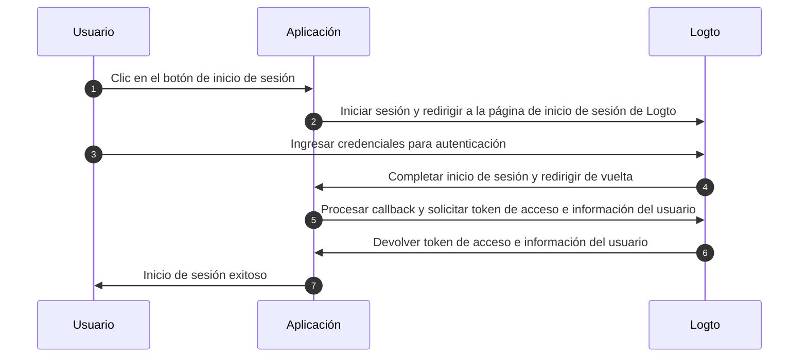
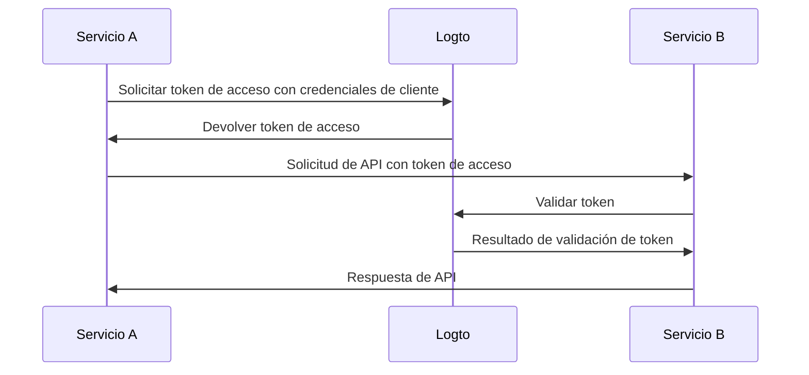

# Comprender el flujo de autenticación

Logto está basado en los estándares [OAuth 2.0](https://auth.wiki/oauth-2.0) y [OpenID Connect (OIDC)](https://auth.wiki/openid-connect). Comprender estos estándares de autenticación hará que el proceso de integración sea más fluido y sencillo.

### Flujo de autenticación de usuario \{#user-authentication-flow}

Esto es lo que sucede cuando un usuario inicia sesión con Logto:

En este flujo, varios conceptos clave son esenciales para el proceso de integración:

- `Aplicación`: Esto representa tu aplicación en Logto. Crearás una configuración de aplicación en la Consola de Logto para establecer una conexión entre tu aplicación real y los servicios de Logto. Aprende más sobre [Aplicación](/integrate-logto/application-data-structure/#introduction).
- `URI de redirección`: Después de que los usuarios completen la autenticación en la página de inicio de sesión de Logto, Logto los redirige de vuelta a tu aplicación a través de este URI. Necesitarás configurar el URI de redirección en la configuración de tu Aplicación. Para más detalles, consulta [URIs de redirección](/integrate-logto/application-data-structure/#redirect-uris).
- `Manejar el callback de inicio de sesión`: Cuando Logto redirige a los usuarios de vuelta a tu aplicación, tu aplicación necesita procesar los datos de autenticación y solicitar tokens de acceso e información del usuario. No te preocupes: el SDK de Logto maneja esto automáticamente.

Este resumen cubre lo esencial para una integración rápida. Para una comprensión más profunda, consulta nuestra guía [Experiencia de inicio de sesión explicada](/concepts/sign-in-experience/).

### Flujo de autenticación máquina a máquina \{#machine-to-machine-authentication-flow}

Logto proporciona el tipo de [aplicación máquina a máquina (M2M)](/quick-starts/m2m) para habilitar la autenticación directa entre servicios, basada en el [flujo de credenciales de cliente de OAuth 2.0](https://auth.wiki/client-credentials-flow):

Este flujo de autenticación máquina a máquina (M2M) está diseñado para aplicaciones que necesitan comunicarse directamente con recursos sin interacción del usuario (por lo tanto, sin interfaz de usuario), como un servicio de API actualizando datos de usuario en Logto o un servicio de estadísticas extrayendo pedidos diarios.

En este flujo, los servicios se autentican usando credenciales de cliente: una combinación de [ID de aplicación](/integrate-logto/application-data-structure/#application-id) y [Secreto de aplicación](/integrate-logto/application-data-structure/#application-secret) que identifica y autentica de manera única al servicio. Estas credenciales sirven como la identidad del servicio al solicitar [tokens de acceso](https://auth.wiki/access-token) de Logto.

## Recursos relacionados \{#related-resources}

<Url href="https://blog.logto.io/secure-cloud-apps-with-oauth-and-openid-connect">
  Blog: Asegura aplicaciones basadas en la nube con OAuth 2.0 y OpenID Connect
</Url>

<Url href="https://blog.logto.io/sso-is-better">
  Por qué el inicio de sesión único (SSO) para múltiples aplicaciones es mejor
</Url>

<Url href="https://blog.logto.io/centralized-identity-system">
  Por qué necesitas un sistema de identidad centralizado para un negocio con múltiples aplicaciones
</Url>
