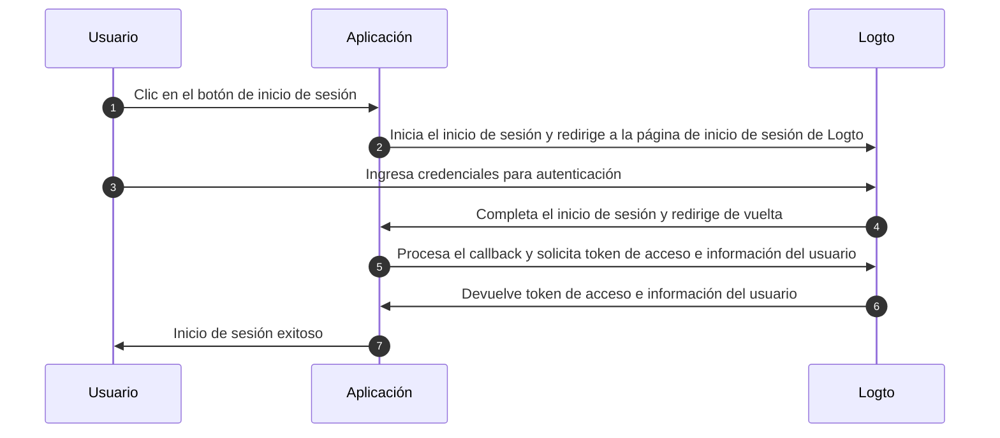
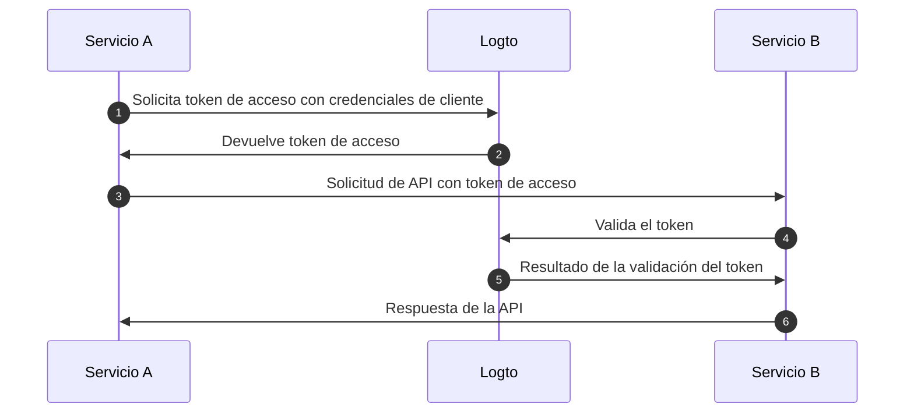
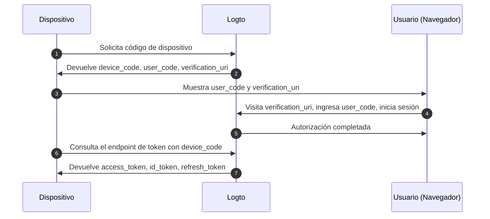
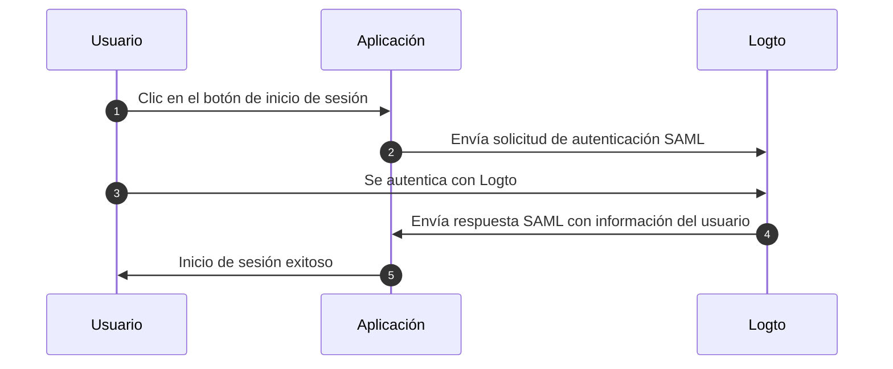

# Comprende el flujo de autenticación OIDC

Logto está construido sobre los estándares [OAuth 2.0](https://auth.wiki/oauth-2.0) y [OpenID Connect (OIDC)](https://auth.wiki/openid-connect). Comprender estos estándares de autenticación hará que el proceso de integración sea más fluido y sencillo.

### Flujo de autenticación de usuario \{#user-authentication-flow}

Esto es lo que sucede cuando un usuario inicia sesión con Logto:

```mermaid
sequenceDiagram
    autonumber
    participant Usuario
    participant Aplicación
    participant Logto

    Usuario->>Aplicación: Clic en el botón de inicio de sesión
    Aplicación->>Logto: Inicia el inicio de sesión y redirige a la página de inicio de sesión de Logto
    Usuario->>Logto: Ingresa credenciales para autenticación
    Logto->>Aplicación: Completa el inicio de sesión y redirige de vuelta
    Aplicación->>Logto: Procesa el callback y solicita token de acceso e información del usuario
    Logto->>Aplicación: Devuelve token de acceso e información del usuario
    Aplicación->>Usuario: Inicio de sesión exitoso
```

En este flujo, varios conceptos clave son esenciales para el proceso de integración:

- `Aplicación`: Esto representa tu app en Logto. Crearás una configuración de aplicación en la Consola de Logto para establecer una conexión entre tu aplicación real y los servicios de Logto. Aprende más sobre [Aplicación](/integrate-logto/application-data-structure/#introduction).
- `Redirect URI`: Después de que los usuarios completen la autenticación en la página de inicio de sesión de Logto, Logto los redirige de vuelta a tu aplicación a través de este URI. Deberás configurar el Redirect URI en la configuración de tu Aplicación. Para más detalles, consulta [Redirect URIs](/integrate-logto/application-data-structure/#redirect-uris).
- `Procesar el callback de inicio de sesión`: Cuando Logto redirige a los usuarios de vuelta a tu aplicación, tu app necesita procesar los datos de autenticación y solicitar tokens de acceso e información del usuario. No te preocupes: el SDK de Logto maneja esto automáticamente.

Esta visión general cubre lo esencial para una integración rápida. Para una comprensión más profunda, consulta nuestra guía [Experiencia de inicio de sesión explicada](/concepts/sign-in-experience/).

### Flujo de autenticación máquina a máquina \{#machine-to-machine-authentication-flow}

Logto proporciona el tipo de [aplicación máquina a máquina (M2M)](/quick-starts/m2m) para habilitar la autenticación directa entre servicios, basada en el [flujo de credenciales de cliente de OAuth 2.0](https://auth.wiki/client-credentials-flow):

```mermaid
sequenceDiagram
    autonumber
    participant Servicio A
    participant Logto
    participant Servicio B

    Servicio A->>Logto: Solicita token de acceso con credenciales de cliente
    Logto->>Servicio A: Devuelve token de acceso
    Servicio A->>Servicio B: Solicitud de API con token de acceso
    Servicio B->>Logto: Valida el token
    Logto->>Servicio B: Resultado de la validación del token
    Servicio B->>Servicio A: Respuesta de la API
```

Este flujo de autenticación máquina a máquina (M2M) está diseñado para aplicaciones que necesitan comunicarse directamente con recursos sin interacción del usuario (por lo tanto, sin interfaz gráfica), como un servicio de API que actualiza datos de usuario en Logto o un servicio de estadísticas que extrae pedidos diarios.

En este flujo, los servicios se autentican usando credenciales de cliente: una combinación de [ID de aplicación](/integrate-logto/application-data-structure/#application-id) y [Secreto de aplicación](/integrate-logto/application-data-structure/#application-secret) que identifica y autentica de manera única al servicio. Estas credenciales sirven como la identidad del servicio al solicitar [tokens de acceso](https://auth.wiki/access-token) a Logto.

### Flujo de dispositivo (dispositivos con entrada limitada) \{#device-flow}

Para dispositivos con capacidades de entrada limitadas (por ejemplo, televisores inteligentes, consolas de juegos, herramientas CLI, dispositivos IoT), Logto admite el [OAuth 2.0 Device Authorization Grant](https://auth.wiki/device-flow). El dispositivo muestra un código y una URL, mientras que el usuario completa la autenticación en otro dispositivo con navegador:

```mermaid
sequenceDiagram
    autonumber
    participant Dispositivo
    participant Logto
    participant Usuario as Usuario (Navegador)

    Dispositivo->>Logto: Solicita código de dispositivo
    Logto->>Dispositivo: Devuelve device_code, user_code, verification_uri
    Dispositivo->>Usuario: Muestra user_code y verification_uri
    Usuario->>Logto: Visita verification_uri, ingresa user_code, inicia sesión
    Logto->>Usuario: Autorización completada
    Dispositivo->>Logto: Consulta el endpoint de token con device_code
    Logto->>Dispositivo: Devuelve access_token, id_token, refresh_token
```

En este flujo:

- El dispositivo solicita un código de dispositivo a Logto, recibiendo un breve `user_code` y un `verification_uri`.
- El usuario visita la URL de verificación en otro dispositivo (teléfono, portátil), ingresa el código e inicia sesión.
- El dispositivo consulta el endpoint de token hasta que el usuario complete la autorización, y luego recibe los tokens.

A diferencia del flujo estándar de usuario, el flujo de dispositivo no requiere Redirect URIs ni capacidades de navegador en el propio dispositivo. Aprende más en el [inicio rápido del flujo de dispositivo](/quick-starts/device-flow).

### Flujo de autenticación SAML \{#saml-authentication-flow}

Además de OAuth 2.0 y OIDC, Logto también admite autenticación SAML (Security Assertion Markup Language), actuando como Proveedor de Identidad (IdP) para permitir la integración con aplicaciones empresariales. Actualmente, Logto admite el flujo de autenticación iniciado por el SP:

#### Flujo iniciado por el SP \{#saml-authentication-flow-sp-init}

En el flujo iniciado por el SP, el proceso de autenticación comienza desde el Proveedor de Servicios (tu aplicación):

```mermaid
sequenceDiagram
    autonumber
    participant Usuario
    participant Aplicación
    participant Logto

    Usuario->>Aplicación: Clic en el botón de inicio de sesión
    Aplicación->>Logto: Envía solicitud de autenticación SAML
    Usuario->>Logto: Se autentica con Logto
    Logto->>Aplicación: Envía respuesta SAML con información del usuario
    Aplicación->>Usuario: Inicio de sesión exitoso
```

En este flujo:

- El usuario inicia el proceso de autenticación desde tu aplicación (Proveedor de Servicios)
- Tu aplicación genera una solicitud SAML y redirige al usuario a Logto (Proveedor de Identidad)
- Tras la autenticación exitosa en Logto, se envía una respuesta SAML de vuelta a tu aplicación
- Tu aplicación procesa la respuesta SAML y completa la autenticación

#### Flujo iniciado por el IdP \{#saml-authentication-flow-idp-init}

Logto admitirá el flujo iniciado por el IdP en futuras versiones, permitiendo a los usuarios iniciar el proceso de autenticación directamente desde el portal de Logto. Mantente atento a las actualizaciones sobre esta función.

Esta integración SAML permite que las aplicaciones empresariales aprovechen Logto como su proveedor de identidad, admitiendo tanto proveedores de servicios modernos como aquellos basados en SAML heredado.

## Recursos relacionados \{#related-resources}

<Url href="https://blog.logto.io/secure-cloud-apps-with-oauth-and-openid-connect">
  Blog: Asegura aplicaciones en la nube con OAuth 2.0 y OpenID Connect
</Url>

<Url href="https://blog.logto.io/sso-is-better">
  Por qué el inicio de sesión único (SSO) para múltiples aplicaciones es mejor
</Url>

<Url href="https://blog.logto.io/centralized-identity-system">
  Por qué necesitas un sistema de identidad centralizado para un negocio multi-aplicación
</Url>
