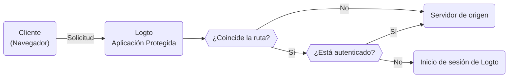

# Aplicación Protegida

La Aplicación Protegida está diseñada para eliminar la complejidad de las [integraciones de SDK](/quick-starts) separando la capa de [autenticación](https://auth.wiki/authentication) de tu aplicación. Nosotros manejamos la autenticación, permitiéndote enfocarte en tu funcionalidad principal. Una vez que un usuario está autenticado, la Aplicación Protegida sirve el contenido desde tu servidor.

## Cómo funciona la Aplicación Protegida

La Aplicación Protegida, impulsada por Cloudflare, opera globalmente en redes de borde, asegurando baja latencia y alta disponibilidad para tu aplicación.

La Aplicación Protegida mantiene el estado de la sesión y la información del usuario. Si un usuario no está autenticado, la Aplicación Protegida lo redirige a la página de inicio de sesión. Una vez autenticado, la Aplicación Protegida envuelve la solicitud del usuario con autenticación e información del usuario, y luego la reenvía al servidor de origen.

Este proceso se visualiza en el siguiente diagrama de flujo:



## Protege tu servidor de origen

El servidor de origen, que podría ser un dispositivo físico o virtual no propiedad de la Aplicación Protegida de Logto, es donde reside el contenido de tu aplicación. Similar a un servidor de Red de Entrega de Contenido (CDN), la Aplicación Protegida gestiona los procesos de autenticación y recupera contenido de tu servidor de origen. Por lo tanto, si los usuarios obtienen acceso directo a tu servidor de origen, pueden eludir la autenticación y tu aplicación ya no está protegida.

Por lo tanto, es importante asegurar las conexiones de origen, ya que previene que los atacantes descubran y accedan a tu servidor de origen sin autenticación. Hay varias maneras de hacer esto:

1. Validación de Cabecera HTTP
2. Validación de JSON Web Tokens (JWT)

### Validación de Cabecera HTTP

Asegurar tu servidor de origen se puede lograr utilizando [Autenticación Básica HTTP](https://developer.mozilla.org/en-US/docs/Web/HTTP/Authentication#basic_authentication_scheme) para asegurar tu servidor de origen.

Cada solicitud de la Aplicación Protegida incluye la siguiente cabecera:

```
Authorization: Basic base64(appId:appSecret)
```

Al validar esta cabecera, puedes confirmar que la solicitud proviene de la Aplicación Protegida y negar cualquier solicitud que no incluya esta cabecera.

Si estás usando Nginx o Apache, puedes consultar las siguientes guías para implementar la Autenticación Básica HTTP en tu servidor de origen:

1. Nginx: [Configuración de Autenticación Básica HTTP](https://docs.nginx.com/nginx/admin-guide/security-controls/configuring-http-basic-authentication/)
2. Apache: [Autenticación y Autorización](https://httpd.apache.org/docs/2.4/howto/auth.html)

Para verificar las cabeceras dentro de tu aplicación, consulta el [ejemplo de Autenticación Básica HTTP](https://developers.cloudflare.com/workers/examples/basic-auth/) proporcionado por Cloudflare para aprender cómo restringir el acceso utilizando el esquema Básico HTTP.

### Validación de JSON Web Tokens (JWT)

Otra forma de asegurar tu servidor de origen es utilizando JSON Web Tokens (JWT).

Cada solicitud autenticada de la Aplicación Protegida incluye la siguiente cabecera:

```
Logto-ID-Token: <JWT>
```

El JWT se llama [Token de ID](https://auth.wiki/id-token) que está firmado por Logto y contiene información del usuario. Al validar este JWT, puedes confirmar que la solicitud proviene de la Aplicación Protegida y negar cualquier solicitud que no incluya esta cabecera.

El token está encriptado y firmado como un token [JWS](https://auth.wiki/jws).

Los pasos de validación:

1. [Validación de un JWT](https://datatracker.ietf.org/doc/html/rfc7519#section-7.2)
2. [Validación de la firma JWS](https://datatracker.ietf.org/doc/html/rfc7515#section-5.2)
3. El emisor del token es `https://<tu-dominio-logto>/oidc` (emitido por tu servidor de autenticación Logto)

```js
const express = require('express');
const jwksClient = require('jwks-rsa');
const jwt = require('jsonwebtoken');

const ISSUER = 'https://<tu-dominio-logto>/oidc';
const CERTS_URL = 'https://<tu-dominio-logto>/oidc/jwks';

const client = jwksClient({
  jwksUri: CERTS_URL,
});

const getKey = (header, callback) => {
  client.getSigningKey(header.kid, function (err, key) {
    callback(err, key?.getPublicKey());
  });
};

const verifyToken = (req, res, next) => {
  const token = req.headers['Logto-ID-Token'];

  // Asegúrate de que la solicitud entrante tenga nuestra cabecera de token
  if (!token) {
    return res
      .status(403)
      .send({ status: false, message: 'falta la cabecera requerida Logto-ID-Token' });
  }

  jwt.verify(token, getKey, { issuer: ISSUER }, (err, decoded) => {
    if (err) {
      return res.status(403).send({ status: false, message: 'token de id inválido' });
    }

    req.user = decoded;
    next();
  });
};

const app = express();

app.use(verifyToken);

app.get('/', (req, res) => {
  res.send('¡Hola Mundo!');
});

app.listen(3000);
```

## Obtener el estado de autenticación e información del usuario

Si necesitas obtener la autenticación e información del usuario para tu aplicación, también puedes usar la cabecera `Logto-ID-Token`.

Si solo deseas decodificar el token, puedes usar el siguiente código:

```js
const express = require('express');

const decodeIdToken = (req, res, next) => {
  const token = req.headers['Logto-ID-Token'];

  if (!token) {
    return res.status(403).send({
      status: false,
      message: 'falta la cabecera requerida Logto-ID-Token',
    });
  }

  const parts = token.split('.');
  if (parts.length !== 3) {
    throw new Error('Token de ID inválido');
  }

  const payload = parts[1];
  const decodedPayload = atob(payload.replace(/-/g, '+').replace(/_/g, '/'));
  const claims = JSON.parse(decodedPayload);

  req.user = claims;
  next();
};

const app = express();

app.use(decodeIdToken);

app.get('/', (req, res) => {
  res.json(req.user);
});

app.listen(3000);
```

## Obtener el host original

Si necesitas obtener el host original solicitado por el cliente, puedes usar la cabecera `Logto-Host` o `x-forwarded-host`.

## Personalizar reglas de autenticación

Por defecto, la Aplicación Protegida protegerá todas las rutas. Si necesitas personalizar las reglas de autenticación, puedes configurar el campo "Reglas de autenticación personalizadas" en la Consola.

Admite expresiones regulares, aquí hay dos escenarios de caso:

1. Para proteger solo las rutas `/admin` y `/privacy` con autenticación: `^/(admin|privacy)/.*`
2. Para excluir imágenes JPG de la autenticación: `^(?!.*\.jpg$).*$`

## Desarrollo local

La Aplicación Protegida está diseñada para trabajar con tu servidor de origen. Sin embargo, si tu servidor de origen no es accesible públicamente, puedes usar una herramienta como [ngrok](https://ngrok.com/) o [Cloudflare Tunnels](https://developers.cloudflare.com/pages/how-to/preview-with-cloudflare-tunnel/) para exponer tu servidor local a internet.

## Transición a la integración de SDK

La Aplicación Protegida está diseñada para simplificar el proceso de autenticación. Sin embargo, si decides hacer la transición a la integración de SDK para un mejor control y personalización, puedes [crear una nueva aplicación](/integrate-logto/integrate-logto-into-your-application) en Logto y configurar la [integración de SDK](/quick-starts). Y para una transición sin problemas, puedes reutilizar las configuraciones de la aplicación de la Aplicación Protegida. La Aplicación Protegida es en realidad una "Aplicación Web Tradicional" en Logto, puedes encontrar el "[AppId](/integrate-logto/application-data-structure#application-id)" y el "[AppSecret](/integrate-logto/application-data-structure#application-secret)" en la configuración de la aplicación. Una vez que la transición esté completa, puedes eliminar la Aplicación Protegida de tu aplicación.
