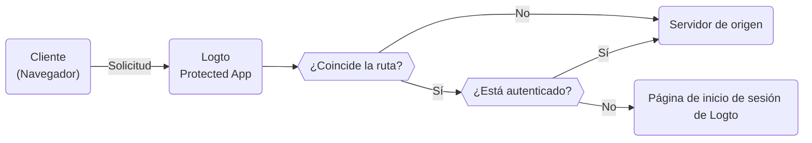

# Protected App — Integración de autenticación sin SDK

La Protected App está diseñada para eliminar la complejidad de las [integraciones con SDK](/quick-starts) separando la capa de [autenticación](https://auth.wiki/authentication) de tu aplicación. Nosotros gestionamos la autenticación, permitiéndote centrarte en tu funcionalidad principal. Una vez que un usuario está autenticado, la Protected App sirve el contenido desde tu servidor.

## Cómo funciona Protected App \{#how-protected-app-works}

La Protected App, impulsada por Cloudflare, opera globalmente en redes edge, asegurando baja latencia y alta disponibilidad para tu aplicación.

La Protected App mantiene el estado de la sesión y la información del usuario. Si un usuario no está autenticado, la Protected App lo redirige a la página de inicio de sesión. Una vez autenticado, la Protected App envuelve la solicitud del usuario con la autenticación e información del usuario, y luego la reenvía al servidor de origen.

Para restringir qué usuarios autenticados pueden acceder a una Protected App, configura el [control de acceso a nivel de aplicación](/authorization/app-level-access-control) en la pestaña **Rules** de la aplicación.

Este proceso se visualiza en el siguiente diagrama de flujo:


```mermaid
graph LR
  A("Cliente<br/>(Navegador)") -->|Solicitud| B(Logto<br/>Protected App)
  B --> Condition{{¿Coincide la ruta?<br/>}}
  Condition -->|Sí| Matched{{¿Está autenticado?<br/>}}
  Matched -->|Sí| C(Servidor de origen)
  Matched -->|No| D(Página de inicio de sesión de Logto)
  Condition -->|No| C
```

## Protege tu servidor de origen \{#protect-your-origin-server}

El servidor de origen, que puede ser un dispositivo físico o virtual que no es propiedad de la Protected App de Logto, es donde reside el contenido de tu aplicación. Similar a un servidor de Content Delivery Network (CDN), la Protected App gestiona los procesos de autenticación y recupera el contenido de tu servidor de origen. Por lo tanto, si los usuarios obtienen acceso directo a tu servidor de origen, pueden eludir la autenticación y tu aplicación deja de estar protegida.

Por eso es importante asegurar las conexiones al origen, ya que previene que los atacantes descubran y accedan a tu servidor de origen sin autenticación. Hay varias formas de hacerlo:

1. Validación de cabecera HTTP
2. Validación de JSON Web Tokens (JWT)

### Validación de cabecera HTTP \{#http-header-validation}

Proteger tu servidor de origen se puede lograr usando [HTTP Basic Authentication](https://developer.mozilla.org/en-US/docs/Web/HTTP/Authentication#basic_authentication_scheme).

Cada solicitud desde la Protected App incluye la siguiente cabecera:

```
Authorization: Basic base64(appId:appSecret)
```

Validando esta cabecera, puedes confirmar que la solicitud proviene de la Protected App y denegar cualquier solicitud que no incluya esta cabecera.

Si usas Nginx o Apache, puedes consultar las siguientes guías para implementar HTTP Basic Authentication en tu servidor de origen:

1. Nginx: [Configurar autenticación HTTP Basic](https://docs.nginx.com/nginx/admin-guide/security-controls/configuring-http-basic-authentication/)
2. Apache: [Authentication and Authorization](https://httpd.apache.org/docs/2.4/howto/auth.html)

Para comprobar las cabeceras dentro de tu aplicación, consulta el [ejemplo de HTTP Basic Authentication](https://developers.cloudflare.com/workers/examples/basic-auth/) proporcionado por Cloudflare para aprender cómo restringir el acceso usando el esquema HTTP Basic.

### Validación de JSON Web Tokens (JWT) \{#json-web-tokens-jwt-validation}

Otra forma de proteger tu servidor de origen es usando JSON Web Tokens (JWT).

Cada solicitud autenticada desde la Protected App incluye la siguiente cabecera:

```
Logto-ID-Token: <JWT>
```

El JWT se llama [Token de ID (ID token)](https://auth.wiki/id-token), está firmado por Logto y contiene información del usuario. Validando este JWT, puedes confirmar que la solicitud proviene de la Protected App y denegar cualquier solicitud que no incluya esta cabecera.

El token está cifrado y firmado como un token [JWS](https://auth.wiki/jws).

Los pasos de validación:

1. [Validar un JWT](https://datatracker.ietf.org/doc/html/rfc7519#section-7.2)
2. [Validar la firma JWS](https://datatracker.ietf.org/doc/html/rfc7515#section-5.2)
3. El emisor del token es `https://<your-logto-domain>/oidc` (emitido por tu servidor de autenticación Logto)

```js
const express = require('express');
const jwksClient = require('jwks-rsa');
const jwt = require('jsonwebtoken');

const ISSUER = 'https://<your-logto-domain>/oidc';
const CERTS_URL = 'https://<your-logto-domain>/oidc/jwks';

const client = jwksClient({
  jwksUri: CERTS_URL,
});

const getKey = (header, callback) => {
  client.getSigningKey(header.kid, function (err, key) {
    callback(err, key?.getPublicKey());
  });
};

const verifyToken = (req, res, next) => {
  const token = req.headers['Logto-ID-Token'];

  // Asegúrate de que la solicitud entrante tenga nuestra cabecera de token
  if (!token) {
    return res
      .status(403)
      .send({ status: false, message: 'falta la cabecera requerida Logto-ID-Token' });
  }

  jwt.verify(token, getKey, { issuer: ISSUER }, (err, decoded) => {
    if (err) {
      return res.status(403).send({ status: false, message: 'token de ID inválido' });
    }

    req.user = decoded;
    next();
  });
};

const app = express();

app.use(verifyToken);

app.get('/', (req, res) => {
  res.send('¡Hola Mundo!');
});

app.listen(3000);
```

## Obtener el estado de autenticación e información del usuario \{#get-authentication-state-and-user-information}

Si necesitas obtener la autenticación y la información del usuario para tu aplicación, también puedes usar la cabecera `Logto-ID-Token`.

Si solo quieres decodificar el token, puedes usar el siguiente código:

```js
const express = require('express');

const decodeIdToken = (req, res, next) => {
  const token = req.headers['Logto-ID-Token'];

  if (!token) {
    return res.status(403).send({
      status: false,
      message: 'falta la cabecera requerida Logto-ID-Token',
    });
  }

  const parts = token.split('.');
  if (parts.length !== 3) {
    throw new Error('Token de ID inválido');
  }

  const payload = parts[1];
  const decodedPayload = atob(payload.replace(/-/g, '+').replace(/_/g, '/'));
  const claims = JSON.parse(decodedPayload);

  req.user = claims;
  next();
};

const app = express();

app.use(decodeIdToken);

app.get('/', (req, res) => {
  res.json(req.user);
});

app.listen(3000);
```

## Personalizar los reclamos del token de ID \{#customize-id-token-claims}

Por defecto, la cabecera `Logto-ID-Token` incluye los reclamos estándar de OIDC (por ejemplo, `sub`, `name` y `email`). Para incluir [reclamos extendidos](/developers/custom-id-token#extended-claims) como roles o datos de organización, se deben configurar ambos:

1. **Conmutador del tenant**: Habilita el reclamo en <CloudLink to="/customize-jwt">Console > Custom JWT > ID token</CloudLink>.
2. **Scopes de Protected App**: En la configuración de tu Protected App, selecciona el scope correspondiente en **ID token claims** > **Additional scopes**.

Los reclamos extendidos se incluyen en el token de ID reenviado solo cuando el reclamo está habilitado en Custom JWT y el scope correspondiente está seleccionado para la Protected App. Consulta [Token de ID personalizado](/developers/custom-id-token) para la lista completa de scopes y reclamos extendidos.

| Alcance (Scope)                      | Reclamos (Claims)                    |
| ------------------------------------ | ------------------------------------ |
| `custom_data`                        | `custom_data`                        |
| `identities`                         | `identities`, `sso_identities`       |
| `roles`                              | `roles`                              |
| `urn:logto:scope:organizations`      | `organizations`, `organization_data` |
| `urn:logto:scope:organization_roles` | `organization_roles`                 |

## Obtener el host original \{#get-the-original-host}

Si necesitas obtener el host original solicitado por el cliente, puedes usar la cabecera `Logto-Host` o `x-forwarded-host`.

## Personalizar las reglas de autenticación \{#customize-authentication-rules}

Por defecto, la Protected App protegerá todas las rutas. Si necesitas personalizar las reglas de autenticación, puedes establecer el campo "Custom authentication rules" en la Console.

Soporta expresiones regulares, aquí tienes dos escenarios de ejemplo:

1. Para proteger solo las rutas `/admin` y `/privacy` con autenticación: `^/(admin|privacy)/.*`
2. Para excluir imágenes JPG de la autenticación: `^(?!.*\.jpg$).*$`

## Desarrollo local \{#local-development}

La Protected App está diseñada para funcionar con tu servidor de origen. Sin embargo, si tu servidor de origen no es accesible públicamente, puedes usar una herramienta como [ngrok](https://ngrok.com/) o [Cloudflare Tunnels](https://developers.cloudflare.com/pages/how-to/preview-with-cloudflare-tunnel/) para exponer tu servidor local a internet.

## Transición a integración con SDK \{#transition-to-sdk-integration}

La Protected App está diseñada para simplificar el proceso de autenticación. Sin embargo, si decides pasar a una integración con SDK para un mayor control y personalización, puedes [crear una nueva aplicación](/integrate-logto/integrate-logto-into-your-application) en Logto y configurar la [integración con SDK](/quick-starts). Y para una transición fluida, puedes reutilizar la configuración de la aplicación de la Protected App. La Protected App es en realidad una "Traditional Web App" en Logto, puedes encontrar el "[AppId](/integrate-logto/application-data-structure#application-id)" y el "[AppSecret](/integrate-logto/application-data-structure#application-secret)" en la configuración de la aplicación. Una vez completada la transición, puedes eliminar la Protected App de tu aplicación.

## Recursos relacionados \{#related-resources}

<Url href="https://www.youtube.com/watch?v=ZBrXW3iZyKY">
  Protected App: Construye la autenticación de tu app en unos clics. Sin código.
</Url>

<Url href="https://blog.logto.io/protected-app">La motivación detrás de Protected App</Url>

<Url href="https://blog.logto.io/fastest-way-to-build-auth-system">
  La forma más rápida de construir un sistema de autenticación
</Url>
