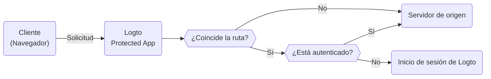

# Protected App — Integración de autenticación sin SDK

La Protected App está diseñada para eliminar la complejidad de las [integraciones de SDK](/quick-starts) separando la [autenticación](https://auth.wiki/authentication) de tu aplicación. Nosotros manejamos la autenticación, permitiéndote enfocarte en tu funcionalidad principal. Una vez que un usuario está autenticado, la Protected App sirve el contenido desde tu servidor.

## Cómo funciona Protected App \{#how-protected-app-works}

La Protected App, impulsada por Cloudflare, opera globalmente en redes de borde, asegurando baja latencia y alta disponibilidad para tu aplicación.

La Protected App mantiene el estado de la sesión y la información del usuario. Si un usuario no está autenticado, la Protected App lo redirige a la página de inicio de sesión. Una vez autenticado, la Protected App envuelve la solicitud del usuario con autenticación e información del usuario, y luego la reenvía al servidor de origen.

Este proceso se visualiza en el siguiente diagrama de flujo:



## Protege tu servidor de origen \{#protect-your-origin-server}

El servidor de origen, que podría ser un dispositivo físico o virtual no propiedad de la Protected App de Logto, es donde reside el contenido de tu aplicación. Similar a un servidor de Content Delivery Network (CDN), la Protected App gestiona los procesos de autenticación y recupera contenido de tu servidor de origen. Por lo tanto, si los usuarios obtienen acceso directo a tu servidor de origen, pueden eludir la autenticación y tu aplicación ya no está protegida.

Por lo tanto, es importante asegurar las conexiones de origen, ya que previene que los atacantes descubran y accedan a tu servidor de origen sin autenticación. Hay varias maneras de hacer esto:

1. Validación de cabeceras HTTP
2. Validación de JSON Web Tokens (JWT)

### Validación de cabeceras HTTP \{#http-header-validation}

Asegurar tu servidor de origen se puede lograr usando [HTTP Basic Authentication](https://developer.mozilla.org/en-US/docs/Web/HTTP/Authentication#basic_authentication_scheme) para asegurar tu servidor de origen.

Cada solicitud de la Protected App incluye la siguiente cabecera:

```
Authorization: Basic base64(appId:appSecret)
```

Al validar esta cabecera, puedes confirmar que la solicitud proviene de la Protected App y negar cualquier solicitud que no incluya esta cabecera.

Si estás usando Nginx o Apache, puedes consultar las siguientes guías para implementar HTTP Basic Authentication en tu servidor de origen:

1. Nginx: [Configuring HTTP Basic Authentication](https://docs.nginx.com/nginx/admin-guide/security-controls/configuring-http-basic-authentication/)
2. Apache: [Authentication and Authorization](https://httpd.apache.org/docs/2.4/howto/auth.html)

Para verificar las cabeceras dentro de tu aplicación, consulta el [ejemplo de HTTP Basic Authentication](https://developers.cloudflare.com/workers/examples/basic-auth/) proporcionado por Cloudflare para aprender cómo restringir el acceso usando el esquema HTTP Basic.

### Validación de JSON Web Tokens (JWT) \{#json-web-tokens-jwt-validation}

Otra forma de asegurar tu servidor de origen es usando JSON Web Tokens (JWT).

Cada solicitud autenticada de la Protected App incluye la siguiente cabecera:

```
Logto-ID-Token: <JWT>
```

El JWT se llama [Token de ID](https://auth.wiki/id-token) que está firmado por Logto y contiene información del usuario. Al validar este JWT, puedes confirmar que la solicitud proviene de la Protected App y negar cualquier solicitud que no incluya esta cabecera.

El token está encriptado y firmado como un token [JWS](https://auth.wiki/jws).

Los pasos de validación:

1. [Validar un JWT](https://datatracker.ietf.org/doc/html/rfc7519#section-7.2)
2. [Validar la firma JWS](https://datatracker.ietf.org/doc/html/rfc7515#section-5.2)
3. El emisor del token es `https://<your-logto-domain>/oidc` (emitido por tu servidor de autenticación Logto)

```js
const express = require('express');
const jwksClient = require('jwks-rsa');
const jwt = require('jsonwebtoken');

const ISSUER = 'https://<your-logto-domain>/oidc';
const CERTS_URL = 'https://<your-logto-domain>/oidc/jwks';

const client = jwksClient({
  jwksUri: CERTS_URL,
});

const getKey = (header, callback) => {
  client.getSigningKey(header.kid, function (err, key) {
    callback(err, key?.getPublicKey());
  });
};

const verifyToken = (req, res, next) => {
  const token = req.headers['Logto-ID-Token'];

  // Asegúrate de que la solicitud entrante tenga nuestra cabecera de token
  if (!token) {
    return res
      .status(403)
      .send({ status: false, message: 'falta la cabecera requerida Logto-ID-Token' });
  }

  jwt.verify(token, getKey, { issuer: ISSUER }, (err, decoded) => {
    if (err) {
      return res.status(403).send({ status: false, message: 'token de ID inválido' });
    }

    req.user = decoded;
    next();
  });
};

const app = express();

app.use(verifyToken);

app.get('/', (req, res) => {
  res.send('¡Hola Mundo!');
});

app.listen(3000);
```

## Obtener el estado de autenticación e información del usuario \{#get-authentication-state-and-user-information}

Si necesitas obtener la autenticación y la información del usuario para tu aplicación, también puedes usar la cabecera `Logto-ID-Token`.

Si solo deseas decodificar el token, puedes usar el siguiente código:

```js
const express = require('express');

const decodeIdToken = (req, res, next) => {
  const token = req.headers['Logto-ID-Token'];

  if (!token) {
    return res.status(403).send({
      status: false,
      message: 'falta la cabecera requerida Logto-ID-Token',
    });
  }

  const parts = token.split('.');
  if (parts.length !== 3) {
    throw new Error('Token de ID inválido');
  }

  const payload = parts[1];
  const decodedPayload = atob(payload.replace(/-/g, '+').replace(/_/g, '/'));
  const claims = JSON.parse(decodedPayload);

  req.user = claims;
  next();
};

const app = express();

app.use(decodeIdToken);

app.get('/', (req, res) => {
  res.json(req.user);
});

app.listen(3000);
```

## Obtener el host original \{#get-the-original-host}

Si necesitas obtener el host original solicitado por el cliente, puedes usar la cabecera `Logto-Host` o `x-forwarded-host`.

## Personalizar reglas de autenticación \{#customize-authentication-rules}

Por defecto, la Protected App protegerá todas las rutas. Si necesitas personalizar las reglas de autenticación, puedes establecer el campo "Reglas de autenticación personalizadas" en la Consola.

Soporta expresiones regulares, aquí hay dos escenarios de caso:

1. Para proteger solo las rutas `/admin` y `/privacy` con autenticación: `^/(admin|privacy)/.*`
2. Para excluir imágenes JPG de la autenticación: `^(?!.*\.jpg$).*$`

## Desarrollo local \{#local-development}

La Protected App está diseñada para trabajar con tu servidor de origen. Sin embargo, si tu servidor de origen no es accesible públicamente, puedes usar una herramienta como [ngrok](https://ngrok.com/) o [Cloudflare Tunnels](https://developers.cloudflare.com/pages/how-to/preview-with-cloudflare-tunnel/) para exponer tu servidor local a internet.

## Transición a la integración con SDK \{#transition-to-sdk-integration}

La Protected App está diseñada para simplificar el proceso de autenticación. Sin embargo, si decides hacer la transición a la integración con SDK para un mejor control y personalización, puedes [crear una nueva aplicación](/integrate-logto/integrate-logto-into-your-application) en Logto y configurar la [integración con SDK](/quick-starts). Y para una transición sin problemas, puedes reutilizar las configuraciones de la aplicación de la Protected App. La Protected App es en realidad una "Aplicación Web Tradicional" en Logto, puedes encontrar el "[AppId](/integrate-logto/application-data-structure#application-id)" y el "[AppSecret](/integrate-logto/application-data-structure#application-secret)" en la configuración de la aplicación. Una vez que la transición esté completa, puedes eliminar la Protected App de tu aplicación.

## Recursos relacionados \{#related-resources}

<Url href="https://www.youtube.com/watch?v=ZBrXW3iZyKY">
  Protected App: Construye la autenticación de tu aplicación en clics. No se requiere código.
</Url>

<Url href="https://blog.logto.io/protected-app">La motivación detrás de Protected App</Url>

<Url href="https://blog.logto.io/fastest-way-to-build-auth-system">
  La forma más rápida de construir un sistema de autenticación
</Url>
