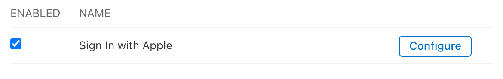

import GuideTip from '../../fragments/_guide-tip.mdx';

# Configura el inicio de sesión social con Apple

El conector oficial de Logto para el inicio de sesión social de Apple.

<GuideTip />

## Comenzar

Si no conoces el concepto del conector o no sabes cómo agregar este conector a tu experiencia de inicio de sesión, consulta el [tutorial de Logto](/connectors/social-connectors).

> ℹ️ **Nota**
>
> El inicio de sesión de Apple es obligatorio para AppStore si tienes otros métodos de inicio de sesión social en tu aplicación.
> Tener inicio de sesión de Apple en dispositivos Android es excelente si también ofreces una aplicación para Android.

Necesitas inscribirte en el [Programa de Desarrolladores de Apple](https://developer.apple.com/programs/) antes de continuar.

### Habilitar Iniciar sesión con Apple para tu aplicación

> ⚠️ **Precaución**
>
> Incluso si deseas implementar Iniciar sesión con Apple solo en una aplicación web, aún necesitas tener una aplicación existente que abrace el ecosistema de AppStore (es decir, tener un ID de aplicación válido).

Puedes hacerlo a través de Xcode -> Configuración del proyecto -> Firmado y Capacidades, o visitar [Certificados, Identificadores y Perfiles](https://developer.apple.com/account/resources/identifiers/list/bundleId).

Consulta la sección "Habilitar un ID de aplicación" en los [documentos oficiales de Apple](https://developer.apple.com/documentation/sign_in_with_apple/configuring_your_environment_for_sign_in_with_apple) para más información.

### Crear un identificador

1. Visita [Certificados, Identificadores y Perfiles](https://developer.apple.com/account/resources/identifiers/list/serviceId), luego haz clic en el botón "+" junto a "Identificador".
2. En la página "Registrar un nuevo identificador", elige "IDs de servicios" y haz clic en "Continuar".
3. Completa "Descripción" e "Identificador" (por ejemplo, `Logto Test` y `io.logto.test`), luego haz clic en "Continuar".
4. Verifica la información y haz clic en "Registrar".

### Habilitar Iniciar sesión con Apple para tu identificador

Haz clic en el identificador que acabas de crear. Marca "Iniciar sesión con Apple" en la página de detalles y haz clic en "Configurar".

En el modal que se abre, selecciona el ID de aplicación que acabas de habilitar para Iniciar sesión con Apple.

Ingresa el dominio de tu instancia de Logto sin protocolo ni puerto, por ejemplo, `your.logto.domain`; luego ingresa la "URL de retorno" (es decir, URI de redirección), que es la URL de Logto con `/callback/${connector_id}`, por ejemplo, `https://your.logto.domain/callback/apple-universal`. Puedes obtener el `connector_id` generado aleatoriamente después de crear el conector de Apple en la Consola de Administración.

Haz clic en "Siguiente" y luego en "Hecho" para cerrar el modal. Haz clic en "Continuar" en la esquina superior derecha, luego haz clic en "Guardar" para guardar tu configuración.

> ⚠️ **Precaución**
>
> Apple NO permite URLs de retorno con protocolo HTTP y dominio `localhost`.
>
> Si deseas probar localmente, necesitas editar el archivo `/etc/hosts` para mapear localhost a un dominio personalizado y configurar un entorno HTTPS local. [mkcert](https://github.com/FiloSottile/mkcert) puede ayudarte a configurar HTTPS local.

## Configurar alcance

Para obtener el correo electrónico del usuario de Apple, necesitas configurar el alcance para incluir `email`. Para obtener tanto el correo electrónico como el nombre, puedes usar `name email` como el alcance. Consulta los [documentos oficiales de Apple](https://developer.apple.com/documentation/sign_in_with_apple/sign_in_with_apple_js/incorporating_sign_in_with_apple_into_other_platforms#3332113) para más información.

> ℹ️ **Nota**
>
> El usuario puede optar por ocultar su dirección de correo electrónico de tu aplicación. En este caso, no podrás recuperar la dirección de correo electrónico real. En su lugar, se devolverá una dirección de correo electrónico como `random@privaterelay.appleid.com`.

### Trampas al configurar el alcance

Si has configurado tu aplicación para solicitar direcciones de correo electrónico de los usuarios después de que ya hayan iniciado sesión con Apple, no podrás recuperar las direcciones de correo electrónico de esos usuarios existentes, incluso si inician sesión nuevamente usando Apple ID. Para solucionar esto, necesitas instruir a tus usuarios para que visiten la [página de gestión de cuentas de Apple ID](https://appleid.apple.com/account/manage) y eliminen tu aplicación de la sección "Iniciar sesión con Apple". Esto se puede hacer seleccionando "Dejar de usar Iniciar sesión con Apple" en la página de detalles de tu aplicación.

Por ejemplo, si tu aplicación solicita tanto el correo electrónico como el nombre de los usuarios (alcance `email name`), la pantalla de consentimiento que ven los nuevos usuarios durante su primer inicio de sesión debería verse similar a esto:

Consulta la discusión de desarrolladores [aquí](https://forums.developer.apple.com/forums/thread/132223).

## Probar el conector de Apple

Eso es todo. El conector de Apple debería estar disponible tanto en aplicaciones web como nativas. No olvides [habilitar el conector social en la experiencia de inicio de sesión](/connectors/social-connectors/#enable-social-sign-in).
