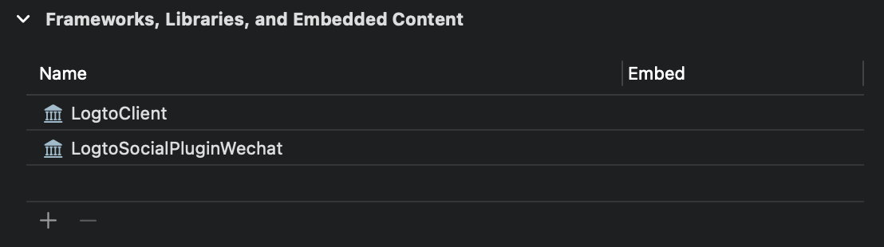

import GuideTip from '../../fragments/_guide-tip.mdx';

# Configura el inicio de sesión social con WeChat (Native)

El conector oficial de Logto para el inicio de sesión social de WeChat en aplicaciones nativas (iOS y Android).

<GuideTip />

## Comenzar

Si no conoces el concepto del conector o no sabes cómo agregar este conector a tu experiencia de inicio de sesión, consulta el [tutorial de Logto](/connectors/social-connectors).

En aplicaciones nativas, no puedes usar la web como método de inicio de sesión de WeChat: se requiere la navegación a la aplicación de WeChat, y también requiere usar su SDK.

Sabemos que suena aterrador, pero no te preocupes. Lo manejaremos fácilmente en este tutorial.

## Crea una aplicación móvil en la Plataforma Abierta de WeChat

> 💡 **Consejo**
>
> Puedes omitir algunas secciones si ya las has completado.

### Crear una cuenta

Abre https://open.weixin.qq.com/, haz clic en el botón "Sign Up" en la esquina superior derecha, luego completa el proceso de registro.

### Crear una aplicación móvil

Inicia sesión con la cuenta que acabas de crear. En la pestaña "Aplicación Móvil" (移动应用), haz clic en el gran botón verde "Crear una aplicación móvil" (创建移动应用).


Completemos la información requerida en el formulario de solicitud.


#### Información básica

La mayoría son bastante sencillas, y aquí tenemos varios consejos:

- Si solo deseas probar el inicio de sesión de WeChat y la aplicación no está en la App Store, en la sección "App is available", elige "No" para omitir el "Enlace de descarga de la aplicación".
- El "Diagrama de flujo de operación de la aplicación" parece complicado. Según nuestra experiencia, necesitas preparar un diagrama de flujo simple y varias capturas de pantalla de la aplicación para mejorar la posibilidad de pasar la revisión.

Haz clic en "Siguiente paso" para continuar.

#### Información de la plataforma

Puedes configurar una o ambas plataformas iOS y Android para integrar Logto con el inicio de sesión nativo de WeChat.

**Aplicación iOS**

Marca "Aplicación iOS" (iOS 应用), luego marca el tipo de dispositivo objetivo de tu aplicación según corresponda.


Si elegiste "No" para la disponibilidad en la App Store, puedes omitir completar la "Dirección de descarga de AppStore" aquí.

Completa _Bundle ID_, _Test version Bundle ID_ y _Universal Links_ (en realidad, solo se necesita un enlace 😂).

> ℹ️ **Nota**
>
> _Bundle ID_ y _Test version Bundle ID_ pueden tener el mismo valor.

> 💡 **Consejo**
>
> WeChat requiere un enlace universal para el inicio de sesión nativo. Si no lo has configurado o no lo conoces, consulta el [documento oficial de Apple](https://developer.apple.com/ios/universal-links/).

**Aplicación Android**

Marca "Aplicación Android" (Android 应用).


Completa _Firma de la aplicación_ (应用签名) y _Nombre del paquete de la aplicación_ (应用包名).

> ℹ️ **Nota**
>
> Necesitas firmar tu aplicación para obtener una firma. Consulta [Firmar tu aplicación](https://developer.android.com/studio/publish/app-signing) para más información.

Después de terminar de firmar, puedes ejecutar la tarea `signingReport` para obtener la firma de la aplicación.

```bash
./gradlew your-android-project:signingReport
```

El valor `MD5` del informe de la variante de compilación correspondiente será la _Firma de la aplicación_ (应用签名), pero recuerda eliminar todos los puntos y comas del valor y ponerlo en minúsculas.

Por ejemplo, `1A:2B:3C:4D` -> `1a2b3c4d`.

#### Esperando el resultado de la revisión

Después de completar la información de la plataforma, haz clic en "Enviar revisión" para continuar. Por lo general, la revisión es rápida y termina en 1-2 días.

Sospechamos que el revisor se asigna aleatoriamente en cada envío, ya que el estándar es variable. Puede que te rechacen la primera vez, ¡pero no te rindas! Explica tu situación actual y pregunta al revisor cómo modificarla.

## Habilitar el inicio de sesión nativo de WeChat en tu aplicación

### iOS

Asumimos que has integrado [Logto iOS SDK](/quick-starts/swift) en tu aplicación. En este caso, las cosas son bastante simples, y ni siquiera necesitas leer el documento del SDK de WeChat:

**1. Configura el enlace universal y el esquema de URL en tu proyecto Xcode**

En el proyecto Xcode -> pestaña Signing & Capabilities, agrega la capacidad "Associated Domains" y el enlace universal que configuraste antes.


Luego ve a la pestaña "Info", agrega un [esquema de URL personalizado](https://developer.apple.com/documentation/xcode/defining-a-custom-url-scheme-for-your-app) con el ID de la aplicación de WeChat.


Finalmente, abre tu `Info.plist`, agrega `weixinULAPI` y `weixin` bajo `LSApplicationQueriesSchemes`.


> 🤦 **Nota**
>
> Sabemos que estas acciones no son muy razonables, pero esta es la solución mínima viable que encontramos. Consulta la [guía oficial mágica](https://developers.weixin.qq.com/doc/oplatform/en/Mobile_App/Access_Guide/iOS.html) para más información.

**2. Agrega `LogtoSocialPluginWechat` a tu proyecto Xcode**

Agrega el framework:



Y agrega `-ObjC` a tus Build Settings > Linking > Other Linker Flags:


> ℹ️ **Nota**
>
> El plugin incluye WeChat Open SDK 1.9.2. Puedes usar directamente `import WechatOpenSDK` una vez importado el plugin.

**3. Agrega el plugin a tus opciones de inicialización de `LogtoClient`**

```swift
let logtoClient = LogtoClient(
  useConfig: config,
  socialPlugins: [LogtoSocialPluginWechat()]
)
```

**4. Maneja `onOpenURL` adecuadamente**

> ℹ️ **Nota**
>
> La función `LogtoClient.handle(url:)` manejará todos los conectores nativos que hayas habilitado. Solo necesitas llamarla una vez.

```swift
// SwiftUI
YourRootView()
  .onOpenURL { url in
      LogtoClient.handle(url: url)
  }

// o AppDelegate
func application(_ app: UIApplication, open url: URL, options: /*...*/) -> Bool {
  LogtoClient.handle(url: url)
}
```

### Android

Asumimos que has integrado [Logto Android SDK](/quick-starts/android) en tu aplicación. En este caso, las cosas son bastante simples, y ni siquiera necesitas leer el documento del SDK de WeChat:

**1. Agrega `Wechat Open SDK` a tu proyecto**

Asegúrate de que el repositorio `mavenCentral()` esté en los repositorios de tu proyecto Gradle:

```kotlin
repositories {
  // ...
  mavenCentral()
}
```

Agrega el Wechat Open SDK a tus dependencias:

```kotlin
dependencies {
  // ...
  api("com.tencent.mm.opensdk:wechat-sdk-android:6.8.0")  // kotlin-script
  // o
  api 'com.tencent.mm.opensdk:wechat-sdk-android:6.8.0'   // groovy-script
}
```

**2. Introduce `WXEntryActivity` a tu proyecto**

Crea un paquete `wxapi` bajo tu raíz de paquete y agrega el `WXEntryActivity` en el paquete `wxapi` (Toma `com.sample.app` como ejemplo):

```kotlin
// WXEntryActivity.kt
package com.sample.app.wxapi

import io.logto.sdk.android.auth.social.wechat.WechatSocialResultActivity

class WXEntryActivity: WechatSocialResultActivity()
```

```java
// WXEntryActivity.java
package com.sample.app.wxapi

import io.logto.sdk.android.auth.social.wechat.WechatSocialResultActivity

public class WXEntryActivity extends WechatSocialResultActivity {}
```

La posición final del `WXEntryActivity` bajo el proyecto debería verse así (Toma Kotlin como ejemplo):

```bash
src/main/kotlin/com/sample/app/wxapi/WXEntryActivity.kt
```

**3. Modifica el `AndroidManifest.xml`**

Agrega la siguiente línea a tu `AndroidManifest.xml`:

```xml
\<?xml version="1.0" encoding="utf-8"?>
\<manifest xmlns:android="http://schemas.android.com/apk/res/android"
  package="com.sample.app">

  \<application>
    \<!-- línea a agregar -->
    \<activity android:name=".wxapi.WXEntryActivity" android:exported="true"/>
  \</application>

\</manifest>
```

## Probar el conector nativo de WeChat

Eso es todo. No olvides [Habilitar el conector social en la experiencia de inicio de sesión](/connectors/social-connectors/#enable-social-sign-in).

Una vez que el conector nativo de WeChat esté habilitado, puedes compilar y ejecutar tu aplicación para ver si funciona.

> ⚠️ **Precaución**
>
> WeChat no tiene un plan para aquellos dispositivos sin la aplicación de WeChat instalada. Logto ocultará este conector durante el inicio de sesión si es así (lo cual es la forma recomendada según la [guía de desarrollo oficial](https://developers.weixin.qq.com/doc/oplatform/en/Mobile_App/WeChat_Login/Development_Guide.html)).
