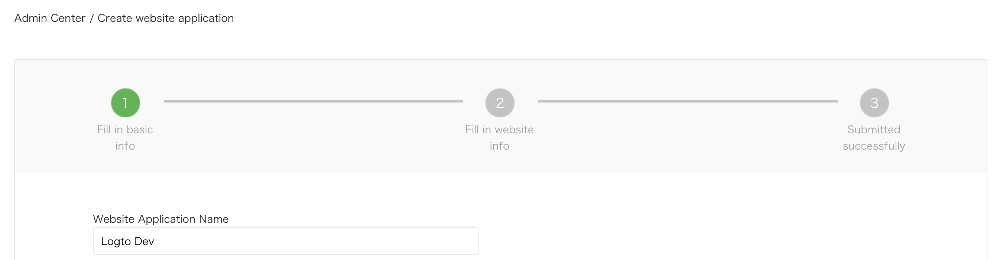

import GuideTip from '../../fragments/_guide-tip.mdx';

# Configura el inicio de sesión social con WeChat (Web)

El conector oficial de Logto para el inicio de sesión social de WeChat en aplicaciones web.

<GuideTip />

## Comenzar \{#get-started}

Si no conoces el concepto del conector o no sabes cómo agregar este conector a tu experiencia de inicio de sesión, por favor consulta el [tutorial de Logto](/connectors/social-connectors).

> **⚠️ Precaución**
>
> Este conector es solo para aplicaciones web. Si estás buscando el método para iniciar sesión con WeChat en aplicaciones nativas, por favor consulta el [conector nativo de WeChat](/integrations/wechat-native).

## Crea una aplicación web en la Plataforma Abierta de WeChat \{#create-a-web-app-in-the-wechat-open-platform}

> 💡 **Consejo**
>
> Puedes omitir algunas secciones si ya las has completado.

### Crear una cuenta \{#create-an-account}

Abre https://open.weixin.qq.com/, haz clic en el botón "Sign Up" en la esquina superior derecha, luego completa el proceso de registro.

### Crear una aplicación web \{#create-a-web-app}

Inicia sesión con la cuenta que acabas de crear. En la pestaña "Web Application" (网页应用), haz clic en el gran botón verde "Create a web app" (创建网页应用).

Completemos la información requerida en el formulario de aplicación.

#### Información básica \{#basic-info}

La mayoría de ellos son bastante sencillos. Después de completar el formulario, haz clic en "Next step" para continuar.

#### Información del sitio web \{#website-info}

Rellena "Authorization callback domain" (授权回调域) con tu dominio de Logto. Por ejemplo, `logto.io`.

#### Esperando el resultado de la revisión \{#waiting-for-the-review-result}

Después de completar la información del sitio web, haz clic en "Submit Review" para continuar. Por lo general, la revisión es rápida y termina dentro de 1-2 días.

Sospechamos que el revisor se asigna aleatoriamente en cada envío, ya que el estándar es variable. Puede que te rechacen la primera vez, ¡pero no te rindas! Explica tu situación actual y pregunta al revisor cómo modificarla.

### Configura tu conector de WeChat \{#configure-your-wechat-connector}

Rellena el campo `clientId` y `clientSecret` con el _Client ID_ y _Client Secret_ que obtuviste de las páginas de detalles de la aplicación OAuth.

Rellena el campo `scope` con 'snsapi_userinfo' o 'snsapi_base'. Puedes dejar este campo en blanco ya que es OPCIONAL. El valor predeterminado está configurado como 'snsapi_userinfo'. Puedes consultar la [diferencia](https://developers.weixin.qq.com/doc/offiaccount/OA_Web_Apps/Wechat_webpage_authorization.html) entre los diferentes valores.

### Prueba el conector web de WeChat \{#test-wechat-web-connector}

Eso es todo. No olvides [habilitar el conector social en la experiencia de inicio de sesión](/connectors/social-connectors/#enable-social-sign-in).

Una vez que el conector web de WeChat esté habilitado, puedes iniciar sesión en tu aplicación nuevamente para ver si funciona.
