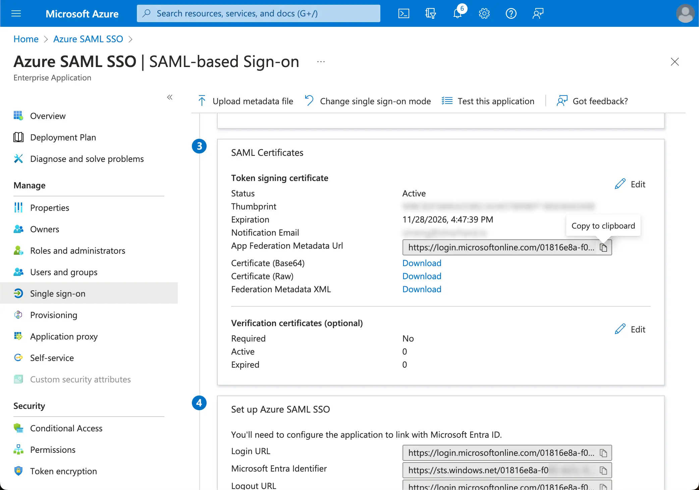

import GuideTip from '../../fragments/_sso_guide_tip.mdx';

# Configura el inicio de sesión único con Microsoft Entra ID (SAML)

Con un mínimo esfuerzo de configuración, este conector permite la integración con Microsoft Entra ID (anteriormente Azure AD) para SSO empresarial.

<GuideTip />

## Paso 1: Crea una aplicación SSO de Azure AD \{#step-1-create-an-azure-ad-sso-application}

Inicia la integración de Azure AD SSO creando una aplicación SSO en el lado de Azure AD.

1. Ve al [portal de Azure](https://portal.azure.com/) e inicia sesión como administrador.
2. Selecciona el servicio `Microsoft Entra ID`.
3. Navega a las `Aplicaciones empresariales` usando el menú lateral. Haz clic en `Nueva aplicación` y selecciona `Crear tu propia aplicación`.

1. Ingresa el nombre de la aplicación y selecciona `Integrar cualquier otra aplicación que no encuentres en la galería (No en galería)`.
2. Selecciona `Configurar inicio de sesión único` > `SAML`.

1. Sigue las instrucciones, como primer paso, necesitarás completar la configuración básica de SAML usando la siguiente información proporcionada por Logto.

- **URI de audiencia (ID de entidad SP)**: Representa un identificador único global para tu servicio Logto, funcionando como el EntityId para SP durante las solicitudes de autenticación al IdP. Este identificador es fundamental para el intercambio seguro de afirmaciones SAML y otros datos relacionados con la autenticación entre el IdP y Logto.
- **URL de ACS**: La URL del Servicio de Consumidor de Afirmaciones (ACS) es la ubicación donde se envía la afirmación SAML con una solicitud POST. Esta URL es utilizada por el IdP para enviar la afirmación SAML a Logto. Actúa como una URL de callback donde Logto espera recibir y consumir la respuesta SAML que contiene la información de identidad del usuario.

Haz clic en `Guardar` para continuar.

## Paso 2: Configura SAML SSO en Logto \{#step-2-configure-saml-sso-at-logto}

Para que la integración de SAML SSO funcione, necesitarás proporcionar los metadatos del IdP de vuelta a Logto. Cambiemos de nuevo al lado de Logto y naveguemos a la pestaña `Conexión` de tu conector SSO de Azure AD.

Logto ofrece tres formas diferentes de configurar los metadatos del IdP. La forma más fácil es proporcionando la `URL de metadatos` de la aplicación SSO de Azure AD.

Copia la `URL de Metadatos de Federación de la Aplicación` de la sección `Certificados SAML` de tu aplicación SSO de Azure AD y pégala en el campo `URL de Metadatos` en Logto.

Logto obtendrá los metadatos de la URL y configurará automáticamente la integración de SAML SSO.

## Paso 3: Configura el mapeo de atributos de usuario \{#step-3-configure-user-attributes-mapping}

Logto ofrece una forma flexible de mapear los atributos de usuario devueltos por el IdP a los atributos de usuario en Logto. Logto sincronizará los siguientes atributos de usuario del IdP por defecto:

- id: El identificador único del usuario. Logto leerá el reclamo `nameID` de la respuesta SAML como el id de identidad SSO del usuario.
- email: La dirección de correo electrónico del usuario. Logto leerá el reclamo `email` de la respuesta SAML como el correo electrónico principal del usuario por defecto.
- name: El nombre del usuario.

Puedes gestionar la lógica de mapeo de atributos de usuario ya sea en el lado de Azure AD o en el lado de Logto.

1. Mapea los atributos de usuario de AzureAD a los atributos de usuario de Logto en el lado de Logto.

   Visita la sección `Atributos y Reclamos` de tu aplicación SSO de Azure AD.

   Copia los siguientes nombres de atributos (con prefijo de espacio de nombres) y pégalos en los campos correspondientes en Logto.

   - `http://schemas.xmlsoap.org/ws/2005/05/identity/claims/emailaddress`
   - `http://schemas.xmlsoap.org/ws/2005/05/identity/claims/name` (Recomendación: actualiza este valor de atributo a `user.displayname` para una mejor experiencia de usuario)

1. Mapea los atributos de usuario de AzureAD a los atributos de usuario de Logto en el lado de AzureAD.

   Visita la sección `Atributos y Reclamos` de tu aplicación SSO de Azure AD.

   Haz clic en `Editar` y actualiza los campos de `Reclamos adicionales` basados en la configuración de atributos de usuario de Logto:

   - actualiza el valor del nombre del reclamo basado en la configuración de atributos de usuario de Logto.
   - elimina el prefijo de espacio de nombres.
   - haz clic en `Guardar` para continuar.

   Deberías terminar con la siguiente configuración:

También puedes especificar atributos de usuario adicionales en el lado de Azure AD. Logto mantendrá un registro de los atributos de usuario originales devueltos por el IdP bajo el campo `sso_identity` del usuario.

## Paso 4: Asigna usuarios a la aplicación SSO de Azure AD \{#step-4-assign-users-to-the-azure-ad-sso-application}

Visita la sección `Usuarios y grupos` de tu aplicación SSO de Azure AD. Haz clic en `Agregar usuario/grupo` para asignar usuarios a la aplicación SSO de Azure AD. Solo los usuarios asignados a tu aplicación SSO de Azure AD podrán autenticarse a través del conector SSO de Azure AD.

## Paso 5: Establece dominios de correo electrónico y habilita el conector SSO \{#step-5-set-email-domains-and-enable-the-sso-connector}

Proporciona los `dominios de correo electrónico` de tu organización en la pestaña `Experiencia SSO` del conector de Logto. Esto habilitará el conector SSO como un método de autenticación para esos usuarios.

Los usuarios con direcciones de correo electrónico en los dominios especificados serán redirigidos para usar el conector SAML SSO como su único método de autenticación.

Por favor, consulta la [documentación](https://learn.microsoft.com/en-us/entra/identity/enterprise-apps/add-application-portal-setup-sso) oficial de Azure AD para más detalles sobre la integración de Azure AD SSO.
