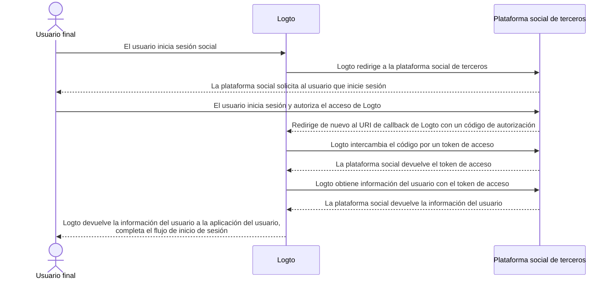

# Implementar conectores

Después de revisar la estructura de archivos del conector, discutamos la implementación y la idea principal de desarrollar un conector.

Revisaremos un ejemplo sencillo para conectores sociales y sin contraseña para que puedas construir tu conector con casi la misma idea.

En esta parte, no profundizaremos en los detalles de parámetros específicos (como `config`) ya que no es el objetivo de esta guía. Los desarrolladores que implementen nuevos conectores deben leer los documentos proporcionados por los proveedores de servicios de terceros, y esos documentos deben detallar los parámetros.

## Construir un conector social

Tomemos el conector de GitHub como ejemplo.

El flujo de autorización de la mayoría de los conectores sociales sigue el [Flujo de Código de Autorización de OAuth](https://openid.net/specs/openid-connect-basic-1_0.html).

:::note
La mayoría de los _conectores sociales_, obtienen un perfil de usuario con la autenticación de los usuarios finales siguiendo un esquema de dos pasos (asumiendo que todos los pasos tienen éxito):

1. Iniciar una solicitud de autenticación y obtener la autenticación del usuario.
2. Obtener `accessToken` utilizando un `authCode` otorgado por el proveedor del conector.
3. Solicitar un perfil de usuario accesible públicamente usando `accessToken`.

:::



Para completar el flujo, necesitamos tener los siguientes tres métodos:

### getAuthorizationUri

`getAuthorizationUri` genera una URL de redirección que puede dirigir a los usuarios finales a la página que necesita la autenticación de los usuarios.

La interfaz está definida como `GetAuthorizationUri` en [`@logto/connector-kit`](https://github.com/logto-io/logto/blob/master/packages/toolkit/connector-kit/src/types.ts).

Se te permite almacenar información esencial relacionada con el inicio de sesión usando `setSession` (el segundo parámetro de entrada de `GetAuthorizationUri`) para el método `getUserInfo`.

Los parámetros listados son necesarios:

- `authorizationEndpoint` se puede encontrar en el sitio de documentación de OAuth de GitHub, que es la página donde el usuario final debe ir para la autenticación
- `config`, que incluye `clientId` y `clientSecret` en el escenario de GitHub
- `state`, una cadena aleatoria para probar CSRF
- `redirectUri` de la página de destino después de la autenticación exitosa del usuario final

```typescript
const getAuthorizationUri = async ({ state, redirectUri }) => {
  const queryParameters = new URLSearchParams({
    client_id: config.clientId, // `config` contiene las credenciales de tu aplicación de GitHub
    redirect_uri: redirectUri,
    state,
  });

  return `${authorizationEndpoint}?${queryParameters.toString()}`;
};
```

### getAccessToken

`getAccessToken` obtiene el token de acceso con el código de autorización emitido después de la autenticación exitosa de los usuarios finales.

Además de `config` que mencionamos en el método anterior `getAuthorizationUri`, también queremos obtener:

- `code` de autorización de los parámetros llevados a la página de destino de redirección
- `accessTokenEndpoint`, que es el punto final para obtener el token de acceso con el código de autorización

```typescript
const getAccessToken = async (config: GithubConfig, code: string) => {
  const { clientId: client_id, clientSecret: client_secret } = config;

  const httpResponse = await got.post({
    url: accessTokenEndpoint,
    json: {
      client_id,
      client_secret,
      code,
    },
    timeout: defaultTimeout,
  });

  const result = accessTokenResponseGuard.safeParse(qs.parse(httpResponse.body));

  if (!result.success) {
    throw new ConnectorError(ConnectorErrorCodes.InvalidResponse, result.error);
  }

  const { access_token: accessToken } = result.data;

  assert(accessToken, new ConnectorError(ConnectorErrorCodes.SocialAuthCodeInvalid));

  return { accessToken };
};
```

### getUserInfo

`getUserInfo` obtiene información del usuario con el token de acceso obtenido en el paso anterior.

La interfaz está definida como `GetUserInfo` en [`@logto/connector-kit`](https://github.com/logto-io/logto/blob/master/packages/toolkit/connector-kit/src/types.ts).

Para propósitos de inicio de sesión, puedes recuperar la información necesaria usando la función `getSession`.

`userInfoEndpoint` es el punto final que se utiliza para obtener información del usuario.

Puedes consultar documentos oficiales para encontrar información específica del usuario que se puede acceder en el punto final de información del usuario y el alcance correspondiente.

`id` asignado por el proveedor de identidad del conector (en este caso, GitHub) es obligatorio; otra información es opcional. Si puedes obtener `email` o `phone` del perfil del usuario, ASEGÚRATE de que estén "verificados". También necesitas alinear las claves de retorno con los nombres de los campos en el [perfil de usuario de Logto](/user-management/user-data/#basic-data).

```typescript
const getUserInfo = async (
  data: { code: string; config: GithubConfig },
  getSession: GetSession,
  { set: SetStorageValue, get: GetStorageValue }
) => {
  const { code, config } = data;
  const { accessToken } = await getAccessToken(config, code);

  try {
    const httpResponse = await got.get(userInfoEndpoint, {
      headers: {
        authorization: `token ${accessToken}`,
      },
      timeout: defaultTimeout,
    });

    const result = userInfoResponseGuard.safeParse(parseJson(httpResponse.body));

    if (!result.success) {
      throw new ConnectorError(ConnectorErrorCodes.InvalidResponse, result.error);
    }

    const { id, avatar_url: avatar, email, name } = result.data;

    return {
      id: String(id),
      avatar: conditional(avatar),
      email: conditional(email),
      name: conditional(name),
    };
  } catch (error: unknown) {
    if (error instanceof HTTPError) {
      const { statusCode, body: rawBody } = error.response;

      if (statusCode === 401) {
        throw new ConnectorError(ConnectorErrorCodes.SocialAccessTokenInvalid);
      }

      throw new ConnectorError(ConnectorErrorCodes.General, JSON.stringify(rawBody));
    }

    throw error;
  }
};
```

Puedes encontrar la implementación completa [aquí](https://github.com/logto-io/connectors/blob/master/packages/connector-github/src/index.ts).

Para más detalles sobre los parámetros configurables, consulta el README del conector de GitHub o los documentos oficiales de GitHub.

:::note
El ejemplo que hemos estado discutiendo se basa en el tipo de concesión de Código de Autorización del protocolo OAuth, que se utiliza en el conector de GitHub de Logto. Sin embargo, vale la pena destacar que otro tipo de concesión, el tipo de concesión Implícita, también se puede usar para recuperar el perfil de un usuario, y de hecho, proporciona un access_token directamente en la respuesta de autenticación. A pesar de esta conveniencia, el tipo de concesión de Código de Autorización generalmente se recomienda sobre el tipo Implícito debido a su mayor seguridad.

También puedes construir un conector basado en OIDC u otros protocolos abiertos, depende de tu caso de uso así como de la compatibilidad del proveedor social al que deseas conectarte.
:::

## Construir un conector sin contraseña

Revisemos la implementación del conector de correo directo de Aliyun para comprender el proceso de construir un conector sin contraseña.

Los conectores sin contraseña se utilizan para enviar un código aleatorio al correo electrónico o teléfono de los usuarios finales. Como resultado, se requiere un método `sendMessage`.

### sendMessage

Para enviar un mensaje, necesitamos que `config` y `endpoint` estén configurados correctamente.

- `endpoint` es el punto final al que se conectan tus llamadas API
- `config` contiene `templates` (plantillas de contenido para enviar el código de acceso en diferentes flujos de usuario), `clientId` y `clientSecret` (para acceder a las solicitudes de API)

```typescript
const sendMessage = async (data, inputConfig) => {
  const { to, type, payload } = data;
  const config = inputConfig ?? (await getConfig(defaultMetadata.id));
  validateConfig<AliyunDmConfig>(config, aliyunDmConfigGuard);
  const { accessKeyId, accessKeySecret, accountName, fromAlias, templates } = config;
  const template = templates.find((template) => template.usageType === type);

  assert(
    template,
    new ConnectorError(
      ConnectorErrorCodes.TemplateNotFound,
      `Cannot find template for type: ${type}`
    )
  );

  const parameters = {
    AccessKeyId: accessKeyId,
    AccountName: accountName,
    ReplyToAddress: 'false',
    AddressType: '1',
    ToAddress: to,
    FromAlias: fromAlias,
    Subject: template.subject,
    HtmlBody:
      typeof payload.code === 'string'
        ? template.content.replace(/{{code}}/g, payload.code)
        : template.content,
  };

  try {
    const httpResponse = await request(
      endpoint,
      { Action: 'SingleSendMail', ...staticConfigs, ...parameters },
      accessKeySecret
    );

    const result = sendEmailResponseGuard.safeParse(parseJson(httpResponse.body));

    if (!result.success) {
      throw new ConnectorError(ConnectorErrorCodes.InvalidResponse, result.error);
    }

    return result.data;
  } catch (error: unknown) {
    if (error instanceof HTTPError) {
      const {
        response: { body: rawBody },
      } = error;

      assert(typeof rawBody === 'string', new ConnectorError(ConnectorErrorCodes.InvalidResponse));

      errorHandler(rawBody);
    }

    throw error;
  }
};

const request = async (
  url: string,
  parameters: PublicParameters & Record<string, string>,
  accessKeySecret: string
) => {
  const finalParameters: Record<string, string> = {
    ...parameters,
    SignatureNonce: String(Math.random()),
    Timestamp: new Date().toISOString(),
  };
  const signature = getSignature(finalParameters, accessKeySecret, 'POST');

  const payload = new URLSearchParams();

  for (const [key, value] of Object.entries(finalParameters)) {
    payload.append(key, value);
  }
  payload.append('Signature', signature);

  return got.post({
    url,
    headers: {
      'Content-Type': 'application/x-www-form-urlencoded',
    },
    form: payload,
  });
};
```

Puedes encontrar la implementación completa [aquí](https://github.com/logto-io/connectors/blob/master/packages/connector-aliyun-dm/src/index.ts).

Para más detalles sobre los parámetros configurables, consulta el README del conector de correo directo de Aliyun o los documentos oficiales de correo directo de Aliyun.

## ¿Qué más?

Para ver la definición de los métodos del conector y construir una imagen del diseño de la interfaz del conector, consulta [`@logto/connector-kit`](https://github.com/logto-io/logto/tree/master/packages/toolkit/connector-kit). También puedes encontrar la referencia de _ConnectorMetadata_ en "[Connectors - ConnectorMetadata](/connectors/connector-data-structure/#connectors-local-storage-connectormetadata)" y "[Estructura de archivos del conector](/logto-oss/develop-your-connector/connector-file-structure/)" que pueden ayudarte a organizar tu implementación.

- El esquema de _Zod_ de la configuración de un conector es obligatorio para todos los conectores. Esto es bastante importante ya que realizamos una verificación de tipo antes de guardar `config` en la base de datos y llamar a las API que requieren información de `config`.
- Todos los _conectores de SMS_ y _conectores de correo electrónico_ requieren un método `sendMessage` para llamar a las API de envío de mensajes de los proveedores de servicios utilizando configuraciones de la base de datos. Los desarrolladores también pueden reutilizar este método para enviar un mensaje de prueba con una configuración no guardada mientras configuran los conectores en la Consola de Administración.
- El generador de URL de autorización `getAuthorizationUri` y el recuperador de perfil de usuario `getUserInfo` son necesarios para todos los _conectores sociales_ (`getAccessToken` se considera un paso opcional en `getUserInfo`).
- Todos los métodos de los conectores funcionan a través de llamadas API, como resultado, los desarrolladores de conectores necesitan revisar documentos y manejar posibles respuestas de llamadas API no exitosas.

## Instalar tus propios conectores

Asumimos que ya has terminado de construir tu propio conector. Sigue los siguientes pasos para instalarlo manualmente:

1. Copia la carpeta del conector que implementaste en el directorio `/packages/connectors` de [`logto-io/logto`](https://github.com/logto-io/logto).
2. Instala las dependencias del repositorio del conector escribiendo `pnpm pnpm:devPreinstall && pnpm i` en la ruta raíz de la carpeta logto.
3. Construye el conector con `pnpm connectors build`.
4. Enlaza los conectores locales usando `pnpm cli connector link`.
5. Reinicia la instancia de Logto con `pnpm dev` en el directorio raíz de `logto-io/logto`, y podrás encontrar los conectores instalados con éxito.

Ahora puedes probar y verificar tu conector para ver si funciona como se espera.

Si deseas agregar conectores que ya han sido publicados en NPM o conectores oficiales de Logto, puedes consultar [Usando Logto CLI - Gestionar conectores](/logto-oss/using-cli/manage-connectors/#add-connectors).
