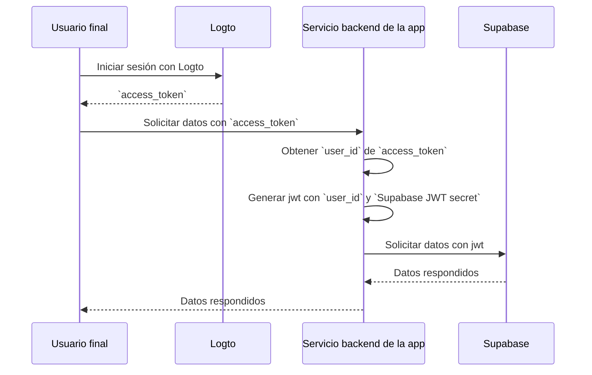

# Añade autenticación a tu aplicación Supabase (Add authentication to your Supabase application)

## Conceptos básicos de Supabase \{#supabase-basics}

Supabase utiliza la [Seguridad a nivel de fila de Postgres (Row-Level Security)](https://www.postgresql.org/docs/current/ddl-rowsecurity.html) para controlar los permisos de acceso a los datos. En términos simples, al crear políticas de seguridad a nivel de fila para las tablas en la base de datos, podemos restringir y gestionar quién puede leer, escribir y actualizar datos en una tabla.

Supongamos que tienes una tabla llamada "posts" en tu base de datos, con el siguiente contenido:


El campo `user_id` en la tabla representa el usuario al que pertenece cada dato de post. Puedes restringir que cada usuario solo acceda a los datos de sus propios posts basándote en el campo `user_id`.

Sin embargo, antes de que esto pueda implementarse, Supabase necesita poder identificar al usuario actual que accede a la base de datos.

### Añadir datos de usuario a las solicitudes de Supabase \{#add-user-data-to-the-supabase-requests}

Gracias al soporte de JWT en Supabase, cuando nuestra aplicación interactúa con Supabase, podemos generar un JWT que contenga los datos del usuario utilizando el secreto JWT proporcionado por Supabase. Luego usamos este JWT como el encabezado de Autenticación al hacer solicitudes. Al recibir la solicitud, Supabase verifica automáticamente la validez del JWT y permite el acceso a los datos contenidos en él durante los procesos posteriores.

Primero, podemos obtener el secreto JWT proporcionado por Supabase desde la sección “Project Settings” en el panel de Supabase:


Luego, cuando usamos el SDK de Supabase para hacer solicitudes a Supabase, utilizamos este secreto para generar nuestro JWT y adjuntarlo como el encabezado de Autenticación a la solicitud. (Ten en cuenta que este proceso ocurre dentro del servicio backend de tu aplicación, y el secreto JWT nunca debe ser expuesto a terceros).

```jsx
import { createClient } from '@supabase/supabase-js';
import { sign } from 'jsonwebtoken';

/
 * Nota:
 * Puedes encontrar SUPABASE_URL y SUPABASE_ANON_KEY en el mismo lugar donde encuentras el JWT Secret.
 */
const SUPABASE_URL = process.env.SUPABASE_URL;
const SUPABASE_ANON_KEY = process.env.SUPABASE_ANON_KEY;

const SUPABASE_JWT_SECRET = process.env.SUPABASE_JWT_SECRET;

export const getSupabaseClient = (userId) => {
  const jwtPayload = {
    userId,
  };

  const jwt = sign(jwtPayload, SUPABASE_JWT_SECRET, {
    expiresIn: '1h', // Solo para demostración
  });

  const client = createClient(SUPABASE_URL, SUPABASE_ANON_KEY, {
    global: {
      headers: {
        Authorization: `Bearer ${jwt}`,
      },
    },
  });

  return client;
};
```

A continuación, navega al Editor SQL en el panel de Supabase y crea una función para recuperar el userId transportado en la solicitud:


El código utilizado en la imagen es el siguiente:

```sql
create or replace function auth.user_id() returns text as $$
  select nullif(current_setting('request.jwt.claims', true)::json->>'userId', '')::text;
$$ language sql stable;
```

Como muestra el código, en Supabase, puedes recuperar el payload del JWT que generamos llamando a `request.jwt.claims`. El campo `userId` dentro del payload es el valor que hemos establecido.

Con esta función, Supabase puede determinar el usuario que está accediendo actualmente a la base de datos.

### Crear política de Seguridad a nivel de fila \{#create-row-level-security-policy}

A continuación, podemos crear una política de Seguridad a nivel de fila para restringir que cada usuario solo acceda a los datos de sus propios posts basándonos en el campo `user_id` en la tabla posts.

1. Navega a la página del Editor de Tablas en el panel de Supabase y selecciona la tabla posts.
2. Haz clic en "Add RLS Policy" en la parte superior de la tabla.
3. En la ventana emergente, haz clic en "Create policy".
4. Introduce un nombre para la política y elige el comando SELECT Policy.
5. En el bloque `using` del siguiente código, introduce:

```sql
auth.user_id() = user_id
```


Al aprovechar este tipo de políticas, se logra el control de acceso a los datos dentro de Supabase.

En aplicaciones reales, crearías varias políticas para restringir acciones de los usuarios como la inserción y modificación de datos. Sin embargo, esto está fuera del alcance de este artículo. Para más información sobre la Seguridad a nivel de fila (RLS), consulta [Protege tus datos usando Row Level Security de Postgres](https://supabase.com/docs/guides/database/postgres/row-level-security).

### Proceso básico de integración con Logto \{#basic-integration-process-with-logto}

Como se mencionó anteriormente, dado que Supabase utiliza RLS para su control de acceso, la clave para integrarse con Logto (o cualquier otro servicio de autenticación) radica en obtener el id del usuario autorizado y enviarlo a Supabase. Todo el proceso se ilustra en el siguiente diagrama:



A continuación, explicaremos cómo integrar Logto con Supabase basándonos en este diagrama de proceso.

## Integración con Logto \{#logto-integration}

Logto ofrece guías de integración para varios frameworks y lenguajes de programación.

Generalmente, las aplicaciones construidas con estos frameworks y lenguajes se dividen en categorías como aplicaciones nativas, SPA (aplicaciones de una sola página), aplicaciones web tradicionales y aplicaciones M2M (máquina a máquina). Puedes visitar la página de [Logto quick starts](/quick-starts) para integrar Logto en tu aplicación según el stack tecnológico que estés utilizando. Después, sigue las instrucciones a continuación para integrar Logto en tu proyecto según el tipo de tu aplicación.

### Aplicación nativa o SPA \{#native-app-or-spa}

Tanto las aplicaciones nativas como las SPA se ejecutan en tu dispositivo, y las credenciales (token de acceso) obtenidas tras el inicio de sesión se almacenan localmente en tu dispositivo.

Por lo tanto, al integrar tu aplicación con Supabase, necesitas interactuar con Supabase a través de tu servicio backend porque no puedes exponer información sensible (como el secreto JWT de Supabase) en el dispositivo de cada usuario.

Supongamos que estás construyendo tu SPA usando React y Express. Has integrado Logto en tu aplicación siguiendo la [Guía del SDK de Logto React](/quick-starts/react) (puedes consultar el código en nuestro [ejemplo de react](https://github.com/logto-io/js/tree/master/packages/react-sample)). Además, has añadido la validación del token de acceso de Logto a tu servidor backend según la guía de [validar tokens de acceso](/authorization/validate-access-tokens).

A continuación, usarás el token de acceso obtenido de Logto para solicitar datos de usuario a tu servidor backend:

```jsx
import { useLogto } from '@logto/react';
import { useState, useEffect } from 'react';
import PostList from './PostList';

const endpoint = '<https://www.mysite.com/api/posts>';
const resource = '<https://www.mysite.com/api>';

function PostPage() {
  const { isAuthenticated, getAccessToken } = useLogto();
  const [posts, setPosts] = useState();

  useEffect(() => {
    const fetchPosts = async () => {
      const response = await fetch(endpoint, {
        headers: {
          Authorization: `Bearer ${await getAccessToken(resource)}`,
        },
      });
      setPosts(response.json());
    };

    if (isAuthenticated) {
      void fetchPosts();
    }
  }, [isAuthenticated, getAccessToken]);

  return <PostList posts={posts} />;
}

export default PostPage;
```

En tu servidor backend, ya has extraído el id del usuario autenticado del token de acceso usando un middleware:

```jsx
// auth-middleware.ts
import { createRemoteJWKSet, jwtVerify } from 'jose';

//...

export const verifyAuthFromRequest = async (ctx, next) => {
  // Extraer el token
  const token = extractBearerTokenFromHeaders(ctx.request.headers);

  const { payload } = await jwtVerify(
    token, // El Bearer Token extraído del encabezado de la solicitud
    createRemoteJWKSet(new URL('https://<your-logto-domain>/oidc/jwks')), // genera un jwks usando jwks_uri consultado desde el servidor Logto
    {
      // emisor esperado del token, debe ser emitido por el servidor Logto
      issuer: 'https://<your-logto-domain>/oidc',
      // audiencia esperada del token, debe ser el indicador de recurso de la API actual
      audience: '<your request listener resource indicator>',
    }
  );

  // si estás usando RBAC
  assert(payload.scope.includes('some_scope'));

  // lógica personalizada del payload
  ctx.auth = {
    userId: payload.sub,
  };

  return next();
};
```

Ahora, puedes usar el `getSupabaseClient` descrito anteriormente para adjuntar el `userId` al JWT utilizado en las solicitudes posteriores a Supabase. Alternativamente, puedes crear un middleware para crear un cliente de Supabase para las solicitudes que necesiten interactuar con Supabase:

```jsx
export const withSupabaseClient = async (ctx, next) => {
  ctx.supabase = getSupabaseClient(ctx.auth.userId);

  return next();
};
```

En el flujo de procesamiento posterior, puedes llamar directamente a `ctx.supabase` para interactuar con Supabase:

```jsx
const fetchPosts = async (ctx) => {
	const { data } = await ctx.supabase.from('posts').select('*');

	return data;
}
```

En este código, Supabase solo devolverá los datos de los posts que pertenecen al usuario actual según las políticas establecidas previamente.

### Aplicación web tradicional \{#traditional-web-app}

La principal diferencia entre una aplicación web tradicional y una aplicación nativa o SPA es que una aplicación web tradicional renderiza y actualiza las páginas únicamente en el servidor web. Por lo tanto, las credenciales del usuario son gestionadas directamente por el servidor web, mientras que en las aplicaciones nativas y SPA residen en el dispositivo del usuario.

Al integrar Logto con una aplicación web tradicional en Supabase, puedes recuperar directamente el id del usuario autenticado desde el backend.

Tomando como ejemplo un proyecto Next.js, después de integrar Logto en tu proyecto siguiendo la [Guía del SDK de Next.js](/quick-starts/next-app-router), puedes usar el SDK de Logto para recuperar la información del usuario y construir el JWT correspondiente para interactuar con Supabase.

```jsx
import { getLogtoContext } from '@logto/next-server-actions';
import { logtoConfig } from '@/logto';
import { getSupabaseClient } from '@/utils';
import PostList from './PostList';

export default async function PostPage() {
  const { cliams } = await getLogtoContext(logtoConfig);

  // El valor `sub` en `cliams` es el id de usuario.
  const supabase = getSupabaseClient(cliams.sub);

  const { data: posts } = await supabase.from('posts').select('*');

  return <PostList posts={posts} />;
}
```

### Aplicación máquina a máquina \{#machine-to-machine-app}

Máquina a máquina (M2M) se utiliza a menudo cuando tu aplicación necesita comunicarse directamente con servidores de recursos, como un servicio estático que extrae posts diarios, etc.

Puedes usar la guía de [Máquina a máquina: Autenticación con Logto](/quick-starts/m2m) para la autenticación de aplicaciones máquina a máquina. La integración entre Supabase y las aplicaciones máquina a máquina es similar a la de las aplicaciones nativas y SPA (como se describe en la sección "[Aplicación nativa o SPA](#native-app-or-spa)"). Consiste en obtener un token de acceso de Logto y luego validarlo a través de una API backend protegida.

Sin embargo, es importante tener en cuenta que las aplicaciones nativas y SPA están diseñadas normalmente para usuarios finales, por lo que el id de usuario obtenido representa al propio usuario. Sin embargo, el token de acceso para aplicaciones máquina a máquina representa la propia aplicación, y el campo `sub` en el payload del token de acceso es el id de cliente de la app M2M, no un usuario específico. Por lo tanto, durante el desarrollo, es fundamental distinguir qué datos están destinados a aplicaciones M2M.

Además, si deseas que una aplicación M2M específica acceda a Supabase en nombre de todo el servicio para omitir las restricciones de RLS, puedes usar el secreto `service_role` de Supabase para crear un cliente de Supabase. Es útil cuando quieres realizar tareas administrativas o automatizadas que requieren acceso a todos los datos sin estar restringido por las políticas de Seguridad a nivel de fila establecidas para usuarios individuales.

El secreto `service_role` se puede encontrar en la misma página que el secreto JWT:


Al crear un cliente de Supabase, usa el secreto `service_role`, entonces este cliente podrá acceder a todos los datos en la base de datos:

```jsx
import { createClient } from '@supabase/supabase-js';

// ...
const SUPABASE_SERVICE_ROLE_SCRET = process.env.SUPABASE_SERVICE_ROLE_SCRET;

const client = createClient(SUPABASE_URL, SUPABASE_SERVICE_ROLE_SCRET, {
  // ...opciones
});
```
