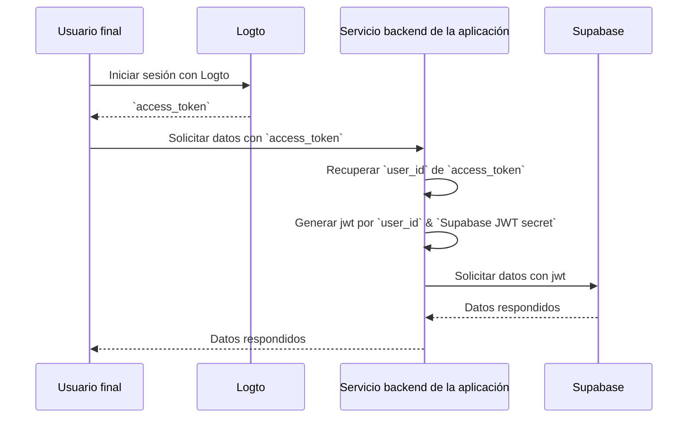

# Añade autenticación a tu aplicación Supabase

## Conceptos básicos de Supabase

Supabase utiliza [la seguridad a nivel de fila de Postgres](https://www.postgresql.org/docs/current/ddl-rowsecurity.html) para controlar los permisos de acceso a los datos. En términos simples, al crear políticas de seguridad a nivel de fila para las tablas en la base de datos, podemos restringir y gestionar quién puede leer, escribir y actualizar datos en una tabla.

Supongamos que tienes una tabla llamada "posts" en tu base de datos, con el siguiente contenido:


El campo `user_id` en la tabla representa al usuario al que pertenecen los datos de cada publicación. Puedes restringir a cada usuario para que solo acceda a sus propios datos de publicación basándote en el campo `user_id`.

Sin embargo, antes de que esto pueda implementarse, Supabase necesita poder identificar al usuario actual que accede a la base de datos.

### Añadir datos de usuario a las solicitudes de Supabase

Gracias al soporte de JWT de Supabase, cuando nuestra aplicación interactúa con Supabase, podemos generar un JWT que contenga datos de usuario utilizando el secreto JWT proporcionado por Supabase. Luego usamos este JWT como el encabezado de Autenticación al hacer solicitudes. Al recibir la solicitud, Supabase verifica automáticamente la validez del JWT y permite el acceso a los datos contenidos en él durante los procesos posteriores.

Primero, podemos obtener el secreto JWT proporcionado por Supabase desde la "Configuración del Proyecto" en el panel de Supabase:


Luego, cuando usamos el SDK de Supabase para hacer solicitudes a Supabase, utilizamos este secreto para generar nuestro JWT y adjuntarlo como el encabezado de Autenticación a la solicitud. (Ten en cuenta que este proceso ocurre dentro del servicio backend de tu aplicación, y el secreto JWT nunca debe exponerse a terceros).

```jsx
import { createClient } from '@supabase/supabase-js';
import { sign } from 'jsonwebtoken';

/*
 * Nota:
 * Puedes encontrar SUPABASE_URL, SUPABASE_ANON_KEY en el mismo lugar donde encuentras el Secreto JWT.
 */
const SUPABASE_URL = process.env.SUPABASE_URL;
const SUPABASE_ANON_KEY = process.env.SUPABASE_ANON_KEY;

const SUPABASE_JWT_SECRET = process.env.SUPABASE_JWT_SECRET;

export const getSupabaseClient = (userId) => {
  const jwtPayload = {
    userId,
  };

  const jwt = sign(jwtPayload, SUPABASE_JWT_SECRET, {
    expiresIn: '1h', // Solo para demostración
  });

  const client = createClient(SUPABASE_URL, SUPABASE_ANON_KEY, {
    global: {
      headers: {
        Authorization: `Bearer ${jwt}`,
      },
    },
  });

  return client;
};
```

A continuación, navega al Editor SQL en el panel de Supabase y crea una función para recuperar el userId llevado en la solicitud:


El código utilizado en la imagen es el siguiente:

```sql
create or replace function auth.user_id() returns text as $$
  select nullif(current_setting('request.jwt.claims', true)::json->>'userId', '')::text;
$$ language sql stable;
```

Como muestra el código, en Supabase, puedes recuperar la carga útil del JWT que generamos llamando a `request.jwt.claims`. El campo `userId` dentro de la carga útil es el valor que hemos establecido.

Con esta función, Supabase puede determinar el usuario que está accediendo actualmente a la base de datos.

### Crear política de seguridad a nivel de fila

A continuación, podemos crear una política de seguridad a nivel de fila para restringir a cada usuario a acceder solo a sus propios datos de publicación basándose en el campo `user_id` en la tabla de publicaciones.

1. Navega a la página del Editor de Tablas en el panel de Supabase y selecciona la tabla de publicaciones.
2. Haz clic en "Añadir política RLS" en la parte superior de la tabla.
3. En la ventana que aparece, haz clic en "Crear política".
4. Ingresa un Nombre de Política y elige el comando de Política SELECT.
5. En el bloque `using` del código a continuación, ingresa:

```sql
auth.user_id() = user_id
```


Al aprovechar tales políticas, se logra el control de acceso a los datos dentro de Supabase.

En aplicaciones del mundo real, crearías varias políticas para restringir acciones de usuario como la inserción y modificación de datos. Sin embargo, esto está fuera del alcance de este artículo. Para obtener más información sobre la seguridad a nivel de fila (RLS), consulta [Protege tus datos usando la seguridad a nivel de fila de Postgres](https://supabase.com/docs/guides/database/postgres/row-level-security).

### Proceso básico de integración con Logto

Como se mencionó anteriormente, debido a que Supabase utiliza RLS para su control de acceso, la clave para integrarse con Logto (o cualquier otro servicio de autenticación) radica en obtener el id del usuario autorizado y enviarlo a Supabase. Todo el proceso se ilustra en el siguiente diagrama:



A continuación, explicaremos cómo integrar Logto con Supabase basándonos en este diagrama de proceso.

## Integración con Logto

Logto ofrece guías de integración para varios frameworks y lenguajes de programación.

Generalmente, las aplicaciones construidas con estos frameworks y lenguajes se dividen en categorías como aplicaciones nativas, SPA (aplicaciones de una sola página), aplicaciones web tradicionales y aplicaciones M2M (máquina a máquina). Puedes visitar la página de [inicios rápidos de Logto](/quick-starts) para integrar Logto en tu aplicación basándote en la pila tecnológica que estás utilizando. Luego, sigue las instrucciones a continuación para integrar Logto en tu proyecto según el tipo de tu aplicación.

### Aplicación nativa o SPA

Tanto las aplicaciones nativas como las SPA se ejecutan en tu dispositivo, y las credenciales (token de acceso) obtenidas después del inicio de sesión se almacenan localmente en tu dispositivo.

Por lo tanto, al integrar tu aplicación con Supabase, necesitas interactuar con Supabase a través de tu servicio backend porque no puedes exponer información sensible (como el secreto JWT de Supabase) en el dispositivo de cada usuario.

Supongamos que estás construyendo tu SPA usando React y Express. Has integrado exitosamente Logto en tu aplicación siguiendo la [Guía del SDK de React de Logto](/quick-starts/react) (puedes consultar el código en nuestro [ejemplo de react](https://github.com/logto-io/js/tree/master/packages/react-sample)). Además, has añadido la validación del token de acceso de Logto a tu servidor backend según la documentación de [Protege tu API en Node (Express)](/authorization/api-resources/node-express).

A continuación, usarás el token de acceso obtenido de Logto para solicitar datos de usuario desde tu servidor backend:

```jsx
import { useLogto } from '@logto/react';
import { useState, useEffect } from 'react';
import PostList from './PostList';

const endpoint = '<https://www.mysite.com/api/posts>';
const resource = '<https://www.mysite.com/api>';

function PostPage() {
  const { isAuthenticated, getAccessToken } = useLogto();
  const [posts, setPosts] = useState();

  useEffect(() => {
    const fetchPosts = async () => {
      const response = await fetch(endpoint, {
        headers: {
          Authorization: `Bearer ${await getAccessToken(resource)}`,
        },
      });
      setPosts(response.json());
    };

    if (isAuthenticated) {
      void fetchPosts();
    }
  }, [isAuthenticated, getAccessToken]);

  return <PostList posts={posts} />;
}

export default PostPage;
```

En tu servidor backend, ya has extraído el id del usuario que ha iniciado sesión desde el token de acceso usando middleware:

```jsx
// auth-middleware.ts
import { createRemoteJWKSet, jwtVerify } from 'jose';

//...

export const verifyAuthFromRequest = async (ctx, next) => {
  // Extraer el token
  const token = extractBearerTokenFromHeaders(ctx.request.headers);

  const { payload } = await jwtVerify(
    token, // El token Bearer bruto extraído del encabezado de la solicitud
    createRemoteJWKSet(new URL('https://<your-logto-domain>/oidc/jwks')), // generar un jwks usando jwks_uri consultado desde el servidor Logto
    {
      // emisor esperado del token, debe ser emitido por el servidor Logto
      issuer: 'https://<your-logto-domain>/oidc',
      // audiencia esperada del token, debe ser el indicador de recurso de la API actual
      audience: '<your request listener resource indicator>',
    }
  );

  // si estás usando RBAC
  assert(payload.scope.includes('some_scope'));

  // lógica de carga útil personalizada
  ctx.auth = {
    userId: payload.sub,
  };

  return next();
};
```

Ahora, puedes usar el `getSupabaseClient` descrito anteriormente para adjuntar el `userId` al JWT utilizado en las solicitudes posteriores a Supabase. Alternativamente, puedes crear un middleware para crear un cliente de Supabase para solicitudes que necesiten interactuar con Supabase:

```jsx
export const withSupabaseClient = async (ctx, next) => {
  ctx.supabase = getSupabaseClient(ctx.auth.userId);

  return next();
};
```

En el flujo de procesamiento posterior, puedes llamar directamente a `ctx.supabase` para interactuar con Supabase:

```jsx
const fetchPosts = async (ctx) => {
  const { data } = await ctx.supabase.from('posts').select('*');

  return data;
};
```

En este código, Supabase devolverá solo los datos de publicación que pertenecen al usuario actual basándose en las políticas establecidas anteriormente.

### Aplicación web tradicional

La principal diferencia entre una aplicación web tradicional y una aplicación nativa o SPA es que una aplicación web tradicional renderiza y actualiza páginas únicamente en el servidor web. Por lo tanto, las credenciales de usuario son gestionadas directamente por el servidor web, mientras que en las aplicaciones nativas y SPA, residen en el dispositivo del usuario.

Al integrar Logto con una aplicación web tradicional en Supabase, puedes recuperar directamente el id del usuario que ha iniciado sesión desde el backend.

Tomando un proyecto de Next.js como ejemplo, después de integrar Logto con tu proyecto siguiendo la [Guía del SDK de Next.js](/quick-starts/next-app-router), puedes usar el SDK de Logto para recuperar información del usuario y construir el JWT correspondiente para interactuar con Supabase.

```jsx
import { getLogtoContext } from '@logto/next-server-actions';
import { logtoConfig } from '@/logto';
import { getSupabaseClient } from '@/utils';
import PostList from './PostList';

export default async function PostPage() {
  const { claims } = await getLogtoContext(logtoConfig);

  // El valor `sub` en `claims` es el id del usuario.
  const supabase = getSupabaseClient(claims.sub);

  const { data: posts } = await supabase.from('posts').select('*');

  return <PostList posts={posts} />;
}
```

### Aplicación máquina a máquina

Máquina a máquina (M2M) se utiliza a menudo cuando tu aplicación necesita comunicarse directamente con servidores de recursos, como un servicio estático que extrae publicaciones diarias, etc.

Puedes usar la guía de [Máquina a máquina: Autenticación con Logto](/quick-starts/m2m) para la autenticación de aplicaciones máquina a máquina. La integración entre Supabase y las aplicaciones máquina a máquina es similar a la de las aplicaciones nativas y SPA (como se describe en la sección "[Aplicación nativa o SPA](#native-app-or-spa)"). Implica obtener un token de acceso de Logto y luego validarlo a través de una API backend protegida.

Sin embargo, es importante tener en cuenta que las aplicaciones nativas y SPA están diseñadas típicamente para usuarios finales, por lo que el id de usuario obtenido representa al usuario mismo. Sin embargo, el token de acceso para aplicaciones máquina a máquina representa la aplicación en sí, y el campo `sub` en la carga útil del token de acceso es el id del cliente de la aplicación M2M, no un usuario específico. Por lo tanto, durante el desarrollo, es crucial distinguir qué datos están destinados a las aplicaciones M2M.

Además, si deseas que una aplicación M2M específica acceda a Supabase en nombre de todo el servicio para evitar las restricciones de RLS, puedes usar el secreto `service_role` de Supabase para crear un cliente de Supabase. Es útil cuando deseas realizar algunas tareas administrativas o automatizadas que requieren acceso a todos los datos sin estar restringido por las políticas de seguridad a nivel de fila establecidas para usuarios individuales.

El secreto `service_role` se puede encontrar en la misma página que el secreto JWT:


Al crear un cliente de Supabase, usa el secreto `service_role`, entonces este cliente puede acceder a todos los datos en la base de datos:

```jsx
import { createClient } from '@supabase/supabase-js';

// ...
const SUPABASE_SERVICE_ROLE_SECRET = process.env.SUPABASE_SERVICE_ROLE_SECRET;

const client = createClient(SUPABASE_URL, SUPABASE_SERVICE_ROLE_SECRET, {
  // ...opciones
});
```
