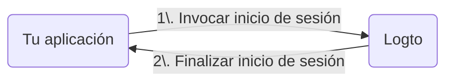

import RegardingRedirectBasedSignIn from './_regarding-redirect-based-sign-in.mdx';

Antes de entrar en los detalles, aquí tienes una visión general rápida de la experiencia del usuario final. El proceso de inicio de sesión se puede simplificar de la siguiente manera:

1. Tu aplicación invoca el método de inicio de sesión.
2. El usuario es redirigido a la página de inicio de sesión de Logto. Para aplicaciones nativas, se abre el navegador del sistema.
3. El usuario inicia sesión y es redirigido de vuelta a tu aplicación (configurada como el URI de redirección).

<RegardingRedirectBasedSignIn />

---
