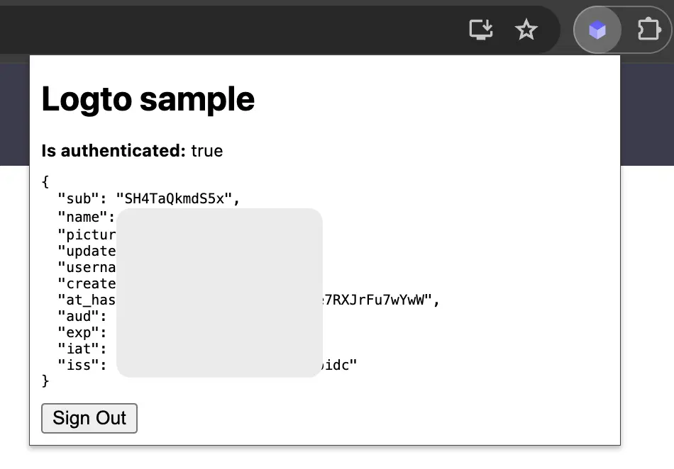

import RegardingRedirectBasedSignIn from '../../fragments/_regarding-redirect-based-sign-in.mdx';

### El flujo de autenticación \{#the-authentication-flow}

Suponiendo que colocas un botón de "Iniciar sesión" en el popup de tu extensión de Chrome, el flujo de autenticación se verá así:


Para otras páginas interactivas en tu extensión, solo necesitas reemplazar el participante `Popup de la extensión` con el nombre de la página. En este tutorial, nos centraremos en la página del popup.

<RegardingRedirectBasedSignIn />

### Actualiza el `manifest.json` \{#update-the-manifestjson}

Logto SDK requiere los siguientes permisos en el `manifest.json`:

```json title="manifest.json"
{
  "permissions": ["identity", "storage"],
  "host_permissions": ["https://*.logto.app/*"]
}
```

- `permissions.identity`: Requerido para la API de Identidad de Chrome, que se utiliza para iniciar y cerrar sesión.
- `permissions.storage`: Requerido para almacenar la sesión del usuario.
- `host_permissions`: Requerido para que el Logto SDK se comunique con las APIs de Logto.

:::note
Si estás utilizando un dominio personalizado en Logto Cloud, necesitas actualizar el `host_permissions` para que coincida con tu dominio.
:::

### Configura un script de fondo (service worker) \{#set-up-a-background-script-service-worker}

En el script de fondo de tu extensión de Chrome, inicializa el Logto SDK:

```js title="service-worker.js"
import LogtoClient from '@logto/chrome-extension';

export const logtoClient = new LogtoClient({
  endpoint: '<your-logto-endpoint>'
  appId: '<your-logto-app-id>',
});
```

Reemplaza `<your-logto-endpoint>` y `<your-logto-app-id>` con los valores reales. Puedes encontrar estos valores en la página de la aplicación que acabas de crear en el Logto Console.

Si no tienes un script de fondo, puedes seguir la [guía oficial](https://developer.chrome.com/docs/extensions/develop/concepts/service-workers/basics) para crear uno.

:::info
**¿Por qué necesitamos un script de fondo?**

Las páginas normales de la extensión, como el popup o la página de opciones, no pueden ejecutarse en segundo plano y pueden cerrarse durante el proceso de autenticación. Un script de fondo asegura que el proceso de autenticación se maneje correctamente.
:::

Luego, necesitamos escuchar el mensaje de otras páginas de la extensión y manejar el proceso de autenticación:

```js title="service-worker.js"
chrome.runtime.onMessage.addListener((message, sender, sendResponse) => {
  // En el código a continuación, dado que devolvemos `true` para cada acción, necesitamos llamar a `sendResponse`
  // para notificar al remitente. También puedes manejar errores aquí, o usar otras formas de notificar al remitente.

  if (message.action === 'signIn') {
    const redirectUri = chrome.identity.getRedirectURL('/callback');
    logtoClient.signIn(redirectUri).finally(sendResponse);
    return true;
  }

  if (message.action === 'signOut') {
    const redirectUri = chrome.identity.getRedirectURL();
    logtoClient.signOut(redirectUri).finally(sendResponse);
    return true;
  }

  return false;
});
```

Puedes notar que hay dos URIs de redirección utilizados en el código anterior. Ambos son creados por `chrome.identity.getRedirectURL`, que es una [API integrada de Chrome](https://developer.chrome.com/docs/extensions/reference/api/identity#method-getRedirectURL) para generar una URL de redirección para flujos de autenticación. Las dos URIs serán:

- `https://<extension-id>.chromiumapp.org/callback` para iniciar sesión.
- `https://<extension-id>.chromiumapp.org/` para cerrar sesión.

Ten en cuenta que estas URIs no son accesibles y solo se utilizan para que Chrome active acciones específicas para el proceso de autenticación.

### Actualiza la configuración de la aplicación Logto \{#update-logto-application-settings}

Ahora necesitamos actualizar la configuración de la aplicación Logto para permitir las URIs de redirección que acabamos de crear.

1. Ve a la página de la aplicación en el Logto Console.
2. En la sección "Redirect URIs", agrega la URI: `https://<extension-id>.chromiumapp.org/callback`.
3. En la sección "Post sign-out redirect URIs", agrega la URI: `https://<extension-id>.chromiumapp.org/`.
4. En la sección "CORS allowed origins", agrega la URI: `chrome-extension://<extension-id>`. El SDK en la extensión de Chrome usará este origen para comunicarse con las APIs de Logto.
5. Haz clic en **Guardar cambios**.

Recuerda reemplazar `<extension-id>` con tu ID de extensión real. Puedes encontrar el ID de la extensión en la página `chrome://extensions`.

### Añade botones de inicio y cierre de sesión al popup \{#add-sign-in-and-sign-out-buttons-to-the-popup}

¡Ya casi estamos! Vamos a añadir los botones de inicio y cierre de sesión y otra lógica necesaria a la página del popup.

En el archivo `popup.html`:

```html title="popup.html"
<button id="sign-in">Iniciar sesión</button> <button id="sign-out">Cerrar sesión</button>
```

En el archivo `popup.js` (suponiendo que `popup.js` está incluido en el `popup.html`):

```js title="popup.js"
document.getElementById('sign-in').addEventListener('click', async () => {
  await chrome.runtime.sendMessage({ action: 'signIn' });
  // Inicio de sesión completado (o fallido), puedes actualizar la UI aquí.
});

document.getElementById('sign-out').addEventListener('click', async () => {
  await chrome.runtime.sendMessage({ action: 'signOut' });
  // Cierre de sesión completado (o fallido), puedes actualizar la UI aquí.
});
```

### Punto de control: Prueba el flujo de autenticación \{#checkpoint-test-the-authentication-flow}

Ahora puedes probar el flujo de autenticación en tu extensión de Chrome:

1. Abre el popup de la extensión.
2. Haz clic en el botón "Iniciar sesión".
3. Serás redirigido a la página de inicio de sesión de Logto.
4. Inicia sesión con tu cuenta de Logto.
5. Serás redirigido de vuelta a Chrome.

### Verifica el estado de autenticación \{#check-authentication-state}

Dado que Chrome proporciona APIs de almacenamiento unificadas, además del flujo de inicio y cierre de sesión, todos los demás métodos del Logto SDK pueden usarse directamente en la página del popup.

En tu `popup.js`, puedes reutilizar la instancia de `LogtoClient` creada en el script de fondo, o crear una nueva con la misma configuración:

```js title="popup.js"
import LogtoClient from '@logto/chrome-extension';

const logtoClient = new LogtoClient({
  endpoint: '<your-logto-endpoint>'
  appId: '<your-logto-app-id>',
});

// O reutiliza la instancia de logtoClient creada en el script de fondo
import { logtoClient } from './service-worker.js';
```

Luego puedes crear una función para cargar el estado de autenticación y el perfil del usuario:

```js title="popup.js"
const loadAuthenticationState = async () => {
  const isAuthenticated = await logtoClient.isAuthenticated();
  // Actualiza la UI según el estado de autenticación

  if (isAuthenticated) {
    const user = await logtoClient.getIdTokenClaims(); // { sub: '...', email: '...', ... }
    // Actualiza la UI con el perfil del usuario
  }
};
```

También puedes combinar la función `loadAuthenticationState` con la lógica de inicio y cierre de sesión:

```js title="popup.js"
document.getElementById('sign-in').addEventListener('click', async () => {
  await chrome.runtime.sendMessage({ action: 'signIn' });
  await loadAuthenticationState();
});

document.getElementById('sign-out').addEventListener('click', async () => {
  await chrome.runtime.sendMessage({ action: 'signOut' });
  await loadAuthenticationState();
});
```

Aquí tienes un ejemplo de la página del popup con el estado de autenticación:



### Otras consideraciones \{#other-considerations}

- **Empaquetado del service worker**: Si usas un empaquetador como Webpack o Rollup, necesitas establecer explícitamente el objetivo en `browser` o similar para evitar el empaquetado innecesario de módulos de Node.js.
- **Resolución de módulos**: El SDK de extensión de Chrome de Logto es un módulo solo ESM.

Consulta nuestro [proyecto de ejemplo](https://github.com/logto-io/js/tree/HEAD/packages/chrome-extension-sample) para un ejemplo completo con TypeScript, Rollup y otras configuraciones.
