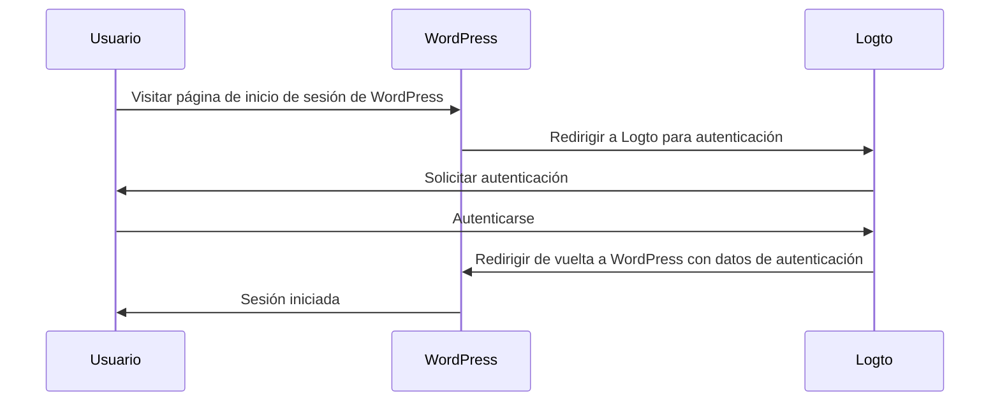
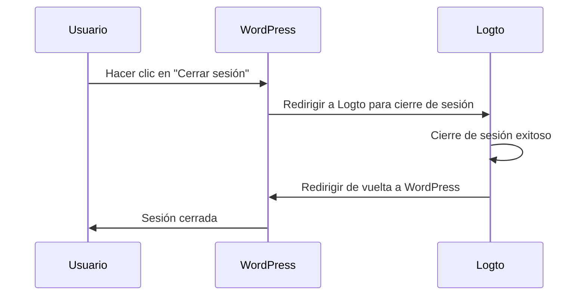

import TabItem from '@theme/TabItem';
import Tabs from '@theme/Tabs';

import FurtherReadings from '../../fragments/_further-readings.md';

# Añade autenticación a tu sitio web de WordPress con el plugin de Logto

Este tutorial te mostrará cómo integrar Logto en tu sitio web de [WordPress](https://wordpress.org) con nuestro plugin oficial de WordPress.

## Prerrequisitos \{#prerequisites}

- Una cuenta de [Logto Cloud](https://cloud.logto.io) o un [Logto autoalojado](/introduction/set-up-logto-oss).
- Una aplicación tradicional de Logto creada.
- Un proyecto de WordPress: sigue la guía oficial de [instalación de WordPress](https://wordpress.org/support/article/how-to-install-wordpress/) para configurar tu sitio web de WordPress antes de continuar.

## Integración \{#integration}

### Instalar el plugin \{#authentication-settings}

:::info
Por el momento, nuestro plugin está en revisión y no está disponible en el directorio de plugins de WordPress. Actualizaremos esta página una vez que esté disponible.
:::

<Tabs>

{/* Uncomment the following block when plugin is available in the WordPress plugin directory */}
{/* <TabItem value="admin-panel" label="Desde el panel de administración de WordPress"> */}

{/* 1. Ve a **Plugins** > **Añadir nuevo**. */}
{/* 2. Busca "Logto". */}
{/* 3. Haz clic en **Instalar ahora**. */}
{/* 4. Haz clic en **Activar**. */}

{/* </TabItem> */}

<TabItem value="upload" label="Desde carga">

1. Descarga el plugin de WordPress de Logto desde uno de los siguientes enlaces:
   - [Última versión](https://github.com/logto-io/wordpress/releases): Descarga el archivo cuyo nombre tiene el formato `logto-plugin-<version>.zip`.
     {/* Uncomment the following line when plugin is available in the WordPress plugin directory */}
     {/* - [Directorio de plugins de WordPress](https://wordpress.org/plugins) y busca "Logto". */}
2. Descarga el archivo ZIP del plugin.
3. Ve a **Plugins** > **Añadir nuevo** en el panel de administración de WordPress.
4. Haz clic en **Subir plugin**.
5. Selecciona el archivo ZIP descargado y haz clic en **Instalar ahora**.
6. Haz clic en **Activar**.

</TabItem>

</Tabs>

### Configurar el plugin \{#scopes}

Ahora deberías poder ver el menú de Logto en la barra lateral del panel de administración de WordPress. Haz clic en **Logto** > **Configuración** para configurar el plugin.

:::note
Debes tener una aplicación **web tradicional** creada en Logto Console antes de configurar el plugin. Si no has creado una, por favor consulta [Integrar Logto en tu aplicación](/integrate-logto/integrate-logto-into-your-application) para más información.
:::

La configuración mínima para comenzar con el plugin es:

- Endpoint de Logto: El endpoint de tu inquilino de Logto.
- ID de la aplicación: El ID de tu aplicación de Logto.
- Secreto de la aplicación: Uno de los secretos válidos de tu aplicación de Logto.

Todos los valores se pueden encontrar en la página de detalles de la aplicación en Logto Console.

Después de completar los valores, haz clic en **Guardar cambios** (desplázate hacia abajo en la página si no encuentras el botón).

### Configurar URI de redirección \{#extra-params}

El URI de redirección es la URL a la que Logto redirigirá a los usuarios después de que se hayan autenticado; y el URI de redirección posterior al cierre de sesión es la URL a la que Logto redirigirá a los usuarios después de que hayan cerrado sesión.

Aquí tienes un diagrama de secuencia no normativo para ilustrar el flujo de inicio de sesión:

Así es como se ve el flujo de cierre de sesión en un diagrama de secuencia no normativo:

Para aprender más sobre por qué se necesita la redirección, consulta [Experiencia de inicio de sesión explicada](/concepts/sign-in-experience).

En nuestro caso, necesitamos configurar ambos URIs de redirección en tu Logto Console. Para encontrar el URI de redirección, ve a la página **Logto** > **Configuración** en tu panel de administración de WordPress. Verás los campos **Redirect URI** y **Post sign-out redirect URI**.

1. Copia los valores de **Redirect URI** y **Post sign-out redirect URI** y pégalos en los campos **Redirect URIs** y **Post sign-out redirect URIs** en tu Logto Console.
2. Haz clic en **Guardar cambios** en Logto Console.

### Punto de control: Prueba tu sitio web de WordPress \{#require-verified-email}

Ahora puedes probar tu integración de Logto en tu sitio web de WordPress:

1. Abre una ventana de navegador en modo incógnito si es necesario.
2. Visita tu sitio web de WordPress y haz clic en el enlace **Iniciar sesión** si corresponde; o visita directamente la página de inicio de sesión (por ejemplo, `https://example.com/wp-login.php`).
3. La página debería redirigirte a la página de inicio de sesión de Logto.
4. Completa el proceso de inicio de sesión o registro.
5. Después de una autenticación exitosa, deberías ser redirigido de vuelta a tu sitio web de WordPress e iniciar sesión automáticamente.
6. Haz clic en el enlace **Cerrar sesión** para cerrar sesión en tu sitio web de WordPress.
7. Deberías ser redirigido a la página de cierre de sesión de Logto, y luego de vuelta a tu sitio web de WordPress.
8. Deberías haber cerrado sesión en tu sitio web de WordPress.

## Configuración de autenticación \{#require-organization-id}

Aunque el plugin funciona de inmediato, puedes personalizar la configuración de autenticación en la página de configuración del plugin de Logto para adaptarla mejor a tus necesidades.

### Alcances \{#authorization-settings}

Logto utiliza alcances para controlar qué información se comparte con tu aplicación. El plugin de WordPress de Logto utiliza [Logto PHP SDK](https://github.com/logto-io/php) para manejar el proceso de autenticación, que incluye los siguientes alcances por defecto:

- `openid`: El alcance básico requerido para OpenID Connect.
- `profile`: Para obtener la información básica del perfil del usuario.
- `offline_access`: Para obtener un token de actualización para acceso sin conexión.

Para más información sobre alcances, consulta [Alcances y reclamos](/quick-starts/php#scopes-and-claims).

El plugin también añade dos alcances adicionales por defecto:

- `email`: Para obtener la dirección de correo electrónico del usuario.
- `roles`: Para obtener los roles del usuario en Logto.

Estos dos alcances se utilizan para mapear el correo electrónico y los roles de Logto a los correos electrónicos y roles de WordPress. Puedes personalizar los alcances editando el campo **Scopes** en la configuración del plugin.

:::warning
Si eliminas el alcance `email` o `roles`, algunas funciones del plugin no funcionarán correctamente.
:::

### Parámetros extra \{#role-mapping}

Es posible que desees añadir algunos parámetros extra a la solicitud de autenticación para personalizar el proceso de autenticación. Por ejemplo, puedes añadir el parámetro `first_screen` para decidir qué pantalla mostrar primero en el proceso de autenticación.

Para más información sobre parámetros extra, consulta [Parámetros de autenticación](/end-user-flows/authentication-parameters).

### Requerir correo electrónico verificado \{#advanced-settings}

Por defecto, el plugin requiere que los usuarios tengan una dirección de correo electrónico verificada en Logto para iniciar sesión en tu sitio web de WordPress. Si un usuario intenta iniciar sesión sin una dirección de correo electrónico verificada, el plugin lanzará un error.

Puedes desactivar esta función desmarcando la opción **Requerir correo electrónico verificado** en la configuración del plugin.

### Requerir ID de organización \{#remember-session}

Puedes requerir que los usuarios tengan una membresía específica de organización en Logto para iniciar sesión en tu sitio web de WordPress. Cuando se especifica un ID de organización, el plugin verificará si el usuario tiene el ID de organización especificado en su Token de ID. Si no, se lanzará un error.

Para aprender más sobre organizaciones, consulta [Organizaciones](/organizations).

## Configuración de autorización \{#sync-profile}

Además de la autenticación, Logto también proporciona características de autorización como [control de acceso basado en roles (RBAC)](/authorization/role-based-access-control). Aunque requiere algo de código personalizado para implementar RBAC si estás desarrollando tu propia aplicación, el plugin de WordPress de Logto proporciona una forma integrada de mapear roles de Logto a [roles de WordPress](https://wordpress.org/documentation/article/roles-and-capabilities/).

### Mapeo de roles \{#wordpress-form-login}

El plugin de WordPress de Logto te permite mapear roles de Logto a roles de WordPress. Esto significa que puedes asignar diferentes roles a los usuarios en Logto, y el plugin asignará automáticamente los roles de WordPress correspondientes a esos usuarios cuando inicien sesión.

Para mapear roles, haz clic en **Añadir** en la sección **Mapeo de roles** para añadir un nuevo mapeo de roles. Por ejemplo, si deseas mapear el rol `group:editors` en Logto al rol `Editor` en WordPress, puedes hacerlo añadiendo un nuevo mapeo de roles con los siguientes valores:

- Rol de Logto: `group:editors`
- Rol de WordPress: `editor` (el slug del rol `Editor` en WordPress)

Puedes encontrar los slugs de los roles de todos los roles de WordPress en la documentación de [Roles y Capacidades](https://wordpress.org/documentation/article/roles-and-capabilities/).

:::note
Los slugs de roles son sensibles a mayúsculas y minúsculas. Si ingresas el nombre del rol como `Editor` en lugar de `editor`, el mapeo de roles no funcionará.
:::

Ahora, dirígete a Logto Console y haz clic en **Roles** en la barra lateral izquierda. Crea un nuevo rol llamado `group:editors` y asígnalo a un usuario. Luego inicia sesión en tu sitio web de WordPress con ese usuario. Deberías ver que al usuario se le ha asignado el rol `Editor` en WordPress.

:::note
Si el usuario ha iniciado sesión en tu sitio web de WordPress, el mapeo de roles no tendrá efecto hasta que el usuario cierre sesión y vuelva a iniciar sesión.
:::

También puedes añadir múltiples mapeos de roles para mapear múltiples roles de Logto a roles de WordPress. Por el momento, el plugin intentará mapear los roles con el orden de precedencia. Por ejemplo, si tienes los siguientes mapeos de roles:

- Rol de Logto: `group:editors`, Rol de WordPress: `editor`
- Rol de Logto: `group:authors`, Rol de WordPress: `author`
- Rol de Logto: `group:subscribers`, Rol de WordPress: `subscriber`

Y un usuario tiene ambos roles `group:editors` y `group:authors` en Logto, al usuario se le asignará el rol `Editor` en WordPress.

## Configuración avanzada \{#username-strategy}

### Recordar sesión \{#troubleshooting}

Por defecto, el plugin recordará la sesión del usuario durante 2 semanas. Esto significa que si un usuario inicia sesión en tu sitio web de WordPress, no se le pedirá que inicie sesión nuevamente durante 2 semanas. Puedes reducir este tiempo a 2 días desmarcando la opción **Recordar sesión** en la configuración del plugin.

### Sincronizar perfil \{#callback-url-shows-404}

Por defecto, el plugin sincronizará el perfil del usuario en cada inicio de sesión. Esto significa que si un usuario inicia sesión en tu sitio web de WordPress, su perfil se actualizará con la información más reciente de Logto. Puedes desactivar esta función desmarcando la opción **Sincronizar perfil** en la configuración del plugin.

:::warning
Si desactivas esta función, el mapeo de roles solo tendrá efecto cuando el usuario inicie sesión por primera vez.
:::

### Inicio de sesión con formulario de WordPress \{#frequently-asked-questions}

Por defecto, puedes añadir `?form=1` a la URL de inicio de sesión de WordPress para usar el inicio de sesión con formulario de WordPress. Esto es útil para propósitos de prueba, pero puedes desactivar esta función si no deseas permitir que los usuarios inicien sesión con el formulario de WordPress.

### Estrategia de nombre de usuario \{#how-can-i-trigger-the-forgot-password-flow}

Hay múltiples formas de generar un nombre de usuario para un usuario en WordPress. Es seguro usar la estrategia predeterminada cuando confías en el correo electrónico como el identificador único de un usuario.

## Solución de problemas \{#how-can-i-use-the-wordpress-form-login}

### La URL de callback muestra 404 \{#further-readings}

Si la URL de callback muestra un error 404, es probable que las reglas de reescritura de WordPress estén desactualizadas y necesiten ser actualizadas manualmente. Para hacer esto, ve a **Configuración** > **Enlaces permanentes** en tu panel de administración de WordPress (o visita `/wp-admin/options-permalink.php` directamente) y haz clic en **Guardar cambios**.

## Preguntas frecuentes \{#frequently-asked-questions}

### ¿Cómo puedo activar el flujo de recuperación de contraseña? \{#how-can-i-trigger-the-forgot-password-flow}

Hay dos formas de activar el flujo de recuperación de contraseña:

1. Haz clic en el enlace de recuperación de contraseña en la página de inicio de sesión de Logto.
2. Añade `?action=lostpassword` a la URL de inicio de sesión de WordPress. Por ejemplo, `https://example.com/wp-login.php?action=lostpassword`.
   Esto te redirigirá a la página de recuperación de contraseña de Logto.

### ¿Cómo puedo usar el inicio de sesión con formulario de WordPress? \{#how-can-i-use-the-wordpress-form-login}

Por defecto, puedes añadir `?form=1` a la URL de inicio de sesión de WordPress para usar el inicio de sesión con formulario de WordPress. Por ejemplo, `https://example.com/wp-login.php?form=1`.

Si deseas desactivar esta función, puedes desmarcar la opción **Inicio de sesión con formulario de WordPress** en la configuración del plugin.

## Lecturas adicionales \{#further-readings}

<FurtherReadings />
