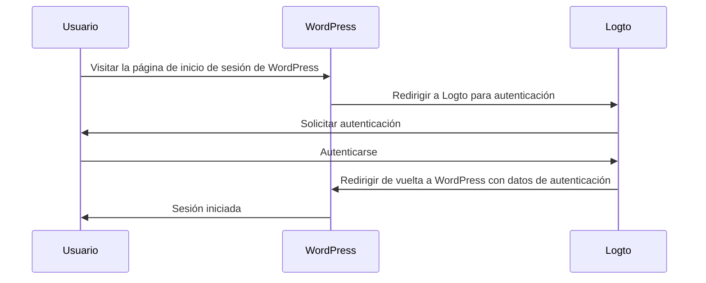
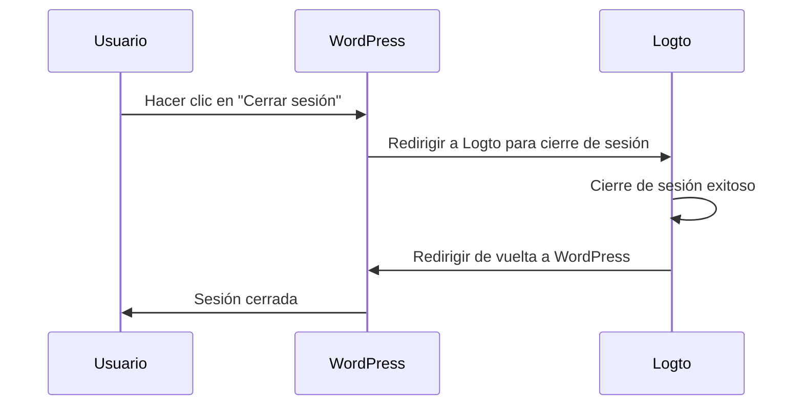

import TabItem from '@theme/TabItem';
import Tabs from '@theme/Tabs';

### Instalar el plugin \{#install-the-plugin}

:::info
Por el momento, nuestro plugin aún está en revisión y no está disponible en el directorio de plugins de WordPress. Actualizaremos esta página una vez que esté disponible.
:::

<Tabs>

{/* Descomenta el siguiente bloque cuando el plugin esté disponible en el directorio de plugins de WordPress */}
{/* <TabItem value="admin-panel" label="Desde el panel de administración de WordPress"> */}

{/* 1. Ve a **Plugins** > **Añadir nuevo**. */}
{/* 2. Busca "Logto". */}
{/* 3. Haz clic en **Instalar ahora**. */}
{/* 4. Haz clic en **Activar**. */}

{/* </TabItem> */}

<TabItem value="upload" label="Desde la carga">

1. Descarga el plugin de WordPress de Logto desde uno de los siguientes enlaces:
   - [Última versión](https://github.com/logto-io/wordpress/releases): Descarga el archivo cuyo nombre tiene el formato `logto-plugin-<version>.zip`.
     {/* Descomenta la siguiente línea cuando el plugin esté disponible en el directorio de plugins de WordPress */}
     {/* - [Directorio de plugins de WordPress](https://wordpress.org/plugins) y busca "Logto". */}
2. Descarga el archivo ZIP del plugin.
3. Ve a **Plugins** > **Añadir nuevo** en tu panel de administración de WordPress.
4. Haz clic en **Subir plugin**.
5. Selecciona el archivo ZIP descargado y haz clic en **Instalar ahora**.
6. Haz clic en **Activar**.

</TabItem>

</Tabs>

### Configurar el plugin \{#configure-the-plugin}

Ahora deberías poder ver el menú de Logto en la barra lateral de tu panel de administración de WordPress. Haz clic en **Logto** > **Configuración** para configurar el plugin.

:::note
Deberías tener una aplicación **web tradicional** creada en Logto Console antes de configurar el plugin. Si no has creado una, por favor consulta [Integrar Logto en tu aplicación](/integrate-logto/integrate-logto-into-your-application) para más información.
:::

La configuración mínima para comenzar con el plugin es:

- Endpoint de Logto: El endpoint de tu inquilino de Logto.
- ID de la aplicación: El ID de tu aplicación Logto.
- Secreto de la aplicación: Uno de los secretos válidos de tu aplicación Logto.

Todos los valores se pueden encontrar en la página de detalles de la aplicación en Logto Console.

Después de completar los valores, haz clic en **Guardar cambios** (desplázate hacia abajo en la página si no encuentras el botón).

### Configurar URI de redirección \{#configure-redirect-uri}

El URI de redirección es la URL a la que Logto redirigirá a los usuarios después de que se hayan autenticado; y el URI de redirección posterior al cierre de sesión es la URL a la que Logto redirigirá a los usuarios después de que hayan cerrado sesión.

Aquí tienes un diagrama de secuencia no normativo para ilustrar el flujo de inicio de sesión:

Así es como se ve el flujo de cierre de sesión en un diagrama de secuencia no normativo:

Para aprender más sobre por qué se necesita la redirección, consulta [Experiencia de inicio de sesión explicada](/concepts/sign-in-experience).

En nuestro caso, necesitamos configurar ambos URIs de redirección en tu Logto Console. Para encontrar el URI de redirección, ve a la página **Logto** > **Configuración** en tu panel de administración de WordPress. Verás los campos **URI de redirección** y **URI de redirección posterior al cierre de sesión**.

1. Copia los valores de **URI de redirección** y **URI de redirección posterior al cierre de sesión** y pégalos en los campos **URIs de redirección** y **URIs de redirección posterior al cierre de sesión** en tu Logto Console.
2. Haz clic en **Guardar cambios** en Logto Console.

### Punto de control: Prueba tu sitio web de WordPress \{#checkpoint-test-your-website}

Ahora puedes probar tu integración de Logto en tu sitio web de WordPress:

1. Abre una ventana de navegador en modo incógnito si es necesario.
2. Visita tu sitio web de WordPress y haz clic en el enlace **Iniciar sesión** si es aplicable; o visita directamente la página de inicio de sesión (por ejemplo, `https://example.com/wp-login.php`).
3. La página debería redirigirte a la página de inicio de sesión de Logto.
4. Completa el proceso de inicio de sesión o registro.
5. Después de una autenticación exitosa, deberías ser redirigido de vuelta a tu sitio web de WordPress y haber iniciado sesión automáticamente.
6. Haz clic en el enlace **Cerrar sesión** para cerrar sesión en tu sitio web de WordPress.
7. Deberías ser redirigido a la página de cierre de sesión de Logto, y luego de vuelta a tu sitio web de WordPress.
8. Deberías haber cerrado sesión en tu sitio web de WordPress.
