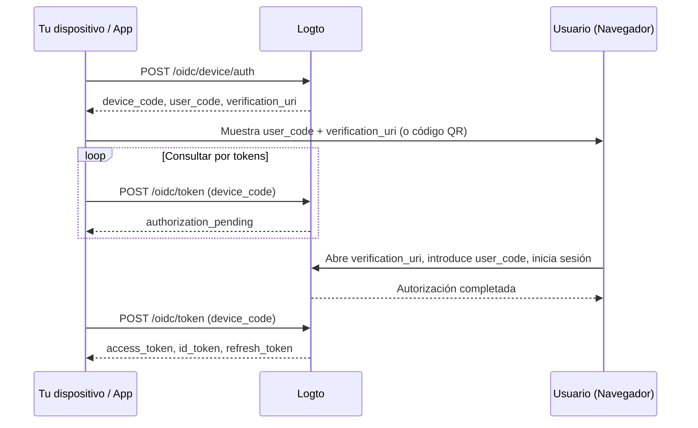

import ApiResourcesDescription from '../../fragments/_api-resources-description.md';
import FurtherReadings from '../../fragments/_further-readings.md';
import ScopeClaimList from '../../fragments/_scope-claim-list.md';
import ScopesAndClaimsIntroduction from '../../fragments/_scopes-claims-introduction.md';

# Flujo de dispositivo: Autenticación con Logto

:::note
Esta guía asume que has creado una Aplicación de tipo "Nativa" con flujo de dispositivo como el flujo de autorización en la Consola de Logto.
:::

## Introducción \{#introduction}

El [grant de autorización de dispositivo de OAuth 2.0](https://auth.wiki/device-flow) (flujo de dispositivo) está diseñado para dispositivos con capacidades de entrada limitadas, como smart TVs, consolas de juegos, herramientas CLI y dispositivos IoT. Permite a los usuarios iniciar el proceso de inicio de sesión en el dispositivo pero completar la autenticación en otro dispositivo con navegador, como un teléfono o portátil.

Dado que el propio dispositivo no puede manejar un flujo de inicio de sesión basado en navegador, el dispositivo muestra un código corto y una URL. El usuario visita esa URL en otro dispositivo, introduce el código e inicia sesión. Mientras tanto, el dispositivo original consulta Logto hasta que la autorización se completa.



## Obtén las credenciales de la aplicación \{#get-application-credentials}

En tu Consola de Logto, navega a la página de detalles de tu aplicación para obtener las siguientes credenciales:

- **App ID**: El identificador único de tu aplicación (también conocido como `client_id`).
- **Endpoint de Logto**: El endpoint de tu servidor de autorización Logto. Puedes encontrarlo en la Consola de Logto bajo "Detalles de la aplicación".

Para Logto Cloud, el endpoint es `https://{your-tenant-id}.logto.app`.

:::note
Las apps de flujo de dispositivo son clientes públicos, por lo que no se requiere App Secret.
:::

## Solicita un código de dispositivo \{#request-a-device-code}

Inicia el flujo de dispositivo enviando una solicitud `POST` al endpoint de autorización de dispositivo:

```bash
curl --request POST 'https://your.logto.endpoint/oidc/device/auth' \
  --header 'Content-Type: application/x-www-form-urlencoded' \
  --data-urlencode 'client_id=your-application-id' \
  --data-urlencode 'scope=openid offline_access profile'
```

La respuesta incluye:

| Campo                       | Descripción                                                                                                                                                                                                                |
| --------------------------- | -------------------------------------------------------------------------------------------------------------------------------------------------------------------------------------------------------------------------- |
| `device_code`               | Un código único para que tu app lo use al consultar el endpoint de token.                                                                                                                                                  |
| `user_code`                 | Un código corto para mostrar al usuario y que lo introduzca en el navegador.                                                                                                                                               |
| `verification_uri`          | La URL donde el usuario introduce el `user_code`.                                                                                                                                                                          |
| `verification_uri_complete` | Una URL con el `user_code` pre-rellenado. Los usuarios pueden visitar esta URL directamente para saltarse la introducción manual del código — puedes presentarla como código QR, enlace clicable, o cualquier otro método. |
| `expires_in`                | El tiempo de vida en segundos de `device_code` y `user_code`. Deja de consultar cuando esto expire.                                                                                                                        |

## Muestra la URL de verificación al usuario \{#display-verification-url}

Muestra el `user_code` y el `verification_uri` en la pantalla de tu dispositivo.

Alternativamente, puedes usar `verification_uri_complete` que ya tiene el código pre-rellenado — el usuario solo necesita confirmar. Cómo lo presentes depende de ti: un código QR, un enlace clicable, etc.

## Consulta por tokens \{#poll-for-tokens}

Mientras el usuario completa la autenticación en el navegador, tu dispositivo debe consultar el endpoint de token. Tu app debe esperar al menos **5 segundos** entre solicitudes de consulta:

```bash
curl --request POST 'https://your.logto.endpoint/oidc/token' \
  --header 'Content-Type: application/x-www-form-urlencoded' \
  --data-urlencode 'client_id=your-application-id' \
  --data-urlencode 'grant_type=urn:ietf:params:oauth:grant-type:device_code' \
  --data-urlencode 'device_code=DEVICE_CODE'
```

Reemplaza `DEVICE_CODE` con el valor de `device_code` de la respuesta de autorización de dispositivo.

**Deja de consultar** cuando:

- Recibas una respuesta de token exitosa.
- El tiempo `expires_in` de la respuesta del código de dispositivo haya expirado.
- Recibas un error no reintentable como `expired_token` o `access_denied`.

### Respuesta de token \{#token-response}

Después de que el usuario aprueba, la respuesta incluye:

| Campo           | Descripción                                                                                                                                |
| --------------- | ------------------------------------------------------------------------------------------------------------------------------------------ |
| `access_token`  | El token de acceso. Es una cadena opaca por defecto; cuando se solicita un `resource`, es un JWT con `aud` establecido al URI del recurso. |
| `id_token`      | El token de ID que contiene los reclamos de identidad del usuario. Solo presente cuando se solicita el alcance `openid`.                   |
| `refresh_token` | Se utiliza para obtener nuevos tokens sin reautenticación. Solo presente cuando se solicita el alcance `offline_access`.                   |
| `token_type`    | Siempre `Bearer`.                                                                                                                          |
| `expires_in`    | Tiempo de vida del token en segundos.                                                                                                      |
| `scope`         | Los alcances concedidos por el servidor de autorización.                                                                                   |

## Punto de control: Prueba tu flujo de dispositivo \{#checkpoint}

Ahora, prueba la integración de tu flujo de dispositivo:

1. Ejecuta tu app y activa el flujo de dispositivo para obtener un `device_code` y un `user_code`.
2. Abre el `verification_uri` en un navegador e introduce el `user_code`, o usa `verification_uri_complete` para saltar la introducción manual del código.
3. Completa el proceso de inicio de sesión en el navegador.
4. Verifica que tu app reciba los tokens después de consultar.

## Obtén información del usuario \{#get-user-information}

### Decodifica los reclamos del ID token \{#decode-id-token-claims}

El `id_token` devuelto en la respuesta de token es un [JSON Web Token (JWT)](https://auth.wiki/jwt) estándar. Puedes decodificar la carga útil codificada en Base64URL (la segunda parte del JWT, separada por `.`) para acceder a los reclamos básicos del usuario sin una solicitud de red adicional.

La carga útil decodificada contiene reclamos como `sub` (ID de usuario), `name`, `email`, etc., dependiendo de los alcances solicitados.

:::tip
Para uso en producción, debes validar la firma del JWT antes de confiar en sus reclamos. Usa el JWKS de tu endpoint de Logto (`https://your.logto.endpoint/oidc/jwks`) para verificar el token.
:::

### Obtén información desde el endpoint userinfo \{#fetch-from-userinfo-endpoint}

El ID token contiene reclamos básicos según los alcances solicitados. Algunos reclamos extendidos (como `custom_data`, `identities`) solo están disponibles a través del [endpoint OIDC UserInfo](https://openid.net/specs/openid-connect-core-1_0.html#UserInfo):

```bash
curl --request GET 'https://your.logto.endpoint/oidc/me' \
  --header 'Authorization: Bearer ACCESS_TOKEN'
```

Reemplaza `ACCESS_TOKEN` con el token de acceso opaco (no el token de recurso JWT) obtenido de la respuesta de token. La respuesta es un objeto JSON que contiene los reclamos del usuario según los alcances concedidos.

### Solicita reclamos adicionales \{#request-additional-claims}

Puede que notes que falta alguna información del usuario en el ID token. Esto se debe a que OAuth 2.0 y OpenID Connect (OIDC) están diseñados para seguir el principio de privilegio mínimo (PoLP), y Logto está construido sobre estos estándares.

<ScopesAndClaimsIntroduction />

Para solicitar alcances adicionales, inclúyelos en el parámetro `scope` de la solicitud de autorización de dispositivo. Por ejemplo, para solicitar el correo electrónico y el teléfono del usuario:

```bash
curl --request POST 'https://your.logto.endpoint/oidc/device/auth' \
  --header 'Content-Type: application/x-www-form-urlencoded' \
  --data-urlencode 'client_id=your-application-id' \
  --data-urlencode 'scope=openid offline_access profile email phone'
```

### Alcances y reclamos \{#scopes-and-claims}

<ScopeClaimList />

## Recursos de API y organizaciones \{#api-resources-and-organizations}

<ApiResourcesDescription />

### Solicita acceso para recursos de API \{#request-access-for-api-resources}

Para acceder a un recurso de API específico, incluye el parámetro `resource` en la solicitud de autorización de dispositivo:

```bash
curl --request POST 'https://your.logto.endpoint/oidc/device/auth' \
  --header 'Content-Type: application/x-www-form-urlencoded' \
  --data-urlencode 'client_id=your-application-id' \
  --data-urlencode 'scope=openid offline_access' \
  --data-urlencode 'resource=https://your-api-resource-indicator'
```

Una vez que el usuario complete la autorización y recibas un refresh token, puedes obtener tokens de acceso JWT para el recurso de API:

```bash
curl --request POST 'https://your.logto.endpoint/oidc/token' \
  --header 'Content-Type: application/x-www-form-urlencoded' \
  --data-urlencode 'client_id=your-application-id' \
  --data-urlencode 'grant_type=refresh_token' \
  --data-urlencode 'refresh_token=REFRESH_TOKEN' \
  --data-urlencode 'resource=https://your-api-resource-indicator'
```

La respuesta contendrá un `access_token` JWT con `aud` establecido a tu indicador de recurso de API.

:::note
El `refresh_token` solo está disponible cuando el alcance `offline_access` se incluye en la solicitud inicial de autorización de dispositivo. Siempre almacena y usa el último `refresh_token`, ya que Logto utiliza rotación de tokens.
:::

### Obtén tokens de organización \{#fetch-organization-tokens}

Si [organizaciones](/organizations) es nuevo para ti, por favor lee [🏢 Organizaciones (Multi-tenancy)](/organizations) para comenzar.

Para solicitar información relacionada con la organización, añade el alcance `urn:logto:scope:organizations` en la solicitud de autorización de dispositivo:

```bash
curl --request POST 'https://your.logto.endpoint/oidc/device/auth' \
  --header 'Content-Type: application/x-www-form-urlencoded' \
  --data-urlencode 'client_id=your-application-id' \
  --data-urlencode 'scope=openid offline_access urn:logto:scope:organizations' \
  --data-urlencode 'resource=urn:logto:resource:organizations'
```

Una vez que el usuario haya iniciado sesión, puedes obtener tokens de organización usando el refresh token:

```bash
curl --request POST 'https://your.logto.endpoint/oidc/token' \
  --header 'Content-Type: application/x-www-form-urlencoded' \
  --data-urlencode 'client_id=your-application-id' \
  --data-urlencode 'grant_type=refresh_token' \
  --data-urlencode 'refresh_token=REFRESH_TOKEN' \
  --data-urlencode 'organization_id=your-organization-id'
```

La respuesta contendrá un token de acceso limitado a la organización especificada.

#### Recursos de API de la organización \{#organization-api-resources}

Para obtener un token de acceso para un recurso de API dentro de una organización, incluye ambos parámetros `resource` y `organization_id`:

```bash
curl --request POST 'https://your.logto.endpoint/oidc/token' \
  --header 'Content-Type: application/x-www-form-urlencoded' \
  --data-urlencode 'client_id=your-application-id' \
  --data-urlencode 'grant_type=refresh_token' \
  --data-urlencode 'refresh_token=REFRESH_TOKEN' \
  --data-urlencode 'organization_id=your-organization-id' \
  --data-urlencode 'resource=https://your-api-resource-indicator'
```

## Lecturas adicionales \{#further-readings}

<FurtherReadings />
