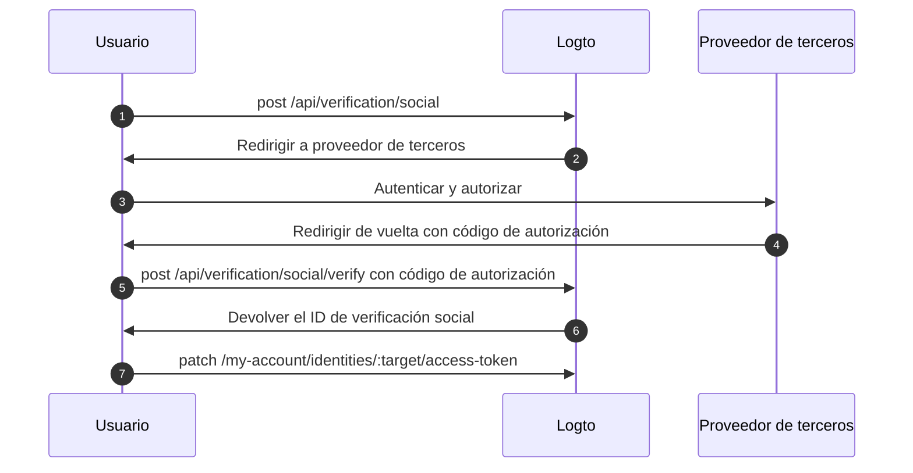

import Availability from '@components/Availability';

<Availability cloud oss={{ major: 1, minor: 31 }} />

El conjunto de tokens federados es un tipo de secreto almacenado en el Secret Vault de Logto, utilizado para gestionar de forma segura los tokens de acceso y actualización emitidos por proveedores de identidad de terceros federados. Cuando un usuario se autentica a través de un conector social o de SSO empresarial, Logto almacena los tokens emitidos en el vault. Estos tokens pueden recuperarse posteriormente para acceder a APIs de terceros en nombre del usuario, sin requerir una nueva autenticación.

## Habilitar el almacenamiento de tokens federados \{#enable-federated-token-storage}

### Conectores sociales \{#social-connectors}

:::Info
Esta función solo está disponible para conectores que admiten almacenamiento de tokens. Los conectores actualmente soportados incluyen: [GitHub](/integrations/github), [Google](/integrations/google), [Facebook](/integrations/facebook), [OAuth 2.0 estándar](/integrations/oauth2) y [OIDC estándar](/integrations/oidc). El soporte para conectores adicionales se implementará gradualmente.
:::

1. Navega a <CloudLink to="/connectors/social">Consola > Conectores > Conectores sociales</CloudLink>.
2. Selecciona el conector social para el que deseas habilitar el almacenamiento de tokens federados.
3. En la página "Configuración", habilita la opción **Almacenar tokens para acceso persistente a la API**.

### Conectores de SSO empresarial \{#enterprise-sso-connectors}

:::Info
El almacenamiento de tokens está disponible para todos los conectores empresariales OIDC.
:::

1. Navega a <CloudLink to="/enterprise-sso">Consola > SSO empresarial</CloudLink>.
2. Selecciona el conector de SSO empresarial para el que deseas habilitar el almacenamiento de tokens federados.
3. En la pestaña "Experiencia SSO", habilita la opción **Almacenar tokens para acceso persistente a la API**.

Asegúrate de guardar los cambios.

## Almacenamiento de tokens \{#token-storage}

Una vez habilitado el almacenamiento de tokens federados, Logto almacena automáticamente los tokens de acceso y actualización emitidos por el proveedor de identidad federado cada vez que un usuario se autentica a través de un conector social o de SSO empresarial. Esto incluye:

- [Inicio de sesión y registro social](/end-user-flows/sign-up-and-sign-in/social-sign-in)
- [Inicio de sesión y registro con SSO empresarial](/end-user-flows/enterprise-sso)
- [Vinculación de cuentas sociales a través del Account API](/end-user-flows/account-settings/by-account-api#link-a-new-social-connection)

Los tokens almacenados se adjuntan a la identidad social o de SSO empresarial del usuario, permitiendo que los recupere posteriormente para acceder a APIs sin requerir una nueva autenticación.

### Comprobar el estado del almacenamiento de tokens \{#checking-token-storage-status}

Puedes comprobar el estado del almacenamiento de tokens federados de un usuario en la Consola de Logto:

1. Navega a <CloudLink to="/users">Consola > Usuarios</CloudLink>.
2. Haz clic en el usuario que deseas inspeccionar. Esto te llevará a la página de detalles del usuario.
3. Desplázate hasta la sección **Conexiones**. Esta área muestra todas las conexiones sociales y de SSO empresarial asociadas al usuario.
4. Cada entrada de conexión muestra una etiqueta de estado de token que indica si los tokens están almacenados para esa conexión.
5. Haz clic en la entrada de la conexión para ver más detalles, incluyendo los metadatos del token de acceso almacenado y la disponibilidad del token de actualización (si está disponible).

También puedes comprobar las identidades de terceros del usuario y el estado del almacenamiento de tokens a través del Management API:

- `GET /api/users/{userId}/identities/{target}?includeTokenSecret=true`: Recupera la identidad social de un usuario y el estado del almacenamiento de tokens asociado a la identidad por un conector específico (por ejemplo, `github`, `google`, etc.).
- `GET /api/users/{userId}/sso-identities/{ssoConnectorId}?includeTokenSecret=true`: Recupera la identidad de SSO empresarial de un usuario y el estado del almacenamiento de tokens asociado a la identidad por un ID de conector SSO dado.

### Estado del almacenamiento de tokens \{#token-storage-status}

- **Activo**: El token de acceso está almacenado y activo.
- **Expirado**: El token de acceso está almacenado pero ha expirado. Si hay un token de actualización disponible, puede usarse para obtener un nuevo token de acceso.
- **Inactivo**: No hay token de acceso almacenado para esta conexión. Esto puede ocurrir si el usuario no se ha autenticado a través de esta conexión o si el almacenamiento de tokens ha sido eliminado.
- **No aplicable**: El conector no admite almacenamiento de tokens.

### Metadatos del token \{#token-metadata}

Por integridad y seguridad de los datos, todos los tokens se cifran antes de almacenarse en el Secret Vault. Los valores reales de los tokens solo son accesibles para el usuario final con la autorización adecuada. Los desarrolladores, por otro lado, solo pueden recuperar los metadatos del conjunto de tokens para entender el estado de los tokens almacenados sin exponer contenido sensible.

- `createdAt`: Marca de tiempo cuando se estableció la conexión por primera vez y el conjunto de tokens se almacenó inicialmente en el Secret Vault.
- `updatedAt`: La última vez que se actualizó el conjunto de tokens.
  - Si no hay token de actualización disponible, este valor será igual a **createdAt**.
  - Si hay un token de actualización presente, este valor refleja la última vez que se actualizó el token de acceso.
- `hasRefreshToken`: Indica si hay un token de actualización disponible.
  Si el conector admite acceso offline y la solicitud de autorización está correctamente configurada, Logto almacena el token de actualización cuando es emitido por el proveedor de identidad junto con el token de acceso.
  Cuando el token de acceso expira y existe un token de actualización válido, Logto intenta automáticamente obtener un nuevo token de acceso usando el token de actualización almacenado cada vez que el usuario solicita acceso al proveedor conectado.
- `expiresAt`: El tiempo estimado de expiración del token de acceso en **segundos**.
  Esto se calcula en base al valor `expires_in` devuelto por el endpoint de tokens del proveedor de identidad. (Este campo solo está disponible si el proveedor incluye `expires_in` en la respuesta de tokens.)
- `scope`: El alcance (scope) del token de acceso, indicando los permisos otorgados por el proveedor de identidad.
  Esto es útil para entender qué acciones pueden realizarse con el token de acceso almacenado. (Este campo solo está disponible si el proveedor incluye `scope` en la respuesta de tokens.)
- `tokenType`: El tipo de token de acceso, típicamente "Bearer".
  (Este campo solo está disponible si el proveedor incluye `token_type` en la respuesta de tokens.)

## Recuperación de tokens \{#token-retrieval}

Una vez habilitado el almacenamiento de tokens y los tokens estén almacenados de forma segura en el Secret Vault de Logto, los usuarios finales pueden recuperar sus tokens de acceso de terceros desde tu aplicación cliente integrándose con el [Account API](/end-user-flows/account-settings/by-account-api) de Logto.

- `GET /my-account/identities/:target/access-token`: Recupera el token de acceso para una identidad social especificando el conector (por ejemplo, github, google).

- `GET /my-account/sso-identities/:connectorId/access-token`: Recupera el token de acceso para una identidad de SSO empresarial especificando el ID del conector.

:::info
Aprende cómo [habilitar](/end-user-flows/account-settings/by-account-api#how-to-enable-account-api) y [acceder](/end-user-flows/account-settings/by-account-api#access-account-api-using-access-token) al Account API usando el token de acceso emitido por Logto.
:::

### Rotación de tokens \{#token-rotation}

Los endpoints de recuperación de tokens devuelven:

- `200` OK: Si el token de acceso se recupera correctamente y sigue siendo válido.
- `404` No encontrado: Si el usuario no tiene una identidad social o de SSO empresarial asociada con el target o ID de conector especificado, o si el token de acceso no está almacenado.
- `401` No autorizado: Si el token de acceso ha expirado.

Si el token de acceso ha expirado y hay un token de actualización disponible, Logto intenta automáticamente refrescar el token de acceso y devuelve el nuevo token de acceso en la respuesta. El almacenamiento de tokens en el Secret Vault también se actualiza con el nuevo token de acceso y sus metadatos.

## Eliminación del almacenamiento de tokens \{#token-storage-deletion}

El almacenamiento de tokens federados está directamente vinculado a cada conexión social o de SSO empresarial del usuario. Esto significa que el conjunto de tokens almacenados se eliminará automáticamente en los siguientes casos:

- Se elimina la identidad social o de SSO empresarial asociada de la cuenta del usuario.
- Se elimina la cuenta del usuario de tu tenant.
- Se elimina el conector social o de SSO empresarial de tu tenant.

### Revocación de tokens \{#revoking-tokens}

También puedes eliminar manualmente el conjunto de tokens de terceros de un usuario para revocar el acceso:

- Desde la Consola:
  Navega a la página de detalles de la identidad del usuario. Desplázate hasta la sección **Token de acceso** (si el almacenamiento de tokens está disponible) y haz clic en el botón **Eliminar tokens** al final de la sección.
- Vía Management API:
  - `DELETE /api/secret/:id`: Elimina un secreto específico por su ID, que puede obtenerse desde los detalles de la identidad del usuario.

Revocar el conjunto de tokens obligará al usuario a autenticarse nuevamente con el proveedor de terceros para obtener un nuevo token de acceso antes de poder acceder a las APIs de terceros nuevamente.

## Reautenticación y renovación de tokens \{#reauthentication-and-token-renewal}

En escenarios donde un token de acceso almacenado ha expirado o cuando una aplicación necesita solicitar alcances (scopes) adicionales de API, los usuarios finales pueden reautenticarse con el proveedor de terceros para obtener un nuevo token de acceso, sin necesidad de iniciar sesión en Logto nuevamente.
Esto puede lograrse a través del [Social Verification API](https://openapi.logto.io/operation/operation-createverificationbysocial) de Logto, que permite a los usuarios reiniciar un flujo de autorización social federada y actualizar su conjunto de tokens almacenados.

:::note
La reiniciación de la autorización federada está actualmente limitada a conectores sociales.
Para conectores de SSO empresarial, la reautenticación y renovación de tokens requiere que el usuario inicie un flujo completo de autenticación de Logto nuevamente, ya que la reautorización directa con el proveedor de SSO empresarial no está soportada tras el inicio de sesión.
:::



1. El usuario inicia una solicitud de verificación social llamando al endpoint `POST /api/verification/social`. El usuario puede especificar scopes personalizados para solicitar permisos adicionales al proveedor de terceros.

   ```sh
   curl -X POST https://<your-logto-domain>/api/verification/social \
     -H "Authorization: Bearer <access_token>" \
     -H "Content-Type: application/json" \
     -d '{
       "state": "<state>",
       "connectorId": "<logto_connectorId>",
       "redirectUri": "<redirect_uri>",
       "scope": "<custom_scope>"
     }'
   ```

   - **authorization header**: El token de acceso del usuario emitido por Logto.
   - **connectorId**: El ID del conector social en Logto.
   - **redirectUri**: La URI a la que redirigir al usuario de vuelta a tu aplicación después de la autenticación. Deberás registrar esta URI en la configuración de la aplicación del proveedor.
   - **scope**: (Opcional) Scopes personalizados para solicitar permisos adicionales al proveedor de terceros. Si no se especifica, se usarán los scopes predeterminados configurados en el conector.

2. Logto crea un nuevo registro de verificación social y devuelve el ID de verificación social junto con la URL de autorización para redirigir al usuario al proveedor de terceros para autenticación.

   La respuesta tendrá el siguiente aspecto:

   ```json
   {
     "verificationRecordId": "<social_verification_id>",
     "authorizationUri": "<authorization_url>",
     "expiresAt": "<expiration_time>"
   }
   ```

3. Redirige al usuario a la URL de autorización. El usuario se autentica con el proveedor de terceros y otorga permisos.

4. El proveedor de terceros redirige al usuario de vuelta a tu aplicación cliente con un código de autorización.

5. Maneja el callback de autorización reenviando el código de autorización al endpoint de verificación de Logto:

   ```sh
   curl -X POST https://<your-logto-domain>/api/verification/social/verify \
     -H "Authorization: Bearer <access_token>" \
     -d '{
       "verificationRecordId": "<social_verification_id>",
       "connectorData": {
         "code": "<authorization_code>",
         "state": "<state>",
         "redirectUri": "<redirect_uri>"
       }
     }'
   ```

   - **authorization header**: El token de acceso del usuario emitido por Logto.
   - **verificationRecordId**: El ID de verificación social devuelto en el paso anterior.
   - **connectorData**: El código de autorización y cualquier otro dato devuelto por el proveedor de terceros durante el callback.

   :::note
   No olvides validar el parámetro `state` para prevenir ataques CSRF.
   :::

6. Logto verifica el código de autorización y lo intercambia por un nuevo token de acceso y token de actualización del proveedor de terceros, luego devuelve el ID de verificación social en la respuesta.

7. Finalmente, actualiza el almacenamiento de tokens del usuario llamando al endpoint `PATCH /my-account/identities/:target/access-token` con el ID de verificación social:

   ```sh
   curl -X PATCH https://<your-logto-domain>/my-account/identities/<target>/access-token \
     -H "Authorization: Bearer <access_token>" \
     -H "Content-Type: application/json" \
     -d '{
       "socialVerificationId": "<social_verification_id>"
     }'
   ```

   - **authorization header**: El token de acceso del usuario emitido por Logto.
   - **socialVerificationId**: El ID de registro de verificación social verificado devuelto en el paso anterior.

   Esto actualizará el almacenamiento del conjunto de tokens del usuario en el Secret Vault de Logto con el nuevo token de acceso y token de actualización, permitiendo al usuario acceder a APIs de terceros sin necesidad de iniciar sesión en Logto nuevamente.

   El token de acceso actualizado será devuelto.
