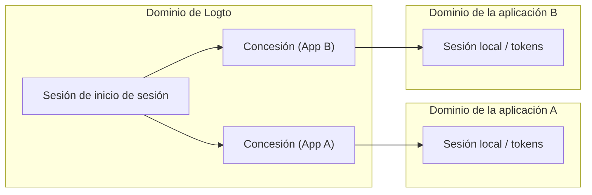
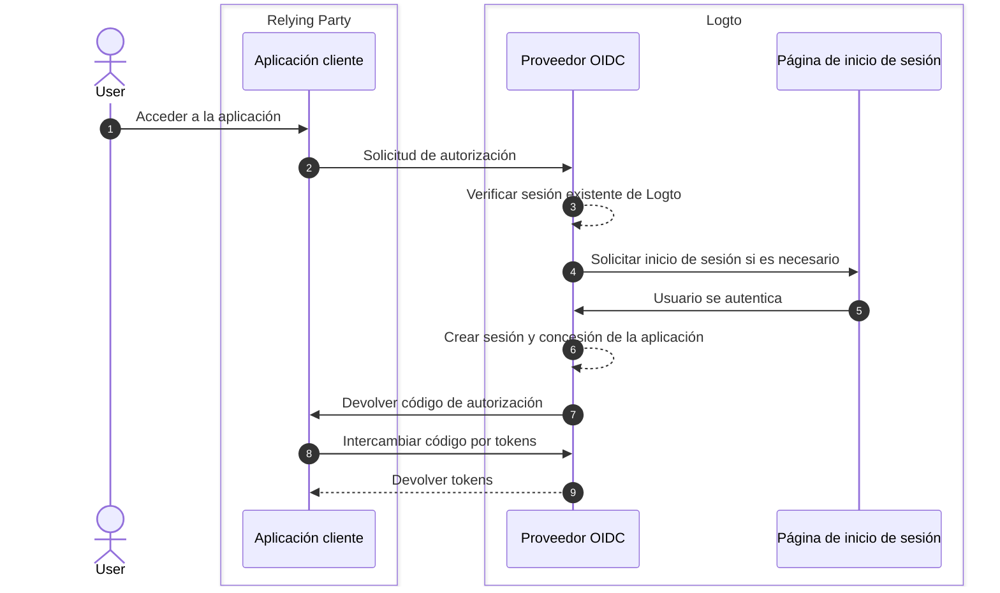
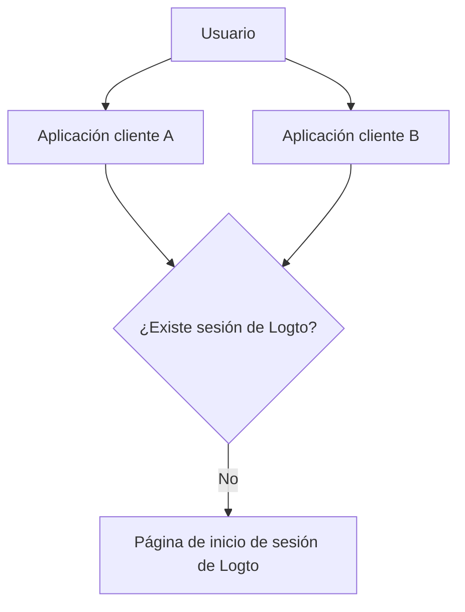

# Sesiones

Las sesiones en Logto definen cómo se crea, comparte, actualiza y revoca el estado de autenticación a través de aplicaciones, navegadores y dispositivos.

En la práctica, los usuarios experimentan "inicio de sesión" como un estado, pero el estado del sistema se divide en múltiples capas. Comprender estas capas es clave para diseñar un comportamiento predecible de SSO, renovación de tokens y cierre de sesión.

## Modelo de sesión en Logto \{#session-model-in-logto}

- **Sesión de inicio de sesión de Logto**: Estado de inicio de sesión centralizado almacenado como cookies del dominio Logto. Esto controla la disponibilidad de SSO en el contexto del navegador actual.
- **Concesión (Grant)**: Estado de autorización específico de la aplicación para `usuario + aplicación cliente`. Las concesiones son el puente entre el inicio de sesión centralizado y la emisión de tokens de la aplicación.
- **Sesión/tokens locales de la aplicación**: Estado de autenticación local en cada aplicación (tokens de ID/acceso/actualización, cookie de sesión de la aplicación, etc.).

## Conceptos clave \{#core-concepts}

### ¿Qué es una sesión de Logto? \{#what-is-a-logto-session}

Una sesión de Logto es el estado de autenticación centralizado creado después de un inicio de sesión exitoso. Si aún es válida, Logto puede autenticar a los usuarios de manera silenciosa para otras aplicaciones en el mismo inquilino. Si no existe, los usuarios deben iniciar sesión nuevamente.

### ¿Qué son las concesiones? \{#what-are-grants}

Una concesión es un estado de autorización a nivel de aplicación vinculado a un usuario específico y una aplicación cliente.

- Una sesión de Logto puede tener concesiones para múltiples aplicaciones.
- Los tokens para una aplicación se emiten bajo la concesión de esa aplicación.
- Revocar una concesión afecta la capacidad de esa aplicación para continuar con el acceso basado en tokens.

### Cómo se relacionan la sesión, las concesiones y el estado de autenticación de la aplicación \{#how-session-grants-and-app-auth-state-relate}

- **Sesión** responde: "¿Puede este navegador hacer SSO con Logto ahora mismo?"
- **Concesión** responde: "¿Está este usuario autorizado para esta aplicación cliente?"
- **Sesión local de la aplicación** responde: "¿Trata actualmente esta aplicación al usuario como si estuviera conectado?"

## Creación de sesión e inicio de sesión \{#sign-in-and-session-creation}

## Topología de sesión a través de aplicaciones y dispositivos \{#session-topology-across-apps-and-devices}

### Mismo navegador: sesión compartida de Logto \{#same-browser-shared-logto-session}

Las aplicaciones en el mismo navegador pueden compartir el estado de sesión centralizado de Logto, por lo que el SSO puede ocurrir sin la entrada repetida de credenciales.

### Diferentes navegadores o dispositivos: sesiones de Logto aisladas \{#different-browsers-or-devices-isolated-logto-sessions}

Cada navegador/dispositivo tiene un almacenamiento de cookies separado. Una sesión válida en el Dispositivo A no implica una sesión válida en el Dispositivo B.

## Ciclo de vida de la sesión \{#session-lifecycle}

### 1. Crear \{#1-create}

Después de la autenticación del usuario, Logto crea una sesión centralizada y una concesión específica de la aplicación.

### 2. Reutilizar (SSO) \{#2-reuse-sso}

Mientras las cookies de sesión sean válidas en el mismo navegador, las nuevas solicitudes de autorización pueden completarse a menudo de manera silenciosa.

### 3. Renovar tokens \{#3-renew-tokens}

El acceso a la aplicación generalmente continúa a través de flujos de actualización de tokens (cuando están habilitados). Esta es una continuidad a nivel de aplicación, separada de si la sesión centralizada de Logto aún existe.

### 4. Revocar/expirar \{#4-revokeexpire}

La revocación puede ocurrir en diferentes capas:

- El cierre de sesión local de la aplicación elimina los tokens/sesión local de la aplicación.
- El fin de la sesión elimina la sesión centralizada de Logto.
- La revocación de la concesión elimina la continuidad de la autorización a nivel de aplicación.

## Recomendaciones de diseño \{#design-recommendations}

- Mantén el manejo de la sesión local de la aplicación explícito en el código de tu aplicación.
- Trata la sesión de Logto, las concesiones y la sesión local de la aplicación como capas separadas.
- Elige si el cierre de sesión debe ser solo local de la aplicación o global.
- Usa [cierre de sesión por canal secundario](/end-user-flows/sign-out#federated-sign-out-back-channel-logout) cuando se requiera consistencia entre múltiples aplicaciones.
- Para detalles sobre el comportamiento e implementación del cierre de sesión, consulta [Cierre de sesión](/end-user-flows/sign-out).

## Mejores prácticas para revocar el acceso \{#best-practices-for-revoking-access}

Usa diferentes estrategias de revocación según tu objetivo:

- **Revocar acceso desde tus aplicaciones de primera parte**:
  Revoca la sesión objetivo con `revokeGrantsTarget=firstParty`.
  Esto cierra la sesión del usuario en las aplicaciones de primera parte asociadas con esa sesión, lo que crea una experiencia de cierre de sesión consistente.
  Al mismo tiempo, las concesiones para aplicaciones de terceros que tienen `offline_access` concedido pueden permanecer disponibles para integraciones continuas.
  Consulta [Gestionar sesiones de usuario](/sessions/manage-user-sessions) para obtener detalles sobre la revocación de sesiones.

- **Revocar acceso a aplicaciones de terceros**:
  Elige una de las siguientes opciones:

  - Revoca la sesión con `revokeGrantsTarget=all` para revocar todas las concesiones asociadas con esa sesión.
  - Revoca concesiones específicas directamente a través de las APIs de gestión de concesiones para eliminar autorizaciones de aplicaciones de terceros sin forzar el cierre completo de la sesión.
    Consulta [Gestionar aplicaciones autorizadas por el usuario (concesiones)](/sessions/grants-management) para estrategias de revocación específicas de concesiones.

- **Al usar Logto Console**:
  En la página de detalles del usuario, Logto proporciona tanto la gestión de sesiones como la gestión de aplicaciones de terceros autorizadas de manera predeterminada.
  - Revocar una sesión también revoca las concesiones de aplicaciones de primera parte, para mantener el comportamiento de cierre de sesión de primera parte consistente.
  - Revocar una autorización de aplicación de terceros revoca las concesiones para esa aplicación de terceros mientras mantiene el estado original de la sesión sin cambios.

## Recursos relacionados \{#related-resources}

<Url href="/sessions/manage-user-sessions">Gestionar sesiones de usuario</Url>
<Url href="/sessions/grants-management">
  Gestionar aplicaciones autorizadas por el usuario (concesiones)
</Url>
<Url href="/sessions/session-configs">Configuración de sesiones</Url>
<Url href="/end-user-flows/sign-out">Cierre de sesión</Url>
<Url href="/end-user-flows/sign-up-and-sign-in">Registro e inicio de sesión</Url>
<Url href="/integrate-logto/integrate-logto-into-your-application/understand-authentication-flow">
  Comprender el flujo de autenticación
</Url>
