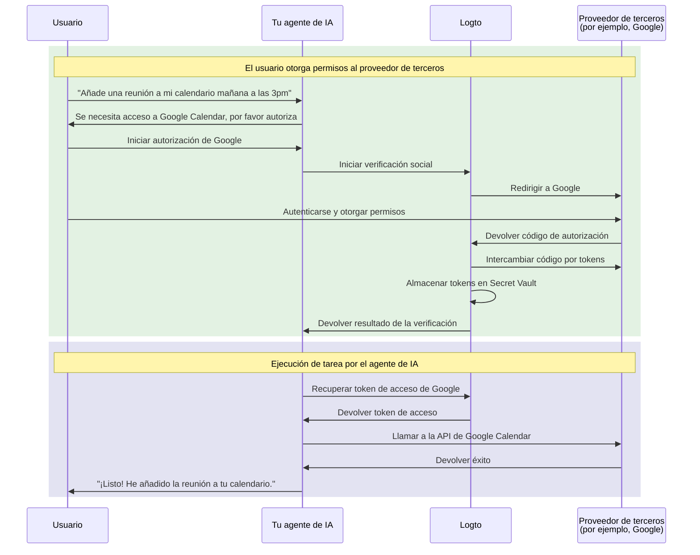

# Conecta tu agente de IA a APIs de terceros

Esta guía te muestra cómo habilitar que tu agente de IA acceda a APIs de terceros (por ejemplo, Google Calendar, GitHub, etc.) en nombre de los usuarios. Aprovechando los conectores sociales de Logto y el Secret Vault, puedes almacenar y gestionar de forma segura los tokens de acceso, permitiendo que tu agente realice tareas automatizadas sin pedir repetidamente a los usuarios que se vuelvan a autenticar.

Aprenderás a:

- Configurar conectores sociales con almacenamiento de tokens de terceros.
- Solicitar permisos mínimos durante el inicio de sesión inicial.
- Solicitar progresivamente permisos adicionales según sea necesario.
- Recuperar y usar los tokens almacenados para acceder a APIs de terceros.

## Por qué tu agente de IA necesita acceso a APIs de terceros \{#why-your-ai-agent-needs-third-party-api-access}

Los agentes de IA se utilizan cada vez más para automatizar tareas que requieren interacción con servicios externos. Por ejemplo:

- **📅 Gestión de calendarios**: Tu agente de IA puede programar reuniones automáticamente, añadir eventos o ajustar citas en Google Calendar.
- **📧 Automatización de correos electrónicos**: Enviar correos de seguimiento, organizar bandejas de entrada o redactar respuestas usando las APIs de Gmail.
- **💻 Gestión de código**: Crear incidencias en GitHub, revisar pull requests o gestionar repositorios.
- **📁 Gestión de archivos**: Subir, organizar o compartir archivos en Google Drive o Dropbox.

Para realizar estas tareas, tu agente de IA necesita acceso seguro a APIs de terceros autorizadas por el usuario, lo que implica manejar correctamente y de forma segura los tokens OAuth.

## Cómo funciona \{#how-it-works}

Aquí tienes una visión general rápida del flujo:



1. **El usuario solicita una tarea**: El usuario pide al agente de IA que realice una tarea que requiere acceso a una API de terceros (por ejemplo, añadir un evento al calendario).
2. **Solicitud de autorización**: El agente detecta la necesidad de acceso de terceros y solicita al usuario que autorice.
3. **Tokens almacenados**: Tras la autorización del usuario, Logto almacena de forma segura los tokens de acceso y actualización en el Secret Vault.
4. **Ejecución de la tarea**: El agente recupera el token almacenado y llama a la API de terceros para completar la tarea.

Una vez autorizado, el usuario puede realizar múltiples tareas sin volver a autorizar. Logto almacena los tokens de forma segura y los renueva automáticamente cuando es necesario, proporcionando una experiencia fluida para las interacciones continuas del agente de IA.

## Requisitos previos \{#prerequisites}

Antes de comenzar, asegúrate de tener:

- Un tenant de [Logto Cloud](https://cloud.logto.io) (o Logto autogestionado v1.31+)
- Una cuenta de proveedor de terceros con acceso a API (por ejemplo, [Google Cloud Console](https://console.cloud.google.com))
- Una aplicación de agente de IA integrada con Logto SDK (los usuarios pueden iniciar sesión en tu agente de IA)

## Configura el conector social con almacenamiento de tokens \{#set-up-social-connector-with-token-storage}

Para habilitar que tu agente de IA acceda a APIs de terceros, necesitas configurar un conector social con el almacenamiento de tokens habilitado. Esto permite que Logto almacene y gestione los tokens de acceso cuando los usuarios autorizan servicios de terceros durante su interacción con tu agente de IA.

Usemos Google como ejemplo:

1. Navega a <CloudLink to="/connectors/social">Consola > Conectores > Conectores sociales</CloudLink>.
2. Haz clic en **Añadir conector social** y selecciona **Google**.
3. Sigue la [guía de configuración del conector de Google](/integrations/google) para configurar tus credenciales de cliente OAuth.
4. En la configuración del conector:
   - Activa **Almacenar tokens para acceso persistente a la API** para guardar los tokens en el Secret Vault.
   - Configura **Prompts** para incluir `consent` y asegurar que los usuarios vean la solicitud de permisos.
   - Activa **Acceso offline** para recibir tokens de actualización para acceso prolongado a la API.
5. Guarda los cambios.

:::info
No necesitas añadir este conector a tu experiencia de inicio de sesión. El conector se usará para autorización bajo demanda cuando tu agente de IA necesite acceder a APIs de terceros, no para el inicio de sesión del usuario.
:::

## Solicita autorización y accede a APIs de terceros \{#request-authorization-and-access-third-party-apis}

Cuando tu agente de IA necesite acceder a una API de terceros (por ejemplo, Google Calendar), primero debe comprobar si el usuario ya ha autorizado el acceso. Si no es así, solicita al usuario que autorice.

:::info Habilita Account API
Antes de continuar, habilita el Account API en <CloudLink to="/sign-in-experience/account-center">Consola > Experiencia de inicio de sesión > Centro de cuentas</CloudLink>. Aprende más sobre [cómo habilitar Account API](/end-user-flows/account-settings/by-account-api#how-to-enable-account-api).
:::

### Paso 1: Comprueba si ya existe autorización{step-1-check-for-existing-authorization} \{#step-1-check-for-existing-authorization}

Primero, intenta recuperar el token de acceso almacenado para ver si el usuario ya ha autorizado:

```tsx
async function getGoogleAccessToken(userAccessToken: string) {
  const response = await fetch(
    'https://[tenant-id].logto.app/my-account/identities/google/access-token',
    {
      headers: {
        Authorization: `Bearer ${userAccessToken}`,
      },
    }
  );

  return response.json();
}
```

### Paso 2: Solicita autorización si es necesario{step-2-request-authorization-if-needed} \{#step-2-request-authorization-if-needed}

Si no existe token, el token ha expirado o necesitas ampliar el alcance del token de acceso, utiliza la [API de Verificación Social](/secret-vault/federated-token-set#reauthentication-and-token-renewal) de Logto para iniciar el flujo de autorización:

```tsx
async function requestGoogleAuthorization(userAccessToken: string, scopes: string) {
  // Genera un estado aleatorio para protección CSRF
  const state = crypto.randomUUID();
  sessionStorage.setItem('oauth_state', state);

  // Inicia la verificación social
  const response = await fetch('https://[tenant-id].logto.app/api/verification/social', {
    method: 'POST',
    headers: {
      Authorization: `Bearer ${userAccessToken}`,
      'Content-Type': 'application/json',
    },
    body: JSON.stringify({
      connectorId: '<google_connector_id>',
      state,
      redirectUri: 'https://your-ai-agent.com/callback',
      scope: scopes,
    }),
  });

  const { verificationRecordId, authorizationUri } = await response.json();

  // Guarda verificationRecordId para uso posterior
  sessionStorage.setItem('verificationRecordId', verificationRecordId);

  // Redirige al usuario a Google para autorización
  window.location.href = authorizationUri;
}
```

### Paso 3: Gestiona el callback de autorización{step-3-handle-the-authorization-callback} \{#step-3-handle-the-authorization-callback}

Después de que el usuario otorgue permisos, Google redirige de vuelta a tu app. Completa la verificación y almacena los tokens:

```tsx
async function handleAuthorizationCallback(
  userAccessToken: string,
  callbackParams: URLSearchParams
) {
  const verificationRecordId = sessionStorage.getItem('verificationRecordId');
  const storedState = sessionStorage.getItem('oauth_state');
  const code = callbackParams.get('code');
  const state = callbackParams.get('state');

  // Valida el estado para prevenir ataques CSRF
  if (state !== storedState) {
    throw new Error('Parámetro de estado inválido');
  }

  // Verifica la autorización
  await fetch('https://[tenant-id].logto.app/api/verification/social/verify', {
    method: 'POST',
    headers: {
      Authorization: `Bearer ${userAccessToken}`,
      'Content-Type': 'application/json',
    },
    body: JSON.stringify({
      verificationRecordId,
      connectorData: {
        code,
        state,
        redirectUri: 'https://your-ai-agent.com/callback',
      },
    }),
  });

  // Almacena los tokens en el Secret Vault de Logto
  await fetch('https://[tenant-id].logto.app/my-account/identities/google/access-token', {
    method: 'PUT',
    headers: {
      Authorization: `Bearer ${userAccessToken}`,
      'Content-Type': 'application/json',
    },
    body: JSON.stringify({
      verificationRecordId,
    }),
  });

  // Limpia
  sessionStorage.removeItem('verificationRecordId');
  sessionStorage.removeItem('oauth_state');
}
```

### Paso 4: Llama a la API de terceros{step-4-call-the-third-party-api} \{#step-4-call-the-third-party-api}

Ahora tu agente de IA puede recuperar el token y llamar a la API:

```tsx
async function addCalendarEvent(userAccessToken: string, eventDetails: EventDetails) {
  // Obtén el token de acceso de Google almacenado
  const tokenData = await getGoogleAccessToken(userAccessToken);

  if (!tokenData) {
    // El usuario no ha autorizado, solicita autorización con alcance de calendario
    await requestGoogleAuthorization(
      userAccessToken,
      'https://www.googleapis.com/auth/calendar.events'
    );
    return; // Continuará después de la redirección
  }

  // Llama a la API de Google Calendar
  const response = await fetch('https://www.googleapis.com/calendar/v3/calendars/primary/events', {
    method: 'POST',
    headers: {
      Authorization: `Bearer ${tokenData.accessToken}`,
      'Content-Type': 'application/json',
    },
    body: JSON.stringify(eventDetails),
  });

  return response.json();
}
```

Logto gestiona la renovación de tokens automáticamente. Si el token de acceso ha expirado pero existe un token de actualización, Logto obtendrá un nuevo token de acceso de forma transparente cuando llames al endpoint de recuperación.

## Solicita permisos adicionales{request-additional-permissions} \{#request-additional-permissions}

A medida que tu agente de IA asuma más tareas, puede que necesites solicitar permisos adicionales. Por ejemplo, si el usuario inicialmente autorizó solo acceso de lectura al calendario pero ahora quiere crear eventos, necesitarás permisos de escritura.

### ¿Por qué autorización incremental?{why-incremental-authorization} \{#why-incremental-authorization}

- **Mejor experiencia de usuario**: Los usuarios son más propensos a otorgar permisos cuando entienden por qué se necesitan en contexto.
- **Mayor tasa de conversión**: Menos permisos iniciales significan menos fricción.
- **Generación de confianza**: Los usuarios confían en aplicaciones que solo piden lo que realmente necesitan.

### Ejemplo: Actualizar de acceso de lectura a escritura{example-upgrading-from-read-to-write-access} \{#example-upgrading-from-read-to-write-access}

```tsx
async function createCalendarEvent(userAccessToken: string, eventDetails: EventDetails) {
  const tokenData = await getGoogleAccessToken(userAccessToken);

  if (!tokenData) {
    // Aún no hay autorización, solicita permiso de escritura en el calendario directamente
    await requestGoogleAuthorization(userAccessToken, 'https://www.googleapis.com/auth/calendar');
    return;
  }

  // Intenta crear el evento
  const response = await fetch('https://www.googleapis.com/calendar/v3/calendars/primary/events', {
    method: 'POST',
    headers: {
      Authorization: `Bearer ${tokenData.accessToken}`,
      'Content-Type': 'application/json',
    },
    body: JSON.stringify(eventDetails),
  });

  if (response.status === 403) {
    // Permisos insuficientes, solicita alcance adicional
    await requestGoogleAuthorization(
      userAccessToken,
      'https://www.googleapis.com/auth/calendar' // Acceso completo al calendario
    );
    return;
  }

  return response.json();
}
```

:::tip
Al solicitar alcances adicionales, el usuario verá una pantalla de consentimiento mostrando solo los nuevos permisos solicitados. Sus permisos existentes se conservarán.
:::

## Gestiona el estado de los tokens{manage-token-status} \{#manage-token-status}

La Consola de Logto proporciona visibilidad sobre el estado de los tokens para cada usuario:

1. Navega a <CloudLink to="/users">Consola > Gestión de usuarios</CloudLink>.
2. Haz clic en un usuario para ver sus detalles.
3. Desplázate a la sección **Conexiones** para ver todas las cuentas sociales vinculadas.
4. Cada conexión muestra el estado del token:
   - **Activo**: El token de acceso es válido y está listo para usarse.
   - **Expirado**: El token de acceso ha expirado. Si existe un token de actualización, se renovará automáticamente en la próxima recuperación.
   - **Inactivo**: No hay tokens almacenados para esta conexión.

## Mejores prácticas de seguridad{security-best-practices} \{#security-best-practices}

Al construir agentes de IA que acceden a APIs de terceros, ten en cuenta estas prácticas de seguridad:

- **Solicita alcances mínimos**: Solicita solo los permisos que tu agente realmente necesita.
- **Usa autorización incremental**: Solicita permisos adicionales en contexto, no todos de una vez.
- **Gestiona la expiración de tokens de forma adecuada**: Siempre maneja los casos en los que los tokens puedan estar expirados o revocados.
- **Protege los tokens de acceso de usuario**: El token de acceso de Logto del usuario es la clave para recuperar los tokens de terceros. Protégelo adecuadamente.
- **Audita el acceso a la API**: Registra cuando tu agente de IA accede a APIs de terceros para resolución de problemas y cumplimiento.

## Recursos relacionados{related-resources} \{#related-resources}

<Url href="/secret-vault/federated-token-set">Almacenamiento de tokens de terceros</Url>
<Url href="/connectors/social-connectors">Conectores sociales</Url>
<Url href="/end-user-flows/sign-up-and-sign-in/social-sign-in">Inicio de sesión social</Url>
<Url href="/end-user-flows/account-settings/by-account-api">Account API</Url>
