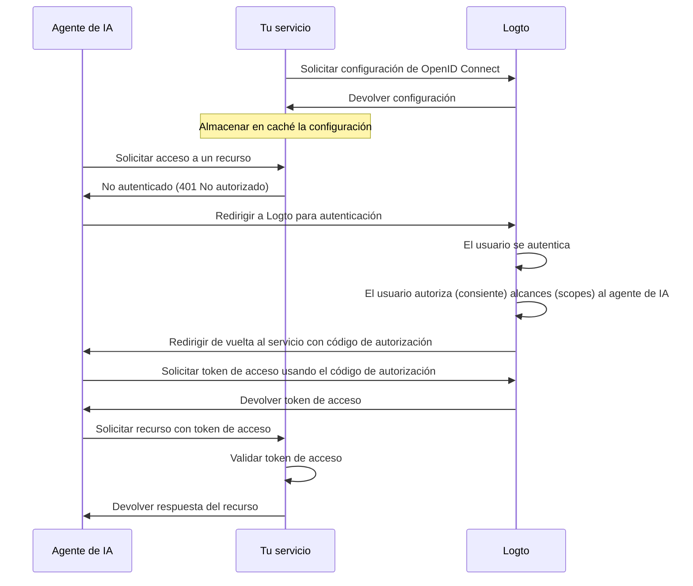

import ConfigureThirdPartyAiAgent from './fragments/_configure-third-party-ai-agent.mdx';

# Habilita el acceso de agentes de IA de terceros a tu app

Esta guía te guía paso a paso para integrar Logto con tu servicio y habilitar el acceso de agentes de IA.

Aprenderás a:

- Configurar Logto como el servidor de autorización para tu servicio.
- Obtener un token de acceso (Access token) para que el agente de IA acceda a tu servicio.
- Probar el flujo con un agente de IA.

## Diferencia entre un agente de IA de terceros y tu propio agente de IA (o app) \{#difference-between-third-party-ai-agent-and-your-own-ai-agent-or-app}

Veamos un ejemplo. Imagina que eres un desarrollador que gestiona un servicio que proporciona datos meteorológicos.

**App meteorológica oficial (Tu propio agente de IA / app)**

- Proporcionas una app meteorológica oficial para que los usuarios consulten el clima.
- Cómo funciona: La app meteorológica oficial se conecta a tu servicio usando Logto para autenticar a los usuarios. Cuando Alice inicia sesión, obtiene acceso automáticamente a los datos meteorológicos, sin pantallas de permisos adicionales, ya que es tu app de confianza.

**Agente de IA de terceros**

- Estás construyendo un ecosistema alrededor de tu servicio, así que otro desarrollador crea "WeatherBot" (un asistente de IA que puede proporcionar actualizaciones y pronósticos del clima) integrándolo como un agente de IA de terceros.
- Cómo funciona: WeatherBot (agente de IA de terceros) quiere acceder a los datos meteorológicos del usuario a través de tu servicio. Cuando Alice inicia sesión en WeatherBot usando su cuenta:
  - Se le muestra una pantalla de consentimiento (Consent screen), pidiendo permiso para que WeatherBot acceda a sus datos meteorológicos.
  - Alice puede permitir o denegar este acceso.
  - Solo los datos a los que ella consiente son compartidos con WeatherBot, y WeatherBot no puede acceder a datos adicionales sin un nuevo consentimiento explícito.

Este control de acceso (permiso) garantiza la seguridad de los datos del usuario; aunque tu servicio gestiona todos los datos, los agentes de IA de terceros como WeatherBot solo pueden acceder a lo que el usuario ha permitido explícitamente. No pueden eludir este proceso, ya que está reforzado por tu implementación de control de acceso en el servicio.

**Resumen**

| Tipo de cliente           | Ejemplo                 | ¿Requiere consentimiento? | ¿Quién lo controla?   |
| ------------------------- | ----------------------- | ------------------------- | --------------------- |
| App meteorológica oficial | Tu propia app del clima | No                        | Tú (el desarrollador) |
| Agente de IA de terceros  | Asistente WeatherBot    | Sí                        | Otro desarrollador    |

:::note
Si quieres integrar tu servicio con tu propio agente de IA o app, consulta nuestras [guías de inicio rápido](/quick-starts) para más información.
:::

## Requisitos previos \{#prerequisites}

- Un tenant de [Logto Cloud](https://cloud.logto.io) (o autogestionado)
- Un servicio que exponga endpoints de API para ser accedidos por el agente de IA

### Entendiendo el flujo \{#understanding-the-flow}

- **Servicio**: El servicio que deseas exponer al agente de IA.
- **Agente de IA**: El agente de IA que accederá a tu servicio.
- **Logto**: Funciona como el proveedor de OpenID Connect (servidor de autorización) y gestiona las identidades de los usuarios.

Un diagrama de secuencia no normativo ilustra el flujo general del proceso:

## Configura el agente de IA de terceros \{#set-up-third-party-ai-agent}

Para configurar un agente de IA de terceros que acceda a tu servicio, debes seguir estos pasos:

1. **Registrar el agente de IA en Logto**: Crea una aplicación en Logto para representar al agente de IA.
2. **Configurar el agente de IA**: Asegúrate de que el agente de IA pueda realizar solicitudes a tu servicio y manejar la respuesta 401 No autorizado.
3. **Implementar el flujo de autorización**: El agente de IA debe ser capaz de manejar el flujo de autorización OAuth 2.0 para obtener un token de acceso (Access token) de Logto.
4. **Probar la integración**: Usa el agente de IA para acceder a tu servicio y verifica que pueda autenticar y autorizar solicitudes correctamente.

<ConfigureThirdPartyAiAgent />

## Configura la autorización en tu servicio \{#set-up-authorization-in-your-service}

Para habilitar el control de acceso en tu servicio, debes implementar lo siguiente:

1. **Definir recursos de API en Logto**: Crea recursos de API en Logto que representen los endpoints a los que accederá tu agente de IA.
2. **Implementar la lógica de control de acceso**: En tu servicio, implementa la lógica para validar el token de acceso recibido del agente de IA y verifica si el usuario tiene los permisos necesarios para acceder al recurso solicitado.
3. **Responder al agente de IA**: Si el token de acceso es válido y el usuario tiene permiso, devuelve el recurso solicitado. Si no, devuelve una respuesta 401 No autorizado.

Para aprender más sobre cómo implementar el control de acceso en tu servicio, consulta nuestra [Guía de autorización](/authorization).

## Prueba la integración \{#test-the-integration}

1. Inicia tu servicio.
2. Inicia el agente de IA.
3. En el agente de IA, invoca el endpoint de API para acceder a tu servicio.
4. El agente de IA debe manejar la respuesta 401 No autorizado y redirigir al usuario a Logto para autenticación.
5. Tras la autenticación exitosa, el agente de IA debe recibir un token de acceso y usarlo para realizar solicitudes a tu servicio.
6. El agente de IA debe poder recuperar el recurso de tu servicio usando el token de acceso.
