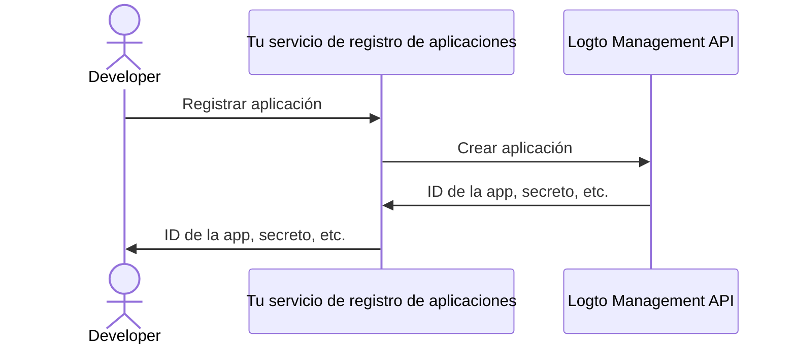

import QuickStartsReference from '../../../quick-starts/third-party/oidc/_quick-starts-reference.md';
import thirdPartyAppPermissions from '../assets/third-party-app-permissions.png';

## Configura un agente de IA de terceros en Logto \{#configure-third-party-ai-agent-in-logto}

Para permitir que el agente de IA de terceros acceda a {props.serviceName ?? 'tu servicio'}, necesitas configurar una **aplicación de terceros** en Logto. Esta aplicación se utilizará para representar al agente de IA y obtener las credenciales necesarias para la autenticación y autorización.

### Permitir que los desarrolladores creen aplicaciones de terceros en Logto \{#allow-developers-to-create-third-party-apps-in-logto}

Si estás construyendo un marketplace o deseas permitir que los desarrolladores creen aplicaciones de terceros en Logto, puedes aprovechar la [Logto Management API](/integrate-logto/interact-with-management-api) para crear aplicaciones de terceros de forma programática. Esto permite a los desarrolladores registrar sus aplicaciones y obtener las credenciales necesarias para la autenticación.

Necesitarás alojar tu propio servicio para gestionar el proceso de registro de clientes. Este servicio interactuará con la Logto Management API para crear aplicaciones de terceros en nombre de los desarrolladores.

Alternativamente, puedes crear manualmente aplicaciones de terceros en Logto Console para familiarizarte con el proceso.

### Crear manualmente una aplicación de terceros en Logto \{#manually-create-a-third-party-app-in-logto}

Puedes crear manualmente una aplicación de terceros en Logto Console para propósitos de prueba o integraciones puntuales. Esto es útil cuando deseas probar rápidamente la integración sin implementar un flujo completo de registro de clientes.

1. Inicia sesión en tu Logto Console.
2. Ve a <CloudLink to="/applications">**Aplicaciones**</CloudLink> → **Crear aplicación** → **Aplicación de terceros** -> **OIDC**.
3. Rellena el nombre de la aplicación y otros campos requeridos, luego haz clic en **Crear aplicación**.
4. Haz clic en la pestaña **Permisos**, en la sección **Usuario**, haz clic en "Agregar".
5. En el diálogo que se abre -> **Datos de usuario** -> selecciona los permisos **`profile`**, **`email`**, luego haz clic en **Guardar**.
6. En la aplicación de terceros, configura los alcances (scopes) para solicitar los permisos (alcances) `openid profile email`.

   **Nota**: `openid` es obligatorio para OIDC, y `profile` y `email` son los permisos que agregaste en el paso anterior.

7. Configura el **redirect URI** de tu aplicación de terceros según corresponda. Recuerda actualizar también el redirect URI en Logto.

---

<QuickStartsReference />
