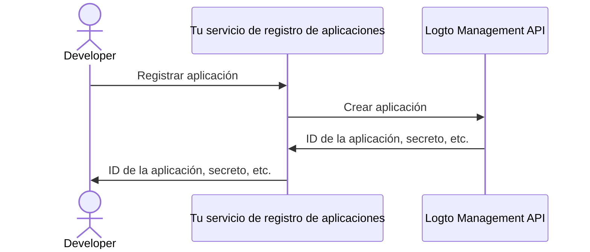
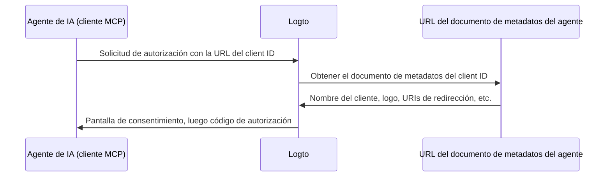

import QuickStartsReference from '../../../quick-starts/third-party/oidc/_quick-starts-reference.md';

## Configura un agente de IA de terceros en Logto \{#configure-third-party-ai-agent-in-logto}

Para permitir que el agente de IA de terceros acceda a {props.serviceName ?? 'tu servicio'}, necesitas configurar una **aplicación de terceros** en Logto. Esta aplicación se utilizará para representar al agente de IA y obtener las credenciales necesarias para la autenticación y autorización.

:::info[¿Qué es una aplicación de terceros?]
Una **aplicación de terceros** es una aplicación creada por desarrolladores externos (no el propietario del recurso) que necesita el consentimiento del usuario para acceder a recursos protegidos. A diferencia de las aplicaciones de primer partido (tus propias aplicaciones), las aplicaciones de terceros mostrarán una pantalla de consentimiento solicitando a los usuarios que aprueben permisos específicos antes de acceder a sus datos. Esto garantiza que los usuarios tengan control sobre qué datos comparten con servicios externos.

Para obtener más información, consulta [Aplicaciones de terceros](/integrate-logto/third-party-applications).
:::

Hay tres formas de incorporar agentes de IA:

- [Crear manualmente la aplicación en la Consola](#manually-create-a-third-party-app-in-logto), para pruebas o algunos agentes conocidos.
- [Construir un servicio de registro sobre la Management API](#allow-developers-to-create-third-party-apps-in-logto), si deseas controlar quién obtiene credenciales.
- [Habilitar aplicación dinámica](#let-any-ai-agent-connect-without-pre-registration), si cualquier agente puede conectarse y no quieres un paso de registro.

### Permitir que los desarrolladores creen aplicaciones de terceros en Logto \{#allow-developers-to-create-third-party-apps-in-logto}

Si estás construyendo un marketplace o deseas permitir que los desarrolladores creen aplicaciones de terceros en Logto, puedes aprovechar la [Logto Management API](/integrate-logto/interact-with-management-api) para crear aplicaciones de terceros de forma programática. Esto permite a los desarrolladores registrar sus aplicaciones y obtener las credenciales necesarias para la autenticación.

Necesitarás alojar tu propio servicio para manejar el proceso de registro de clientes. Este servicio interactuará con la Logto Management API para crear aplicaciones de terceros en nombre de los desarrolladores.

```mermaid
sequenceDiagram
  actor Developer
  participant Server as Tu servicio de registro de aplicaciones
  participant Logto as Logto Management API
  Developer->>Server: Registrar aplicación
  Server->>Logto: Crear aplicación
  Logto->>Server: ID de la aplicación, secreto, etc.
  Server->>Developer: ID de la aplicación, secreto, etc.
```

Alternativamente, puedes crear manualmente aplicaciones de terceros en la Consola de Logto para familiarizarte con el proceso.

### Permitir que cualquier agente de IA se conecte sin pre-registro \{#let-any-ai-agent-connect-without-pre-registration}

En un ecosistema MCP abierto, normalmente no conoces los agentes de antemano. [Aplicación dinámica](/integrate-logto/third-party-applications/dynamic-apps) elimina el paso de registro: el agente utiliza una URL pública HTTPS que sirve su propio documento de metadatos de cliente como su `client_id`, y Logto lo resuelve cuando llega la solicitud de autorización.

```mermaid
sequenceDiagram
  participant Agent as Agente de IA (cliente MCP)
  participant Logto
  participant Metadata as URL del documento de metadatos del agente
  Agent->>Logto: Solicitud de autorización con la URL del client ID
  Logto->>Metadata: Obtener el documento de metadatos del client ID
  Metadata->>Logto: Nombre del cliente, logo, URIs de redirección, etc.
  Logto->>Agent: Pantalla de consentimiento, luego código de autorización
```

Aún controlas qué agentes pueden solicitar a través de los permisos otorgados a la aplicación dinámica, y cada autorización pasa por la pantalla de consentimiento del usuario.

### Crear manualmente una aplicación de terceros en Logto \{#manually-create-a-third-party-app-in-logto}

Puedes crear manualmente una aplicación de terceros en la Consola de Logto para fines de prueba o integraciones ad-hoc. Esto es útil cuando deseas probar rápidamente la integración sin implementar un flujo completo de registro de clientes.

1. Inicia sesión en tu Consola de Logto.
2. Ve a <CloudLink to="/applications">**Aplicaciones**</CloudLink> → **Crear aplicación** → **Aplicación de terceros** -> **OIDC**.
3. Rellena el nombre de la aplicación y otros campos requeridos, luego haz clic en **Crear aplicación**.
4. Haz clic en la pestaña **Permisos**, en la sección **Usuario**, haz clic en "Agregar".
5. En el diálogo que se abre -> **Datos de usuario** -> selecciona los permisos **`profile`**, **`email`**, luego haz clic en **Guardar**.
6. En la aplicación de terceros, configura los alcances para solicitar los permisos (alcances) `openid profile email`.

   **Nota**: `openid` es obligatorio para OIDC, y `profile` y `email` son los permisos que agregaste en el paso anterior.

7. Configura la **URI de redirección** de tu aplicación de terceros en consecuencia. Recuerda actualizar también la URI de redirección en Logto.

---

<QuickStartsReference />
