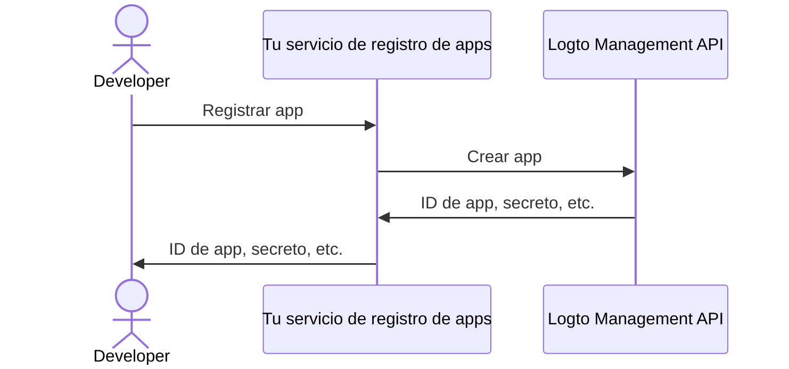

import thirdPartyAppPermissions from '../../../../../../docs/use-cases/ai/assets/third-party-app-permissions.png';
import QuickStartsReference from '../../quick-starts/third-party/oidc/_quick-starts-reference.md';

import Prerequisites from './fragments/_mcp-prerequisites.mdx';
import SampleCode from './fragments/_mcp-sample-code.mdx';
import SetUpServer from './fragments/_mcp-set-up-server.mdx';

# Habilitar el acceso de agentes de IA de terceros a tu servidor MCP

Esta guía te guía paso a paso para integrar Logto con tu servidor MCP usando [mcp-auth](https://mcp-auth.dev), permitiéndote autenticar usuarios y recuperar de forma segura su información de identidad utilizando el flujo estándar de OpenID Connect.

Aprenderás a:

- Configurar Logto como el servidor de autorización para tu servidor MCP.
- Configurar una herramienta “whoami” en tu servidor MCP para devolver los reclamos de identidad del usuario actual.
- Probar el flujo con un agente de IA de terceros (cliente MCP).

Después de este tutorial, tu servidor MCP podrá:

- Autenticar usuarios en tu tenant de Logto.
- Devolver reclamos de identidad (`sub`, `username`, `name`, `email`, etc.) para la invocación de la herramienta "whoami".

## Diferencia entre agente de IA de terceros (cliente MCP) y tu propio cliente MCP \{#difference-between-third-party-ai-agent-mcp-client-and-your-own-mcp-client}

Veamos un ejemplo. Imagina que eres un desarrollador que ejecuta un servidor MCP para gestionar el acceso y la automatización del correo electrónico.

**Aplicación de correo oficial (Tu propio cliente MCP)**

- Proporcionas una aplicación de correo oficial para que los usuarios lean y gestionen sus correos electrónicos.
- Cómo funciona: La aplicación de correo oficial se conecta a tu servidor MCP usando Logto para autenticar a los usuarios. Cuando Alice inicia sesión, obtiene acceso automáticamente a sus correos electrónicos, sin pantallas de permisos adicionales, ya que es tu aplicación de confianza.

**Agente de IA de terceros (Cliente MCP de terceros)**

- Estás construyendo un ecosistema alrededor de tu servidor MCP, así que otro desarrollador crea “SmartMail AI” (un asistente de IA que puede resumir correos y programar reuniones automáticamente) integrándolo como cliente de terceros.
- Cómo funciona: SmartMail AI (cliente MCP de terceros) quiere acceder a los correos electrónicos de los usuarios a través de tu servidor MCP. Cuando Alice inicia sesión en SmartMail AI usando su cuenta:
  - Se le muestra una pantalla de consentimiento, solicitando permiso para que SmartMail AI lea sus correos y calendario.
  - Alice puede permitir o denegar este acceso.
  - Solo los datos a los que ella consiente son compartidos con SmartMail AI, y SmartMail AI no puede acceder a ningún dato adicional sin un nuevo consentimiento explícito.

Este control de acceso (permiso) garantiza la seguridad de los datos del usuario, incluso si tu servidor MCP gestiona todos los datos, las aplicaciones de terceros como SmartMail AI solo pueden acceder a lo que el usuario ha permitido explícitamente. No pueden eludir este proceso, ya que está reforzado por tu implementación de control de acceso en el servidor MCP.

**Resumen**

| Tipo de cliente              | Ejemplo                        | ¿Requiere consentimiento? | ¿Quién lo controla?   |
| ---------------------------- | ------------------------------ | ------------------------- | --------------------- |
| Aplicación de correo oficial | Tu propia aplicación de correo | No                        | Tú (el desarrollador) |
| Agente de IA de terceros     | Asistente SmartMail AI         | Sí                        | Otro desarrollador    |

:::note
Si deseas integrar tu servidor MCP con tu propio agente de IA o aplicación, consulta la guía [Habilita autenticación para tus apps impulsadas por MCP con Logto](./mcp-server-add-auth).
:::

<Prerequisites isThirdParty />

## Configurar el agente de IA de terceros \{#set-up-third-party-ai-agent}

Para habilitar que el agente de IA de terceros acceda a tu servidor MCP, debes configurar lo siguiente:

1. El cliente debe poder realizar solicitudes MCP para invocar las herramientas expuestas por el servidor MCP.
2. El cliente debe poder manejar la respuesta 401 No autorizado. Consulta [Pasos del flujo de autorización](https://modelcontextprotocol.io/specification/2025-03-26/basic/authorization#2-5-authorization-flow-steps) para más detalles.
3. Tras la autenticación exitosa, el cliente debe poder realizar solicitudes al servidor MCP con el token de acceso obtenido de Logto.

## Configurar el agente de IA en Logto \{#set-up-ai-agent-in-logto}

Para permitir que el agente de IA de terceros acceda a tu servidor MCP, debes configurar una **aplicación de terceros** en Logto. Esta aplicación se usará para representar al agente de IA y obtener las credenciales necesarias para la autenticación y autorización.

### Permitir que los desarrolladores creen aplicaciones de terceros en Logto \{#allow-developers-to-create-third-party-apps-in-logto}

Si estás construyendo un marketplace o quieres permitir que los desarrolladores creen aplicaciones de terceros en Logto, puedes aprovechar la [Logto Management API](/integrate-logto/interact-with-management-api) para crear aplicaciones de terceros de forma programática. Esto permite a los desarrolladores registrar sus aplicaciones y obtener las credenciales necesarias para la autenticación.

Necesitarás alojar tu propio servicio para manejar el proceso de registro de clientes. Este servicio interactuará con la Logto Management API para crear aplicaciones de terceros en nombre de los desarrolladores.

Alternativamente, puedes crear manualmente aplicaciones de terceros en Logto Console para familiarizarte con el proceso.

### Crear manualmente una aplicación de terceros en Logto \{#manually-create-a-third-party-app-in-logto}

Puedes crear manualmente una aplicación de terceros en Logto Console para pruebas o integraciones puntuales. Esto es útil cuando quieres probar rápidamente la integración sin implementar un flujo completo de registro de clientes.

1. Inicia sesión en tu Logto Console.
2. Ve a <CloudLink to="/applications">**Aplicaciones**</CloudLink> → **Crear aplicación** → **Aplicación de terceros** -> **OIDC**.
3. Rellena el nombre de la app y otros campos requeridos, luego haz clic en **Crear aplicación**.
4. Haz clic en la pestaña **Permisos**, en la sección **Usuario**, haz clic en "Agregar".
5. En el diálogo que se abre -> **Datos de usuario** -> selecciona los permisos **`profile`**, **`email`**, luego haz clic en **Guardar**.
6. En la aplicación de terceros, configura los alcances para solicitar los permisos `openid profile email`.
7. Configura la **URI de redirección** de tu aplicación de terceros según corresponda. Recuerda actualizar también la URI de redirección en Logto.

---

<QuickStartsReference />

<SetUpServer />

## Probar la integración \{#test-the-integration}

1. Inicia el servidor MCP.
2. Inicia el agente de IA.
3. En el cliente, invoca la herramienta `whoami` para recuperar los reclamos de identidad del usuario actual.
4. El cliente debe manejar la respuesta 401 No autorizado y redirigir al usuario a Logto para autenticación.
5. Tras la autenticación exitosa, el cliente debe recibir un token de acceso y usarlo para realizar solicitudes al servidor MCP.
6. El cliente debe poder recuperar los reclamos de identidad del servidor MCP usando el token de acceso.

<SampleCode />
