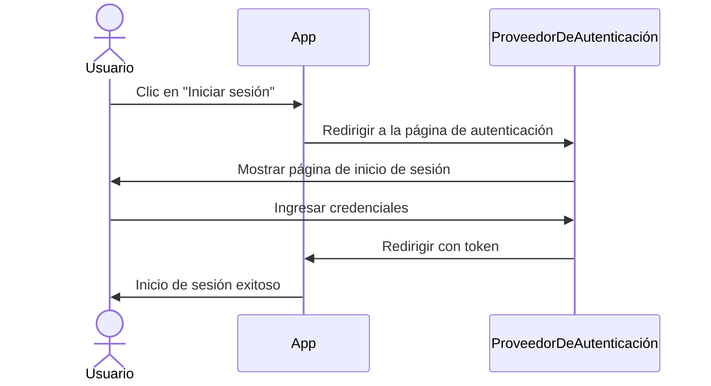
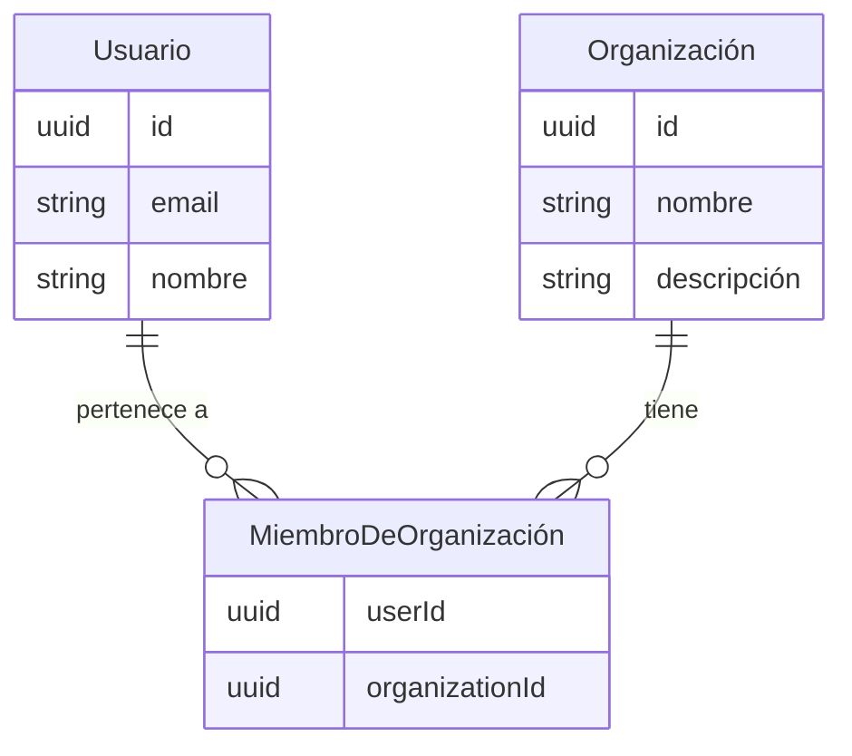
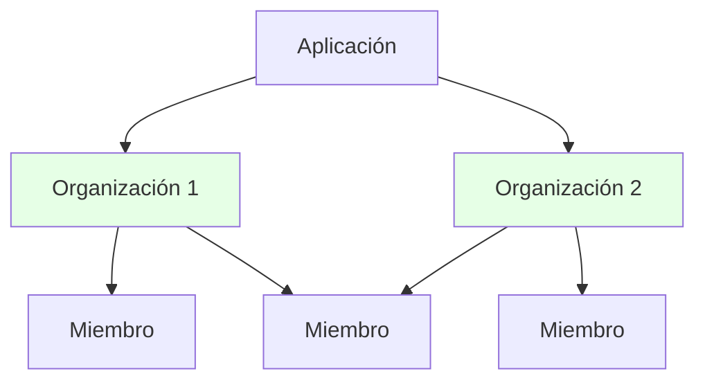
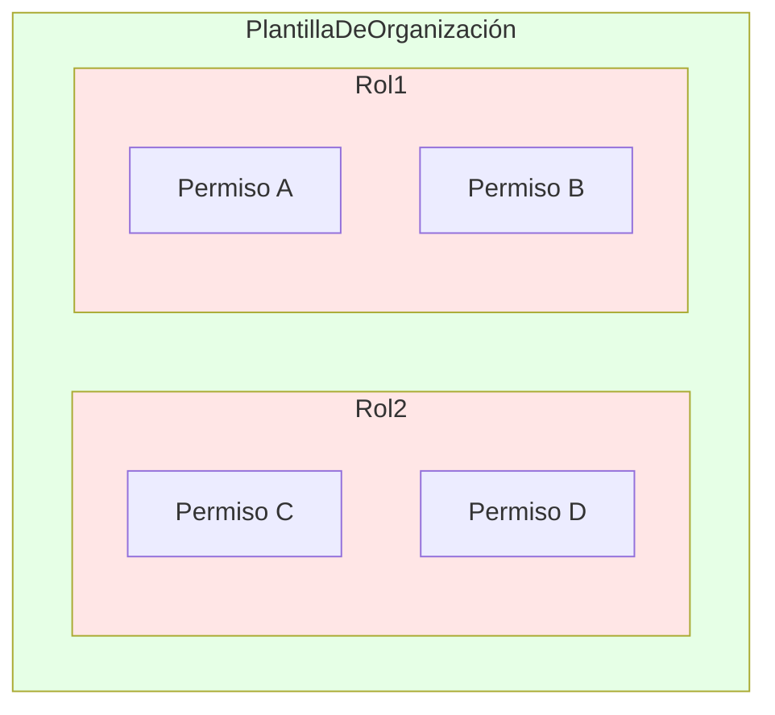
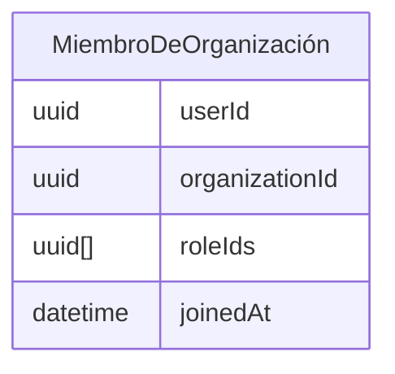
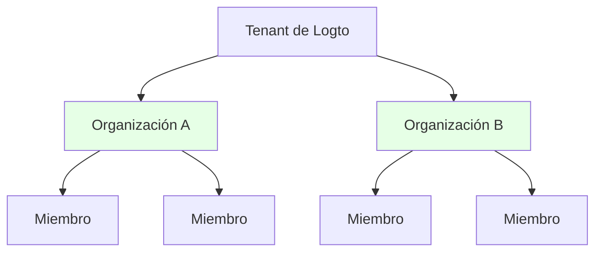
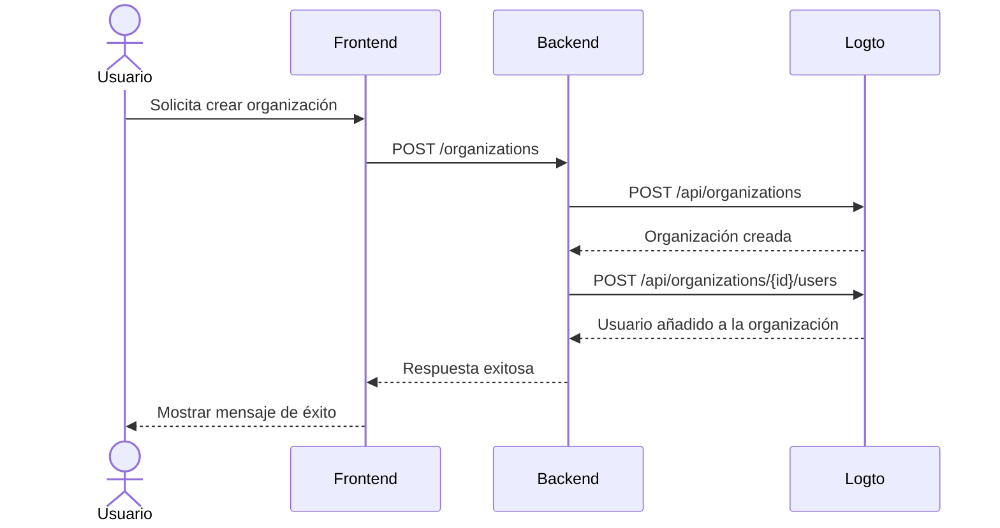

<head>
  <link rel="canonical" href="https://blog.logto.io/build-multi-tenant-saas-application" />
</head>

<style>
  {`
    .twoColumn {
      display: grid;
      grid-template-columns: 1fr 1fr;
      gap: 24px;
    }
    .twoColumn + .twoColumn {
      margin-top: 24px;
    }
  `}
</style>

# Construye una aplicación SaaS multi-inquilino: Una guía completa desde el diseño hasta la implementación

¿Cómo se construyen aplicaciones como Notion, Slack o Figma? Estas aplicaciones SaaS multi-inquilino parecen simples de usar, pero ¿construir una tú mismo? Eso es otra historia.

Cuando pensé por primera vez en construir una bestia tan compleja, mi mente explotó:

- Los usuarios necesitan múltiples opciones de inicio de sesión (correo electrónico, Google, GitHub)
- Cada usuario puede crear y pertenecer a múltiples organizaciones
- Diferentes niveles de permisos dentro de cada organización
- Organizaciones empresariales que requieren unión automática para dominios de correo específicos
- Requisitos de MFA para operaciones sensibles
- Y más...

"Jefe, hablemos del diseño del producto en dos semanas. Ahora mismo estoy atascado."

Pero cuando realmente empecé a trabajar en ello, **descubrí que no es tan abrumador como parece.**

¡Acabo de **construir un sistema con todas estas funciones con sorprendentemente poco esfuerzo!**


<div className="twoColumn">
  
  
</div>

Te mostraré exactamente cómo diseñar e implementar un sistema así desde cero, y te sorprenderás de lo simple que realmente es en 2025 con herramientas modernas y el enfoque arquitectónico adecuado.

> **El código fuente completo está disponible en este [Repositorio de Github](https://github.com/logto-io/multi-tenant-saas-sample). ¡Vamos allá!**

Comenzaremos con un producto SaaS de documentación con IA llamado DocuMind.

DocuMind es un producto SaaS de documentación con IA diseñado con un modelo multi-inquilino para soportar usuarios individuales, pequeñas empresas y empresas.

La plataforma proporciona potentes capacidades de IA para la gestión de documentos, incluyendo generación automática de resúmenes, extracción de puntos clave y recomendaciones inteligentes de contenido dentro de las organizaciones.

## ¿Qué características se requieren para la autenticación y autorización SaaS? \{#what-features-are-required-for-saas-authentication-and-authorization}

Primero, revisemos los requisitos necesarios. ¿Qué características necesitas?

### Arquitectura multi-inquilino \{#multi-tenant-architecture}

Para habilitar una arquitectura multi-inquilino, necesitarás una capa de entidad llamada **organización**. Imagina tener un solo grupo de usuarios que pueden acceder a múltiples espacios de trabajo. Cada organización representa un espacio de trabajo, y los usuarios mantienen una sola identidad mientras acceden a diferentes espacios de trabajo (organizaciones) según sus roles asignados.


Es una característica ampliamente utilizada en los proveedores de autenticación. Una organización en un sistema de gestión de identidad corresponde al espacio de trabajo, proyecto o inquilino de tu aplicación SaaS.


### Membresía \{#membership}

Un miembro es un concepto temporal utilizado para indicar el estado de membresía de una identidad dentro de una organización.

Por ejemplo, Sarah se registra en tu aplicación usando su correo electrónico, **sarah@gmail.com**. Ella puede pertenecer a diferentes espacios de trabajo. Si Sarah es parte de **Workspace A** pero no de **Workspace B**, se considera miembro de **Workspace A** pero no de **Workspace B**.

### Diseño de roles y permisos \{#role-and-permission-design}

En una arquitectura multi-inquilino, los usuarios necesitan **roles** con **permisos** específicos para acceder a los recursos de su inquilino.
Los permisos son controles de acceso detallados que definen acciones específicas, como `read: order` o `write: order`. Determinan qué acciones se pueden realizar sobre recursos particulares.

Los roles son un conjunto de permisos asignados a los miembros en un entorno multi-inquilino.

Necesitarás definir estos roles y permisos, luego asignar roles a los usuarios, y a veces puede incluir procesos automatizados. Por ejemplo:

1. Los usuarios que se unen a una organización obtienen automáticamente el rol de **miembro**.
2. El primer usuario que crea un espacio de trabajo recibe automáticamente el rol de **administrador**.

### Flujo de registro e inicio de sesión \{#sign-up-and-login-flow}

Asegura un proceso de registro y autenticación fácil de usar y seguro, incluyendo opciones básicas de inicio de sesión y registro:

1. **Inicio de sesión con correo electrónico y contraseña**: Método tradicional de inicio de sesión con correo electrónico y contraseña.
2. **Inicio de sesión sin contraseña**: Usa códigos de verificación por correo electrónico para un acceso fácil y seguro.
3. **Gestión de cuentas**: Un centro de cuentas donde los usuarios pueden actualizar su correo electrónico, contraseña y otros detalles.
4. **Inicio de sesión social**: Opciones como Google y GitHub para un inicio de sesión rápido.
5. **Autenticación multifactor (MFA)**: Mejora la seguridad permitiendo el inicio de sesión mediante aplicaciones autenticadoras como Duo.

### Creación de inquilinos e invitación \{#tenant-creation-and-invitation}

En una aplicación SaaS multi-inquilino, una diferencia clave en el flujo de usuario es la necesidad de soportar la creación de inquilinos e invitaciones a miembros. Este proceso requiere una planificación y ejecución cuidadosa, ya que juega un papel clave en la activación y el crecimiento del producto.

Aquí tienes algunos flujos de uso típicos que debes considerar:

| Tipo de usuario                                                 | Punto de entrada                                                                   |
| --------------------------------------------------------------- | ---------------------------------------------------------------------------------- |
| Nueva cuenta                                                    | Entra desde la página de inicio de sesión y registro para crear un nuevo inquilino |
| Cuenta existente                                                | Crea otro inquilino dentro del producto                                            |
| La cuenta existente recibió una invitación a un nuevo inquilino | Entra desde la página de inicio de sesión y registro                               |
| La cuenta existente recibió una invitación a un nuevo inquilino | Entra desde el correo de invitación                                                |
| La nueva cuenta recibió una invitación a un nuevo inquilino     | Entra desde la página de inicio de sesión y registro                               |
| La nueva cuenta recibió una invitación a un nuevo inquilino     | Entra desde el correo de invitación                                                |

Aquí tienes algunos escenarios comunes que se encuentran en casi todas las aplicaciones SaaS. Úsalos como referencia para inspirar a tu equipo de producto y diseño, y siéntete libre de crear tus propios flujos según sea necesario.

<div className="twoColumn">
  
  
</div>

<div className="twoColumn">
  
  
</div>

<div className="twoColumn">
  
  
</div>

## Arquitectura técnica y diseño del sistema \{#technical-architecture-and-system-design}

Una vez que entendemos todos los requisitos del producto, pasemos a la implementación.

### Definir la estrategia de autenticación \{#define-authentication-strategy}

La autenticación puede parecer intimidante. Los usuarios necesitan:

- Registro / inicio de sesión con correo electrónico y contraseña
- Inicio de sesión con un clic usando Google / Github
- Restablecimiento de contraseña cuando la olvidan
- Inicio de sesión para todo el equipo para clientes empresariales
- ...

Implementar solo estas funciones básicas podría llevar semanas de desarrollo.

Pero ahora, **¡no necesitamos construir NADA de esto nosotros mismos!**

Los proveedores de autenticación modernos (esta vez elegiré [Logto](https://logto.io/)) han empaquetado todas estas funciones para nosotros. El flujo de autenticación es sencillo:



**¡De semanas de desarrollo a 15 minutos de configuración!** Logto maneja todos los flujos complejos por nosotros. Cubriremos los pasos de integración en la sección de implementación más adelante. ¡Ahora podemos centrarnos en construir las funciones principales de DocuMind!

### Establecer la arquitectura multi-inquilino \{#establish-multi-tenant-architecture}

El sistema de organizaciones permite a los usuarios crear y unirse a múltiples organizaciones. Comprendamos las relaciones principales:



En este sistema, cada usuario puede pertenecer a múltiples organizaciones y cada organización puede tener múltiples miembros.



### Habilitar el control de acceso en la app multi-inquilino \{#enable-access-control-in-multi-tenant-app}

El Control de Acceso Basado en Roles (RBAC) es importante para garantizar la seguridad y escalabilidad en aplicaciones SaaS multi-inquilino.

En una app multi-inquilino, el diseño de permisos y roles suele ser consistente, ya que proviene del diseño del producto. Por ejemplo, en múltiples espacios de trabajo, normalmente hay un rol de administrador y un rol de miembro. Logto como proveedor de autenticación tiene el siguiente diseño de control de acceso basado en roles a nivel de organización:

1. **Definiciones de permisos unificadas**: Los permisos se definen a nivel de sistema y se aplican de manera consistente en todas las organizaciones, asegurando una gestión de permisos mantenible y coherente.
2. **Plantillas de organización**: Combinaciones predefinidas de roles y permisos a través de plantillas de organización, simplificando la inicialización de organizaciones.

La relación de permisos se ve así:



Como cada usuario necesita su propio(s) rol(es) dentro de cada organización, la relación entre roles y organizaciones debe reflejar los roles asignados a cada usuario:



¡Hemos diseñado el sistema de organizaciones y el sistema de control de acceso, y ahora podemos empezar a construir nuestro producto!

## Stack tecnológico \{#tech-stack}

Elegí un stack amigable para principiantes y portátil:

1. **Frontend**: React (fácilmente transferible a Vue / Angular / Svelte)
2. **Backend**: Express (API simple e intuitiva)

¿Por qué separar frontend y backend? Porque tiene una arquitectura clara, fácil de aprender y simple de cambiar de stack. Y para proveedores de autenticación, uso Logto como ejemplo.

Y para las siguientes guías, **estos patrones funcionan con: cualquier frontend, cualquier backend y cualquier sistema de autenticación.**

## Añade el flujo básico de autenticación a tu app \{#add-basic-authentication-flow-to-your-app}

Este es el paso más fácil. Solo necesitamos integrar Logto en nuestro proyecto. Luego podemos configurar los métodos de inicio de sesión / registro de usuarios en la Consola de Logto según nuestras necesidades.

### Instala Logto en tu app \{#install-logto-to-your-app}

Primero, inicia sesión en [Logto Cloud](https://cloud.logto.io/). Puedes registrarte para una cuenta gratuita si no tienes una. Crea un Tenant de Desarrollo para pruebas.

En la Consola del Tenant, haz clic en el botón "Application" a la izquierda. Luego selecciona React para empezar a construir nuestra aplicación.

Sigue la guía en la página. ¡Puedes completar la integración de Logto en unos 5 minutos!

Aquí tienes mi código de integración:

```jsx
const config: LogtoConfig = {
  endpoint: "<YOUR_LOGTO_ENDPOINT>",
  appId: "<YOUR_LOGTO_APP_ID>",
};

function App() {
  return (
    <LogtoProvider config={config}>
      <div className="min-h-screen bg-gradient-to-b from-gray-50 to-gray-100">
        <Routes>
          {/* Este callback maneja la redirección de inicio de sesión de usuario desde Logto */}
          <Route path="/callback" element={<Callback />} />
          <Route path="/*" element={<AppContent />} />
        </Routes>
      </div>
    </LogtoProvider>
  );
}

function AppContent() {
  const { isAuthenticated } = useLogto();

  if (!isAuthenticated) {
    // Mostrar página de bienvenida para usuarios no autenticados
    return <Landing />;
  }

  // Mostrar app principal para usuarios autenticados
  return (
    <Routes>
      {/* El panel muestra todas las organizaciones disponibles */}
      <Route path="/" element={<Dashboard />} />

      {/* Página de organización después de hacer clic en una organización en el panel */}
      <Route path="/:orgId" element={<Organization />} />
    </Routes>
  );
}
```


Un truco útil: Nuestra página de inicio de sesión tiene botones de Iniciar sesión y Registrarse. El botón de Registro lleva directamente a la página de registro de Logto. Esto funciona gracias a la función [first screen](/end-user-flows/authentication-parameters/first-screen) de Logto. Determina qué paso del flujo de autenticación ven los usuarios primero.

Puedes establecer la página de registro por defecto cuando tu producto espera muchos usuarios nuevos.

```jsx
function LandingPage() {
  const { signIn } = useLogto();

  return (
    <div className="landing-container">
      <div className="auth-buttons">
        <button
          className="sign-in-button"
          onClick={() => {
            signIn({
              redirectUri: '<YOUR_APP_CALLBACK_URL>',
            });
          }}
        >
          Iniciar sesión
        </button>

        <button
          className="register-button"
          onClick={() => {
            signIn({
              redirectUri: '<YOUR_APP_CALLBACK_URL>',
              firstScreen: 'register',
            });
          }}
        >
          Registrarse
        </button>
      </div>
    </div>
  );
}
```

Después de hacer clic en iniciar sesión, irás a la página de inicio de sesión de Logto. ¡Al iniciar sesión (o registrarte) con éxito, felicidades! Tu app tiene su primer usuario (¡tú!).

Y llama a la función `signOut` del hook `useLogto` para cerrar sesión del usuario cuando lo desees.

```jsx
function SignOutButton() {
  const { signOut } = useLogto();

  return <button onClick={() => signOut('<YOUR_POST_LOGOUT_REDIRECT_URL>')}>Cerrar sesión</button>;
}
```

### Personaliza los métodos de inicio de sesión y registro \{#customize-sign-in-and-sign-up-methods}

En la Consola de Logto, haz clic en "Sign-in Experience" en el menú de la izquierda. Luego haz clic en la pestaña "Sign-up and sign-in".
En esta página, sigue las instrucciones para configurar los métodos de inicio de sesión / registro de Logto.


Y el flujo de inicio de sesión se verá así:


### Habilita la autenticación multifactor \{#enable-multi-factor-authentication}

Con Logto, habilitar MFA es simple. Solo haz clic en el botón "Multi-factor auth" en la Consola de Logto. Luego actívalo en la página de autenticación multifactor.


Y el flujo de MFA se verá así:

<div className="twoColumn">
  
  
</div>

¡Todo es tan simple! ¡Hemos configurado un sistema de autenticación de usuarios complejo en solo unos minutos!

## Añadiendo experiencia de organización multi-inquilino \{#adding-multi-tenant-organization-experience}

¡Ahora tenemos nuestro primer usuario! Sin embargo, este usuario aún no pertenece a ninguna organización, y no hemos creado ninguna organización.

Logto proporciona soporte integrado para multi-inquilinato. Puedes crear cualquier número de organizaciones en Logto. Cada organización puede tener múltiples miembros.



Cada usuario puede obtener su información de organización desde Logto. Esto habilita el soporte multi-inquilino.

### Obtener la información de organización de un usuario \{#get-a-user-s-organization-information}

Para obtener la información de organización de un usuario desde Logto, sigue estos dos pasos:

Declara el acceso a la información de organización en el Logto Config. Esto se hace configurando los `scopes` y `resources` apropiados.

```jsx
import { UserScope, ReservedResource } from "@logto/react";
const config: LogtoConfig = {
  endpoint: "<YOUR_LOGTO_ENDPOINT>",
  appId: "<YOUR_LOGTO_APP_ID>",
  scopes: [UserScope.Organizations], // Valor: "urn:logto:scope:organizations"
  resources: [ReservedResource.Organization], // Valor: "urn:logto:resource:organizations"
};

```

Usa el método `fetchUserInfo` de Logto para obtener la información del usuario, incluyendo los datos de organización.

```jsx
function Dashboard() {
  // Obtener información del usuario
  const { fetchUserInfo } = useLogto();
  const [organizations, setOrganizations] = useState<OrganizationData[]>([]);
  const [loading, setLoading] = useState(false);

  useEffect(() => {
    const loadOrganizations = async () => {
      try {
        setLoading(true);
        // Obtener información del usuario
        const userInfo = await fetchUserInfo();
        // Obtener información de organización del usuario
        const organizationData = userInfo?.organization_data || [];
        setOrganizations(organizationData);
      } catch (error) {
        console.error('No se pudieron obtener las organizaciones:', error);
      } finally {
        setLoading(false);
      }
    };

    loadOrganizations();
  }, [fetchUserInfo]);

  if (loading) {
    return <div>Cargando...</div>;
  }

  if (organizations.length === 0) {
    return <div>Aún no eres miembro de ninguna organización</div>;
  }

  return <div>Organizaciones: {organizations.map(org => org.name).join(', ')}</div>;
}

```

Después de completar estos pasos, necesitas cerrar sesión e iniciar sesión de nuevo. Esto es necesario porque modificamos el scope y el recurso solicitados.

Por ahora, no has creado ninguna organización. El usuario tampoco se ha unido a ninguna organización. El panel mostrará "Aún no tienes ninguna organización".


A continuación, crearemos una organización para nuestros usuarios y los añadiremos a ella.

Gracias a Logto, no necesitamos construir relaciones complejas de organización. Solo necesitamos crear una organización en Logto y añadir usuarios a ella. Logto maneja toda la complejidad por nosotros. Hay dos formas de crear Organizaciones:

1. Crear organizaciones manualmente a través de la Consola de Logto
2. Usar la Management API de Logto para crear organizaciones, especialmente al diseñar un flujo SaaS que permita a los usuarios crear sus propias organizaciones (espacios de trabajo).

### Crear organización en la consola de Logto \{#create-organization-in-logto-console}

Haz clic en el botón "Organizations" en el menú de la izquierda de la Consola de Logto. Crea una organización.

Ahora tienes tu primera organización.


A continuación, añadamos el usuario a esta organización.

Ve a la página de detalles de la organización. Cambia a la pestaña Miembros. Haz clic en el botón "+ Add member". Selecciona tu usuario de inicio de sesión de la lista de la izquierda. Haz clic en el botón "Add members" en la parte inferior derecha. Ahora has añadido con éxito el usuario a esta organización.


Actualiza la página de tu APP. ¡Verás que el usuario ahora pertenece a una organización!


## Implementar experiencia de creación de organización self-serve \{#implement-self-serve-organization-creation-experience}

Crear una organización en la consola no es suficiente. Tu aplicación SaaS necesita un flujo que permita a los usuarios finales crear y gestionar fácilmente sus propios espacios de trabajo. Para implementar esta funcionalidad, usa la Management API de Logto.

Para orientación, consulta la documentación [Interactuar con Management API](/integrate-logto/interact-with-management-api) para configurar la comunicación API con Logto.

### Comprender el flujo de interacción de autenticación de organización \{#understand-organization-auth-interaction-flow}

Tomemos el flujo de creación de organización como ejemplo. Así es como funciona el proceso de creación de organización:



Este flujo tiene dos requisitos clave de autenticación:

1. **Proteger la API del servicio backend**:
   - El acceso del frontend a nuestra API de servicio backend requiere autenticación
   - Los endpoints de la API están protegidos validando el Access Token de Logto del usuario
   - Garantiza que solo los usuarios autenticados puedan acceder a nuestros servicios
2. **Acceso a la Management API de Logto**:
   - El servicio backend necesita llamar de forma segura a la Management API de Logto
   - Sigue la guía [Interactuar con Management API](/integrate-logto/interact-with-management-api) para la configuración
   - Usa autenticación máquina a máquina para obtener credenciales de acceso

### Protege tu API backend \{#protect-your-backend-api}

Primero, creemos un endpoint API en nuestro servicio backend para crear organizaciones.

```jsx
app.post('/organizations', async (req, res) => {
  // Implementación usando la Management API de Logto
  // ...
});
```

Nuestra API de servicio backend solo permite usuarios autenticados. Necesitamos usar Logto para proteger nuestra API. También necesitamos saber la información del usuario actual (como el user ID).

En el concepto de Logto (y OAuth 2.0), nuestro servicio backend actúa como un servidor de recursos. Los usuarios acceden al servidor de recursos DocuMind con un Access token desde el frontend. El servidor de recursos verifica este token. Si es válido, devuelve los recursos solicitados.

Creemos un API Resource para representar nuestro servicio backend.

Ve a la Consola de Logto.

1. Haz clic en el botón "API resources" a la derecha.
2. Haz clic en "Create API resource". Selecciona Express en el popup.
3. Rellena "DocuMind API" como nombre de la API. Usa "[https://api.documind.com](https://api.documind.com/)" como identificador de la API.
4. Haz clic en crear.

No te preocupes por esta URL de identificador de API. Es solo un identificador único para tu API en Logto. No está relacionado con la URL real de tu servicio backend.

Verás un tutorial para usar el recurso de API. Puedes seguir ese tutorial o nuestros pasos a continuación.

Creemos un middleware requireAuth para proteger nuestro endpoint POST /organizations.

```jsx
const { createRemoteJWKSet, jwtVerify } = require('jose');

const getTokenFromHeader = (headers) => {
  const { authorization } = headers;
  const bearerTokenIdentifier = 'Bearer';

  if (!authorization) {
    throw new Error('Falta el encabezado Authorization');
  }

  if (!authorization.startsWith(bearerTokenIdentifier)) {
    throw new Error('Tipo de token de autorización no soportado');
  }

  return authorization.slice(bearerTokenIdentifier.length + 1);
};

const requireAuth = (resource) => {
  if (!resource) {
    throw new Error('El parámetro resource es obligatorio para la autenticación');
  }

  return async (req, res, next) => {
    try {
      // Extraer el token
      const token = getTokenFromHeader(req.headers);

      const { payload } = await jwtVerify(
        token,
        createRemoteJWKSet(new URL(process.env.LOGTO_JWKS_URL)),
        {
          issuer: process.env.LOGTO_ISSUER,
          audience: resource,
        }
      );

      // Añadir información de usuario a la request
      req.user = {
        id: payload.sub,
      };

      next();
    } catch (error) {
      console.error('Error de autenticación:', error);
      res.status(401).json({ error: 'No autorizado' });
    }
  };
};

module.exports = {
  requireAuth,
};
```

Para usar este middleware, necesitamos estas variables de entorno:

- LOGTO_JWKS_URL
- LOGTO_ISSUER

Obtén estas variables desde el endpoint OpenID Configuration de tu tenant de Logto. Visita `https://<your-tenant-id>.logto.app/oidc/.well-known/openid-configuration`. Encontrarás la información necesaria en el JSON devuelto:

```json
{
  "jwks_uri": "<https://tenant-id.logto.app/oidc/jwks>",
  "issuer": "<https://tenant-id.logto.app/oidc>"
}
```

Ahora usa el middleware requireAuth en nuestro endpoint POST /organizations.

```jsx
app.post('/organizations', requireAuth('<https://api.documind.com>'), async (req, res) => {
  // Lógica de creación de organización
  // ...
});
```

Esto protege nuestro endpoint POST /organizations. Solo los usuarios con access tokens válidos de Logto pueden acceder a él.

Ahora podemos obtener el token de Logto en nuestro frontend. Los usuarios pueden crear organizaciones a través de nuestro servicio backend con este token. El middleware también nos da el user ID. Esto ayuda al añadir usuarios a organizaciones.

En el código frontend, declara este recurso de API en el config de Logto. Añade su identificador al array de resources.

```jsx
const config: LogtoConfig = {
  endpoint: "<YOUR_LOGTO_ENDPOINT>",
  appId: "<YOUR_LOGTO_APP_ID>",
  scopes: [UserScope.Organizations],
  resources: [ReservedResource.Organization, "<https://api.documind.com>"], // Identificador del recurso de API recién creado
};

```

Como antes, los usuarios deben iniciar sesión de nuevo después de actualizar el config de Logto.

En el Dashboard, obtén el Access Token de Logto al crear una organización. Usa este token para acceder a nuestra API de servicio backend.

```jsx
// Obtener access token para "DocuMind API"
const token = await getAccessToken('<https://api.documind.com>');

// Acceder a nuestra API de servicio backend con el token
const response = await fetch('<http://localhost:3000/organizations>', {
  method: 'POST',
  headers: {
    'Content-Type': 'application/json',
    Authorization: `Bearer ${token}`,
  },
  body: JSON.stringify({
    name: 'Organization A',
    description: 'Organization A description',
  }),
});
```

Ahora podemos acceder correctamente a la API de servicio backend de DocuMind.

### Llamando a la Management API de Logto \{#calling-logto-management-api}

Implementemos la creación de organización usando la Management API de Logto.

Al igual que las peticiones del frontend al servicio backend, las peticiones del backend a Logto necesitan Access tokens.

En Logto, usamos autenticación máquina a máquina para los access tokens. Consulta [Interactuar con Management API](/integrate-logto/interact-with-management-api).

Ve a la página de aplicaciones en la Consola de Logto. Crea una aplicación máquina a máquina. Asigna el rol "Logto Management API access". Copia el endpoint de Token, App ID y App Secret. Usaremos estos para los access tokens.


Ahora podemos obtener access tokens de la Management API de Logto a través de esta aplicación M2M.

```jsx
async function fetchLogtoManagementApiAccessToken() {
  const response = await fetch(process.env.LOGTO_MANAGEMENT_API_TOKEN_ENDPOINT, {
    method: 'POST',
    headers: {
      'Content-Type': 'application/x-www-form-urlencoded',
      Authorization: `Basic ${Buffer.from(
        `${process.env.LOGTO_MANAGEMENT_API_APPLICATION_ID}:${process.env.LOGTO_MANAGEMENT_API_APPLICATION_SECRET}`
      ).toString('base64')}`,
    },
    body: new URLSearchParams({
      grant_type: 'client_credentials',
      resource: process.env.LOGTO_MANAGEMENT_API_RESOURCE,
      scope: 'all',
    }).toString(),
  });
  const data = await response.json();
  return data.access_token;
}
```

Usa este access token para llamar a la Management API de Logto.

Usaremos estas APIs de Management:

- `POST /api/organizations`: Crear organización (ver: [Referencia API Crear organización](https://openapi.logto.io/operation/operation-createorganization))
- `POST /api/organizations/{id}/users`: Añadir usuarios a la organización (ver: [Referencia API Añadir usuarios a organización](https://openapi.logto.io/operation/operation-addusers))

```jsx
app.post('/organizations', requireAuth('<https://api.documind.com>'), async (req, res) => {
  const accessToken = await fetchLogtoManagementApiAccessToken();
  // Crear organización en Logto y añadir usuario
  const response = await fetch(`${process.env.LOGTO_ENDPOINT}/api/organizations`, {
    method: 'POST',
    headers: {
      'Content-Type': 'application/json',
      Authorization: `Bearer ${accessToken}`,
    },
    body: JSON.stringify({
      name: req.body.name,
      description: req.body.description,
    }),
  });

  const createdOrganization = await response.json();

  await fetch(`${process.env.LOGTO_ENDPOINT}/api/organizations/${createdOrganization.id}/users`, {
    method: 'POST',
    headers: {
      'Content-Type': 'application/json',
      Authorization: `Bearer ${accessToken}`,
    },
    body: JSON.stringify({
      userIds: [req.user.id],
    }),
  });

  res.json({ data: createdOrganization });
});
```

Ahora hemos implementado la creación de organizaciones a través de la Management API de Logto. También podemos añadir usuarios a organizaciones.

Probemos esta función en el Dashboard.


y haz clic en “Crear organización”


¡Creación exitosa!

El siguiente paso sería invitar usuarios a una organización. No implementaremos esta función en nuestro tutorial aún. Ya sabes cómo usar la Management API. Puedes consultar esta [**Creación de inquilinos e invitación**](#tenant-creation-and-invitation) como referencia de diseño de producto y fácilmente implementar esta función siguiendo este post: [Cómo implementamos la colaboración de usuarios en una app multi-inquilino](https://blog.logto.io/implement-user-collaboration-in-your-app).

## Implementar control de acceso en tu app multi-inquilino \{#implement-access-control-to-your-multi-tenant-app}

Ahora pasemos al control de acceso de la organización.

Queremos lograr:

- Los usuarios solo pueden acceder a recursos que pertenecen a sus propias organizaciones: Esto se puede hacer a través del `token de organización` de Logto
- Los usuarios tienen roles específicos dentro de las organizaciones (con diferentes permisos) para realizar acciones autorizadas: Esto se puede implementar mediante la función de plantilla de organización de Logto

Veamos cómo implementar estas funciones.

### Usando el token de organización de Logto \{#using-logto-organization-token}

Similar al access token de Logto que mencionamos antes, Logto emite un access token correspondiente a un recurso específico, y los usuarios usan este token para acceder a recursos protegidos en el servicio backend. Correspondientemente, Logto emite un token de organización correspondiente a una organización específica, y los usuarios usan este token para acceder a recursos protegidos de la organización en el servicio backend.

En la aplicación frontend, podemos usar el método `getOrganizationToken` de Logto para obtener un token para acceder a una organización específica.

```jsx
const { getOrganizationToken } = useLogto();
const organizationToken = await getOrganizationToken(organizationId);
```

Aquí, `organizationId` es el id de la organización a la que pertenece el usuario.

Antes de usar `getOrganization` o cualquier función de organización, debemos asegurarnos de que el scope `urn:logto:scope:organizations` y el recurso `urn:logto:resource:organization` estén incluidos en el config de Logto. Como ya los declaramos antes, no lo repetiremos.

En nuestra página de organización, usamos el token de organización para obtener documentos dentro de la organización.

```jsx
function OrganizationPage() {
  const { organizationId } = useParams();
  const navigate = useNavigate();
  const { signOut, getOrganizationToken } = useLogto();
  const [error, setError] = useState<Error | null>(null);
  const [documents, setDocuments] = useState([]);

  const fetchDocuments = useCallback(async () => {
    if (!organizationId) return;

    try {
      const organizationToken = await getOrganizationToken(organizationId);
      const response = await fetch(`http://localhost:3000/documents`, {
          headers: {
          'Content-Type': 'application/json',
          Authorization: `Bearer ${organizationToken}`,
        },
      });
      const documents = await response.json();
      setDocuments(documents);
    } catch (error: unknown) {
      if (error instanceof Error) {
        setError(error);
      } else {
        setError(new Error(String(error)));
      }
    }
  },[getOrganizationToken, organizationId]);

  useEffect(() => {
    void fetchDocuments();
  }, [fetchDocuments]);

  if (error) {
    return <div>Error: {error.message}</div>;
  }

  return <div>
    <h1>Documentos de la organización</h1>
    <ul>
      {documents.map((document) => (
        <li key={document.id}>{document.name}</li>
      ))}
    </ul>
  </div>
}

```

Hay dos puntos importantes a tener en cuenta en esta implementación:

1. Si el `organizationId` pasado a `getOrganizationToken` no es un id de organización que pertenezca al usuario actual, este método no podrá obtener un token, asegurando así que los usuarios solo puedan acceder a sus propias organizaciones.
2. Al solicitar recursos de organización, usamos el token de organización en lugar del access token porque para recursos que pertenecen a una organización, queremos usar el control de permisos de organización en vez del control de permisos de usuario (lo entenderás mejor cuando implementemos la API `GET /documents` más adelante).

A continuación, creamos una API `GET /documents` en nuestro servicio backend. Similar a cómo usamos el recurso de API para proteger la API `POST /organizations`, usamos indicadores de recurso específicos de organización para proteger la API `GET /documents`.

Primero, creemos un middleware `requireOrganizationAccess` para proteger los recursos de Organización.

```jsx
const getTokenFromHeader = (headers) => {
  const { authorization } = headers;
  const bearerTokenIdentifier = 'Bearer';

  if (!authorization) {
    throw new Error('Falta el encabezado Authorization');
  }

  if (!authorization.startsWith(bearerTokenIdentifier)) {
    throw new Error('Tipo de token de autorización no soportado');
  }

  return authorization.slice(bearerTokenIdentifier.length + 1);
};

const extractOrganizationId = (aud) => {
  if (!aud || typeof aud !== 'string' || !aud.startsWith('urn:logto:organization:')) {
    throw new Error('Token de organización inválido');
  }
  return aud.replace('urn:logto:organization:', '');
};

const decodeJwtPayload = (token) => {
  try {
    const [, payloadBase64] = token.split('.');
    if (!payloadBase64) {
      throw new Error('Formato de token inválido');
    }
    const payloadJson = Buffer.from(payloadBase64, 'base64').toString('utf-8');
    return JSON.parse(payloadJson);
  } catch (error) {
    throw new Error('No se pudo decodificar el payload del token');
  }
};

const requireOrganizationAccess = () => {
  return async (req, res, next) => {
    try {
      // Extraer el token
      const token = getTokenFromHeader(req.headers);

      // Obtener dinámicamente la audiencia del token
      const { aud } = decodeJwtPayload(token);
      if (!aud) {
        throw new Error('Falta la audiencia en el token');
      }

      // Verificar el token con la audiencia
      const { payload } = await jwtVerify(
        token,
        createRemoteJWKSet(new URL(process.env.LOGTO_JWKS_URL)),
        {
          issuer: process.env.LOGTO_ISSUER,
          audience: aud,
        }
      );

      // Extraer el id de organización del claim de audiencia
      const organizationId = extractOrganizationId(payload.aud);

      // Añadir información de organización a la request
      req.user = {
        id: payload.sub,
        organizationId,
      };

      next();
    } catch (error) {
      console.error('Error de autenticación de organización:', error);
      res.status(401).json({ error: 'No autorizado - Acceso a organización inválido' });
    }
  };
};
```

Luego usamos el middleware `requireOrganizationAccess` para proteger la API `GET /documents`.

```jsx
app.get('/documents', requireOrganizationAccess(), async (req, res) => {
  // Puedes obtener el id del usuario actual y organizationId a través de req.user
  console.log('userId', req.user.id);
  console.log('organizationId', req.user.organizationId);

  // Obtener documentos de la base de datos por organizationId
  // ....
  const documents = await getDocumentsByOrganizationId(req.user.organizationId);

  res.json(documents);
});
```

De esta manera, hemos implementado el uso de tokens de organización para acceder a recursos de organización. En el servicio backend, puedes recuperar los recursos correspondientes de la base de datos según el id de organización.

Algunos softwares requieren aislamiento de datos entre organizaciones. Para más discusión e implementación, puedes consultar el post: [Implementación multi-inquilino con PostgreSQL: Aprende con un ejemplo real sencillo](https://blog.logto.io/implement-multi-tenancy).

### Implementar diseño de control de acceso basado en roles a nivel de organización \{#implement-organization-level-role-based-access-control-design}

Hemos implementado el uso de tokens de organización para acceder a recursos de organización. Ahora, implementaremos el control de permisos de usuario dentro de las organizaciones usando RBAC.

Supongamos que DocuMind tiene dos roles: Admin y Colaborador.

Los administradores pueden crear y acceder a documentos, mientras que los Colaboradores solo pueden acceder a documentos.

Por lo tanto, nuestra Organización necesita tener estos dos roles: Admin y Colaborador.

Admin tiene los permisos `read:documents` y `create:documents`, mientras que Colaborador solo tiene el permiso `read:documents`.

- Admin
  - `read:documents`
  - `create:documents`
- Colaborador
  - `read:documents`

Aquí es donde entra en juego la función de plantilla de organización de Logto.

Una plantilla de organización es un plano del modelo de control de acceso para cada organización: define los roles y permisos que se aplican a todas las organizaciones.

> ¿Por qué plantilla de organización?
>
> Porque la escalabilidad es uno de los requisitos más importantes para productos SaaS. En otras palabras, lo que funciona para un cliente debe funcionar para todos los clientes.

Vamos a Logto Console > Organization Templates > Organization permissions y creamos dos permisos: `read:documents` y `create:documents`.


Luego ve a la pestaña de roles de organización para crear dos roles de usuario: Admin y Colaborador, y asigna los permisos correspondientes a estos roles.


De esta manera, hemos creado un modelo de permisos RBAC para cada organización.

A continuación, vamos a la página de detalles de nuestra Organización para asignar los roles apropiados a nuestros miembros.


¡Ahora nuestros usuarios de organización tienen roles!
Puedes realizar estos pasos vía la Management API de Logto:

```jsx
// Asignar el rol 'Admin' al creador de la organización
app.post('/organizations', requireAuth('https://api.documind.com'), async (req, res) => {
  const accessToken = await fetchLogtoManagementApiAccessToken();
  // Crear organización en Logto
  // códigos existentes...

  // Añadir usuario a la organización en Logto
  await fetch(`${process.env.LOGTO_ENDPOINT}/api/organizations/${createdOrganization.id}/users`, {
    method: 'POST',
    headers: {
      'Content-Type': 'application/json',
      Authorization: `Bearer ${accessToken}`,
    },
    body: JSON.stringify({
      userIds: [req.user.id],
    }),
  });

  // Asignar el rol `Admin` al primer usuario.
  const rolesResponse = await fetch(`${process.env.LOGTO_ENDPOINT}/api/organization-roles`, {
    method: 'GET',
    headers: {
      'Content-Type': 'application/json',
      Authorization: `Bearer ${accessToken}`,
    },
  });

  const roles = await rolesResponse.json();

  // Encontrar el rol `Admin`
  const adminRole = roles.find((role) => role.name === 'Admin');

  // Asignar el rol `Admin` al primer usuario.
  await fetch(
    `${process.env.LOGTO_ENDPOINT}/api/organizations/${createdOrganization.id}/users/${req.user.id}/roles`,
    {
      method: 'POST',
      headers: {
        'Content-Type': 'application/json',
        Authorization: `Bearer ${accessToken}`,
      },
      body: JSON.stringify({
        organizationRoleIds: [adminRole.id],
      }),
    }
  );

  // códigos existentes...
});
```

Ahora podemos implementar el control de permisos de usuario comprobando sus permisos.

En nuestro código, necesitamos hacer que el token de organización del usuario lleve la información de permisos, y luego verificar estos permisos en el backend.

En el config de Logto del frontend, necesitamos declarar los permisos que los usuarios deben solicitar dentro de la organización. Añadamos los permisos `read:documents` y `create:documents` a los `scopes`.

```jsx
const config: LogtoConfig = {
  endpoint: "<YOUR_LOGTO_ENDPOINT>",
  appId: "<YOUR_LOGTO_APP_ID>",
  scopes: [UserScope.Organizations, "read:documents", "create:documents"],
  resources: [ReservedResource.Organization, "<https://api.documind.com>"], // Identificador del recurso de API recién creado
};

```

Como siempre, inicia sesión de nuevo con tu usuario para que estas configuraciones tengan efecto.

Luego, en el middleware `requireOrganizationAccess` del backend, añadimos la verificación de permisos de usuario.

```jsx
const hasRequiredScopes = (tokenScopes, requiredScopes) => {
  if (!requiredScopes || requiredScopes.length === 0) {
    return true;
  }
  const scopeSet = new Set(tokenScopes);
  return requiredScopes.every((scope) => scopeSet.has(scope));
};

const requireOrganizationAccess = ({ requiredScopes = [] } = {}) => {
  return async (req, res, next) => {
    try {
      //...

      // Verificar el token con la audiencia
      const { payload } = await jwtVerify(
        token,
        createRemoteJWKSet(new URL(process.env.LOGTO_JWKS_URL)),
        {
          issuer: process.env.LOGTO_ISSUER,
          audience: aud,
        }
      );

      //...

      // Obtener scopes del token
      const scopes = payload.scope?.split(' ') || [];

      // Verificar los scopes requeridos
      if (!hasRequiredScopes(scopes, requiredScopes)) {
        throw new Error('Permisos insuficientes');
      }

      //...

      next();
    } catch (error) {
      //...
    }
  };
};
```

Luego crea una API POST /documents, y usa el middleware `requireOrganizationAccess` con la configuración requiredScopes para proteger esta API y la anterior API `GET /documents`.

```jsx
// API para crear documentos
app.post(
  '/documents',
  requireOrganizationAccess({ requiredScopes: ['create:documents'] }),
  async (req, res) => {
    //...
  }
);

// API para obtener documentos
app.get(
  '/documents',
  requireOrganizationAccess({ requiredScopes: ['read:documents'] }),
  async (req, res) => {
    //...
  }
);
```

De esta manera, hemos implementado el control de permisos de usuario comprobando los permisos del usuario.

En el frontend, puedes obtener la información de permisos del usuario decodificando el token de organización o llamando al método `getOrganizationTokenClaims` de Logto.

```jsx
const [scopes, setScopes] = useState([]);
const { getOrganizationTokenClaims } = useLogto();

const loadScopes = async () => {
  const claims = await getOrganizationTokenClaims(organizationId);
  setScopes(claims.scope.split(' '));
};

// ...
```

Controla los elementos de la página según los permisos del usuario comprobando los scopes en los claims.

## Añade más funciones de app multi-inquilino \{#add-more-multi-tenant-app-features}

¡Hasta ahora, hemos implementado las funciones básicas de usuario y organización en un sistema SaaS multi-inquilino! Sin embargo, todavía hay algunas funciones que no hemos cubierto, como personalizar la marca de la página de inicio de sesión para cada Organización, añadir automáticamente usuarios con correos de dominio específico a ciertas organizaciones e integrar funcionalidad SSO a nivel empresarial.

Todas estas son funciones listas para usar, y puedes encontrar más información sobre ellas en la documentación de Logto:

- [Integración SSO empresarial](/end-user-flows/enterprise-sso)
- [Aprovisionamiento Just-in-Time (JIT)](/organizations/just-in-time-provisioning)
- [Personalización de marca a nivel de organización](/customization/match-your-brand#organization-specific-branding)
- [Autenticación multifactor a nivel de organización (MFA)](/organizations/organization-management#require-mfa-for-organization-members)
- [Gestión a nivel de organización](/end-user-flows/organization-experience/organization-management)

## Resumen \{#summary}

¿Recuerdas lo abrumador que parecía al principio? Usuarios, organizaciones, permisos, funciones empresariales... parecía una montaña interminable por escalar.

Pero mira lo que hemos logrado:

- Un sistema de autenticación completo con múltiples opciones de inicio de sesión y soporte MFA
- Un sistema de organizaciones flexible que soporta múltiples membresías
- Control de acceso basado en roles dentro de las organizaciones

¿Y lo mejor? No tuvimos que reinventar la rueda. Aprovechando herramientas modernas como Logto, transformamos lo que podría haber sido meses de desarrollo en cuestión de minutos.

El código fuente completo de este tutorial está disponible en: [Ejemplo SaaS multi-inquilino](https://github.com/logto-io/multi-tenant-saas-sample).

Este es el poder del desarrollo moderno en 2025: podemos centrarnos en construir funciones únicas de producto en lugar de luchar con la infraestructura. ¡Ahora es tu turno de construir algo increíble!

Explora todas las funciones de Logto, desde Logto Cloud hasta Logto OSS, en el [sitio web de Logto](https://logto.io/) o regístrate en [Logto cloud](https://cloud.logto.io/?sign_up) hoy mismo.
